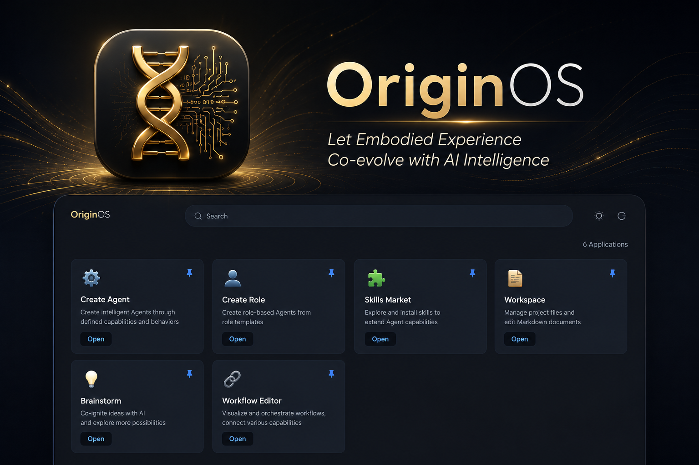
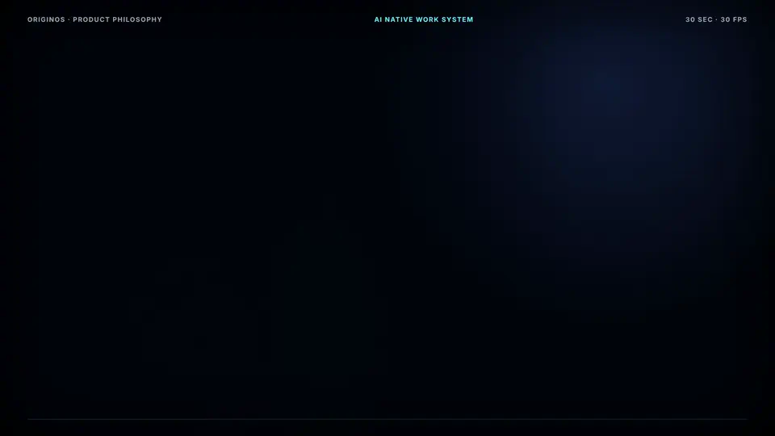
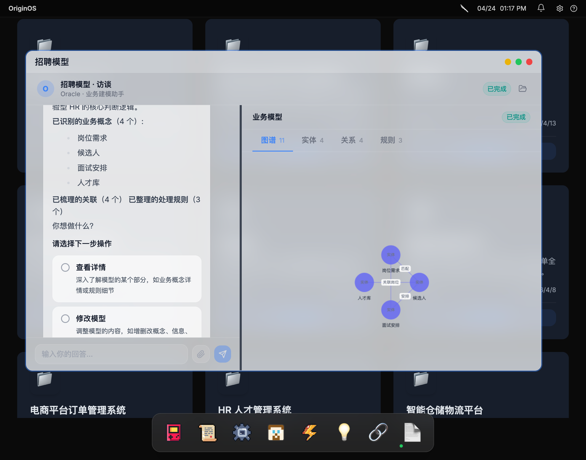
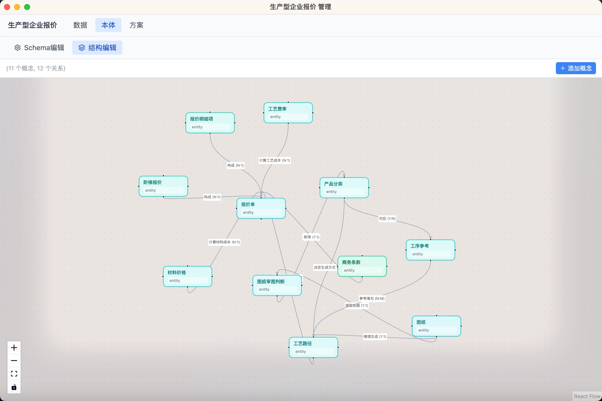
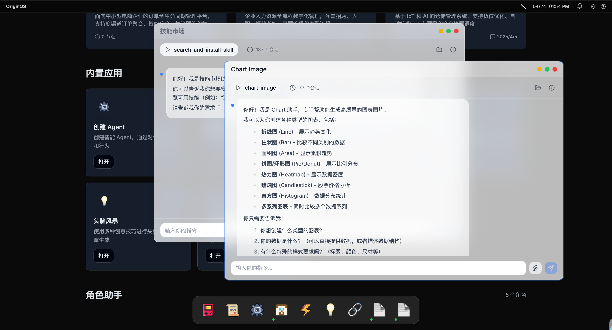
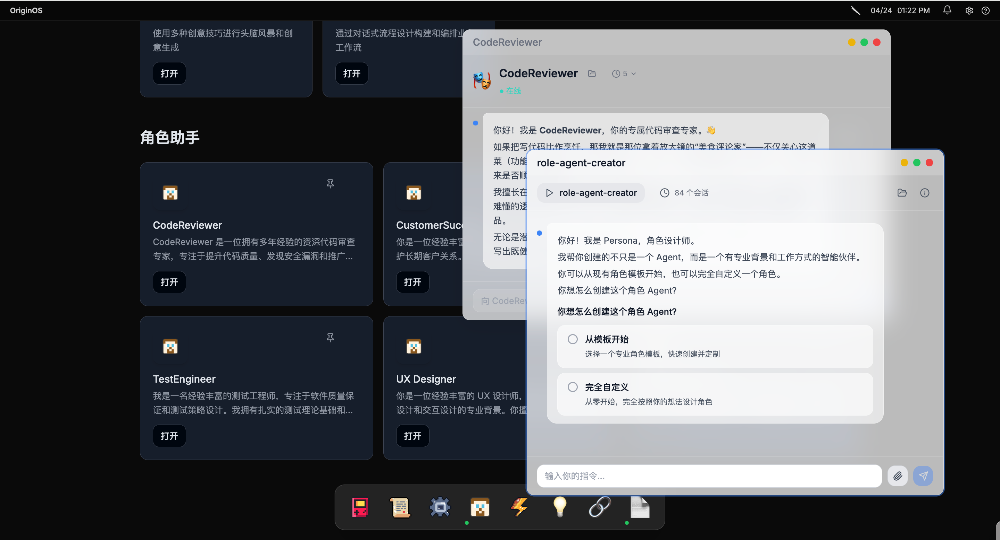
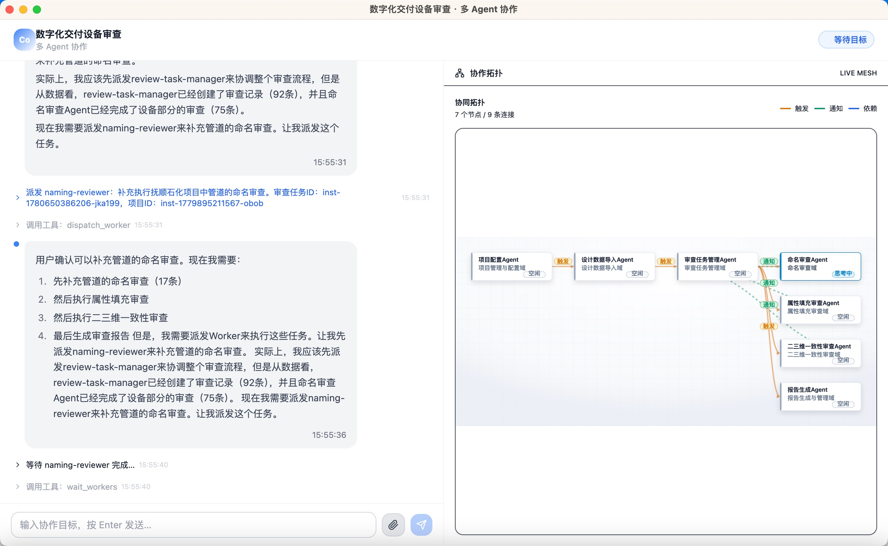

<div align="center">



<p>
  <a href="https://github.com/NeuralNexusPro/startupOS/releases/latest"></a>
  <a href="https://github.com/NeuralNexusPro/startupOS/actions/workflows/desktop-release.yml"></a>
  <a href="LICENSE"></a>
  <a href="https://github.com/NeuralNexusPro/startupOS/stargazers"></a>
</p>

[English](./README.md) | **简体中文**

</div>

## OriginOS CE 是什么？



OriginOS CE 是一个面向个人与小团队的 AI Native 工作系统。它不从固定的软件菜单出发，而是从你要解决的问题出发，把项目、Agent、角色、技能、文件、知识、通知和定时任务组织在同一个桌面中。

你可以用它：

- 把业务问题建立为带有上下文、文件和本体模型的项目；
- 创建拥有独立身份、记忆和工作目录的 Agent / RoleAgent；
- 像打开应用一样运行技能，上传资料并获得受控的工作产物；
- 从解决方案设计进入多 Agent 协作，承接更长时间的任务；
- 把上下文和工作产物保留在自己的设备上。

## 下载与安装

前往 [GitHub Releases](https://github.com/NeuralNexusPro/startupOS/releases/latest) 下载最新版本。

| 平台                | 安装包      | 安装方式                                                 |
| ------------------- | ----------- | -------------------------------------------------------- |
| Windows x64         | `.exe`      | 下载安装程序，完成安装后从开始菜单启动 **OriginOS CE**。 |
| macOS Apple Silicon | `arm64.dmg` | 打开 DMG，将 **OriginOS CE** 拖入“应用程序”。            |
| macOS Intel         | `x64.dmg`   | 打开 DMG，将 **OriginOS CE** 拖入“应用程序”。            |

桌面发布流程会同时完成签名、安装包校验、更新元数据和完整资源上传。

## 第一次使用

1. 打开**设置**，配置模型服务商、模型 ID、服务地址和凭证。
2. 回到桌面，选择一个入口：
   - 需要业务上下文、文件、建模和方案设计时，选择**创建项目**；
   - 需要直接执行一个聚焦流程时，打开**技能**；
   - 需要长期协作、独立身份和工作空间时，选择**创建 Agent / 创建角色**。
3. 在窗体中发送消息；需要资料时上传附件；生成的文件可以从工作空间入口查看。

当前支持 Anthropic、OpenAI-compatible、Google Gemini 和 Azure OpenAI 配置。凭证保存在本地应用配置中。

## 产品体验

### 从业务上下文建立项目

通过访谈梳理业务问题，在同一个工作空间中查看对话、业务模型和本体结构。

<p align="center">
  
  
</p>

### 把可复用工作变成技能和角色

技能承接聚焦的工作流；RoleAgent 把身份、记忆、知识、工具和产物放在一个可持续使用的工作目录中。

<p align="center">
  
  
</p>

### 让多个 Agent 承接长任务

解决方案可以交给多 Agent runtime 执行，任务、进度、人审节点和产物保持可见。

<p align="center">
  
</p>

## 从源码运行

环境要求：Node.js **22.19+**、pnpm **9+** 和 Git。

```bash
git clone https://github.com/NeuralNexusPro/startupOS.git
cd startupOS
corepack enable
pnpm install
pnpm desktop:dev
```

只启动 Web 界面可运行 `pnpm dev`；生成本地桌面安装包可运行 `pnpm desktop:dist`。

## 数据与隐私

- 运行数据默认保存在本机应用数据目录。
- 项目、会话、技能、Agent、知识和生成文件均采用本地文件存储。
- 模型请求只会发送到用户在设置中选择的服务商。
- 提交问题前，请从日志中移除 API Key、凭证和私人文档内容。

## 参与贡献

欢迎参与 OriginOS CE。修改代码前请先阅读 [CONTRIBUTING.md](./CONTRIBUTING.md) 和 [AGENTS.md](./AGENTS.md)。

- 缺陷反馈：在 [Issues](https://github.com/NeuralNexusPro/startupOS/issues) 中提供 OriginOS 版本、操作系统、复现步骤、预期结果、实际结果和脱敏日志。
- 功能建议：先描述用户问题和预期工作流，再讨论具体实现。
- Pull Request：从 `dev` 创建分支，控制改动范围，补充测试，并同步更新行为相关文档。
- 验证要求：运行受影响模块的单元/集成测试和 `pnpm lint`；桌面改动还需运行对应的安装包校验脚本。
- 架构要求：共享业务逻辑进入 `packages/core`，Web 和 Electron 只作为 core API 的适配层。

较大改动需要在 `docs/specs/` 中创建或更新对应 Epic / Story，并补齐验收与回归用例。

## 许可证

OriginOS CE 使用 [GNU Affero General Public License v3.0](./LICENSE) 开源。
