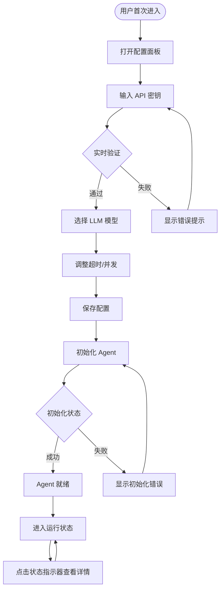
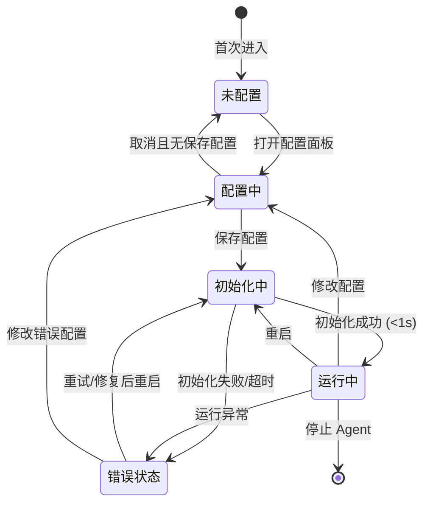

# 交互设计文档 - Story 0.1

**Story:** pi-agent-core集成基础
**版本:** 1.0
**最后更新:** 2026-03-03
**设计师:** Interaction Designer (🖌️)

---

## 🎨 设计概览

### 设计目标

Story 0.1 虽然是技术集成层，但用户仍需要与系统进行关键交互：

1. **配置 LLM** - 为 Agent 设置必要的运行参数
2. **监控状态** - 实时了解 Agent 运行健康度
3. **处理错误** - 当系统出现问题时能够快速恢复

### 核心设计原则

本项目遵循 OriginOS 的核心设计原则：

- **"能一步完成的绝不让用户点两下"** - 最大化操作效率
- **"这个地方要打磨"** - 追求极致的用户体验细节
- **专注用户体验** - 每个交互都必须服务于用户价值

### 参考 UX 规范

参考 [UX Design Specification](../../../_bmad-output/planning-artifacts/ux-design-specification.md) 的以下章节：
- 全局交互规范（模态框、Toast 通知）
- 表单交互规范（输入验证、实时反馈）
- 状态指示器规范

---

## 🗺️ 用户流程

### 主流程：配置并启动 Agent



### 流程说明

#### 步骤 1: 打开配置面板

**触发条件:**
- 用户首次进入系统（如果未配置）
- 用户点击右上角设置图标
- 用户按下 `Ctrl+K` 快捷键

**用户操作:** 点击设置按钮或按快捷键

**系统响应:**
- 配置面板从顶部滑入（200ms 动画）
- 自动加载当前配置（< 100ms）
- 如果首次进入，显示欢迎提示

**下一步:** 输入 API 密钥

#### 步骤 2: 输入并验证 API 密钥

**触发条件:** 配置面板打开后

**用户操作:**
- 在 API 密钥输入框中输入密钥
- 输入框为密码类型，显示可见/隐藏切换

**系统响应:**
- 输入 3 字符后触发实时验证（300ms 防抖）
- 验证中显示加载图标
- 验证结果显示在输入框右侧：
  - ✅ 绿色 checkmark → "API 密钥有效"
  - ❌ 红色 × → "API 密钥无效，请检查"

**下一步:** 验证通过后选择 LLM 模型

#### 步骤 3: 选择 LLM 模型

**触发条件:** API 密钥验证通过

**用户操作:**
- 点击下拉框选择 LLM 模型
- 支持的模型：claude-3-5-sonnet, claude-3-haiku, claude-3-opus

**系统响应:**
- 下拉框展开，显示可用模型列表
- 高亮显示当前选中模型
- 每个模型显示简要描述（如 "适合通用任务"）

**下一步:** 调整高级设置或保存

#### 步骤 4: 保存配置

**触发条件:** 用户完成配置修改

**用户操作:**
- 点击"保存"按钮
- 或按下 `Ctrl+S` 快捷键
- 或直接关闭面板（自动保存）

**系统响应:**
- 保存配置到本地存储（< 50ms）
- 显示成功提示 "配置已保存"（1s 后淡出）
- 如果配置无效，显示具体错误原因

**下一步:** 如果 Agent 未运行，自动初始化

#### 步骤 5: 查看状态详情

**触发条件:** 用户 want to 了解 Agent 状态

**用户操作:**
- 点击右上角状态指示器
- 状态始终可见，无需导航

**系统响应:**
- 状态详情面板展开（150ms 动画）
- 显示实时健康指标
- 每 5 秒自动刷新数据

**下一步:** 用户可以选择重启或查看日志

---

## 🖼️ 界面设计

### 设计 1: 配置面板

```
┌────────────────────────────────────────────────────────────────────────┐
│  OriginOS 设置                                          × Ctrl+K       │
├────────────────────────────────────────────────────────────────────────┤
│                                                                        │
│  🤖 Agent 配置                                                          │
│  ────────────────────────────────────────────────────────────────────│
│                                                                        │
│  LLM 模型                                                              │
│  ┌───────────────────────────────────────────────────────────────────┐│
│  │ claude-3-5-sonnet  ▼   适合通用开发任务                           ││
│  └───────────────────────────────────────────────────────────────────┘│
│                                                                        │
│  API 密钥                                                              │
│  ┌───────────────────────────────────────────────────────────────────┐│
│  │ sk-ant-xxxx...xxxxx                  👁️     ✅ 已验证              ││
│  └───────────────────────────────────────────────────────────────────┘│
│  当前使用的 API 密钥有效                                              │
│                                                                        │
│  超时设置 (秒)                                                         │
│  ┌───────────────────────────────────────────────────────────────────┐│
│  │ 30         ←│●──●──○──●──●──○──●──●──○──●──●──○──●──●─→ 120        ││
│  │     当前设置约 30 秒后超时                                        ││
│  └───────────────────────────────────────────────────────────────────┘│
│                                                                        │
│  最大并发消息数                                                        │
│  ┌───────────────────────────────────────────────────────────────────┐│
│  │ 5         ←│●──●──○──●──●──○──●──●──○──●──●──○──●──●─→ 20          ││
│  └───────────────────────────────────────────────────────────────────┘│
│                                                                        │
│  ┌───────────────────────────────────────────────────────────────────┐│
│  │  🚀 高级配置 (可展开)                                               ││
│  └───────────────────────────────────────────────────────────────────┘│
│                                                                        │
│                                [取消]      [保存  Ctrl+S]             │
└────────────────────────────────────────────────────────────────────────┘
```

**组件说明：**
- 使用 shadcn/ui 的 Dialog 组件作为基础
- 自定义滑块组件调整超时和并发数
- 带验证反馈的输入框

### 设计 2: 状态指示器

右上角固定显示的小型状态组件：

```
运行中状态:
┌──────────────────────┐
│  ● 运行中            │
└──────────────────────┘
│ 绿色圆点

警告状态:
┌──────────────────────┐
│  ● 负载高            │
└──────────────────────┘
│ 黄色圆点

离线状态:
┌──────────────────────┐
│  ● 离线              │
└──────────────────────┘
│ 红色圆点
```

### 设计 3: 状态详情面板

```
┌─────────────────────────────────────────────────────────────────┐
│  Agent 状态                                    ×                 │
├─────────────────────────────────────────────────────────────────┤
│                                                                  │
│  ● 运行中                                                        │
│  ────────────────────────────────────────────────────────────│
│                                                                  │
│  📈 运行指标                                                     │
│  ┌───────────────────────────────────────────────────────────┐│
│  │ 运行时长          25分钟                                  ││
│  │ 处理消息          142 条                                   ││
│  │ 活跃会话          3 个                                     ││
│  └───────────────────────────────────────────────────────────┘│
│                                                                  │
│  💾 资源使用                                                     │
│  ┌───────────────────────────────────────────────────────────┐│
│  │ ┌─────────────────────────────────────────────────────┐   ││
│  │ │ 内存占用  ████████░░░░░░░░ 45.2 MB / 100 MB          │   ││
│  │ └─────────────────────────────────────────────────────┘   ││
│  │ ┌─────────────────────────────────────────────────────┐   ││
│  │ │ CPU 使用    █████░░░░░░░░░░░ 12%                     │   ││
│  │ └─────────────────────────────────────────────────────┘   ││
│  └───────────────────────────────────────────────────────────┘│
│                                                                  │
│  ⏱️ 性能                                                         │
│  ┌───────────────────────────────────────────────────────────┐│
│  │ 平均响应          85 ms                                   ││
│  │ 消息队列          0 / 5                                  ││
│  └───────────────────────────────────────────────────────────┘│
│                                                                  │
├─────────────────────────────────────────────────────────────────┤
│                           [重新启动]     [查看日志]              │
└─────────────────────────────────────────────────────────────────┘
```

**设计规范：**
- 颜色: 使用 Tailwind 色彩系统
  - 成功: green-500
  - 警告: yellow-500
  - 错误: red-500
  - 信息: blue-500
- 字体: 系统默认无衬线字体
- 间距: 使用 4px 基准的 Tailwind 间距
- 组件: shadcn/ui Dialog, Progress, Button

---

## 🔄 交互状态

### 状态定义

#### 状态 1: 未配置状态

**描述:** 用户首次进入系统，尚未配置 API 密钥

**界面表现:**
- 配置面板自动打开
- 显示欢迎引导卡片："欢迎使用 OriginOS，请先配置您的 Agent"
- 状态指示器显示灰色圆点（未初始化）

**可用操作:**
- 输入 API 密钥
- 查看配置帮助文档

#### 状态 2: 配置中

**描述:** 用户正在编辑配置

**界面表现:**
- 配置面板打开
- 输入框聚焦时边框变蓝
- 实时验证结果显示

**可用操作:**
- 编辑配置项
- 保存配置
- 取消编辑

#### 状态 3: 初始化中

**描述:** Agent 正在初始化（< 1 秒）

**界面表现:**
- 配置面板显示加载动画
- 状态指示器显示蓝色脉冲动画
- 禁用所有配置输入

**超时处理:** 5 秒后显示超时错误并显示修复建议

#### 状态 4: 运行中

**描述:** Agent 正常运行

**界面表现:**
- 状态指示器显示绿色圆点
- 状态详情面板显示实时指标
- 每 5 秒自动刷新数据

**可用操作:**
- 查看状态详情
- 修改配置（部分项需要重启生效）
- 重启 Agent
- 查看日志

#### 状态 5: 错误状态

**描述:** Agent 出现错误

**界面表现:**
- 状态指示器显示红色圆点（带抖动效果）
- 错误提示从底部弹出
- 显示具体错误信息和可操作建议

**恢复操作:**
- 根据建议修复问题
- 重试初始化
- 重启 Agent

### 状态转换图



---

## ⚠️ 错误处理

### 错误类型 1: API 密钥验证失败

**触发条件:** 输入的 API 密钥格式错误或无效

**错误提示:** "⚠️ API 密钥验证失败"

**提示位置:** 输入框下方

**提示样式:**
- 类型: 警告 / 错误
- 颜色: 黄色 (警告) / 红色 (错误)
- 图标: ⚠️

**用户操作:**
- 主操作: 重新输入 API 密钥
- 次操作: 打开 API 密钥获取帮助

**详细错误卡片:**

```
┌────────────────────────────────────────────────────────────────────┐
│  ⚠️ API 密钥验证失败                                                 │
├────────────────────────────────────────────────────────────────────┤
│  无法验证您的 API 密钥。                                            │
│                                                                     │
│  常见问题：                                                          │
│  • API 密钥格式不正确（应以 sk-ant- 或 sk- 开头）                   │
│  • API 密钥可能已过期                                               │
│  • 网络连接问题导致无法验证                                         │
│                                                                     │
│  建议操作：                                                          │
│  • 检查输入是否正确                                                 │
│  • 访问 https://console.anthropic.com 获取新密钥                   │
│  • 检查网络连接                                                     │
│                                                                     │
│  ┌─ 展开技术详情 ─┐          [重新输入]                          │
│  │ Error: Invalid API key format                                 │
│  │ Code: AUTH_INVALID_KEY                                         │
│  └────────────────────────────────────────────────────────────┘   │
└────────────────────────────────────────────────────────────────────┘
```

### 错误类型 2: Agent 初始化超时

**触发条件:** Agent 初始化时间超过 5 秒

**错误提示:** "🚫 Agent 初始化失败：超时"

**提示位置:** 屏幕中央弹窗

**提示样式:**
- 类型: 错误
- 颜色: 红色
- 图标: 🚫

**用户操作:**
- 主操作: 重试
- 次操作: 查看日志

### 错误类型 3: 配置文件格式错误

**触发条件:** 配置加载失败（缺失必需项或格式错误）

**错误提示:** "📝 配置文件格式错误"

**提示位置:** 配置面板顶部

**提示样式:**
- 类型: 错误
- 颜色: 红色
- 图标: 📝

**用户操作:**
- 主操作: 重置为默认配置
- 次操作: 手动修复

### 错误类型 4: Agent 运行异常

**触发条件:** Agent 在运行过程中出现异常

**错误提示:** "⚠️ Agent 运行异常"

**提示位置:** 顶部通知栏 + 右上角状态指示器

**提示样式:**
- 类型: 警告
- 颜色: 黄色
- 图标: ⚠️

**用户操作:**
- 主操作: 重启 Agent
- 次操作: 查看详细日志

---

## ♿ 可访问性设计

### 键盘导航

| 按键 | 功能 |
|------|------|
| `Tab` | 焦点移动到下一个可交互元素 |
| `Shift + Tab` | 焦点移动到上一个元素 |
| `Enter` / `Space` | 激活按钮/复选框 |
| `Escape` | 关闭模态框/弹窗 |
| `Ctrl+K` | 打开/关闭配置面板 |
| `Ctrl+S` | 保存当前配置 |
| `Ctrl+r` | 重启 Agent |

### 屏幕阅读器支持

- **ARIA 标签:**
  - 所有交互元素有 `aria-label`
  - 状态变化通过 `aria-live="polite"` 通知
  - 错误信息有 `role="alert"`
  - 进度条有 `aria-valuenow` 和 `aria-valuemin/max`

- **语义化 HTML:**
  - 使用 `<dialog>` 元素实现模态框
  - 使用 `<button>` 实现按钮
  - 使用 `<label>` 关联输入框

- **焦点管理:**
  - 模态框打开时焦点移入
  - 模态框关闭时焦点返回触发元素
  - 焦点在模态框内 trap，不能跳出

- **状态通知:**
  - 配置保存成功通过 `aria-live` 通知
  - 错误发生立即通知

### 颜色对比度

- **文本对比度:** 符合 WCAG AA 标准 (4.5:1)
- **大文本对比度:** 符合 WCAG AA 标准 (3:1)
- **非文本对比度:** 符合 WCAG AA 标准 (3:1)
- **状态指示器:** 使用颜色 + 图标双重编码

### 触摸目标

- **最小尺寸:** 44x44 px
- **间距:** 至少 8px
- **移动端优化:** 状态指示器扩大点击区域

---

## 📱 响应式设计

### 桌面端 (>= 1920px)

**布局:**
- 配置面板宽度：600px，居中显示
- 状态详情面板宽度：500px，从右上角展开
- 状态指示器固定在右上角

**特殊处理:** 支持多窗口布局

### 平板端 (768px - 1919px)

**布局:**
- 配置面板宽度：90%，宽度最大 600px
- 状态详情面板从底部向上展开

**特殊处理:** 触摸优化，增大点击区域

### 移动端 (< 768px)

**布局:**
- 配置面板全屏显示
- 状态指示器固定在顶部栏
- 错误提示支持滑除手势

**特殊处理:**
- 输入框类型设置为 `tel` 以避免移动端键盘布局问题
- 下拉框改为移动端友好的选择器

---

## 🎬 动画和过渡

### 动画 1: 配置面板展开

**触发时机:** 打开配置面板时

**动画效果:**
- 从顶部滑入，淡入效果
- 遮罩层淡入

**持续时间:**
- 面板: 200ms
- 遮罩: 150ms

**缓动函数:** cubic-bezier(0.16, 1, 0.3, 1)

### 动画 2: Toast 通知

**触发时机:** 显示成功/错误/警告提示时

**动画效果:**
- 从底部向上滑入
- 淡入效果

**持续时间:**
- 进入: 150ms
- 退出: 100ms
- 停留: 3s (自动关闭)

**缓动函数:** ease-in-out

### 动画 3: 状态指示器变化

**触发时机:** Agent 状态改变时

**动画效果:**
- 圆点颜色平滑过渡
- 错误状态带轻微抖动效果

**持续时间:**
- 颜色过渡: 300ms
- 抖动: 200ms

**缓动函数:** ease-out

### 动画 4: 进度条更新

**触发时机:** 资源使用指标变化时

**动画效果:**
- 进度条宽度平滑过渡

**持续时间:** 500ms

**缓动函数:** ease-out

**性能考虑:**
- 所有动画使用 CSS transform 和 opacity
- 避免触发 layout 和 paint
- 使用 `will-change` 优化频繁变化的元素
- 使用 requestAnimationFrame 进行实时更新

---

## 📐 设计规范

### 组件使用

| 组件 | 来源 | 用途 |
|------|------|------|
| Dialog | shadcn/ui | 配置面板、状态详情面板 |
| Input | shadcn/ui | API 密钥输入 |
| Select | shadcn/ui | LLM 模型选择 |
| Slider | shadcn/ui | 超时/并发设置 |
| Progress | shadcn/ui | 资源使用显示 |
| Button | shadcn/ui | 所有按钮 |
| Toast | shadcn/ui | 错误/警告/成功提示 |
| Badge | shadcn/ui | 状态指示器 |
| StatusIndicator | 自定义 | 固定状态指示器 |
| ConfigPanel | 自定义 | 配置面板容器 |

### 样式规范

**颜色：**
- 主色: blue-500 (#3b82f6)
- 辅助色: slate-500 (#64748b)
- 成功: green-500 (#22c55e)
- 警告: yellow-500 (#eab308)
- 错误: red-500 (#ef4444)
- 信息: blue-500 (#3b82f6)
- 中性: gray-100 - gray-900

**字体：**
- 标题: text-lg, font-semibold
- 正文: text-sm, font-normal
- 代码: font-mono, text-xs
- 提示文本: text-xs, text-muted-foreground

**间距：**
- 使用 Tailwind 间距系统 (4px 基准)
- 基础间距: p-4 (16px)
- 组间距: gap-4 (16px)
- 边框圆角: rounded-lg (8px)

**阴影：**
- 弹窗: shadow-lg
- 卡片: shadow-sm
- 悬停: shadow-md

---

## 🔍 设计审查

### 审查清单

- [x] 用户流程完整
- [x] 交互状态定义清晰
- [x] 错误处理已设计
- [x] 可访问性已考虑
- [x] 响应式设计已规划
- [x] 动画性能已优化
- [x] 符合 UX 设计规范
- [x] 组件使用符合 shadcn/ui 规范
- [x] 遵循 "能一步完成的绝不让用户点两下" 原则
- [x] 错误提示可操作
- [x] 状态始终可见

### 审查记录

| 日期 | 审查人 | 结果 | 备注 |
|------|--------|------|------|
| 2026-03-03 | Interaction Designer | ✅ Approved | 交互设计已完成，可进入架构设计 |

---

## 📎 设计资源

### 设计图表

- [状态显示与错误处理设计图](./assets/interaction-design.png)

### 设计工具

- **原型工具:** Draw.io
- **流程图工具:** Mermaid (集成在文档中)
- **图标库:** Lucide Icons (shadcn/ui 默认)

---

## 📋 交互设计总结

本交互设计遵循 OriginOS 的核心设计原则，为 Story 0.1 提供了：

1. **高效的配置体验** - 单页面配置，实时验证，自动保存
2. **可见的状态反馈** - 始终显示的指示器，详尽的状态面板
3. **可操作的错误提示** - 每个错误都带有明确的解决建议
4. **完整的可访问性** - 键盘导航、屏幕阅读器支持、颜色对比度

设计方案已准备好交付给架构师和开发者实施。🖌️

---

## 📌 相关文档

- [Story README](./README.md)
- [需求文档](./requirements.md)
- [架构设计](./architecture.md)
- [UX Design Specification](../../../_bmad-output/planning-artifacts/ux-design-specification.md)
- [AGENTS.md](../../../AGENTS.md)
