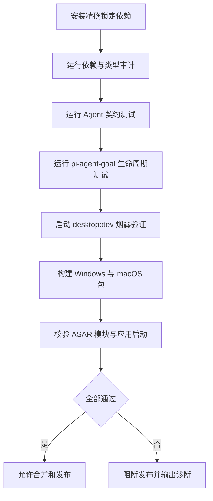

# 交互设计文档 - Story 0.7

**Story:** Pi Runtime 0.80.x 升级与 pi-agent-goal 兼容迁移  
**版本:** 1.0  
**最后更新:** 2026-07-28

---

## 适用性

本 Story 是运行时依赖和适配层迁移，不新增产品界面、按钮或用户流程，
因此线框图、视觉稿、响应式设计和可访问性增量均不适用。

## 用户体验不变式

- 普通 Agent、RoleAgent、Project Agent 和技能窗体的交互保持不变。
- 文本仍按现有流式协议展示，工具状态和最终消息不得丢失。
- 用户中止任务后，界面必须及时结束运行态。
- 运行时或扩展错误必须进入现有错误反馈通道，不能表现为无原因停住。
- 会话恢复后，历史消息、工作目录和 Agent 类型保持一致。

## 开发者与发布流程

## 状态与反馈

| 状态 | 操作者可见反馈 | 处理 |
|------|----------------|------|
| 安装失败 | 包名、期望版本、实际 peer 范围 | 修正版本矩阵后重试 |
| 适配失败 | API/事件契约测试名称与差异 | 在适配层修复 |
| Goal 装载失败 | 扩展版本、Runtime 版本和错误栈 | 阻断后续打包 |
| 打包缺模块 | 平台、架构、ASAR 条目和缺失模块 | 修正 files/unpack 配置 |
| 验证成功 | 测试、平台和产物摘要 | 允许进入发布流程 |

## 人工验收

在自动化测试通过后，分别在开发态和至少一个真实桌面安装包中完成：

1. 启动普通 Agent 并发送消息。
2. 触发成功和失败工具调用，确认状态与结果均显示。
3. 中止一次长任务，确认运行态结束。
4. 重启应用并恢复会话。
5. 启动 RoleAgent 和 Project Agent，确认工作目录及上下文正确。

Goal 产品入口不属于本 Story，人工验收通过测试夹具或内部调用完成。
