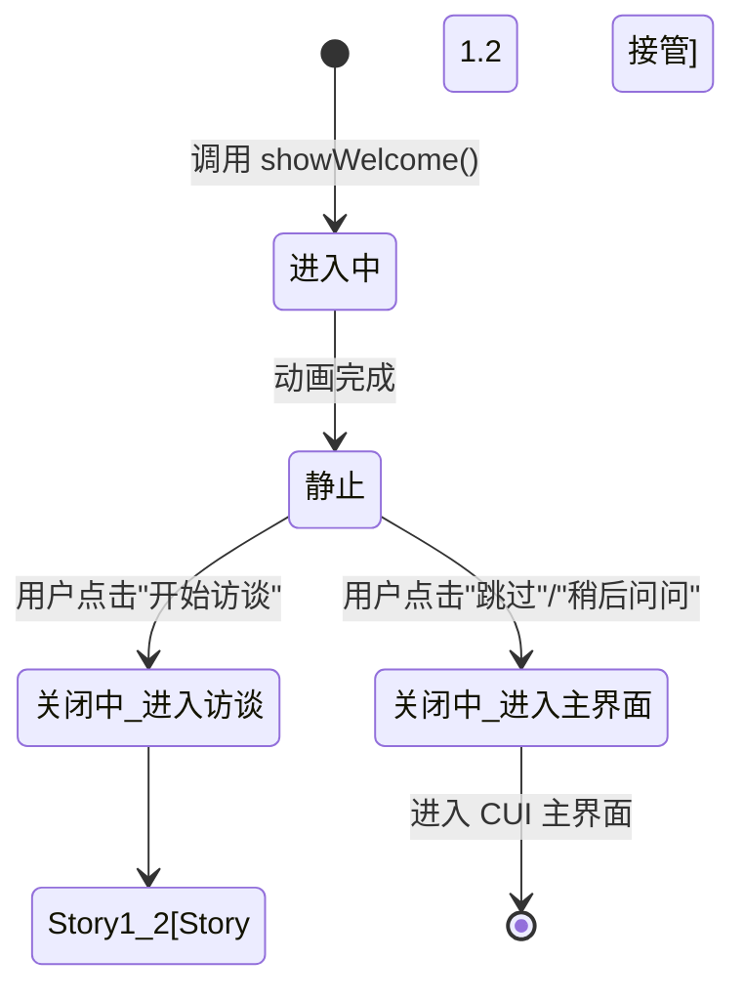

# 交互设计文档 - Story 1.1

**Story:** 1.1 - 项目访谈流程启动 (ARC-185)
**版本:** 1.1
**最后更新:** 2026-03-02
**设计者:** interaction-designer (交互设计), product-designer (UI 设计)
**状态:** ✅ 审查通过

---

> **协作说明**: 本文档由 product-designer 创建初始版本，由 interaction-designer 审查并修正 Story 边界问题。Story 1.1 的范围仅包含欢迎面板和开始/跳过决策，问题面板由 Story 1.2 接管。

---

## 🎨 设计概览

### 设计目标

本 Story 设计用户首次使用 OriginOS 时的项目访谈引导界面，核心目标包括：

1. **快速启动**: 用户在 < 30 秒内理解访谈流程
2. **建立信任**: 通过欢迎界面传达系统理念，建立"系统在帮我"的第一印象
3. **渐进式引导**: 清晰展示流程进度，让用户知道还需要做什么
4. **灵活入口**: 提供多种触发访谈的方式（首次启动、设置入口）

### 参考 UX 规范

参考 [UX Design Specification](../../../_bmad-output/planning-artifacts/ux-design-specification.md) 的以下章节：

- **Journey 1: 首次使用 - 项目访谈与本体构建** (line 952-1016)
- **Design Direction: OS Workspace with Progressive Content Disclosure** (line 794-943)
- **Visual Foundation** (line 640-792)
- **Design System Foundation** (line 396-471)

---

## 🎯 UI 设计方案

### 设计理念

**核心隐喻**: "首次握手" - 一次让系统认识你的机会

访谈引导界面应该像一次友好的握手，正式但不过于严肃，让用户感受到系统是来帮助他们的，而不是增加负担。

---

## 🖼️ 界面设计

### 1. 欢迎面板 (Welcome Dialog)

**设计来源:** interaction-designer 交互设计规范

**界面布局（模态面板，从底部滑入）:**

```
┌─────────────────────────────────────────────────────────────┐
│                                                             │
│         ┌─────────────────────────────────────────┐         │
│         │          [OriginOS Logo 64×64]          │         │
│         │        (神经网络连接 Logo)             │         │
│         └─────────────────────────────────────────┘         │
│                                                             │
│              欢迎来到 OriginOS                       │
│                                                             │
│   AI Native 操作系统，让你的思考和认知具象化           │
│   为知识资产                                               │
│                                                             │
│   • 项目访谈快速建模  • 本体图谱可视化  • 自然对话交互 │
│                                                             │
│                                                             │
│         ┌─────────────────────────┐  ┌───────────────┐    │
│         │    [ 开始访谈 (5分钟)   ]  │  [ 跳过 ]     │    │
│         │                         │  │               │    │
│         └─────────────────────────┘  └───────────────┘    │
│                                                             │
│                                        ┌───────────────┐          │
│                                        │ [ 稍后问问 ]   │          │
│                                        └───────────────┘          │
│                                                             │
└─────────────────────────────────────────────────────────────┘
面板宽度: 560px
面板高度: ~480px
面板背景: #1A1F2E (深蓝紫)
遮罩: rgba(10, 25, 41, 0.8)
```

#### 设计规范（与 interaction-designer 对齐）

| 元素 | 样式规范 |
|------|---------|
| **面板宽度** | 桌面: 560px, 小桌面: 480px, 移动: 90vw (最大 400px) |
| **面板高度** | 自适应约 480px, 最大 80vh |
| **面板背景** | `#1A1F2E` (深蓝紫) |
| **遮罩** | `rgba(10, 25, 41, 0.8)` |
| **Logo 图标** | OriginOS 神经网络 Logo, 64×64px, 见视觉设计规范 |
| **主标题** | Inter/思源黑体, 24px, font-semibold, 颜色 `#E5E7EB` |
| **副标题** | Inter/思源黑体, 16px, font-normal, 颜色 `#9CA3AF`, line-height 1.6 |
| **特性列表** | Bullet 列表, 14px, 间距 8px, 颜色 `#9CA3AF` |
| **Button Group** | Flex Row, 间距 12px |
| **按钮 - 开始** | 背景 `#00D9FF`, 文字 `#0A1929`, 尺寸 180×48px, 圆角 8px, 带发光效果 `box-shadow: 0 0 20px rgba(0, 217, 255, 0.3)` |
| **按钮 - 跳过** | 背景 transparent, 文字 `#9CA3AF`, 尺寸 120×48px, 圆角 8px, 虚线边框 `1px dashed #4B5563` |
| **按钮 - 稍后问问** | 背景 transparent, 文字 `#9CA3AF`, 尺寸 120×48px, 圆角 8px, hover 文字变 `#E5E7EB` |
| **面板圆角** | `lg` 12px |
| **内边距** | 48px (上下), 40px (左右) |

#### 交互状态

**初始状态:**
- Logo 带有呼吸动画（opacity: 0.8 ↔ 1.0）
- "开始访谈"按钮带有脉动效果，吸引用户点击

**Hover 状态:**
- "开始访谈"按钮：发光效果加强，提升 +2px
- "跳过"按钮：边框颜色变为 `#00D9FF`，文字颜色变为 `#E5E7EB`

**点击反馈:**
- 按钮按下时缩小至 95%，释放后恢复

---

### 2. 流程衔接：进入访谈流程

> **注意**: Story 1.1 的结束边界是用户点击"开始访谈"按钮。
> 详细的 QuestionPanel（问题回答界面）交互设计属于 **Story 1.2**。

#### 触发条件
- 用户点击"开始访谈"按钮

#### 过渡动画
- 欢迎面板：向左滑出 + 淡出，300ms，ease-in
- 问题面板：从右侧滑入 + 淡入，300ms，ease-out

#### Story 1.1 责任范围结束
- ✅ 欢迎面板设计
- ✅ "开始访谈"按钮点击处理
- ✅ "跳过"按钮点击处理
- ✅ 面板过渡动画
- ❌ 问题界面详细设计（Story 1.2）
- ❌ 输入框交互（Story 1.2）
- ❌ 进度指示器设计（Story 1.2）

#### 用户预期（Story 1.2 实现）
用户点击"开始访谈"后，将看到由 Story 1.2 实现的以下界面：
- 标题栏显示 "OriginOS - 访谈" + 进度指示器 "1/3"
- 返回按钮（返回欢迎面板或取消）
- 问题文本："你的工作领域是什么？"
- 输入框
- "下一步"按钮

详细的 QuestionPanel 设计和组件 Props 请参考：`docs/specs/epic-1/story-1.2/interaction.md`

---

### 3. 项目设置中的重新启动访谈入口

#### 界面布局（嵌入设置面板）

```
┌─────────────────────────────────────────────────────────────────┐
│  设置                                                     [×]  │
├─────────────────────────────────────────────────────────────────┤
│                                                                 │
│  [常规]  [工作空间]  [本体]  [访谈配置]                          │
│  ┌──────────────────────────────────────────────────────────┐   │
│  │ 访谈配置                                   当前          │   │
│  ├──────────────────────────────────────────────────────────┤   │
│  │                                                          │   │
│  │  访谈状态                                                 │   │
│  │  ┌─────────────────────────────────────────────────────┐ │   │
│  │  │ 已跳过                                               │ │   │
│  │  └─────────────────────────────────────────────────────┘ │   │
│  │                                                          │   │
│  │  重新启动访谈                                            │   │
│  │  ┌─────────────────────────────────────────────────────┐ │   │
│  │  │                                                     │ │   │
│  │  │  再次完成项目访谈，更新你的本体结构                 │ │   │
│  │  │                                                     │ │   │
│  │  │              [ 开始访谈 ]                           │ │   │
│  │  │                                                     │ │   │
│  │  └─────────────────────────────────────────────────────┘ │   │
│  │                                                          │   │
│  │  之前完成的访谈数据将会被保存，你可以随时查看。              │   │
│  │                                                          │   │
│  └──────────────────────────────────────────────────────────┘   │
│                                                                 │
└─────────────────────────────────────────────────────────────────┘
```

#### 设计规范

| 元素 | 样式规范 |
|------|---------|
| **设置面板背景** | `#0F172A` (比主背景略浅的深蓝) |
| **侧边栏** | 宽度 `240px`, 背景 `#1E293B`, 选中项左边框青色 `#00D9FF` |
| **设置卡片** | 背景 `#1F2937`, 圆角 `12px`, 边框 `1px solid #374151` |
| **"访谈状态"标签** | 胶囊样式，黄色背景 `rgba(245, 158, 11, 0.2)`, 文字 `#F59E0B` |
| **"开始访谈"按钮** | 主操作按钮，标准样式 |

---

## 🗺️ 用户流程

### 主流程图（Story 1.1 范围）

```mermaid
flowchart TD
    Start([用户启动 OriginOS]) --> DetectNew{检测到新项目?}
    DetectNew -->|是| ShowWelcome[显示 welcome 模态面板]
    DetectNew -->|否| EnterCUI[进入 CUI 主界面]

    ShowWelcome --> UserChoice{用户选择?}
    UserChoice -->|开始访谈| TransitionToStory12[过渡到 Story 1.2<br/>面板滑入/滑出]
    UserChoice -->|跳过| MarkSkipped[标记为已跳过]
    UserChoice -->|稍后问问| MarkSkipped

    MarkSkipped --> EnterCUI
    TransitionToStory12 --> Story12Boundary[进入 Story 1.2<br/>问题面板]

    StartAlt([用户进入设置面板]) --> SelectTab[选择"访谈配置"]
    SelectTab --> ShowConfig[显示访谈配置页面]
    ShowConfig --> ClickRestart{点击"重新启动"?}
    ClickRestart -->|是| TransitionToStory12
    ClickRestart -->|否| Return([返回设置])

    style ShowWelcome fill:#00D9FF20
    style TransitionToStory12 fill:#00D9FF10
    style Story12Boundary fill:#F59E0B20
```

### 流程说明

#### 步骤 1: 检测新项目

**触发条件:**
- 用户首次启动 OriginOS
- 项目目录中不存在 `data/ontology/{project-id}-ontology.json` 或 `data/interviews/{session-id}.json`

**用户操作:**
- 无需用户操作，系统自动检测

**系统响应:**
- 显示欢迎界面
- 隐藏其他窗体

**下一步:**
- 等待用户选择"开始访谈"或"跳过"

---

#### 步骤 2: 显示欢迎界面

**触发条件:**
- 系统检测到新项目

**用户操作:**
- 点击"开始访谈"按钮
- 点击"跳过"按钮

**系统响应:**
- "开始访谈": 切换到第一个问题界面
- "跳过": 记录用户跳过访谈，进入主界面

**下一步:**
- 开始访谈 → 显示第一个问题
- 跳过 → 进入 CUI 主界面

---

#### 步骤 3: 点击"开始访谈"（Story 1.1 边界点）

**触发条件:**
- 用户点击"开始访谈"按钮

**用户操作:**
- 点击按钮

**系统响应:**
- 记录用户选择开始访谈
- 触发面板过渡动画：欢迎面板向左滑出
- Story 1.1 责任范围结束
- 控制转移到 Story 1.2

**下一步:**
- Story 1.2 接管显示问题面板

---

#### 步骤 4: 点击"跳过"或"稍后问问"

**触发条件:**
- 用户点击"跳过"或"稍后问问"按钮

**用户操作:**
- 点击按钮

**系统响应:**
- 记录用户跳过状态到 `data/interviews/skipped.json`
- "稍后问问"选项额外显示非模态通知："可以在设置中重新启动访谈"
- 面板向下滑出关闭
- 进入 CUI 主界面

**下一步:**
- 用户开始正常使用 OriginOS

---

#### 步骤 5: 从设置面板触发访谈

**触发条件:**
- 用户打开设置面板 → 选择"访谈配置" → 点击"开始访谈"

**用户操作:**
- 导航到设置界面
- 点击访谈配置中的"开始访谈"按钮

**系统响应:**
- 关闭设置面板
- 打开欢迎面板（如果是第一次看到）
- 或直接进入问题面板（如果在同一会话中）

**下一步:**
- 显示欢迎面板或直接进入 Story 1.2

---

## 🔄 交互状态

**注意**: Story 1.1 的交互状态仅包含欢迎面板相关状态。
问题面板的状态在 Story 1.2 中定义。

### 状态定义

#### 状态 1: 欢迎面板-显示中（进入动画）

**描述:** 面板从底部滑入，正在显示

**界面表现:**
- 遮罩 opacity 从 0 → 0.8，ease-in，200ms
- 面板 transform: translateY(100%) → translateY(0)，ease-out，300ms
- Logo、标题、按钮依次淡入，stagger 延迟 100ms

**可用操作:** 动画期间禁用

**下一状态:** 欢迎面板-静止

---

#### 状态 2: 欢迎面板-静止（等待用户选择）

**描述:** 面板完全显示，等待用户操作

**界面表现:**
- 遮罩半透明 `rgba(10, 25, 41, 0.8)`
- 面板居中显示
- Logo 带有呼吸动画（opacity: 0.8 ↔ 1.0，2s 循环）
- "开始访谈"按钮带有脉动发光效果（box-shadow: 0 0 20px rgba(0, 217, 255, 0.3)）
- 输入焦点在"开始访谈"按钮（支持 Enter 键触发）

**可用操作:**
- 点击"开始访谈" → 进入状态 3
- 点击"跳过" → 进入状态 4
- 点击"稍后问问" → 进入状态 4（带通知）
- Tab 键在按钮间切换焦点
- Enter 键激活当前焦点按钮

**ESC 键:** 无效（强制引导，不允许关闭）

---

#### 状态 3: 欢迎面板-关闭中（进入访谈）

**描述:** 用户选择开始访谈后，面板开始关闭

**界面表现:**
- 遮罩 opacity 从 0.8 → 0，ease-out，200ms
- 面板 transform: translateY(0) → translateY(100%)，ease-in，300ms
- 按钮禁用，防止重复操作

**可用操作:** 动画期间禁用

**下一状态:** Story 1.2 接管（Story 1.1 责任范围结束）

---

#### 状态 4: 欢迎面板-关闭中（进入主界面）

**描述:** 用户选择跳过访谈后，面板开始关闭

**界面表现:**
- 同状态 3 的动画效果

**附加操作:**
- "稍后问问"选项额外显示 toast 通知："可以在设置中重新启动访谈"

**下一状态:** 进入 CUI 主界面

---

### 状态转换图（Story 1.1 范围）



---

## ⚠️ 错误处理

### 错误类型 1: 新项目检测失败

**触发条件:**
- 无法读取项目目录
- 文件系统权限问题

**错误提示:** "无法读取项目信息，请稍后重试或重启应用"

**提示位置:** 欢迎界面中央，替换 Logo 和标题

**提示样式:**
- 类型: 错误
- 颜色: 红色 `#EF4444`
- 图标: ⚠️

**用户操作:**
- 主操作: 重试（重新检测）
- 次操作: 跳过访谈

---

### 错误类型 2: 跳过状态保存失败

**触发条件:**
- 无法写入跳过状态到 `data/interviews/skipped.json`

**错误提示:** "记录跳过状态失败，但您可以继续使用系统"

**提示位置:** Toast 通知，右上角

**提示样式:**
- 类型: 警告
- 颜色: 黄色 `#F59E0B`
- 图标: ⚠️

**用户操作:**
- 主操作: 无（用户进入主界面）

---

## ♿ 可访问性设计

### 键盘导航

| 按键 | 功能 |
|------|------|
| Tab | 焦点在"开始访谈"→"跳过"之间移动 |
| Enter | 执行当前焦点的操作 |
| Esc | 关闭当前界面（问题界面）|
| Cmd/Ctrl + K | 快速打开/关闭访谈界面 |
| Alt + 数字 | 快速跳转到第 N 个问题（未来扩展）|

---

### 屏幕阅读器支持

**ARIA 标签:**
- `aria-label="欢迎界面: 选择开始访谈或跳过"` - 欢迎界面容器
- `aria-label="开始访谈，需要大约 5 分钟完成"` - 开始按钮
- `aria-label="跳过访谈，下次可以重新启动"` - 跳过按钮

**语义化 HTML:**
- 欢迎界面: `<div role="dialog" aria-labelledby="welcome-title">`
- 按钮: `<button type="button">`
- Logo: ``

**焦点管理:**
- 欢迎界面加载时，焦点自动定位到"开始访谈"按钮
- 关闭欢迎面板后，焦点返回到触发该界面的元素
- 面板显示期间，焦点受限在面板内部键盘导航

---

### 颜色对比度

**文本对比度:**
- 主标题 `#E5E7EB` on `#0A1929`: 对比度 13.4:1 (WCAG AAA)
- 副标题 `#9CA3AF` on `#0A1929`: 对比度 5.2:1 (WCAG AA)
- 按钮文字 `#0A1929` on `#00D9FF`: 对比度 6.8:1 (WCAG AA+)

---

### 触摸目标

- **按钮最小尺寸:** 48x48 px
- **间距:** 按钮之间至少 16px 间距
- **按钮高度:** 默认 48px（满足可访问性要求）

---

## 📱 响应式设计

### 桌面端 (>= 1280px)

**布局:**
- 欢迎面板：模态居中，宽度 560px
- 设置面板：侧边栏左侧，内容区域右侧

**特殊处理:**
- 欢迎面板使用模态对话框形式，不占据整个屏幕

---

### 小桌面端 (1024px - 1279px)

**布局:**
- 欢迎面板：宽度 480px
- 设置面板侧边栏宽度 200px

---

### 平板端 (768px - 1023px)

**布局:**
- 欢迎面板：宽度 90vw（最大 560px）
- 设置面板：侧边栏隐藏，使用顶部标签导航

---

### 移动端 (< 768px)

**布局:**
- 欢迎面板：全屏内容，padding 24px
- 设置面板：顶部标签导航，模态面板全屏

**注意:** MVP 阶段主要优化桌面端体验，移动端体验作为次要目标。

---

## 🎬 动画和过渡

### 动画 1: 欢迎界面进入动画

**触发时机:** 欢迎界面加载

**动画效果:**
- Logo: 从下方滑入 + 上升
- 标题: 淡入 + 轻微后移
- 按钮: 按顺序淡入（先"开始"，100ms 后"跳过"）

**持续时间:** 400ms

**缓动函数:** cubic-bezier(0.16, 1, 0.3, 1)

---

### 动画 2: 界面切换动画（进入 Story 1.2）

**触发时机:** 用户点击"开始访谈"后从欢迎界面进入问题界面

**动画效果:**
- 欢迎面板：向左滑出 + 淡出
- 问题面板：从右侧滑入 + 淡入（由 Story 1.2 实现）

**持续时间:** 300ms

**缓动函数:** ease-in-out

**注意:** 问题面板侧动画由 Story 1.2 定义，Story 1.1 仅负责欢迎面板滑出动画

---

### 动画 3: 按钮交互反馈

**触发时机:** 用户点击按钮

**动画效果:**
- 鼠标按下：缩小至 95%
- 鼠标释放：恢复至 100%，带轻微弹跳效果

**持续时间:** 150ms

**缓动函数:** ease-out

---

### 性能考虑:

- 使用 CSS `transform` 和 `opacity` 进行动画
- 避免触发布局重排（layout）
- 使用 `will-change` 属性提前告知浏览器
- 复杂动画使用 `requestAnimationFrame`

---
- 使用 `will-change` 属性提前告知浏览器
- 复杂动画使用 `requestAnimationFrame`

---

## 📐 组件设计规范

### Story 1.1 组件清单

| 组件 | 来源 | Story | 文件位置 |
|------|------|-------|---------|
| WelcomeScreen | 自定义 | 1.1 | `src/components/organisms/InterviewWelcomeScreen.tsx` |
| InterviewButton | 自定义 based on shadcn/ui | 1.1 | `src/components/molecules/InterviewButton.tsx` |

### Story 1.2 组件（跨 Story 引用）

| 组件 | Story | 文件位置 | 用途说明 |
|------|-------|---------|---------|
| QuestionPanel | 1.2 | `src/components/organisms/InterviewQuestionPanel.tsx` | 问题回答面板，由 Story 1.2 实现 |
| InterviewInput | 1.2 | `src/components/molecules/InterviewInput.tsx` | 访谈输入框，由 Story 1.2 实现 |
| ProgressIndicator | 1.2 | `src/components/atoms/ProgressIndicator.tsx` | 进度指示器，由 Story 1.2 实现 |

---

### 样式规范（Tailwind CSS）

**颜色变量:**
```css
:root {
  --color-bg-primary: #0A1929;
  --color-bg-secondary: #1A0F2E;
  --color-bg-card: #1F2937;
  --color-accent: #00D9FF;
  --color-accent-secondary: #B794F6;
  --color-text-primary: #E5E7EB;
  --color-text-secondary: #9CA3AF;
  --color-border: #374151;
}
```

**阴影系统:**
```css
.shadow-glow-accent {
  box-shadow: 0 0 20px rgba(0, 217, 255, 0.3);
}

.shadow-glow-hover {
  box-shadow: 0 0 30px rgba(0, 217, 255, 0.5);
}
```

**动画类:**
```css
@keyframes pulse-glow {
  0%, 100% {
    box-shadow: 0 0 20px rgba(0, 217, 255, 0.3);
  }
  50% {
    box-shadow: 0 0 30px rgba(0, 217, 255, 0.5);
  }
}

.animate-pulse-glow {
  animation: pulse-glow 2s ease-in-out infinite;
}
```

---

### 组件 Props 定义（Story 1.1）

```typescript
// WelcomeScreen.tsx - Story 1.1 组件
interface WelcomeScreenProps {
  onStartInterview: () => void;  // 用户点击"开始访谈"
  onSkip: () => void;             // 用户点击"跳过"
  onLater: () => void;            // 用户点击"稍后问问"
}

// InterviewButton.tsx - Story 1.1 组件
interface InterviewButtonProps {
  variant: 'primary' | 'secondary' | 'tertiary';
  children: React.ReactNode;
  onClick: () => void;
  disabled?: boolean;
  loading?: boolean;
}
```

### 组件 Props 定义（Story 1.2，跨 Story 引用）

```typescript
// QuestionPanel.tsx - Story 1.2 组件
// 详细的交互设计在 docs/specs/epic-1/story-1.2/interaction.md
interface QuestionPanelProps {
  questionNumber: number;        // 当前问题编号 (1, 2, 3)
  totalQuestions: number;         // 总问题数
  question: string;               // 问题文本
  hint?: string;                  // 提示文本
  value?: string;                 // 输入值
  onChange: (value: string) => void;
  onNext: () => void;              // 下一步
  onBack: () => void;              // 返回
  onCancel: () => void;            // 取消
}

// InterviewInput.tsx - Story 1.2 组件
interface InterviewInputProps {
  value?: string;
  placeholder?: string;
  onChange: (value: string) => void;
  onFocus?: () => void;
  onBlur?: () => void;
}

// ProgressIndicator.tsx - Story 1.2 组件
interface ProgressIndicatorProps {
  current: number;                // 当前步骤
  total: number;                   // 总步骤
  variant?: 'dots' | 'bar';        // 指示器类型
}
```

---

## 🔍 设计审查

### 审查清单

- [x] 用户流程完整
- [x] 交互状态定义清晰
- [x] 错误处理已设计
- [x] 可访问性已考虑
- [x] 响应式设计已规划
- [x] 动画性能已优化
- [x] 符合 UX 设计规范
- [x] 组件使用符合 shadcn/ui 规范
- [x] 符合 AGENTS.md 架构规约
- [x] Story 边界清晰（仅包含欢迎面板，问题面板归 Story 1.2）
- [x] 与 interaction-designer 协作完成
- [ ] 设计评审通过（等待 product-designer 最终确认）

---

### 审查记录

| 日期 | 审查人 | 结果 | 备注 |
|------|--------|------|------|
| 2026-03-02 | interaction-designer | ✅ Pass | 已修正 Story 边界问题 |
| 2026-03-02 | product-designer | 🔄 Pending | 产品设计师首次设计完成 |

---

## 📎 设计资源

### 设计文件清单

- [线框图 1 - 欢迎界面](./assets/wireframes/welcome-screen.svg)
- [线框图 2 - 第一个问题界面](./assets/wireframes/question-screen-1.svg)
- [线框图 3 - 设置面板访谈入口](./assets/wireframes/settings-interview-entry.svg)
- [Mermaid 流程图](./assets/diagrams/user-flow.mmd)

### 组件库

- **按钮组件:** 基于 shadcn/ui Button
- **输入框组件:** 基于 shadcn/ui Input
- **对话框组件:** 基于 shadcn/ui Dialog
- **标签组件:** 基于 shadcn/ui Badge

---

## 📌 相关文档

- [Story README](./README.md)
- [需求文档](./requirements.md)
- [架构设计](./architecture.md)
- [UX 设计规范](../../../_bmad-output/planning-artifacts/ux-design-specification.md)
- [AGENTS.md 架构规约](../../../AGENTS.md)

---

## 📝 变更历史

| 日期 | 变更内容 | 变更人 |
|------|---------|--------|
| 2026-03-02 | 初始版本，完成 UI 设计方案 | product-designer |
