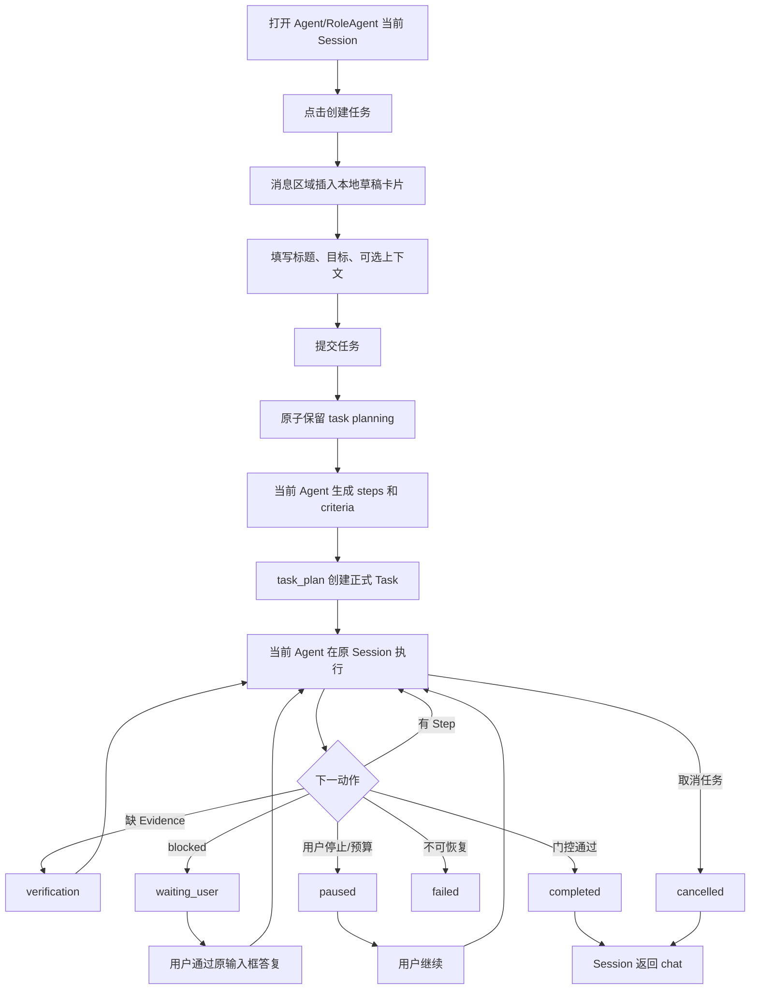

# 交互设计 - Story 9.41

**Story:** Agent/RoleAgent 任务入口与 pi-tasks 直接执行
**版本:** 2.1
**最后更新:** 2026-07-29

## 设计目标

让用户在 Agent 或 RoleAgent 当前会话中创建正式任务，并沿用现有“正在工作”、流式消息、工具状态和停止交互。任务卡片展示步骤、证据和阻塞，不暴露模型内部推理。

## 用户流程

## 任务入口

- 位于消息输入框工具栏，与附件等辅助操作同层。
- 使用任务图标，tooltip 和可访问名称为“创建任务”。
- 点击不发送输入框内容，也不触发模型请求。
- 已有草稿时重复点击只定位草稿。
- 当前 Session working、planning 或已有非终态 Task 时按钮禁用并说明原因。
- active Task 期间 branch/fork 入口禁用，并提示先完成或取消任务。

## 草稿卡片

- 草稿是 renderer 本地结构化项，不属于 LLM 消息。
- 包含标题、目标、可选上下文、取消和提交按钮。
- 不要求用户手工填写 steps/criteria；提交后的 planning 状态由 Agent 生成。
- 不显示执行策略、Workflow 或多 Agent 选项。
- 标题和目标为空时原地显示校验，不提交。
- 提交中锁定字段并防止重复操作。
- 提交失败且未创建 Task 时保留输入、焦点和稳定 draft key，支持原地重试。

## Planning 与 Task 卡片

- 提交后草稿原位进入 `planning`，不得立即伪造 taskId。
- `task_plan` state event 返回后，同一 UI item 原位绑定 taskId 并显示 ordered steps/criteria。
- planning 超时或失败时恢复可编辑草稿，并显示失败分类。
- 正式卡片展示标题、执行状态、canonical 状态、当前 Step、完成数、Evidence 摘要、Blocker 和更新时间。
- 卡片之后继续显示当前 Session assistant/tool 消息。
- 点击卡片展开详情，使用分区列表展示 Step、Criterion 和 Evidence，不嵌套卡片。
- 不显示 chain-of-thought、隐藏 continuation、完整工具参数或完整 Evidence 正文。

## 状态与操作

| 状态 | 展示 | 操作 |
|------|------|------|
| draft | 可编辑标题、目标、上下文 | 提交、取消 |
| planning | 正在生成步骤和验收标准 | 取消 planning |
| queued | 等待当前 Agent 开始 | 暂停、取消任务 |
| running | 当前 Step、进度和 Evidence 数量 | 停止、取消任务、查看详情 |
| verifying | 正在补充/校验证据 | 停止、取消任务、查看详情 |
| waiting_user | 具体 blocker 和所需输入 | 在原输入框答复、取消任务 |
| paused | 暂停原因和已保存进度 | 继续、取消任务 |
| recovering | 正在核对 Session/branch/Task | 查看详情，不允许重复提交 |
| completed | 完成摘要和已验证产物 | 打开产物、创建新任务 |
| failed | 失败原因和最后 canonical 状态 | 重试恢复、取消任务 |
| cancelled | 已取消 | 创建新任务 |

“停止”和“取消任务”必须是两个不同命令：

- 停止：中止当前 turn，保留 Task 和证据，进入 paused。
- 取消任务：中止当前 turn并将 Task 标记为 cancelled，不能继续。

首版不显示“强制完成”。

## waiting_user 答复

- 用户继续使用原消息输入框，不在卡片内维护第二个聊天输入框。
- 输入框上方显示当前 blocker 的简短提示和“正在答复任务”标识。
- 发送时客户端携带隐藏的 taskId、blockerId、modeEpoch 和 expectedRevision。
- blocker 已过期时不发送旧答复，刷新卡片并提示用户重新确认。
- 答复消息仍显示为普通用户消息，但由 Task Runtime消费；Chat Completion Guard不介入。

## Evidence 展示

- Step 显示 pending/active/completed/blocked。
- Criterion 显示未满足、待验证、已验证。
- Evidence 显示类型、引用标签、验证状态、摘要和时间。
- rejected/not_verified 使用文字和图标说明原因，不能只靠颜色。
- `task_complete` 被拒绝时，明确列出缺失 Step、Criterion、Evidence 或未解决 Blocker。
- 大型 artifact 只提供打开入口、大小和 hash 摘要，不内嵌完整内容。

## 错误与恢复反馈

- Task Runtime 不可用：`任务能力暂不可用，请检查运行时配置。`
- Planning 失败：`未能建立正式任务，草稿已保留：{可操作原因}`。
- 创建后首次执行失败：`任务已保存，但尚未开始执行：{原因}`。
- 无进展暂停：`任务连续多轮没有产生可验证进展，已暂停。`
- 预算耗尽：`任务已达到本次自动执行预算，当前进度已保存。`
- 等待用户：显示具体问题、所需授权或决策，不能只显示“已阻塞”。
- 恢复失败：显示 Session、branch、状态版本或运行时分类原因和下一步。
- Evidence 拒绝：显示 criterion/step、验证器和拒绝原因。

不可恢复错误必须：

1. 更新 Task 卡片状态。
2. 向当前消息区域投递一条去重的可见系统反馈。
3. 提供可执行动作：重试恢复、取消任务或查看详情。
4. reload 后仍可从投影恢复，不能只存在于内存 toast 或后台日志。

## 可访问性与性能

- 草稿插入后焦点进入标题。
- Enter/Space 激活按钮；输入框继续遵守 Enter发送、Shift+Enter换行。
- 状态变化使用 `aria-live="polite"`，高频 progress 不逐条播报。
- 状态不能只靠颜色表达。
- Task卡片使用聚合快照更新，不订阅每个 token delta。
- projection更新节流到100ms-250ms，单次payload不超过64KB。
- 小窗体内容换行，长ID截断并可复制。
- Task卡片更新不得阻塞现有统一流式消息的打字机渲染。

## 非目标

- 不展示 Workflow proposal、Worker、DAG、Agent 数或 Workflow 预算。
- 不提供“自动/直接/多 Agent”分段控件。
- 不提供 force completion。
- 多 Agent 详情由 Story 9.42 后续扩展。

## 变更历史

| 日期 | 变更 |
|------|------|
| 2026-07-28 | 创建初版 |
| 2026-07-28 | 删除执行策略和 Workflow UI，改为当前 Session 直接任务 |
| 2026-07-29 | 增加 planning、verifying、paused、recovering、waiting_user答复和错误恢复交互 |
