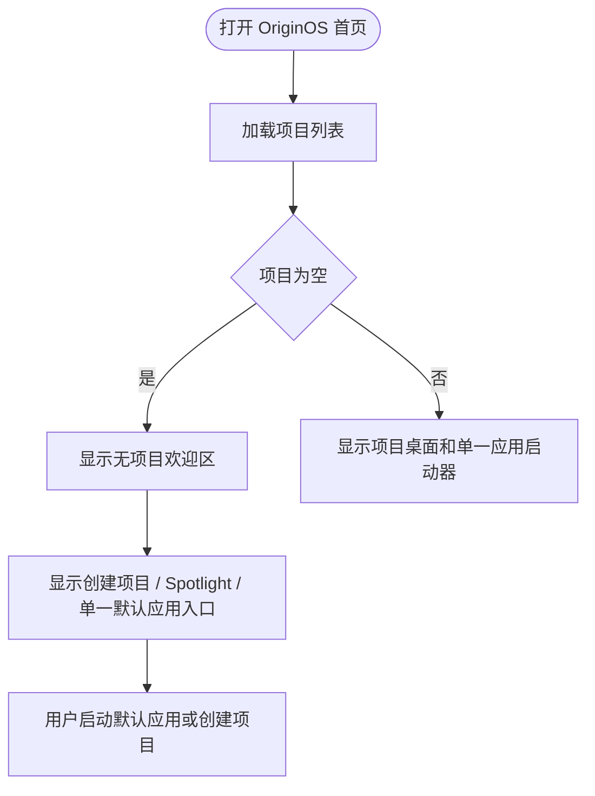
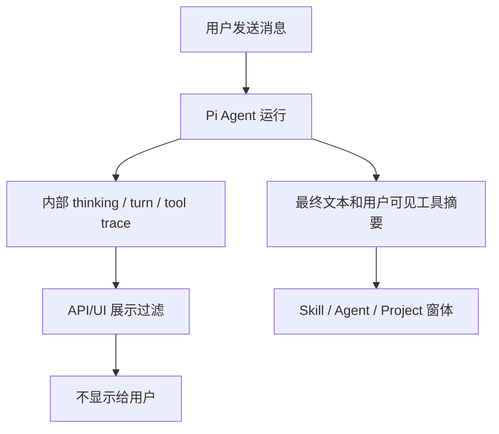

# 交互设计文档 - Story OS.17

**Story:** 无项目首页与 Agent 思考内容显示优化
**版本:** 1.0
**最后更新:** 2026-07-22

---

## 设计目标

让无项目桌面呈现为一个干净的默认 OS 首页：上方欢迎和创建引导负责方向感，下方或同一屏内的应用启动器负责操作入口，但同一应用不得重复出现。Agent 窗体保持“最终回复优先”的用户体验，只展示用户需要采取行动或可理解的输出。

---

## 用户流程

### 无项目首次进入

### Agent 消息展示

---

## 界面状态

### 无项目空状态

- 显示欢迎标题和创建项目按钮。
- 显示 Spotlight 提示。
- 显示一套默认应用入口；推荐保留主 Home Apps Section，或将 Welcome 内应用区提取为唯一入口。
- 不显示两个标题都叫“应用启动器”的区域。

### 有项目状态

- 显示项目桌面、项目统计和项目卡片。
- 显示一套默认应用启动器。
- 用户创建的 Agent、RoleAgent、Skill 按现有 section 展示。

### Agent 运行中

- 可以显示“正在思考...”这类状态文案或加载动画。
- 不显示模型真实 thinking 内容、turn 事件名或 reasoning trace。
- 工具调用可显示面向用户的摘要卡片，但不能把内部 prompt、状态机 turn 或 hidden reasoning 暴露出来。

### 历史消息加载

- 历史 assistant 消息只显示最终文本。
- 如果历史消息只有 thinking 而无最终文本，显示空状态或“未生成可显示回复”，不回退展示 thinking。

---

## 错误处理

- 项目加载失败：显示单一恢复性默认首页和重试入口，不重复应用列表。
- Skill 内容加载失败：保留 SkillDialog 当前错误提示策略，不展示内部 stack trace。
- Agent SSE 失败：显示错误消息，但过滤 error payload 中可能夹带的 reasoning/turn 文本。

---

## 可访问性与响应式

- 默认应用卡片仍可通过键盘 Tab 聚焦和 Enter 激活。
- 移除重复区域后，焦点顺序必须从欢迎操作进入唯一应用列表，不在重复列表之间跳转。
- 1366px、1920px 和移动宽度下，欢迎区、应用区和 Dock 不重叠。
- 加载状态使用文本和视觉状态共同表达，不依赖颜色单独传达。

---

## 设计约束

- 不引入营销式重复 hero。
- 不新增大面积说明文本来解释内部实现。
- 保持现有 Fluent/macOS 桌面视觉语言。
- 窗体中的“思考中”只能是状态，不是内容面板。
