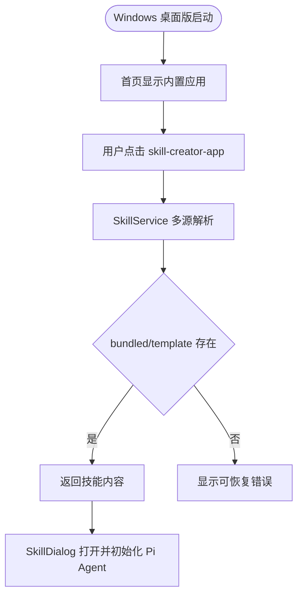

# 交互设计文档 - Story OS.18

**Story:** Windows 内置模板技能加载修复
**版本:** 1.0
**最后更新:** 2026-07-23

---

## 设计目标

这是运行时 bugfix，用户界面不新增新流程。目标是在用户点击首页内置模板技能时保持现有 SkillDialog 体验，但后台技能来源从 bundled/template 只读源解析，而不是依赖用户 `data/skills` 副本。

---

## 用户流程

---

## 界面状态

### 正常状态

- 首页仍显示 `skill-creator-app` 等内置应用入口。
- 用户点击后 SkillDialog 正常打开。
- 加载中的状态、输入框、Agent 初始化流程保持现状。

### 错误状态

- 若技能源缺失，错误提示应说明“内置技能资源缺失”，不要只显示泛化 not found。
- 日志必须包含 skill name 和尝试过的 source roots。
- 不展示内部 stack trace 给终端用户。

### 用户目录状态

- `data/skills` 继续只承载用户技能运行时产物或用户安装技能。
- 系统模板技能不显示为用户目录下的副本。

---

## 响应式与可访问性

无 UI 布局变更。现有首页 AppCard、SkillDialog 的键盘访问、焦点和响应式要求保持不变。

---

## 非适用项

- 不新增视觉设计。
- 不新增窗体类型。
- 不改变 Pi Agent 对话交互模型。
