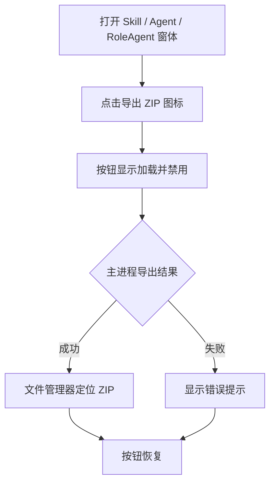

# 交互设计文档 - Story OS.19

**Story:** Skill、Agent 与 RoleAgent 目录导出 ZIP
**版本:** 1.0
**最后更新:** 2026-07-26

## 设计目标

在三类窗体已有头部操作区加入一致的导出能力，不增加独立页面或多步骤弹窗。

## 用户流程

## 控件与状态

- **入口**：窗体头部图标按钮，使用 Lucide 下载/归档图标。
- **提示**：hover/focus tooltip “导出 ZIP”，按钮包含同义 `aria-label`。
- **初始**：按钮可点击。
- **处理中**：显示旋转 loading 图标并禁用，稳定尺寸不引发布局位移。
- **成功**：系统文件管理器打开并选中 ZIP；不额外弹成功模态框。
- **失败**：使用现有 toast/错误反馈机制显示“导出失败：{原因}”，按钮恢复可重试。
- **非 Electron**：隐藏导出按钮，避免提供不可执行操作。

## 可访问性

- 支持 Tab 聚焦和 Enter/Space 激活。
- loading 状态通过 `aria-busy` 表达。
- 图标按钮触摸目标沿用现有窗体头部控件尺寸和设计系统。
- 不仅依赖颜色表达成功或失败。

## 响应式

- 按钮位于既有头部操作区，不改变窗体最小尺寸。
- 窄窗体中保持图标按钮，不新增文字占用宽度。

## 错误文案

| 场景 | 文案 |
|------|------|
| 目录不存在 | 导出失败：工作目录不存在 |
| ID 非法 | 导出失败：入口标识无效 |
| 压缩失败 | 导出失败：无法创建 ZIP 文件 |
| 系统定位失败 | ZIP 已创建，但无法在文件管理器中定位 |
