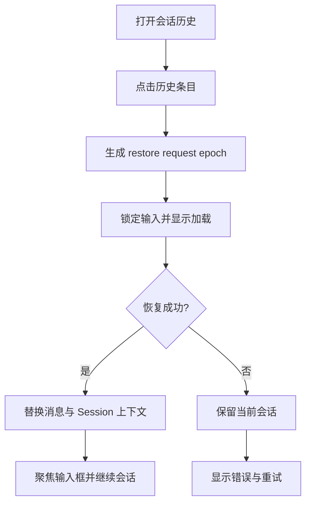

# 交互设计文档 - Story OS.20

**Story：** 窗体会话历史切换与上下文恢复  
**版本：** 1.0  
**最后更新：** 2026-07-29

## 设计目标

让历史切换成为明确、可感知、可恢复的原位操作。用户不离开当前窗体，也不创建
新的窗体或 Session。

## 用户流程

## 交互状态

### Idle

- 历史条目可点击。
- 当前 Session 有明确选中样式。
- 点击当前条目只关闭列表，不触发闪烁。

### Switching

- 被点击条目显示加载图标。
- 输入框和发送按钮暂时禁用。
- 保留当前消息内容，不先清空页面。
- 用户可继续选择另一条记录，后一请求替代前一请求。

### Restored

- 一次性提交目标 Session ID、消息和上下文投影，避免中间空白态。
- 消息区域滚动到历史末尾。
- 输入框重新获得焦点。
- 不自动发送欢迎消息或重复首轮 prompt。

### Failed

- 保留切换前 Session 和消息。
- 历史列表中目标条目取消加载状态。
- 窗体内显示“会话恢复失败”，并附带具体、脱敏的原因。
- 提供重试；Session 不存在时刷新列表并移除失效条目。

## 删除与新建

- 删除按钮必须继续阻止事件冒泡，不能先触发 restore。
- 删除当前 Session 后进入全新 Session；不得恢复已删除内容。
- 新建会话使用现有入口，但必须清除 restore epoch 和历史 runtime binding。

## 可访问性与性能

- 历史条目使用语义化 `button`，支持 Tab、Enter 和 Space。
- switching 状态通过 `aria-busy` 和 live region 通知。
- 焦点不能因列表关闭丢失；成功后回到消息输入框，失败后回到目标条目。
- 不对每条消息执行逐帧重新排序；历史批量载入后再启用现有流式渲染。
- 窗体最小尺寸下，标题、时间、消息数和错误文本不得重叠。
