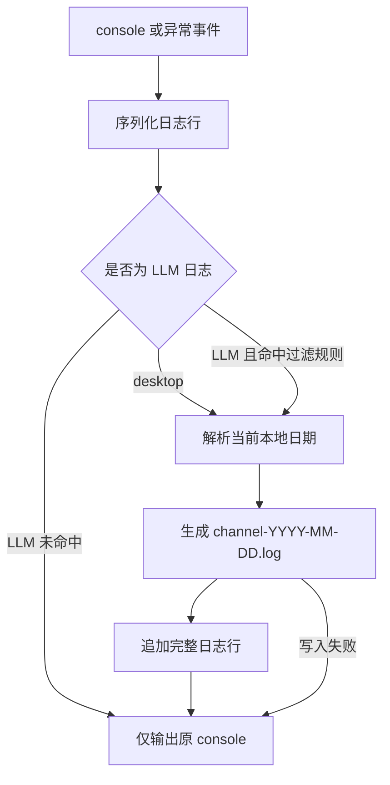

# 交互设计文档 - Story PERF.1

**Story:** 桌面日志按日期滚动  
**版本:** 1.0  
**最后更新:** 2026-07-27

## 适用性

本 Story 是 Electron 主进程基础设施变更，不新增可见 UI、按钮、设置项或用户流程。

## 运行时行为

## 可观察结果

- 维护人员在系统日志目录中按日期看到 desktop 与 LLM 两组文件。
- 应用跨日运行时无需重启即可出现新日期文件。
- 日志写入失败时应用功能和原 console 输出不受影响。

## 错误提示

不向普通用户显示日志写入错误，避免基础设施故障干扰会话。开发态可通过绑定前保存的原始 console 方法输出一次非递归诊断；生产态不得形成重试风暴。

## 响应式与可访问性

不适用。本 Story 不包含渲染进程 UI。
