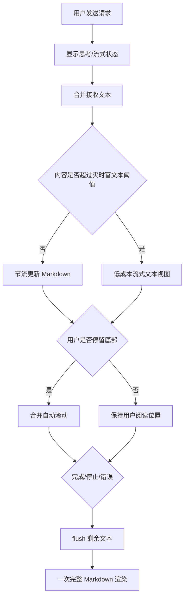

# 交互设计文档 - Story PERF.2

**Story:** IPC 流式长内容输出性能优化  
**版本:** 1.0  
**最后更新:** 2026-07-27

## 设计目标

性能优化不改变用户发送消息、查看工具状态和停止任务的操作模型。长内容流式阶段优先保证持续可读与交互响应，完整 Markdown 排版在消息结束后稳定呈现。

## 用户流程

## 交互状态

| 状态 | 表现 |
|------|------|
| 短内容流式 | 保持当前 Markdown 流式体验，但限制提交频率 |
| 长内容流式 | 使用可读的轻量文本呈现，保留换行和自动换行 |
| 用户向上阅读 | 暂停自动跟随，不抢夺滚动位置 |
| 完成 | flush 全部内容并切换为完整 Markdown |
| 停止 | 立即反馈停止状态，保留已接收内容 |
| 错误 | 先显示已接收内容，再显示明确错误状态 |

## 响应要求

- 停止点击到视觉反馈不超过 200 ms。
- 长流期间输入框、滚动、窗口控制和按钮可响应。
- 自动滚动不得使用可叠加的平滑动画。
- 完整 Markdown 切换不得导致消息区域宽度或滚动位置大幅跳变。

## 可访问性

- 流式与最终内容保持可选择文本。
- 不依赖颜色表达停止、错误或完成状态。
- 降级文本与最终 Markdown 的语义顺序一致。
- 避免每个 delta 触发屏幕阅读器 live region；按合并批次或完成状态播报。

## 响应式

长单行、代码块和表格在窄窗体中必须被容器约束；横向滚动只能发生在代码块或表格内部，不能撑宽整个窗体。
