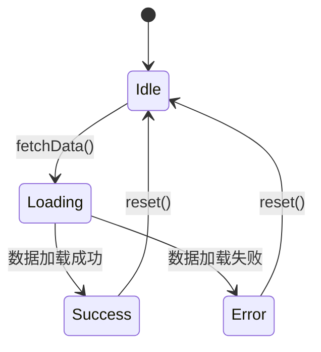

# 架构设计文档 - Story {N}.{M}

**Story:** {Story Title}
**版本:** 1.0
**最后更新:** {Date}

---

## 🏗️ 架构概览

### 设计目标

{描述这个 Story 的架构设计目标}

### AGENTS.md 规约符合性声明

本设计符合 [AGENTS.md](../../../AGENTS.md) 的以下规约：
- ✅ 技术栈约束（第 2 章）
- ✅ 目录结构规约（第 3 章）
- ✅ 模块依赖规约（单向按序依赖）
- ✅ 核心架构约束（第 4 章）
- ✅ 性能约束（第 6 章）

---

## 📦 技术栈

### 使用的技术

| 技术 | 版本 | 用途 | AGENTS.md 符合性 |
|------|------|------|-----------------|
| Next.js | 14.x | 框架 | ✅ 必须使用 |
| React | 18.x | UI 库 | ✅ 必须使用 |
| TypeScript | 5.x | 语言 | ✅ 必须使用 |
| Tailwind CSS | 3.x | 样式 | ✅ 必须使用 |
| Zustand | 4.x | 状态管理 | ✅ 必须使用 |
| {其他库} | {版本} | {用途} | ✅ 允许使用 |

### 禁止使用的技术

根据 AGENTS.md 第 2 章，以下技术禁止使用：
- ❌ Redux / MobX（必须使用 Zustand）
- ❌ CSS Modules / Styled Components（必须使用 Tailwind）
- ❌ 数据库（MVP 阶段使用本地文件系统）

---

## 📁 模块设计

### 文件结构

```
src/
├── app/                          # Next.js App Router
│   └── {相关页面}
│
├── components/                   # UI 组件
│   ├── atoms/
│   │   └── {原子组件}
│   ├── molecules/
│   │   └── {分子组件}
│   └── organisms/
│       └── {有机组件}
│
├── lib/
│   ├── features/
│   │   └── {feature-name}/       # 本 Story 涉及的 Feature
│   │       ├── index.ts          # 公共 API
│   │       ├── types.ts          # 类型定义
│   │       ├── {module}.ts       # 业务模块
│   │       └── {module}-store.ts # Zustand Store
│   │
│   ├── storage/                  # 数据存储
│   │   └── {相关模块}
│   │
│   └── utils/                    # 工具函数
│       └── {相关工具}
│
└── types/                        # 全局类型
    └── {相关类型}
```

### 模块职责

#### 模块 1: {模块名称}

**路径:** `src/lib/features/{feature-name}/{module}.ts`

**职责:**
- {职责 1}
- {职责 2}
- {职责 3}

**依赖:**
- `@/lib/storage/{module}` (Layer 1)
- `@/lib/utils/{module}` (Layer 1)

**导出 API:**
```typescript
export { functionName, ClassName, TypeName };
```

#### 模块 2: {模块名称}

**路径:** `src/lib/features/{feature-name}/{module}-store.ts`

**职责:**
- {职责 1}
- {职责 2}

**依赖:**
- `zustand`
- `@/lib/features/{feature-name}/types`

---

## 🔗 依赖关系

### 依赖层级图

```
┌─────────────────────────────────┐
│  app/{page}                     │  Layer 5
└────────────┬────────────────────┘
             ↓ 单向依赖
┌─────────────────────────────────┐
│  components/organisms/{comp}    │  Layer 4
└────────────┬────────────────────┘
             ↓ 单向依赖
┌─────────────────────────────────┐
│  lib/features/{feature}         │  Layer 2
└────────────┬────────────────────┘
             ↓ 单向依赖
┌─────────────────────────────────┐
│  lib/storage/{module}           │  Layer 1
│  lib/utils/{module}             │
└─────────────────────────────────┘
```

### 依赖规约检查

- ✅ 无双向依赖
- ✅ 无循环依赖
- ✅ 符合单向按序依赖原则
- ✅ Feature 间通过 index.ts 导出

---

## 📊 数据结构

### 类型定义

```typescript
// src/lib/features/{feature-name}/types.ts

/**
 * {类型描述}
 */
export interface TypeName {
  id: string;
  name: string;
  // 根据 AGENTS.md 第 4 章，必须包含以下字段
  createdAt: Date;
  updatedAt: Date;
}

/**
 * {类型描述}
 */
export type AnotherType = {
  // 类型定义
};
```

### 数据存储

**存储方式:** 本地文件系统 (JSON)

**存储路径:** `{project-root}/data/{feature-name}/`

**文件命名:** `{entity-name}.json`

**数据格式:**
```json
{
  "version": "1.0",
  "data": [
    {
      "id": "uuid",
      "name": "example",
      "createdAt": "2026-03-02T00:00:00Z",
      "updatedAt": "2026-03-02T00:00:00Z"
    }
  ]
}
```

---

## 🔌 API 设计

### 内部 API

#### API 1: {API 名称}

```typescript
/**
 * {API 描述}
 *
 * @param {ParamType} param - 参数描述
 * @returns {ReturnType} 返回值描述
 * @throws {ErrorType} 错误描述
 *
 * @example
 * const result = await apiFunction(param);
 */
export async function apiFunction(param: ParamType): Promise<ReturnType> {
  // 实现
}
```

**性能约束:** < {X} 秒（根据 AGENTS.md 第 6 章）

**错误处理:**
- {错误类型 1}: {处理方式}
- {错误类型 2}: {处理方式}

#### API 2: {API 名称}

```typescript
/**
 * {API 描述}
 */
export function anotherFunction(param: ParamType): ReturnType {
  // 实现
}
```

### 外部集成

#### Claude Code 集成

**集成点:** `src/lib/integrations/claude-code/`

**使用场景:** {使用场景描述}

**接口定义:**
```typescript
interface ClaudeCodeIntegration {
  // 接口定义
}
```

#### OpenClaw 集成

**集成点:** `src/lib/integrations/openclaw/`

**使用场景:** {使用场景描述}

---

## 🗄️ 状态管理

### Zustand Store

```typescript
// src/lib/features/{feature-name}/{feature}-store.ts

import { create } from 'zustand';

interface FeatureState {
  // 状态定义
  data: DataType[];
  loading: boolean;
  error: string | null;

  // 操作定义
  fetchData: () => Promise<void>;
  updateData: (id: string, data: Partial<DataType>) => void;
  reset: () => void;
}

export const useFeatureStore = create<FeatureState>((set, get) => ({
  data: [],
  loading: false,
  error: null,

  fetchData: async () => {
    set({ loading: true, error: null });
    try {
      // 实现
      set({ data: result, loading: false });
    } catch (error) {
      set({ error: error.message, loading: false });
    }
  },

  updateData: (id, data) => {
    // 实现
  },

  reset: () => {
    set({ data: [], loading: false, error: null });
  },
}));
```

### 状态流转



---

## ⚡ 性能优化

### 性能约束

根据 AGENTS.md 第 6 章：

| 指标 | 约束 | 优化策略 |
|------|------|---------|
| {指标名称} | < {X} 秒 | {优化策略} |
| {指标名称} | < {X} 秒 | {优化策略} |

### 优化策略

#### 策略 1: {策略名称}

**问题:** {性能问题描述}

**解决方案:**
```typescript
// Performance: Must complete in < {X}s
async function optimizedFunction() {
  // 优化实现
}
```

**预期效果:** {效果描述}

#### 策略 2: {策略名称}

**问题:** {性能问题描述}

**解决方案:** {解决方案描述}

---

## 🔒 安全考虑

### 输入验证

```typescript
import { z } from 'zod';

const inputSchema = z.object({
  // 验证规则
});

function validateInput(input: unknown) {
  return inputSchema.parse(input);
}
```

### 错误处理

```typescript
class FeatureError extends Error {
  constructor(
    message: string,
    public code: string,
    public details?: unknown
  ) {
    super(message);
    this.name = 'FeatureError';
  }
}

function handleError(error: unknown): never {
  if (error instanceof FeatureError) {
    // 处理已知错误
  } else {
    // 处理未知错误
  }
  throw error;
}
```

### 数据加密

**敏感数据:** {列出敏感数据}

**加密方式:** {加密方式描述}

---

## 🧪 可测试性设计

### 依赖注入

```typescript
interface Dependencies {
  storage: StorageService;
  logger: LoggerService;
}

export function createFeatureService(deps: Dependencies) {
  return {
    // 服务实现
  };
}
```

### Mock 数据

```typescript
// src/lib/features/{feature-name}/__mocks__/data.ts

export const mockData: DataType[] = [
  {
    id: 'mock-1',
    name: 'Mock Data 1',
    createdAt: new Date('2026-03-02'),
    updatedAt: new Date('2026-03-02'),
  },
];
```

---

## 📈 监控和日志

### 日志策略

```typescript
import { logger } from '@/lib/utils/logger';

function someFunction() {
  logger.info('Function started', { context });

  try {
    // 实现
    logger.debug('Operation completed', { result });
  } catch (error) {
    logger.error('Operation failed', { error });
    throw error;
  }
}
```

### 性能监控

```typescript
import { performance } from '@/lib/utils/performance';

async function monitoredFunction() {
  const start = performance.now();

  try {
    // 实现
  } finally {
    const duration = performance.now() - start;
    logger.info('Performance', { duration, threshold: 5000 });

    if (duration > 5000) {
      logger.warn('Performance threshold exceeded');
    }
  }
}
```

---

## 🔍 架构审查

### 审查清单

- [ ] 技术栈符合 AGENTS.md
- [ ] 模块依赖符合单向原则
- [ ] 数据结构设计合理
- [ ] API 接口设计完整
- [ ] 性能约束已考虑
- [ ] 安全风险已评估
- [ ] 可测试性设计完整
- [ ] 监控和日志完善

### 审查记录

| 日期 | 审查人 | 结果 | 备注 |
|------|--------|------|------|
| {Date} | {Name} | ✅ Approved / 🔄 Needs Revision | {备注} |

---

## 📌 相关文档

- [Story README](./README.md)
- [需求文档](./requirements.md)
- [交互设计](./interaction.md)
- [开发文档](./implementation.md)
- [AGENTS.md](../../../AGENTS.md)
- [Architecture Document](../../../_bmad-output/planning-artifacts/architecture.md)
