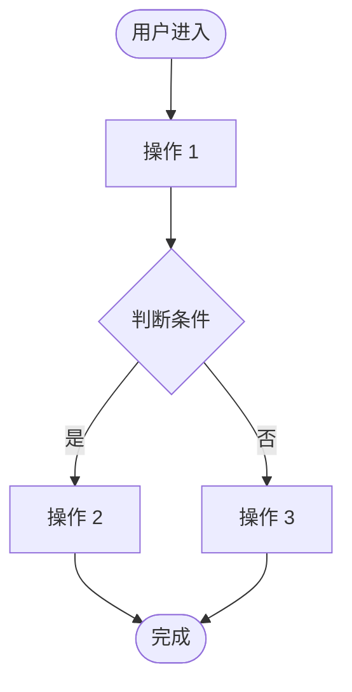
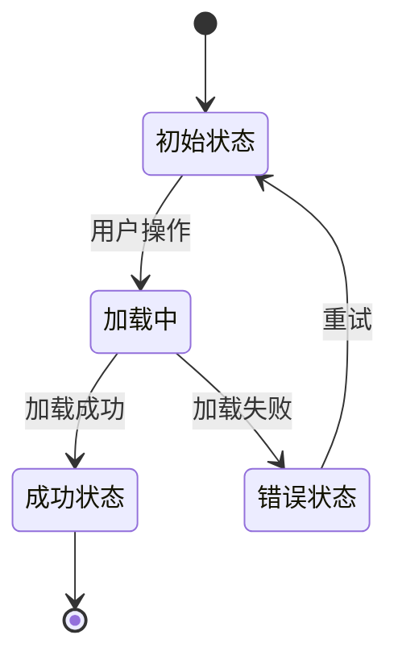

# 交互设计文档 - Story {N}.{M}

**Story:** {Story Title}
**版本:** 1.0
**最后更新:** {Date}

---

## 🎨 设计概览

### 设计目标

{描述这个 Story 的交互设计目标}

### 参考 UX 规范

参考 [UX Design Specification](../../../_bmad-output/planning-artifacts/ux-design-specification.md) 的以下章节：
- {章节名称}
- {章节名称}

---

## 🗺️ 用户流程

### 主流程

### 流程说明

#### 步骤 1: {步骤名称}

**触发条件:** {条件}
**用户操作:** {操作描述}
**系统响应:** {响应描述}
**下一步:** {下一步骤}

#### 步骤 2: {步骤名称}

**触发条件:** {条件}
**用户操作:** {操作描述}
**系统响应:** {响应描述}
**下一步:** {下一步骤}

---

## 🖼️ 界面设计

### 线框图

**说明：**
- {界面元素 1 说明}
- {界面元素 2 说明}
- {界面元素 3 说明}

### 高保真原型

**设计规范：**
- 颜色: {颜色规范}
- 字体: {字体规范}
- 间距: {间距规范}
- 组件: {使用的 shadcn/ui 组件}

---

## 🔄 交互状态

### 状态定义

#### 状态 1: 初始状态

**描述:** {状态描述}
**界面表现:** {界面表现}
**可用操作:** {可用操作列表}

#### 状态 2: 加载中

**描述:** {状态描述}
**界面表现:**
- 显示加载指示器
- 禁用交互元素
- 显示提示文本: "正在加载..."

**超时处理:** {超时后的处理}

#### 状态 3: 成功状态

**描述:** {状态描述}
**界面表现:** {界面表现}
**反馈方式:**
- 成功提示: {提示内容}
- 动画效果: {动画描述}

#### 状态 4: 错误状态

**描述:** {状态描述}
**界面表现:** {界面表现}
**错误提示:** {错误提示内容}
**恢复操作:** {用户可以如何恢复}

### 状态转换图

---

## ⚠️ 错误处理

### 错误类型 1: {错误名称}

**触发条件:** {条件}
**错误提示:** "{错误提示文本}"
**提示位置:** {位置描述}
**提示样式:**
- 类型: 错误 / 警告 / 信息
- 颜色: 红色 / 黄色 / 蓝色
- 图标: ❌ / ⚠️ / ℹ️

**用户操作:**
- 主操作: {操作按钮}
- 次操作: {操作按钮}

### 错误类型 2: {错误名称}

**触发条件:** {条件}
**错误提示:** "{错误提示文本}"
**提示位置:** {位置描述}
**用户操作:** {操作描述}

---

## ♿ 可访问性设计

### 键盘导航

| 按键 | 功能 |
|------|------|
| Tab | 焦点移动到下一个元素 |
| Shift + Tab | 焦点移动到上一个元素 |
| Enter | 激活当前焦点元素 |
| Esc | 关闭对话框/取消操作 |
| {自定义快捷键} | {功能描述} |

### 屏幕阅读器支持

- **ARIA 标签:** {标签使用说明}
- **语义化 HTML:** {使用的语义化标签}
- **焦点管理:** {焦点管理策略}
- **状态通知:** {如何通知状态变化}

### 颜色对比度

- **文本对比度:** 符合 WCAG AA 标准 (4.5:1)
- **大文本对比度:** 符合 WCAG AA 标准 (3:1)
- **非文本对比度:** 符合 WCAG AA 标准 (3:1)

### 触摸目标

- **最小尺寸:** 44x44 px
- **间距:** 至少 8px

---

## 📱 响应式设计

### 桌面端 (>= 1920px)

**布局:** {布局描述}
**特殊处理:** {特殊处理说明}

### 平板端 (768px - 1919px)

**布局:** {布局描述}
**特殊处理:** {特殊处理说明}

### 移动端 (< 768px)

**布局:** {布局描述}
**特殊处理:** {特殊处理说明}

**注意:** MVP 阶段主要优化桌面端体验。

---

## 🎬 动画和过渡

### 动画 1: {动画名称}

**触发时机:** {触发条件}
**动画效果:** {效果描述}
**持续时间:** {时间}
**缓动函数:** ease-in-out / linear / cubic-bezier

### 动画 2: {动画名称}

**触发时机:** {触发条件}
**动画效果:** {效果描述}
**持续时间:** {时间}

**性能考虑:**
- 使用 CSS transform 和 opacity
- 避免触发 layout 和 paint
- 使用 will-change 优化

---

## 📐 设计规范

### 组件使用

| 组件 | 来源 | 用途 |
|------|------|------|
| Button | shadcn/ui | {用途} |
| Input | shadcn/ui | {用途} |
| Dialog | shadcn/ui | {用途} |
| {自定义组件} | 自定义 | {用途} |

### 样式规范

**颜色：**
- 主色: {颜色值}
- 辅助色: {颜色值}
- 成功: {颜色值}
- 警告: {颜色值}
- 错误: {颜色值}

**字体：**
- 标题: {字体规范}
- 正文: {字体规范}
- 代码: {字体规范}

**间距：**
- 使用 Tailwind 间距系统 (4px 基准)

---

## 🔍 设计审查

### 审查清单

- [ ] 用户流程完整
- [ ] 交互状态定义清晰
- [ ] 错误处理已设计
- [ ] 可访问性已考虑
- [ ] 响应式设计已规划
- [ ] 动画性能已优化
- [ ] 符合 UX 设计规范
- [ ] 组件使用符合 shadcn/ui 规范

### 审查记录

| 日期 | 审查人 | 结果 | 备注 |
|------|--------|------|------|
| {Date} | {Name} | ✅ Approved / 🔄 Needs Revision | {备注} |

---

## 📎 设计资源

### 文件清单

- [线框图 1](./assets/wireframes/wireframe-1.png)
- [原型 1](./assets/mockups/mockup-1.png)
- [流程图](./assets/diagrams/user-flow.png)

### 设计工具

- **原型工具:** Figma / Sketch
- **流程图工具:** Mermaid / Draw.io
- **图标库:** {图标库名称}

---

## 📌 相关文档

- [Story README](./README.md)
- [需求文档](./requirements.md)
- [架构设计](./architecture.md)
- [UX Design Specification](../../../_bmad-output/planning-artifacts/ux-design-specification.md)
