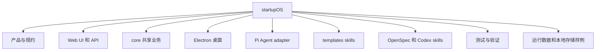

# 00 全量阅读清单

本文件记录深入教程的阅读范围。它的作用不是替代源码，而是保证后续课程知道自己覆盖了哪些区域。

## 1. 本轮统计范围

统计时排除了以下目录：

- `.git`
- `node_modules`
- `packages/web/.next`
- `packages/desktop/dist-electron`
- `dist`
- `release`

这些目录属于版本库元数据、依赖、构建产物或发布产物，不作为源码学习入口。

## 2. 文件总量

重新扫描后的口径分两层：

```text
全仓文件总数：2232
排除依赖和构建产物后的学习登记文件数：2147
可读文本文件：2097
可读文本总行数：434145
```

说明：`05-file-coverage-matrix.md` 使用的是更严格的全仓登记口径，因此会同时记录图片、二进制、运行数据和排除项。后续课程以这里的新扫描结果为准。

按顶层目录统计：

| 顶层目录 | 文件数 | 学习定位 |
| --- | ---: | --- |
| `packages` | 1088 | 核心源码 |
| `docs` | 674 | 产品、架构、Story、QA、设计文档 |
| `templates` | 237 | 内置技能、项目访谈模板、Agent/Skill 模板 |
| `openspec` | 35 | OpenSpec 配置、变更、主规格 |
| `learning-note` | 44 | 当前学习笔记 |
| `scripts` | 10 | 仓库级检查和文档脚本 |
| `electron` | 9 | 历史/根级 Electron 文件 |
| `resources` | 7 | 图标、签名权限等资源 |
| `tests` | 6 | 根级集成和 E2E 测试 |
| `.codex` | 5 | Codex OpenSpec skills |
| `patches` | 2 | 上游依赖补丁 |
| `models` | 2 | 本地模型资产 |

按扩展名统计的主要类型：

| 类型 | 文件数 | 含义 |
| --- | ---: | --- |
| `.md` | 869 | 文档、Story、Skill 说明、记忆文件 |
| `.ts` | 733 | TypeScript 业务和基础设施代码 |
| `.tsx` | 164 | React UI 组件和页面 |
| `.js` | 70 | adapter、脚本、运行时桥接 |
| `.py` | 58 | Skill 脚本和辅助工具 |
| `.json` | 52 | 配置、数据、证据 |
| `.jsonl` | 42 | 会话、实践日志、事件流 |
| `.png/.jpg/.webp/svg` | 多个 | UI/README/课程配图和图标 |

## 3. 源码学习范围

深入教程把项目分成 9 类阅读对象：



## 4. 明确不当作源码入口的内容

这些内容仍然会被识别，但不作为教程逐文件讲解重点：

- `.DS_Store`：macOS 元数据；
- `.pyc`：Python 缓存；
- `.tsbuildinfo`：TypeScript 增量构建缓存；
- `.onnx`、`vocab.txt`：模型资产，作为功能依赖说明，不逐字阅读；
- 图片资源：用于产品和 UI 识别，不逐像素讲解；
- `packages/*/data` 下的历史运行数据：作为存储样例，不当作源代码。

## 5. 后续阅读规则

每个深入章节都按同一套模板写：

- 本章学习目标；
- 相关真实文件；
- Mermaid 架构图或时序图；
- 核心代码路径；
- 关键类型和数据结构；
- 运行时流程；
- 常见误解；
- 测试入口；
- 小练习。
