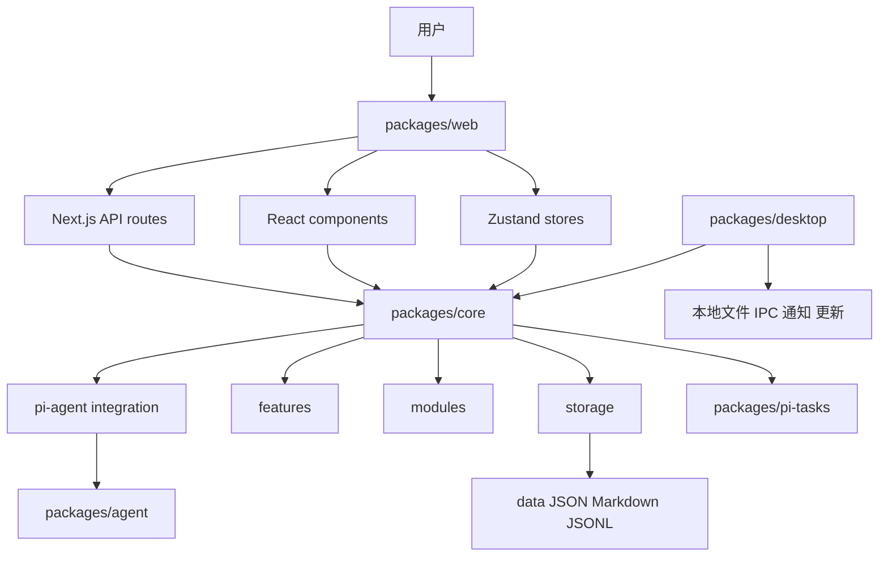
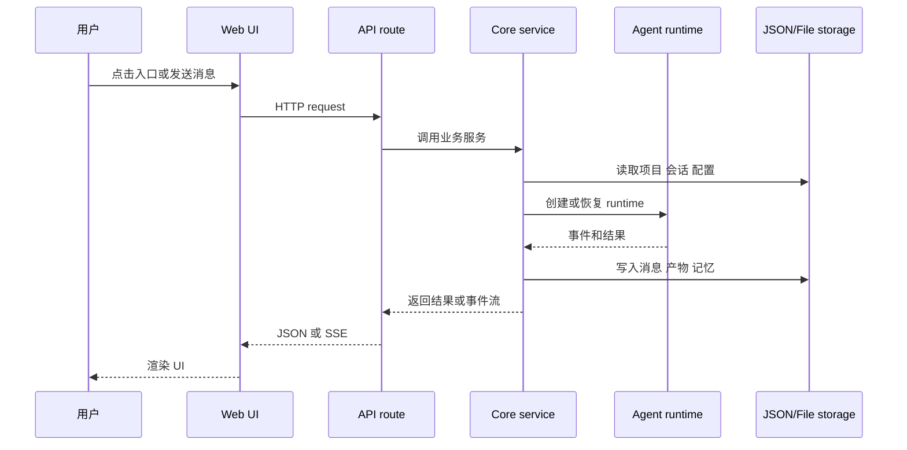

# 02 源码系统地图

这一章把源码按系统能力重新组织。后续深入章节会按这张地图逐块展开。

## 1. 总体结构

## 2. Web 层

关键目录：

- `packages/web/src/app`
- `packages/web/src/components`
- `packages/web/src/config`
- `packages/web/src/services`
- `packages/web/src/store`
- `packages/web/src/styles`

学习重点：

- `app/` 是页面和 API route 边界；
- `components/` 是 UI；
- `config/` 提供首页和系统 app 配置；
- `services/` 是 Web 侧适配；
- `store/` 是 Zustand 状态；
- 共享业务不要写进 `app/`。

## 3. Core 层

关键目录：

- `packages/core/src/lib/features`
- `packages/core/src/lib/integrations`
- `packages/core/src/lib/storage`
- `packages/core/src/modules`
- `packages/core/src/types`

学习重点：

- `features`：agent、skills、project、interview、ontology、taste 等业务功能；
- `integrations/pi-agent`：Agent runtime 核心；
- `modules/memory-core`：记忆模块；
- `modules/collaboration-runtime`：多 Agent 协作；
- `storage`：本地 JSON/file 存储基础设施；
- `types`：跨模块类型。

## 4. Desktop 层

关键目录：

- `packages/desktop/src/main`
- `packages/desktop/src/main/services`
- `packages/desktop/src/lib/integrations/electron`
- `packages/desktop/scripts`

学习重点：

- Electron main 负责本地能力；
- preload/IPC 连接 renderer 和 main；
- desktop services 提供 project、workspace、ontology、skill、agent-session 等服务；
- scripts 负责打包、发布和验证。

## 5. Agent Adapter 层

关键目录：

- `packages/agent`
- `packages/pi-tasks`
- `patches/`

学习重点：

- `packages/agent` 包装上游 Pi Agent 运行时；
- `packages/pi-tasks` 是受控 task runtime；
- `patches` 修改上游依赖行为；
- 这层更靠近底层 runtime，不是 UI 功能入口。

## 6. Skills 和模板

关键目录：

- `templates/skills`
- `templates/project-interview`
- `packages/core/src/lib/features/skills/bundled`

学习重点：

- `templates/skills/*/SKILL.md` 是内置技能定义；
- `project-interview` 提供 Project Agent 工作目录模板；
- bundled skills 是 core 内置技能；
- Skill 源目录和输出目录必须分开。

## 7. Docs、Story、OpenSpec

关键目录：

- `docs/product`
- `docs/design`
- `docs/specs`
- `docs/templates/story-spec-template`
- `docs/test-cases`
- `openspec`
- `.codex/skills`

学习重点：

- 产品文档解释“为什么做”；
- design 文档解释“怎么设计”；
- Story 文档定义需求和验收；
- OpenSpec 管理可实施变更；
- Codex skills 定义 explore/propose/apply/sync/archive 工作流。

## 8. 数据流总览

## 9. 读源码的基本准则

1. 先判断层级，再找文件。
2. 先读 `index.ts` 和类型，再读内部实现。
3. 先追一条用户流程，再横向看模块。
4. 看到 API route，继续追到 core service。
5. 看到 UI 状态，继续追 store 和事件来源。
6. 看到 Agent 逻辑，确认工作目录、工具、session 和持久化。

