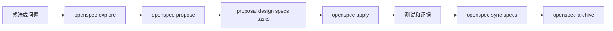
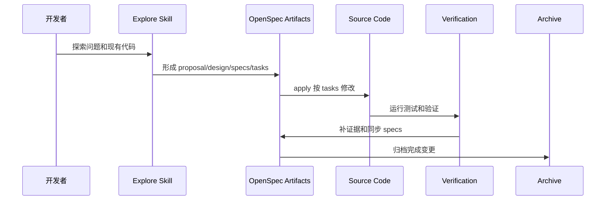

# 03 OpenSpec 与 Codex Skills

这一章解释 OriginOS 里的 Codex skills 和 OpenSpec。它们不是产品运行时的一部分，而是开发流程和变更治理的一部分。

## 1. 相关文件

Codex skills：

- `.codex/skills/openspec-explore/SKILL.md`
- `.codex/skills/openspec-propose/SKILL.md`
- `.codex/skills/openspec-apply-change/SKILL.md`
- `.codex/skills/openspec-sync-specs/SKILL.md`
- `.codex/skills/openspec-archive-change/SKILL.md`

OpenSpec：

- `openspec/config.yaml`
- `openspec/changes/`
- `openspec/specs/`

Story：

- `docs/specs/`
- `docs/templates/story-spec-template/`

## 2. OpenSpec 在项目里的角色

`AGENTS.md` 规定，Story 文档管理需求和验收，OpenSpec Proposal 是实施边界。

你可以这样理解：

## 3. 五个 Codex skills 分工

| Skill | 作用 | 是否写代码 |
| --- | --- | --- |
| `openspec-explore` | 探索问题、读代码、澄清需求 | 不写代码 |
| `openspec-propose` | 创建 change，生成 proposal/design/specs/tasks | 写 OpenSpec artifact |
| `openspec-apply-change` | 按 tasks 实施变更 | 写代码 |
| `openspec-sync-specs` | 把 delta specs 合并到 main specs | 写 spec |
| `openspec-archive-change` | 完成后归档 change | 移动/归档 artifact |

## 4. openspec/config.yaml 的约束

配置里写了项目上下文：

- OriginOS 是 Pi Agent 驱动的 AI Native 桌面操作环境；
- Node.js 24+、pnpm workspace、TypeScript strict mode；
- 前端是 Next.js App Router、React、Tailwind、Zustand；
- 桌面端是 Electron main/preload/IPC；
- 共享业务逻辑位于 `packages/core`；
- MVP 禁止数据库和额外后端框架；
- 架构事实源是 `AGENTS.md`。

它还规定：

- OpenSpec 正文统一中文；
- 每个 Proposal 对应一个可独立交付的 Story Task；
- Proposal 未 strict validation 和明确批准前不得实施；
- design 必须证明符合 AGENTS.md；
- tasks 必须声明依赖、写入范围、测试要求和完成证据。

## 5. 变更闭环

一个健康变更应该像这样：

## 6. 为什么这对学习项目重要

你读代码时，不能只看当前实现。还要看：

- Story 为什么要求这样做；
- OpenSpec change 当时解决了什么问题；
- design 里记录了哪些替代方案；
- tasks 要求哪些测试；
- archive 里保留了什么验证证据。

这能帮你判断：

- 当前代码是临时实现还是规范实现；
- 哪些边界是硬约束；
- 哪些地方后续可能还会演进；
- 改动时需要补哪些文档和测试。

## 7. 深入学习任务

建议按顺序读：

1. `.codex/skills/openspec-explore/SKILL.md`
2. `.codex/skills/openspec-propose/SKILL.md`
3. `.codex/skills/openspec-apply-change/SKILL.md`
4. `.codex/skills/openspec-sync-specs/SKILL.md`
5. `.codex/skills/openspec-archive-change/SKILL.md`
6. `openspec/config.yaml`
7. `openspec/changes/validate-pi-tasks-runtime-boundary/`
8. `openspec/changes/archive/`
9. `openspec/specs/`

读完以后，你应该能回答：

- 什么情况下用 explore？
- Proposal 里必须写什么？
- apply 为什么要先读 context files？
- delta spec 怎么同步到 main spec？
- archive 前为什么要检查 tasks 和 specs？

