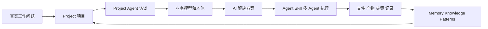
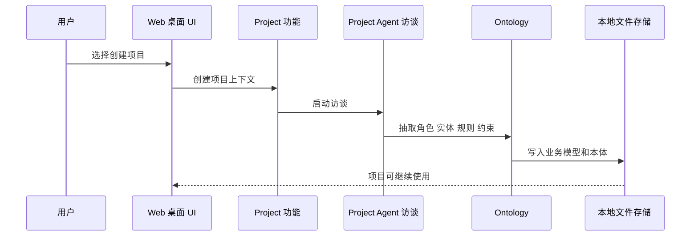
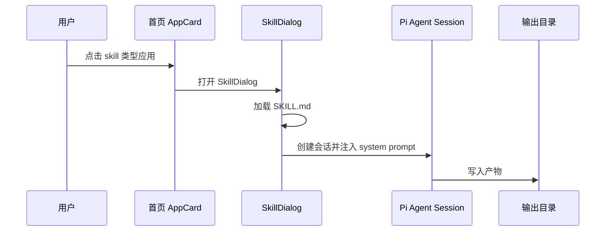
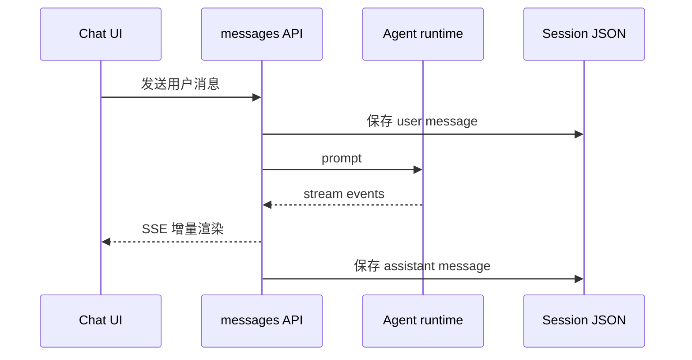

# A1 产品主线和真实目标

## 问题

这一章解决一个基础问题：

> OriginOS 到底要做什么？它为什么不是普通聊天工具，也不是普通桌面壳？

如果这个问题不清楚，后面读源码会混乱。你会看到 `Project`、`Agent`、`Skill`、`Ontology`、`Memory`、`Workspace`、`Collaboration runtime`，但不知道它们为什么放在一起。

本章要建立的判断是：

> OriginOS 的核心不是“聊天”，而是把真实工作问题组织成项目，再通过 AI 方案、Agent 执行和知识沉淀形成闭环。

这张小黑图先帮你建立直觉：用户不是把一句话扔给聊天框就结束，而是把问题放进一个可持续工作的项目空间。项目会沉淀业务模型、文件、记忆、知识和经验模式。后面再打开具体源码时，你要一直问一个问题：这段代码在闭环里的位置是什么？

## 图解

产品主线不是单次问答，而是一个工作闭环：

这张图要读出三层含义：

- 输入是工作问题，不是菜单点击；
- 中间要形成项目上下文和业务模型，不是直接让模型回答；
- 输出会回到项目里，成为下一次继续工作的资产。

## 源码入口

这一章先读“事实源”，不是先读实现：

- `README.md`
- `README_CN.md`
- `AGENTS.md`
- `docs/product/`
- `docs/design/`
- `docs/specs/`

重点摘取：

- `README.md` 定义产品闭环：Project interview -> Business model and ontology -> AI solution -> Agent execution -> Artifacts and knowledge。
- `README_CN.md` 提供中文产品表述：从问题出发，把项目、Agent、角色、技能、文件、知识、通知和定时任务组织在同一个桌面中。
- `AGENTS.md` 定义强制架构边界和 MVP 范围。

这里要特别注意“事实源”的意思。源码当然最真实，但新手第一遍直接扎进 `page.tsx` 或某个 service，很容易只看见局部实现，不知道系统为什么这样拆。A1 的目标不是把每个文件读完，而是先建立一张产品地图：

- `README.md` 和 `README_CN.md` 回答“产品想解决什么问题”；
- `AGENTS.md` 回答“实现时哪些边界不能破坏”；
- `docs/product/` 和 `docs/design/` 回答“用户体验和产品对象怎么组织”；
- `docs/specs/` 回答“每个 Epic / Story 的验收范围是什么”。

读这些文件时，不要只摘关键词。你要把每一段归到闭环中的某一步：它是在讲项目、访谈、本体、Skill、Agent 执行、文件产物，还是知识沉淀。

## 调用链

产品主线最终会落成几条源码链路。

第一条：创建项目链路。

第二条：Skill 执行链路。

第三条：Agent 消息链路。

你现在不需要掌握每条链路的所有代码，只要知道产品闭环最终会落到这些源码链路里。

## 关键类型

这一章的“关键类型”不是某个 TypeScript interface，而是产品对象模型：

| 对象 | 人话解释 | 后续源码位置 |
| --- | --- | --- |
| `Project` | 真实工作的上下文容器 | `packages/core/src/lib/features/project/` |
| `Agent` | 可对话、可用工具、可执行任务的运行体 | `packages/core/src/lib/integrations/pi-agent/` |
| `Skill` | 被系统加载的可复用专项工作流 | `templates/skills/`、`packages/core/src/lib/features/skills/` |
| `Ontology` | 对业务世界的结构化理解 | `packages/core/src/lib/features/ontology/`、`ontology-data-store/` |
| `Memory` | 历史和长期状态 | `packages/core/src/modules/memory-core/` |
| `Knowledge` | 可复用事实和领域知识 | `packages/core/src/lib/integrations/pi-agent/cognitive/` |
| `Patterns` | 可复用经验模式 | `packages/core/src/lib/integrations/pi-agent/cognitive/pattern/` |

这些对象是后续源码学习的索引。

## 测试入口

产品主线本身不会只有一个测试文件。它分散在多类测试中：

- 项目和访谈：`packages/core/src/lib/features/interview/`、`docs/test-cases/epic-1-project-quick-launch/`
- Agent session：`packages/core/src/lib/features/agent/session-service.ts` 相关测试
- Skill：`packages/core/src/lib/features/skills/__tests__/`
- 多 Agent：`packages/core/src/modules/collaboration-runtime/**/__tests__/`
- E2E：`tests/e2e/`

第一遍只要理解：产品主线越长，测试也越分散。后面每个模块章会具体定位测试。

## 练习

练习 1：用自己的话写出 OriginOS 的一句话定义，但必须包含 `Project`、`Agent`、`Skill`、`Knowledge` 四个词。

练习 2：从 `README_CN.md` 里找出“项目访谈 -> 业务模型 -> 执行 -> 沉淀”的对应段落，写出每段的产出。

练习 3：画一张自己的 Mermaid 图，表达“用户问题如何变成项目产物”。

## 验收

学完本章，你应该能做到：

- 能解释为什么 OriginOS 不是普通聊天工具；
- 能说清产品闭环五步；
- 能把 `Project / Agent / Skill / Ontology / Memory` 关联起来；
- 能指出产品事实源在 `README.md`、`README_CN.md` 和 `AGENTS.md`；
- 能把一个真实工作问题放进 OriginOS 的产品主线里描述。
