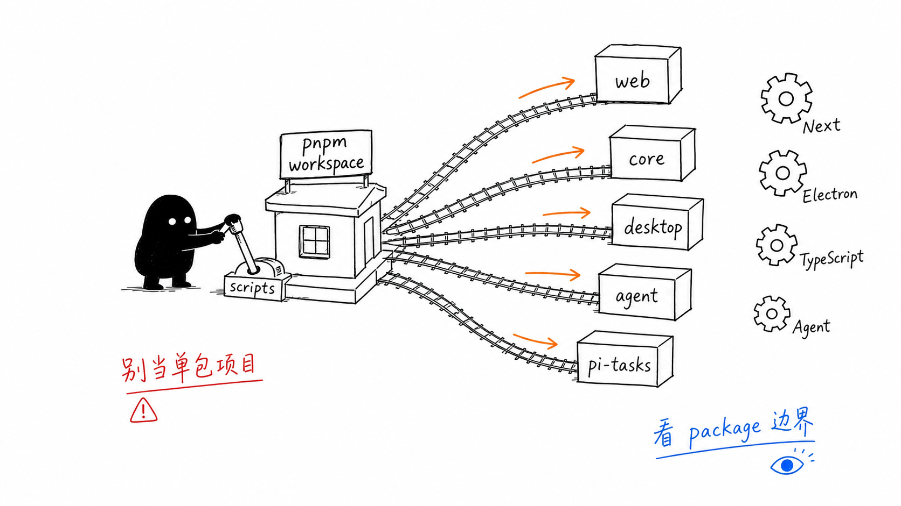
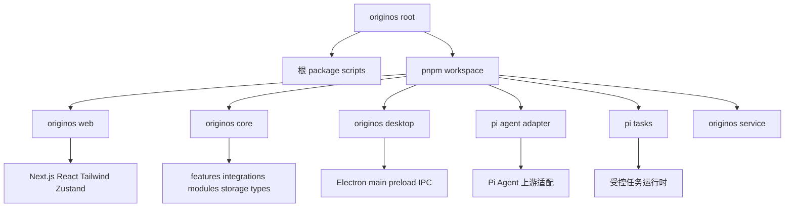
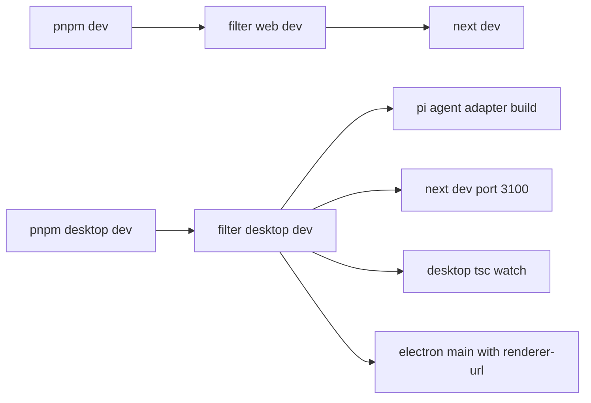
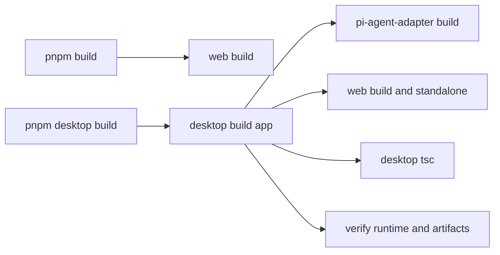

# A2 技术栈和 Monorepo

## 问题

这一章解决：

> OriginOS 是什么技术栈？为什么它不是一个普通 Next.js 仓库？

如果你只把它当成前端项目，会忽略 Electron、core、Agent adapter、本地文件存储、OpenSpec、内置 Skills 等关键部分。

本章要建立的判断是：

> OriginOS 是 pnpm workspace monorepo。Web、Core、Desktop、Agent adapter、pi-tasks、service 是不同 package，它们各自承担不同边界。

这张小黑图把 monorepo 想成一个工作台：根目录负责调度，Web 负责用户界面，Core 负责共享业务，Desktop 负责 Electron 壳，Agent adapter 负责接入 Pi Agent，其他包各守自己的边界。学习时不要把所有 `packages/*` 都当成“前端文件夹”，它们是不同运行环境和职责边界。

## 图解

这张图说明：根目录不是应用本体，而是 workspace 和脚本调度中心。

## 源码入口

先读这些文件：

- `package.json`
- `pnpm-workspace.yaml`
- `packages/web/package.json`
- `packages/core/package.json`
- `packages/desktop/package.json`
- `packages/agent/package.json`
- `packages/pi-tasks/package.json`
- `tsconfig.json`
- `tsconfig.base.json`
- `tailwind.config.ts`

关键事实：

- 根 `package.json` 的 `name` 是 `originos`，版本 `0.1.47`。
- `packageManager` 是 `pnpm@9.15.9`。
- Node 要求是 `>=22.19.0`，README 运行说明里写 Node.js 24+。
- `pnpm-workspace.yaml` 声明 `packages/*` 进入 workspace。
- `nodeLinker: hoisted` 是为了 Electron + monorepo 运行期依赖解析。
- TypeScript 开启 strict 和大量额外检查。

这一章读源码时，可以按三层来理解：

第一层是“包管理层”。`pnpm-workspace.yaml` 决定哪些目录是 workspace package，根 `package.json` 决定常用命令怎么转发。你看到 `pnpm --filter @originos/web dev` 时，要理解它不是执行全仓库，而是只进入 Web 包。

第二层是“运行环境层”。`@originos/web` 跑在浏览器和 Next.js server 边界，`@originos/desktop` 跑在 Electron main / preload / renderer 组合里，`@originos/core` 应该尽量不绑定具体 UI 环境，这样 Web 和 Desktop 才能复用。

第三层是“业务边界层”。真正的业务对象、Agent 集成、本体、协作运行时、存储抽象，应该优先在 `packages/core` 找。Web 页面和 Electron 服务更多是入口、适配和编排。

## 调用链

### 开发命令链路

### 构建命令链路

这说明 desktop 构建比 web 构建复杂，因为它要把 Web、Electron、Agent runtime、native 依赖都打包起来。

## 关键类型

这里的关键不是业务类型，而是 package 边界。

| Package | 关键技术 | 职责 |
| --- | --- | --- |
| `@originos/web` | Next.js、React、Tailwind、Zustand、Vitest | Web UI、App Router、API route 边界 |
| `@originos/core` | TypeScript、zod、uuid | 共享业务、Agent 集成、模块和类型 |
| `@originos/desktop` | Electron、electron-builder、Vitest | 桌面壳、主进程、IPC、本地服务、发布 |
| `@originos/pi-agent-adapter` | 上游 Pi Agent、esbuild | Agent runtime 适配边界 |
| `@originos/pi-tasks` | Node ESM、TypeScript check | 受控 pi-tasks fork |
| `@originos/service` | core dependency | 服务包边界 |

核心依赖：

- UI：`next`、`react`、`tailwindcss`、`lucide-react`
- 状态：`zustand`
- 图和可视化：`@xyflow/react`、`d3-force`、`mermaid`
- 文档渲染：`react-markdown`、`remark-gfm`、`rehype-highlight`
- Agent：`@originos/pi-agent-adapter`
- 桌面：`electron`、`electron-builder`
- 测试：`vitest`、`@testing-library/react`

## 测试入口

和技术栈相关的验证入口：

- Web lint：`pnpm lint`
- Web 类型检查：`pnpm type-check`
- Web 测试：`pnpm test`
- Desktop 测试：`pnpm --filter @originos/desktop test`
- Pi tasks：`pnpm --filter @originos/pi-tasks verify`
- Agent adapter：`pnpm --filter @originos/pi-agent-adapter test`
- 桌面包验证：`packages/desktop/scripts/verify-*`

注意：根 `pnpm test` 只转发到 `@originos/web test`。如果你改了 desktop、pi-tasks 或 agent adapter，要跑对应 package 的测试。

## 练习

练习 1：解释 `pnpm dev` 和 `pnpm desktop:dev` 的区别。

练习 2：打开 `packages/core/package.json`，找出它对外 exports 的三类入口：`lib/features`、`lib/integrations`、`modules`。

练习 3：写出“新增一个 Web UI 组件”和“修改 Agent tool”分别应该优先跑哪些验证命令。

## 验收

学完本章，你应该能做到：

- 能解释为什么这是 monorepo；
- 能说清 6 个 workspace package 的职责；
- 能读懂根 scripts 的转发关系；
- 能根据改动范围选择验证命令；
- 能说明 TypeScript strict、Tailwind、Zustand、Electron、Pi Agent adapter 分别在哪里发挥作用。
