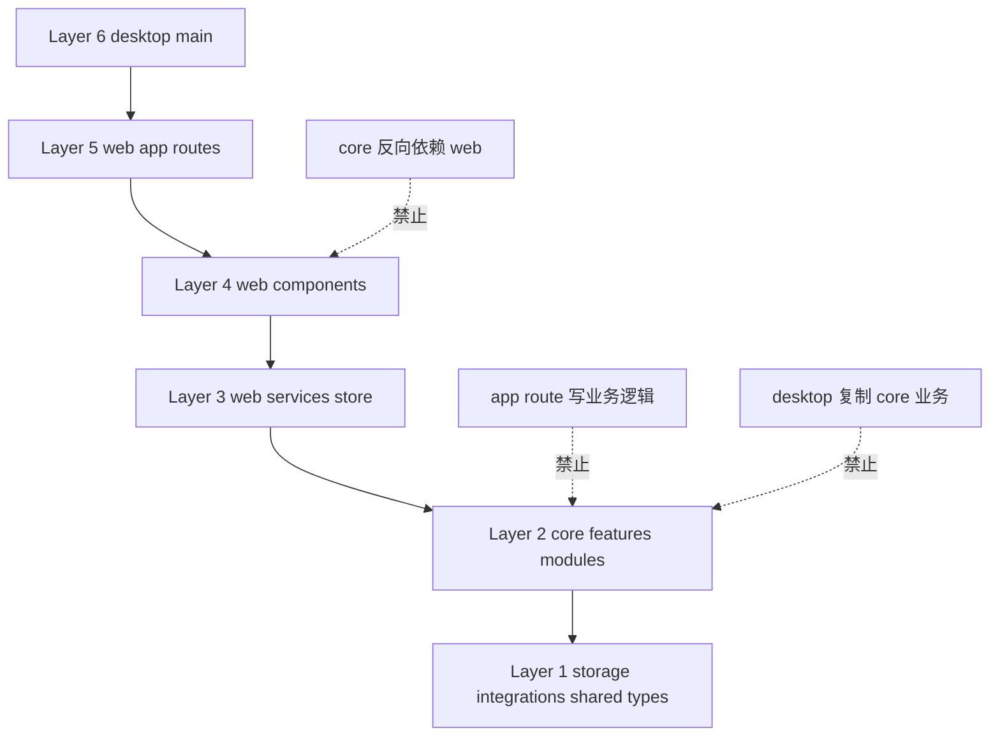
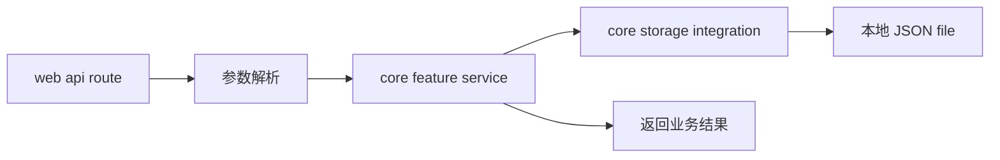
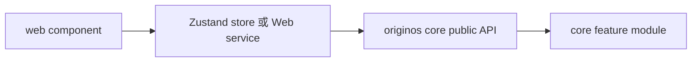
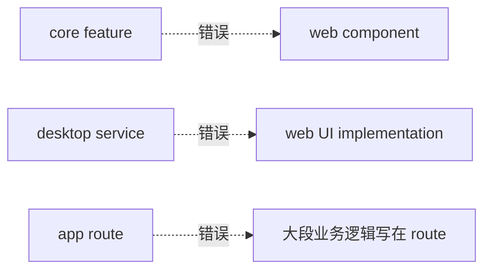

# A3 架构规约

## 问题

这一章解决：

> 读源码和改源码时，哪些边界不能违反？

OriginOS 不是“能跑就行”的项目。`AGENTS.md` 是强制架构规约。你之后做任何修改，都要先判断是否违反它。

本章要建立的判断是：

> AGENTS.md 是项目架构事实源。它规定技术栈、目录边界、依赖方向、数据存储、UI/UX、测试和 Story 闭环。

这张小黑图表达的是“护栏感”：你不是随便找个地方把功能写完，而是先判断当前代码位于哪一层，再决定能依赖谁、不能依赖谁。OriginOS 的难点不是某个 React 组件有多复杂，而是 Web、Desktop、Core、Agent、数据文件之间必须保持清楚的边界。

## 图解

这张图是深入学习的护栏。后面每次追调用链，都要知道它在哪一层。

## 源码入口

本章读：

- `AGENTS.md`
- `LINT.md`
- `eslint-rules/agents-compliance.js`
- `scripts/check-agents-compliance.js`
- `docs/DOCUMENTATION-MANAGEMENT.md`
- `docs/templates/story-spec-template/`
- `openspec/config.yaml`

其中最重要的是 `AGENTS.md`：

- 核心定位；
- MVP 范围；
- 技术栈约束；
- 目录结构规约；
- 单向依赖原则；
- 本体、项目访谈、窗体、Ontology Skill 架构；
- Pi Agent、RoleAgent、Project Agent、认知系统；
- 性能、数据存储、UI/UX、测试。

## 调用链

架构规约不是运行时代码，但它影响所有改动链路。

### 一个 API route 正确调用链

route 可以做边界工作，但业务主实现要在 core。

### 一个 UI 正确调用链

组件可以调用 store/service/core 公共 API，但不要反向依赖 app route，也不要直接碰 desktop main。

### 一个错误依赖

## 关键类型

本章关键是架构规则，不是单个 TypeScript 类型。

| 规则 | 含义 | 学源码时怎么看 |
| --- | --- | --- |
| App Router only | 禁止 Pages Router | 路由在 `packages/web/src/app` |
| app route 不放业务逻辑 | route 是边界 | route 里应调用 core service |
| core 是共享业务层 | Web/Desktop 复用 core | 业务功能优先找 `packages/core` |
| 单向依赖 | 上层依赖下层 | 不允许 core 依赖 web/desktop |
| 本地 JSON 存储 | MVP 禁止数据库 | 找 `storage` 和 `data` |
| Skill 源目录只读 | 定义和产物分开 | 输出写 `data/skills` 或工作目录 |
| Story 测试闭环 | 实施前补验收 | 看 `docs/specs` 和 `testing.md` |

更具体地说，之后你读任何文件，都先做一个“路径判断”：

- 文件在 `packages/web/src/app/`：它应该是页面、layout、loading、error，或者 API route 边界。看到大段业务算法就要警惕。
- 文件在 `packages/web/src/components/`：它主要负责 UI 展示和交互编排，可以依赖 store、service、core 公共 API，但不应该被 core 反向导入。
- 文件在 `packages/web/src/store/` 或 `packages/web/src/services/`：它是 Web 侧状态和适配层，适合承接页面组件的状态组织。
- 文件在 `packages/core/src/lib/features/`：它是共享业务功能，Web 和 Desktop 都可能复用，所以不能依赖 Web UI。
- 文件在 `packages/core/src/lib/storage/`、`integrations/`、`shared/`、`types/`：它更底层，应该更稳定、更少知道上层业务。
- 文件在 `packages/desktop/src/main/`：它接触 Electron、IPC、本地能力，但不应该复制 core 里的业务规则。

这套判断会直接影响你怎么看调用链。比如一个按钮点击后调用 `fetch('/api/projects')`，你不能只停在 API route；你要继续追到 core service，再追到 storage，最后确认数据写到哪里。

## 测试入口

架构规则的验证入口：

- `pnpm lint`
- `pnpm agents:check`
- `scripts/check-agents-compliance.js`
- `eslint-rules/agents-compliance.js`
- Story 测试文档：`docs/specs/**/testing.md`
- 相关单元测试：`packages/**/__tests__`

注意：架构违规不一定都能被自动化检查发现。维护者还需要代码审查判断。

## 练习

练习 1：判断下面改动是否合理：在 `packages/web/src/app/api/projects/route.ts` 里直接写 200 行项目创建业务逻辑。

练习 2：判断下面依赖是否合理：`packages/core/src/lib/features/ontology/index.ts` 导入 `packages/web/src/components/os/ontology-preview`。

练习 3：为“新增一个 ontology relation API”写出正确分层：route、core feature、storage、test 分别放哪里。

## 验收

学完本章，你应该能做到：

- 能解释 AGENTS.md 为什么是事实源；
- 能画出 Layer 6 到 Layer 1 的依赖方向；
- 能判断业务逻辑应该放 app route 还是 core；
- 能识别至少 3 种架构违规；
- 能为一个新增 API 设计符合规约的文件位置。
