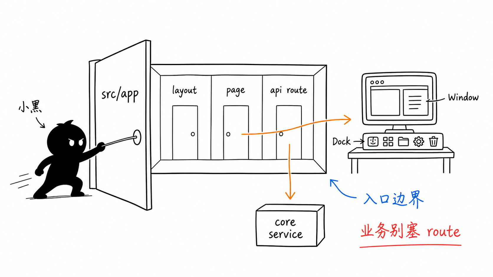
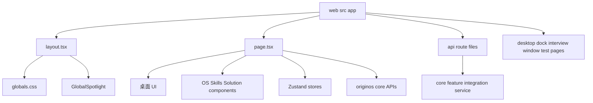
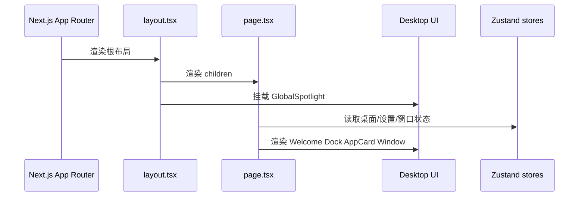
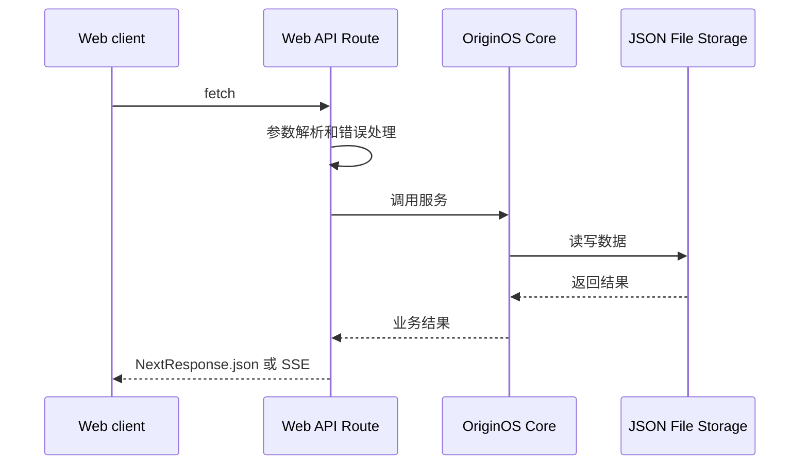
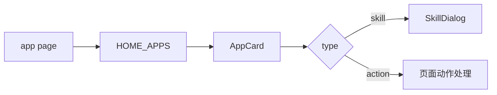

# B1 Next.js App Router 入口

## 问题

这一章解决：

> OriginOS 的 Web 入口在哪里？Next.js App Router 在这个项目里怎么承载桌面 UI 和 API 边界？

如果你不知道 App Router 入口，就无法从用户界面追到组件、状态、API 和 core。

本章要建立的判断是：

> `packages/web/src/app` 是 Web 应用边界。`layout.tsx` 提供全局布局，`page.tsx` 是主桌面入口，`app/api/**/route.ts` 是 API route 边界。



这张小黑图把 B1 的读法画出来：`layout.tsx` 像整个 Web 应用的外壳，`page.tsx` 像桌面的总控台，`app/api/**/route.ts` 像通往 core 的门。你第一遍不用记住每个组件细节，但必须分清“页面入口、UI 组件、状态层、core 服务、文件存储”各自站在哪里。

## 图解



## 源码入口

先读：

- `packages/web/src/app/layout.tsx`
- `packages/web/src/app/page.tsx`
- `packages/web/src/app/api/`
- `packages/web/src/config/homeApps.ts`
- `packages/web/src/components/os/`
- `packages/web/src/components/skills/SkillDialog.tsx`
- `packages/web/src/store/`
- `packages/web/src/services/`

`layout.tsx` 很短，但重要：

- 导入 `@/styles/globals.css`；
- 导入 `@xyflow/react/dist/style.css`；
- 渲染 `{children}`；
- 全局挂载 `GlobalSpotlight`。

`page.tsx` 是主页面，顶部有 `'use client'`，说明它是客户端组件。它导入大量桌面 UI、窗口、Skill、Agent、store 和 core API。

这里要一小步一小步读。

第一步，读 `layout.tsx`。它不是业务页面，而是所有页面共享的根外壳。你看到全局 CSS 和 `GlobalSpotlight`，就知道这些能力不属于某个单独 AppCard，而是整个 Web 应用都能用。`@xyflow/react/dist/style.css` 也说明图形/流程类组件需要全局样式支持。

第二步，读 `page.tsx` 文件头。顶部的 `'use client'` 很关键：这意味着它可以使用 React state、effect、浏览器事件、Zustand store，也可以承载桌面式交互。它不是传统意义上“只负责服务端渲染的首页”。

第三步，只看导入分组，不急着读函数体：

- `@/components/os/*`：桌面、Dock、窗口、通知、设置等操作系统感 UI；
- `@/components/skills`：SkillDialog，连接首页技能入口和 Agent 会话；
- `@/components/solution`：方案设计相关 UI；
- `@/config/homeApps`：首页应用入口配置；
- `@/store/*`：Zustand 状态；
- `@originos/core/*`：共享类型、Agent、Electron、项目等能力；
- `@/services/*`：Web 侧适配服务。

这一步的价值是：你还没读业务逻辑，就已经知道 `page.tsx` 是“桌面编排层”。它把配置、组件、状态和 core 能力接起来，但不应该把所有业务规则都写死在页面里。

第四步，再读页面内的局部类型和小组件。`ProjectCardProps`、`UserAgent`、`DockActionDetail` 这些类型说明页面需要组织卡片、用户 Agent、Dock action 等 UI 数据。它们不是全局领域模型，先不要误以为所有类型都要搬到 core。

第五步，最后读事件处理。重点追三类事件：用户点击首页 AppCard 后怎么打开 SkillDialog 或触发 action；项目相关操作怎么调用 store/service/API；Agent 或通知相关交互怎么连到 core 集成。

## 调用链

### 页面渲染链



### API route 链



### 首页入口链



## 关键类型

`layout.tsx` 里的关键类型：

```ts
interface RootLayoutProps {
  readonly children: React.ReactNode;
}
```

它说明 layout 是包裹页面的根组件。

`page.tsx` 里有几个页面局部类型：

- `ProjectCardProps`
- `UserAgent`
- `DockActionDetail`

这些类型暂时不是全局领域模型，而是页面组织 UI 和事件时用的局部结构。

更重要的是导入结构：

| 导入来源 | 说明 |
| --- | --- |
| `@/components/os/*` | 桌面、Dock、窗口、通知、设置 |
| `@/components/skills` | SkillDialog |
| `@/components/solution` | 解决方案设计 |
| `@/config/homeApps` | 首页应用配置 |
| `@/store/*` | Zustand 状态 |
| `@originos/core/*` | 共享类型、工具、Agent/Electron 集成 |

这一章最容易误解的是 `page.tsx` 的“复杂”。它复杂，不是因为所有业务都应该写在这里，而是因为桌面首页天然要汇聚很多入口。你读的时候要分清两种复杂：

- 编排复杂：页面需要知道哪些窗口、AppCard、Dialog、Dock action 被触发。这是可以出现在 `page.tsx` 的。
- 业务复杂：项目怎么创建、Agent 会话怎么保存、Skill 怎么加载、本体怎么持久化。这类逻辑应该继续往 store、service、API route、core 追。

所以 B1 的核心能力不是“背下 page.tsx 每一行”，而是能从页面入口继续追链路：UI 事件在哪里发生，状态在哪里变，API 在哪里进，core 服务在哪里执行，数据在哪里保存。

## 测试入口

App Router 和 Web UI 相关测试分散在：

- `packages/web/src/store/__tests__/`
- `packages/web/src/components/os/__tests__/`
- `packages/web/src/components/skills/__tests__/`
- `packages/web/src/components/ui/__tests__/`
- `packages/web/src/app/api/projects/__tests__/`
- `tests/e2e/`

如果修改 `layout.tsx`：

- 重点看全局 CSS、Spotlight、页面渲染是否受影响。

如果修改 `page.tsx`：

- 重点看首页渲染、Dock、AppCard、窗口打开、设置配置、项目列表、SkillDialog。

如果修改 `app/api/**/route.ts`：

- 重点看参数、错误响应、core service 调用和持久化。

## 练习

练习 1：解释为什么 `page.tsx` 顶部有 `'use client'`。

练习 2：从 `page.tsx` 导入列表中找出 5 个来自 `@originos/core` 的导入，并说明它们为什么不直接写在 Web 层。

练习 3：选择一个 `packages/web/src/app/api/*/route.ts`，画出它到 core service 的调用链。

## 验收

学完本章，你应该能做到：

- 能指出 Web 根布局和首页入口；
- 能解释 `layout.tsx`、`page.tsx`、`app/api/**/route.ts` 的职责区别；
- 能看懂 `page.tsx` 为什么是桌面入口而不是普通页面；
- 能从首页 AppCard 追到 SkillDialog 或 action；
- 能判断某段逻辑应放在页面、组件、store、service 还是 core。
