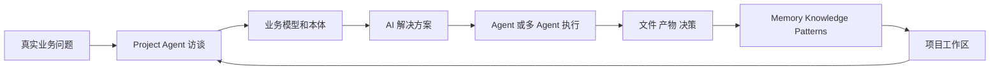
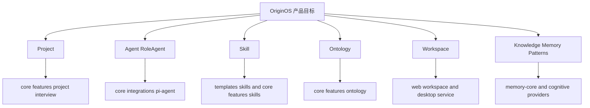
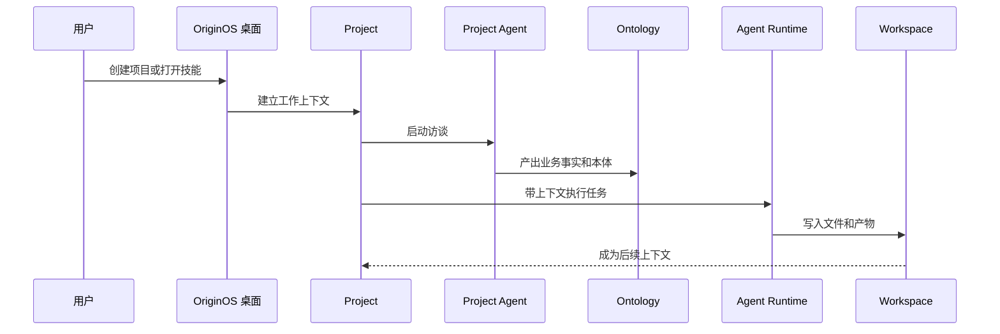
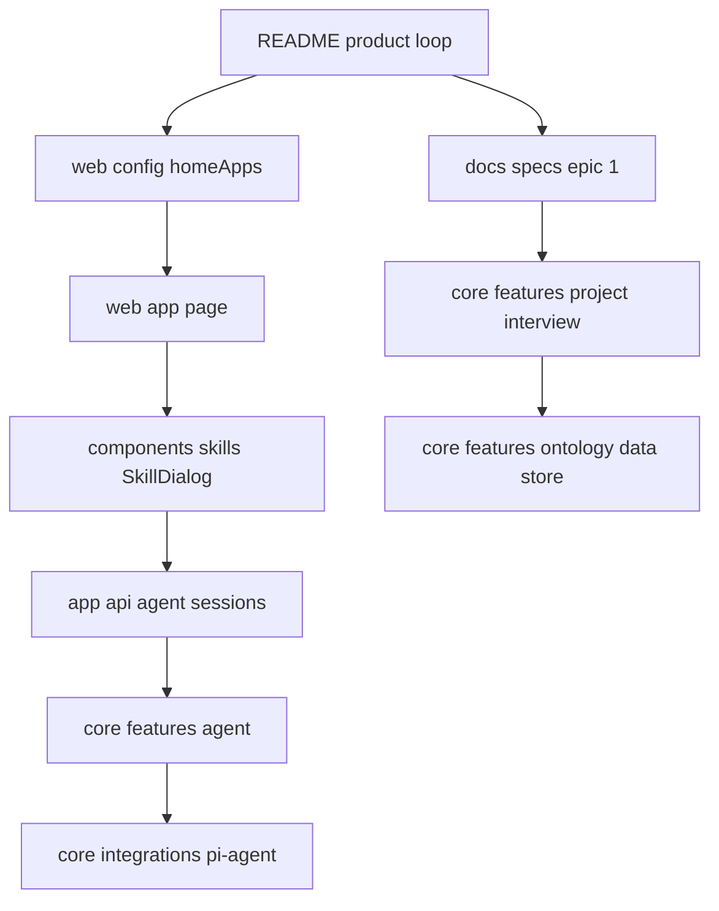

# A1. 产品主线和真实目标

> 类型：源码课  
> 状态：正式课件  
> 本节目标：先把 OriginOS 的产品主线讲清楚，再进入源码。否则后面看到 Project、Agent、Skill、Ontology、Memory、Workspace 时，会只记住名词，看不懂它们为什么在一起。

## 问题

这一节解决一个最基础但很关键的问题：

> OriginOS 到底要做什么？它为什么不是普通聊天工具，也不是普通桌面壳？

从 [README.md（第 1 行）](../../../../README.md#L1) 和 [README_CN.md（第 1 行）](../../../../README_CN.md#L1) 看，OriginOS CE 的定位是 **AI Native 工作系统**。它不是让用户打开一个聊天框随便问，而是从真实工作问题出发，把项目、Agent、角色、技能、文件、知识、通知、定时任务放在一个桌面中。

更具体地说，产品闭环是：

1. 用户提出业务目标；
2. Project Agent 通过访谈理解业务；
3. 系统沉淀业务模型和本体；
4. 用户设计 AI 解决方案；
5. Agent 或多 Agent runtime 执行；
6. 工作产物、决策、知识回到项目工作区。

这张图要帮你建立第一层直觉：OriginOS 的中心不是“聊天消息”，而是“可持续工作的项目空间”。聊天只是入口，真正重要的是上下文、文件、模型、技能、Agent 执行和知识沉淀。

## 图解

### 产品闭环

这张 Mermaid 图比小黑图更“工程化”。你要注意箭头最后回到了 Project：这说明系统不是一次性回答，而是要把产物变成下一次工作的上下文。

### 产品对象和源码区域

这张图是你后面读源码的索引。第一次看项目时，不要急着背所有文件，而是先知道每个产品对象大概落在哪些源码区域。

## 源码入口

本节精读这些文件：

- [README.md（第 1 行）](../../../../README.md#L1)
- [README_CN.md（第 1 行）](../../../../README_CN.md#L1)
- [AGENTS.md（第 1 行）](../../../../AGENTS.md#L1)
- [docs/index.md（第 1 行）](../../../../docs/index.md#L1)
- [docs/product/（第 1 行）](../../../../docs/product/PRD-Main.md#L1)

本节通读这些区域：

- [docs/design/（第 1 行）](../../../../docs/design/os-framework.md#L1)
- [docs/specs/（第 1 行）](../../../../docs/specs/epic-0/README.md#L1)
- [docs/changes/（第 1 行）](../../../../docs/changes/changelog.md#L1)

关键事实：

- [README.md（第 1 行）](../../../../README.md#L1) 和 [README_CN.md（第 1 行）](../../../../README_CN.md#L1) 都把 OriginOS 描述为从问题出发的 AI Native 工作系统。
- 产品工作流不是“问答”，而是 `Project interview -> Business model and ontology -> AI solution -> Agent execution -> Artifacts and knowledge`。
- [AGENTS.md（第 1 行）](../../../../AGENTS.md#L1) 把 MVP 范围落到首页内置应用、技能系统、会话交互层、文件管理层、工作空间编辑器、窗体与可视化、本体构建系统。
- [docs/index.md（第 1 行）](../../../../docs/index.md#L1) 是文档入口，它把产品、规约、API、Agent、指南、QA、Epic 都组织起来。

### 逐文件怎么读

读 [README.md（第 1 行）](../../../../README.md#L1) 和 [README_CN.md（第 1 行）](../../../../README_CN.md#L1) 时，不要把它们当宣传文案。你要抓 4 个证据：

| 文件段落 | 要抓的事实 | 为什么重要 |
| --- | --- | --- |
| `What is OriginOS CE?` / `OriginOS CE 是什么？` | 产品从问题出发，不从菜单出发 | 决定它不是普通桌面壳 |
| `How OriginOS Works` / `OriginOS 如何工作` | 三阶段闭环：访谈、方案、执行 | 决定后续源码主线 |
| `First Run` / `第一次使用` | 设置模型、创建项目、打开技能、创建 Agent | 对应首页入口和设置系统 |
| `Data and Privacy` / `数据与隐私` | 本地文件存储、模型请求走用户配置 | 对应 AGENTS 的本地 JSON 约束 |

读 [AGENTS.md（第 1 行）](../../../../AGENTS.md#L1) 时，要把“产品目标”翻译成“源码入口”：

- 首页内置应用对应 [packages/web/src/config/homeApps.ts（第 1 行）](../../../../packages/web/src/config/homeApps.ts#L1) ；
- 技能系统对应 [templates/skills/（第 1 行）](../../../../templates/skills/project-initialization/SKILL.md#L1) 、 [packages/core/src/lib/features/skills/（第 1 行）](../../../../packages/core/src/lib/features/skills/index.ts#L1) 、`SkillDialog`；
- 会话交互对应 [packages/web/src/app/api/agent/sessions/（第 1 行）](../../../../packages/web/src/app/api/agent/sessions/route.ts#L1) 和 [packages/core/src/lib/features/agent/（第 1 行）](../../../../packages/core/src/lib/features/agent/index.ts#L1) ；
- 文件管理和工作空间对应 workspace API、Web Workspace UI、Desktop workspace service；
- 本体构建对应 `ontology` 和 `ontology-data-store`。

## 调用链

A1 还不是具体代码调用链，而是“产品调用链”。你要先知道用户动作如何一步步变成系统模块。

这条链路现在先不用追到每一行代码。你只要知道，后续课程会把它拆成：

- Web 入口链： [packages/web/src/app/page.tsx（第 1 行）](../../../../packages/web/src/app/page.tsx#L1)
- 首页配置链： [packages/web/src/config/homeApps.ts（第 1 行）](../../../../packages/web/src/config/homeApps.ts#L1)
- Skill 执行链：`SkillDialog -> skills API -> agent session`
- Agent 会话链：`agent sessions API -> core session service -> pi-agent`
- Project 链：`projects API -> core project/interview feature`
- Workspace 链：`workspace API -> desktop service -> file storage`

### 文件级主线索引

这张图比产品图更接近源码。A1 的验收不是让你背路径，而是让你能说出：某个产品名词第一次应该去哪里找源码。

## 关键类型

A1 的“关键类型”先不是 TypeScript interface，而是产品对象模型。

| 对象 | 人话解释 | 后续源码位置 |
| --- | --- | --- |
| `Project` | 一个真实工作问题的上下文容器 | [packages/core/src/lib/features/project/（第 1 行）](../../../../packages/core/src/lib/features/project/index.ts#L1) |
| `Agent` | 能对话、能调用工具、能执行任务的运行体 | [packages/core/src/lib/integrations/pi-agent/（第 1 行）](../../../../packages/core/src/lib/integrations/pi-agent/index.ts#L1) |
| `RoleAgent` | 有角色身份、记忆、技能和状态机的 Agent | [packages/core/src/lib/integrations/pi-agent/role-agent/（第 1 行）](../../../../packages/core/src/lib/integrations/pi-agent/role-agent/index.ts#L1) |
| `Skill` | 可复用的专项工作流 | [templates/skills/（第 1 行）](../../../../templates/skills/project-initialization/SKILL.md#L1) 、 [packages/core/src/lib/features/skills/（第 1 行）](../../../../packages/core/src/lib/features/skills/index.ts#L1) |
| `Ontology` | 对业务世界的结构化理解 | [packages/core/src/lib/features/ontology/（第 1 行）](../../../../packages/core/src/lib/features/ontology/index.ts#L1) |
| `Workspace` | 文件、Markdown、产物和项目资料的工作区 | [packages/web/src/components/os/workspace/（第 1 行）](../../../../packages/web/src/components/os/workspace/CreateFileDialog.tsx#L1) |
| `Memory` | 会话历史、长期记忆、知识和模式 | [packages/core/src/modules/memory-core/（第 1 行）](../../../../packages/core/src/modules/memory-core/index.ts#L1) 、`pi-agent/cognitive/` |

这一节要先建立这些对象之间的关系。后面每个模块都会进一步追真实类型和函数。

### 常见误解

| 误解 | 正确理解 |
| --- | --- |
| OriginOS 是 ChatGPT 套壳 | 聊天只是交互入口，核心是项目上下文、Agent 执行和产物沉淀 |
| 桌面 UI 是核心业务 | 桌面 UI 是入口和编排，核心业务要下沉 core |
| Skill 就是一个按钮 | Skill 是可读取定义、可注入 prompt、可产生受控产物的工作流 |
| Ontology 是可选图谱展示 | Ontology 是项目业务事实结构化后的核心资产 |
| README 看完就懂项目 | README 只能建立主线，真正理解要继续追源码和测试 |

## 测试入口

产品主线没有单一测试文件，它分散在多个测试层：

- Project / Interview： [packages/core/src/lib/features/project/（第 1 行）](../../../../packages/core/src/lib/features/project/index.ts#L1) 、 [packages/core/src/lib/features/interview/（第 1 行）](../../../../packages/core/src/lib/features/interview/index.ts#L1)
- Skill： [packages/core/src/lib/features/skills/__tests__/（第 1 行）](../../../../packages/core/src/lib/features/skills/__tests__/service.test.ts#L1)
- Agent： [packages/core/src/lib/integrations/pi-agent/**/__tests__/（第 1 行）](../../../../packages/core/src/lib/integrations/pi-agent/index.ts#L1)
- Workspace： [tests/integration/epic-2-workspace-api.test.ts（第 1 行）](../../../../tests/integration/epic-2-workspace-api.test.ts#L1) 、 [tests/e2e/epic-2-workspace.spec.ts（第 1 行）](../../../../tests/e2e/epic-2-workspace.spec.ts#L1)
- Story 验收： [docs/specs/（第 1 行）](../../../../docs/specs/epic-0/README.md#L1) 、 [docs/test-cases/（第 1 行）](../../../../docs/test-cases/epic-1-project-quick-launch/test-cases-1.1-interview-start.md#L1)

你现在不用跑测试，但要知道：产品主线越长，测试越分散。后面每节会把具体测试入口收窄。

## 练习

1. 用一句话解释 OriginOS，但必须包含 `Project`、`Agent`、`Skill`、`Knowledge` 四个词。
2. 从 [README_CN.md（第 1 行）](../../../../README_CN.md#L1) 找出“项目访谈、AI 解决方案、AI 运行业务”三段，并写出每段产出。
3. 打开 [AGENTS.md（第 1 行）](../../../../AGENTS.md#L1) 的 MVP 范围，标出哪些能力已经在 A1 的产品闭环图中出现。
4. 画一张自己的 Mermaid 图，表达“用户问题如何变成项目产物”。

参考答案检查：

- 如果你的定义里没有“项目上下文”，说明还停留在聊天工具视角；
- 如果你的图没有“产物回到项目”，说明还没理解闭环；
- 如果你把 `Skill` 和 `Agent` 画成同一个东西，需要重读本节关键类型表。

## 验收

学完本节，你应该能做到：

- 能解释为什么 OriginOS 不是普通聊天工具；
- 能说清产品闭环 6 步；
- 能把 `Project / Agent / Skill / Ontology / Workspace / Memory` 关联起来；
- 能指出产品事实源在 [README.md（第 1 行）](../../../../README.md#L1) 、 [README_CN.md（第 1 行）](../../../../README_CN.md#L1) 、 [AGENTS.md（第 1 行）](../../../../AGENTS.md#L1) 、 [docs/index.md（第 1 行）](../../../../docs/index.md#L1) ；
- 能把一个真实工作问题放进 OriginOS 的产品主线里描述。
