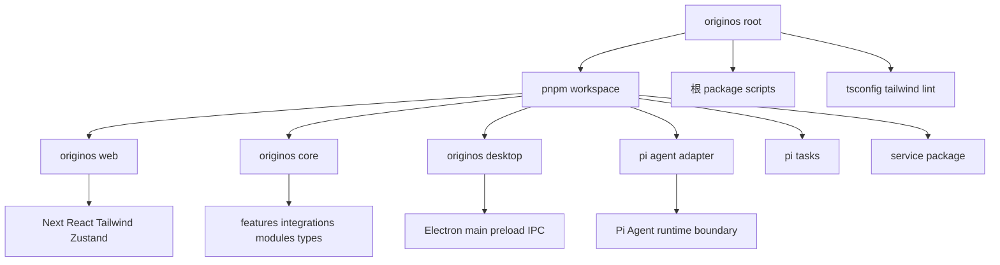
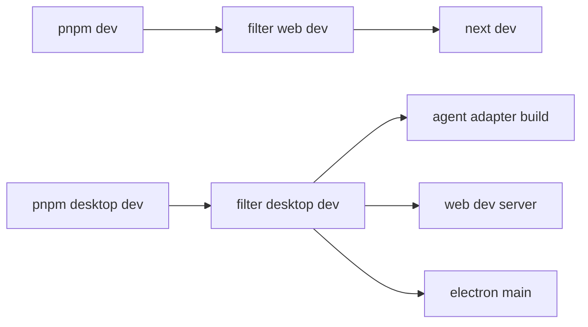
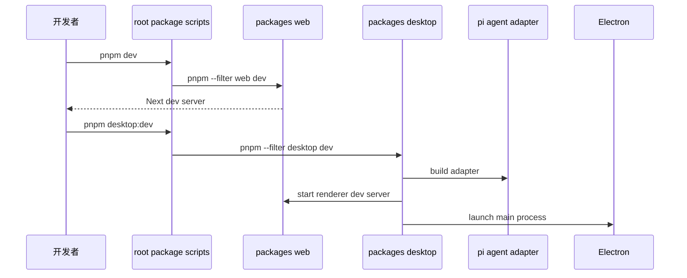
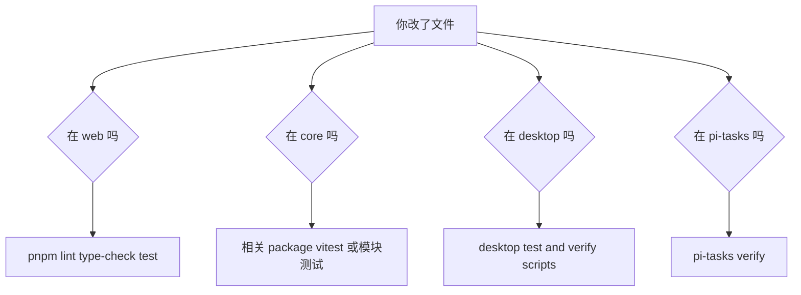

# A2. 技术栈和 monorepo

> 类型：源码课  
> 状态：正式课件  
> 本节目标：看懂 OriginOS 的工程骨架。你要先知道每个 package 为什么存在，再去读具体模块。

## 问题

这一节解决：

> OriginOS 是什么技术栈？为什么它不是一个普通 Next.js 仓库？

如果只把它当成前端项目，你会漏掉 Electron、Core、Pi Agent adapter、本地文件存储、OpenSpec、内置 Skills、桌面发布脚本等关键部分。

根 [package.json（第 1 行）](../../../../package.json#L1) 的描述是：`An AI-native desktop OS prototype with Next.js, Electron, and multi-agent collaboration`。这句话已经点出三件事：

- Web 层使用 Next.js；
- 桌面壳使用 Electron；
- AI 执行核心涉及 multi-agent collaboration。


这张图的核心意思是：根目录不是某一个应用，而是一个工作台。不同 package 分别承担 Web、Core、Desktop、Agent adapter、pi-tasks、service 等边界。

## 图解

### Workspace 包分工



### 开发命令链



## 源码入口

本节精读：

- [package.json（第 1 行）](../../../../package.json#L1)
- [pnpm-workspace.yaml（第 1 行）](../../../../pnpm-workspace.yaml#L1)
- [packages/web/package.json（第 1 行）](../../../../packages/web/package.json#L1)
- [packages/core/package.json（第 1 行）](../../../../packages/core/package.json#L1)
- [packages/desktop/package.json（第 1 行）](../../../../packages/desktop/package.json#L1)
- [packages/agent/package.json（第 1 行）](../../../../packages/agent/package.json#L1)
- [packages/pi-tasks/package.json（第 1 行）](../../../../packages/pi-tasks/package.json#L1)
- [packages/service/package.json（第 1 行）](../../../../packages/service/package.json#L1)
- [tsconfig.json（第 1 行）](../../../../tsconfig.json#L1)
- [tsconfig.base.json（第 1 行）](../../../../tsconfig.base.json#L1)
- [tsconfig.electron.json（第 1 行）](../../../../tsconfig.electron.json#L1)

关键事实：

- 根 [package.json（第 1 行）](../../../../package.json#L1) 的 `name` 是 `originos`，版本是 `0.1.47`。
- `packageManager` 是 `pnpm@9.15.9`。
- `engines.node` 要求 `>=22.19.0`，README 源码运行要求 Node.js 24+。
- [pnpm-workspace.yaml（第 1 行）](../../../../pnpm-workspace.yaml#L1) 声明 `packages/*` 进入 workspace。
- `nodeLinker: hoisted` 是为了 Electron + monorepo 运行期依赖解析。
- `supportedArchitectures` 同时列出 `darwin`、`linux`、`win32` 和 `arm64`、`x64`，说明桌面构建需要跨平台考虑。

### 逐段读根 [package.json（第 1 行）](../../../../package.json#L1)

根 [package.json（第 1 行）](../../../../package.json#L1) 要按 5 块读，不要从 dependencies 开始硬背。

| 区块 | 读什么 | 对源码学习的意义 |
| --- | --- | --- |
| `name/version/private` | 仓库身份和版本 | 判断这是应用仓库，不是发布库 |
| `packageManager/engines` | pnpm 和 Node 版本约束 | 运行和 CI 的前提 |
| `scripts` | 命令如何转发到 package | 判断改动后该跑什么 |
| `dependencies` | 运行期能力 | Next、Electron、Agent、图谱、Markdown、状态 |
| `devDependencies` | 开发验证能力 | ESLint、Vitest、TypeScript、Tailwind |

几个脚本要特别记住：

```json
{
  "dev": "pnpm --filter @originos/web dev",
  "build": "pnpm --filter @originos/web build",
  "test": "pnpm --filter @originos/web test",
  "desktop:dev": "pnpm --filter @originos/desktop dev",
  "agents:check": "node scripts/check-agents-compliance.js"
}
```

这说明根命令大多不是自己做事，而是把任务交给具体 package。

### 逐段读 [pnpm-workspace.yaml（第 1 行）](../../../../pnpm-workspace.yaml#L1)

`packages: - packages/*` 决定 workspace 包范围。

`nodeLinker: hoisted` 的注释直接说明原因：Electron 主进程产物在 `dist-electron/` 下，运行时向上解析 `node_modules`，pnpm isolated 模式可能导致依赖解析失败。

`supportedArchitectures` 说明构建不只服务当前机器，还要考虑 Windows 和不同 CPU 架构。

## 调用链

这里的“调用链”是工程命令链。



这说明 `pnpm dev` 和 `pnpm desktop:dev` 不是同一个层次：

- `pnpm dev` 主要服务 Web；
- `pnpm desktop:dev` 要同时处理 Electron main、renderer、Agent adapter 和本地能力。

### 改动范围到验证命令



这个判断会在每个实战里反复用到。不要用一个 `pnpm test` 代替所有验证。

## 关键类型

本节的关键类型不是 TypeScript interface，而是 package 边界。

| Package | 技术栈 | 职责 |
| --- | --- | --- |
| `@originos/web` | Next.js、React、Tailwind、Zustand | Web UI、App Router、API route 边界 |
| `@originos/core` | TypeScript、zod、uuid | 共享业务、Agent 集成、模块和类型 |
| `@originos/desktop` | Electron、electron-builder | 桌面壳、主进程、IPC、本地服务、发布 |
| `@originos/pi-agent-adapter` | 上游 Pi Agent、构建适配 | Agent runtime 适配边界 |
| `@originos/pi-tasks` | Node ESM、任务运行时 | 受控任务运行能力 |
| `@originos/service` | package 边界 | 服务包占位或扩展边界 |

你后面判断“一个改动应该放哪里”，首先看它属于哪个 package 的职责。

### 技术栈不是清单，而是边界

- Next.js 决定 Web 页面和 API route 的入口；
- React 决定 UI 组件模型；
- Tailwind 决定样式写法；
- Zustand 决定 Web 状态放哪里；
- TypeScript strict 决定类型不能随便糊；
- Electron 决定本地文件、窗口、IPC 能力；
- Pi Agent adapter 决定 Agent runtime 边界；
- Vitest / E2E 决定行为如何被验证。

## 测试入口

和工程系统相关的验证入口：

- Web lint：`pnpm lint`
- Web 类型检查：`pnpm type-check`
- Web 测试：`pnpm test`
- Desktop 测试：`pnpm --filter @originos/desktop test`
- Agent adapter 测试：`pnpm --filter @originos/pi-agent-adapter test`
- Pi tasks 验证：`pnpm --filter @originos/pi-tasks verify`
- 架构检查：`pnpm agents:check`

注意：根 `pnpm test` 转发到 Web 测试，不代表所有包都测了。改 Desktop、Agent adapter、pi-tasks 时要跑对应 package 的测试。

## 练习

1. 解释 `pnpm dev` 和 `pnpm desktop:dev` 的区别。
2. 打开 [pnpm-workspace.yaml（第 1 行）](../../../../pnpm-workspace.yaml#L1) ，用自己的话解释 `nodeLinker: hoisted` 的注释。
3. 从根 [package.json（第 1 行）](../../../../package.json#L1) 找出 5 个和 Desktop 发布相关的 script。
4. 给出一个判断：如果你改了 [packages/core/src/modules/collaboration-runtime/（第 1 行）](../../../../packages/core/src/modules/collaboration-runtime/index.ts#L1) ，只跑 `pnpm test` 够不够？为什么？

参考答案检查：

- 第 1 题必须提到 Web-only 和 Desktop runtime 的差别；
- 第 2 题必须提到 Electron 运行期依赖解析；
- 第 4 题答案应该是“不够”，因为根 `pnpm test` 主要转发 Web 测试，core module 改动需要找对应模块测试。

## 验收

学完本节，你应该能做到：

- 能解释为什么这是 monorepo；
- 能说清 6 个 workspace package 的职责；
- 能读懂根 scripts 的转发关系；
- 能根据改动范围选择验证命令；
- 能说明 Next.js、React、Tailwind、Zustand、Electron、Pi Agent adapter 分别在哪里发挥作用。
