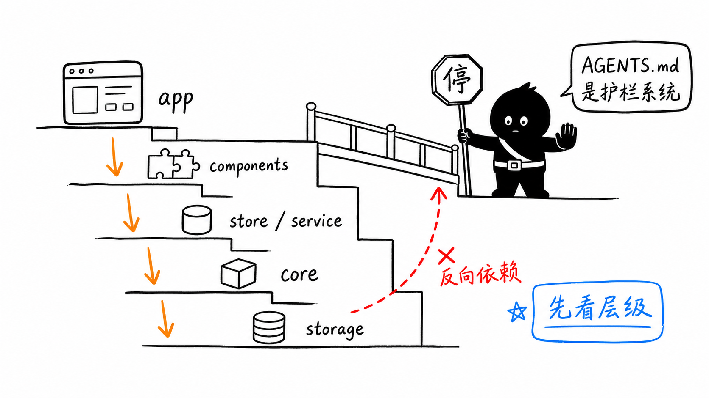
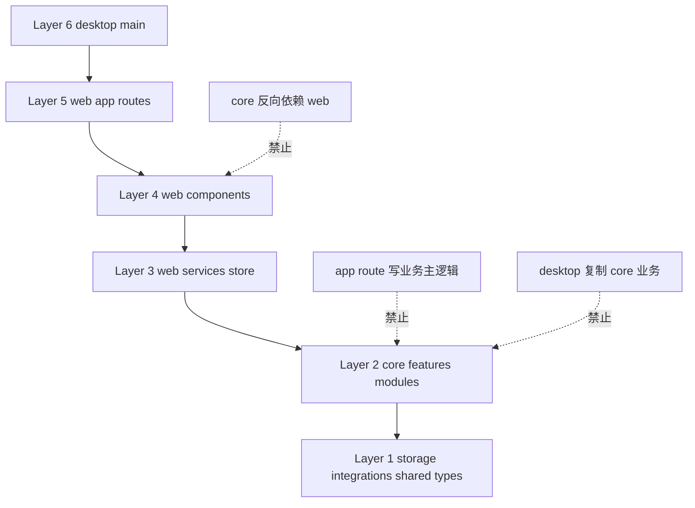
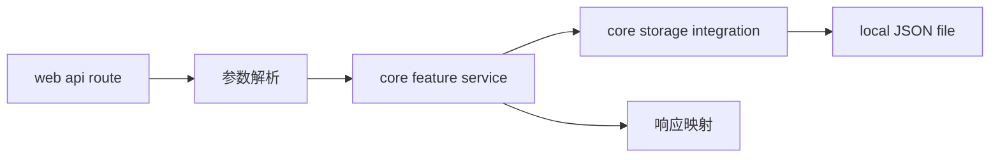
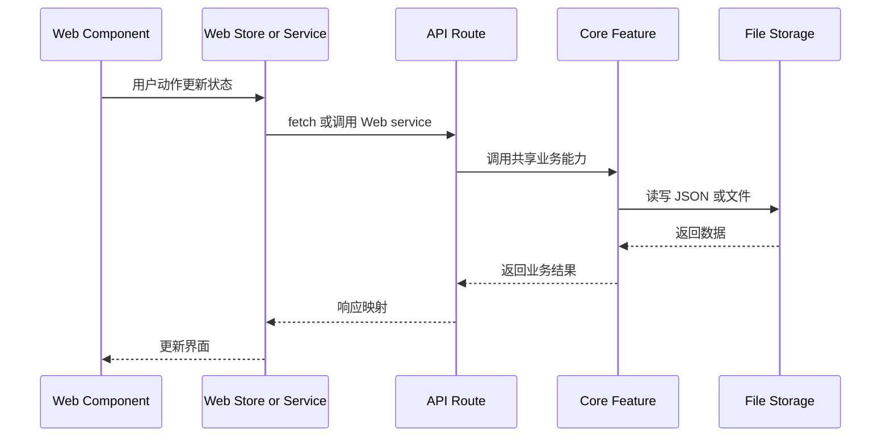
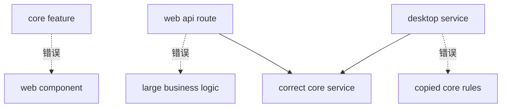

# A3. 架构规约

> 类型：源码课  
> 状态：正式课件  
> 本节目标：掌握项目的硬边界。后面不管读代码还是改代码，都要用这一节判断“应该放哪里、能依赖谁、哪些不能碰”。

## 问题

这一节解决：

> 读源码和改源码时，哪些边界不能违反？

OriginOS 不是“能跑就行”的项目。 [AGENTS.md（第 1 行）](../../../../AGENTS.md#L1) 是强制架构规约，规定了技术栈、目录结构、依赖方向、数据存储、UI/UX、测试闭环和 Story 模板。



这张图要表达的是：你不是在一堆文件里随便找地方写代码，而是在有护栏的道路上行驶。每个目录都有职责，每层只能依赖允许的下层。

## 图解

### 单向依赖层级



### 正确 API route 链路



API route 可以处理 HTTP 边界，但业务主实现应该进入 core。

## 源码入口

本节精读：

- [AGENTS.md（第 1 行）](../../../../AGENTS.md#L1)
- [LINT.md（第 1 行）](../../../../LINT.md#L1)
- [eslint-rules/agents-compliance.js（第 1 行）](../../../../eslint-rules/agents-compliance.js#L1)
- [scripts/check-agents-compliance.js（第 1 行）](../../../../scripts/check-agents-compliance.js#L1)
- [docs/DOCUMENTATION-MANAGEMENT.md（第 1 行）](../../../../docs/DOCUMENTATION-MANAGEMENT.md#L1)
- [docs/templates/story-spec-template/（第 1 行）](../../../../docs/templates/story-spec-template/README.md#L1)

本节重点来自 [AGENTS.md（第 1 行）](../../../../AGENTS.md#L1) ：

- Next.js 必须使用 App Router；
- React 必须使用函数式组件和 Hooks；
- TypeScript 严格模式，禁止 `any`；
- Tailwind CSS 是样式方案，禁止 CSS Modules 和 Styled Components；
- Zustand 是状态管理方案，禁止 Redux / MobX；
- MVP 阶段使用本地 JSON / 文件系统，禁止数据库；
- [packages/web/src/app/（第 1 行）](../../../../packages/web/src/app/page.tsx#L1) 只做页面和 API route 边界；
- 共享业务逻辑下沉到 [packages/core/src/lib/（第 1 行）](../../../../packages/core/src/lib/features/agent/defaults.ts#L1) 或 [packages/core/src/modules/（第 1 行）](../../../../packages/core/src/modules/collaboration-runtime/__tests__/story-9.36.test.ts#L1) ；
- `.claude/skills/` 是只读定义目录，产物不能写进去。

### 架构规约如何落成脚本

[scripts/check-agents-compliance.js（第 1 行）](../../../../scripts/check-agents-compliance.js#L1) 把 [AGENTS.md（第 1 行）](../../../../AGENTS.md#L1) 的一部分规则变成自动检查。它定义了依赖层级：

```js
const DEPENDENCY_LAYERS = {
  'src/app': 5,
  'src/components': 4,
  'src/services': 3,
  'src/lib/features': 2,
  'src/modules': 2,
  'src/lib/storage': 1,
  'src/lib/integrations': 1,
  'src/lib/hooks': 1,
  'src/lib/shared': 0,
  'src/lib/utils.ts': 1,
};
```

读这段要注意：

1. 数字越大，层级越高；
2. 如果一个低层文件导入更高层文件，就会产生 `LAYER_VIOLATION`；
3. 脚本还检查组件分层和 feature 跨模块导入；
4. 脚本只能抓一部分问题，不能替代人工 review。

也就是说，A3 不是空泛原则，而是已经有脚本参与守门。

## 调用链

架构规约不是运行时代码，但它影响所有运行时代码的调用方向。



读代码时，你要不断问：

- 当前文件在哪一层？
- 它依赖的是同层还是下层？
- 有没有反向依赖？
- 业务逻辑有没有堆在 route 或 UI 里？
- 是否复制了 core 业务？

### 三个具体违规例子



- `core feature -> web component` 错，因为 core 是共享业务层，不能知道 Web UI；
- `route -> large business logic` 错，因为 route 应只是 HTTP 边界；
- `desktop service -> copied core rules` 错，因为 Desktop 应复用 core，而不是复制业务。

## 关键类型

本节关键是规则，不是单个 TypeScript 类型。

| 规则 | 含义 | 看源码时怎么判断 |
| --- | --- | --- |
| App Router only | 禁止 Pages Router | 路由应在 `packages/web/src/app` |
| app route 不放业务主逻辑 | route 是边界 | route 里应调用 core service |
| core 是共享业务层 | Web/Desktop 复用 core | 业务能力优先找 `packages/core` |
| 单向依赖 | 上层依赖下层 | core 不能依赖 web/desktop |
| 本地 JSON 存储 | MVP 禁止数据库 | 找 `storage` 和 `data` |
| Skill 源目录只读 | 定义和产物分开 | 输出写 `data/skills` 或工作目录 |
| Story 测试闭环 | 实施前补验收 | 看 `docs/specs/**/testing.md` |

路径判断口诀：

- [packages/web/src/app/（第 1 行）](../../../../packages/web/src/app/page.tsx#L1) ：页面、layout、API route 边界；
- [packages/web/src/components/（第 1 行）](../../../../packages/web/src/components/framework/AppCard.tsx#L1) ：UI 展示和交互编排；
- [packages/web/src/store/（第 1 行）](../../../../packages/web/src/store/dockStore.ts#L1) 、`services/`：Web 状态和适配；
- `packages/core/src/lib/features/`：共享业务功能；
- [packages/core/src/modules/（第 1 行）](../../../../packages/core/src/modules/collaboration-runtime/__tests__/story-9.36.test.ts#L1) ：共享模块能力；
- [packages/core/src/lib/storage/（第 1 行）](../../../../packages/core/src/lib/storage/index.ts#L1) 、`integrations/`、`shared/`、`types/`：底层基础设施；
- [packages/desktop/src/main/（第 1 行）](../../../../packages/desktop/src/main/main.ts#L1) ：Electron main、IPC、本地服务。

### 人工 review 清单

自动脚本不能覆盖所有问题。人工 review 至少要问：

1. 这个文件位置和职责匹配吗？
2. import 是否从上层反向流入下层？
3. route 是否只做参数解析、权限/环境拼装、响应映射？
4. UI 组件是否承担了过多业务规则？
5. shared/core 逻辑是否被复制到 desktop 或 web？
6. 如果改了 Story 功能，`testing.md` 是否同步？

## 测试入口

架构规则相关验证入口：

- `pnpm lint`
- `pnpm agents:check`
- [scripts/check-agents-compliance.js（第 1 行）](../../../../scripts/check-agents-compliance.js#L1)
- [eslint-rules/agents-compliance.js（第 1 行）](../../../../eslint-rules/agents-compliance.js#L1)
- Story 测试文档：`docs/specs/**/testing.md`
- 自动化测试： [packages/**/__tests__（第 1 行）](../../../../packages/core/package.json#L1) 、 [tests/（第 1 行）](../../../../tests/e2e/epic-2-workspace.spec.ts#L1)

注意：架构违规不一定都能自动发现。比如“业务逻辑写在 route 里太多”，可能需要人工 review 判断。

## 练习

1. 判断：在 [packages/web/src/app/api/projects/route.ts（第 1 行）](../../../../packages/web/src/app/api/projects/route.ts#L1) 里直接写 200 行项目创建业务逻辑，是否合理？
2. 判断： [packages/core/src/lib/features/ontology/index.ts（第 1 行）](../../../../packages/core/src/lib/features/ontology/index.ts#L1) 导入 [packages/web/src/components/os/ontology-preview（第 1 行）](../../../../packages/web/src/components/os/ontology-preview/OntologyPreview.tsx#L1) ，是否合理？
3. 判断：desktop service 复制一份 core project 创建逻辑，是否合理？
4. 为“新增一个 ontology relation API”设计文件位置：route、core feature、storage、test 分别放哪里？

参考答案检查：

- route： [packages/web/src/app/api/.../route.ts（第 1 行）](../../../../packages/web/src/app/api/agent/sessions/route.ts#L1) ；
- core feature： [packages/core/src/lib/features/ontology/（第 1 行）](../../../../packages/core/src/lib/features/ontology/index.ts#L1) 或 `ontology-data-store/`；
- storage：优先复用 core storage / ontology data store；
- test：core feature 单元测试 + API route 集成测试；
- 不合格答案：把所有逻辑写进 route。

## 验收

学完本节，你应该能做到：

- 能解释 [AGENTS.md（第 1 行）](../../../../AGENTS.md#L1) 为什么是架构事实源；
- 能画出 Layer 6 到 Layer 1 的依赖方向；
- 能判断业务逻辑应放 app route、component、store/service 还是 core；
- 能识别至少 3 种架构违规；
- 能为一个新增 API 设计符合规约的文件位置和测试入口。
