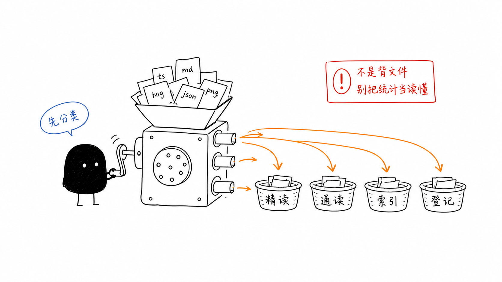
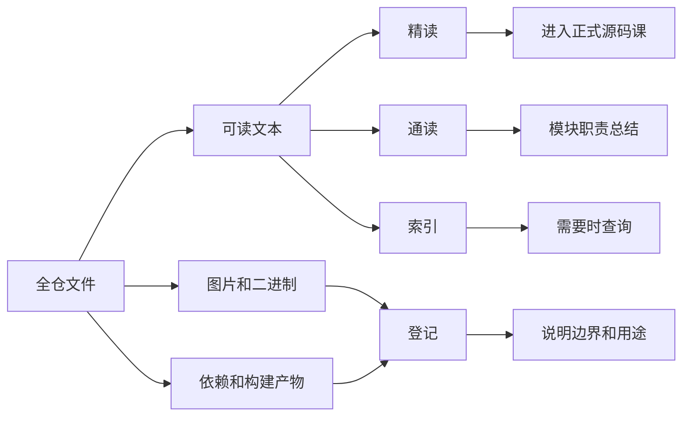
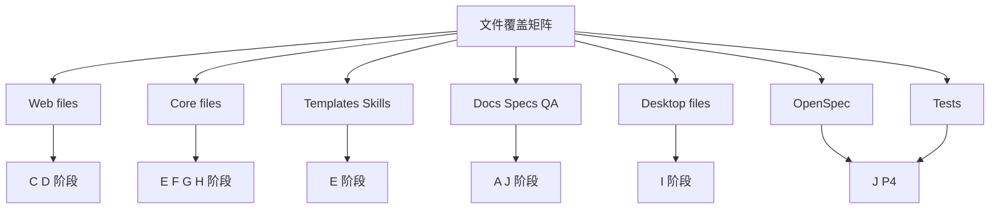
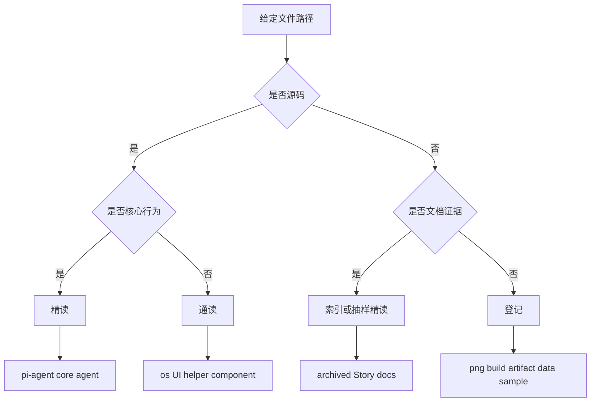
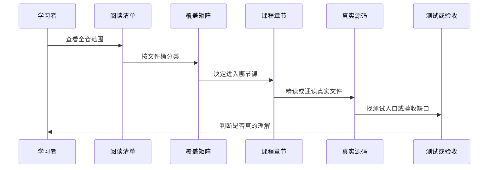

# A4. 全仓文件分类方法

> 类型：源码课  
> 状态：正式课件  
> 本节目标：学会面对两千多个文件时怎么下手。不是每个文件都逐字背，而是先分清哪些要精读、哪些通读、哪些索引、哪些只登记。

## 问题

这一节解决：

> 两千多个项目文件怎么读，才不会陷入“看了很多但不知道重点”的状态？

本项目当前扫描结果：

- 全仓文件总数：`2232`
- 可读文本文件：`2097`
- 可读文本总行数：`434145`
- 图片或二进制资产：`36`
- `.git` 、依赖、构建产物等排除登记项：`85`
- 二进制或不可按 UTF-8 读取文件：`14`

如果你一上来就想“逐字读完所有文件”，会很快崩溃。真正专业的读法是先分类。



图里的小黑在做一件很重要的事：它不是把所有文件吞下去，而是先用分拣机把文件放进不同篮子。吃透项目，第一步是知道每类文件该用什么阅读强度。

## 图解

### 四种阅读强度



### 文件桶和课程阶段



这个图说明：文件不是平均分配到课程里，而是按功能域进入不同阶段。

## 源码入口

本节精读：

- [learning-note/deep-dive/00-reading-inventory.md（第 1 行）](../../00-reading-inventory.md#L1)
- [learning-note/deep-dive/05-file-coverage-matrix.md（第 1 行）](../../05-file-coverage-matrix.md#L1)
- [.gitignore（第 1 行）](../../../../.gitignore#L1)
- [package.json（第 1 行）](../../../../package.json#L1)
- [pnpm-workspace.yaml（第 1 行）](../../../../pnpm-workspace.yaml#L1)

本节索引：

- [packages/web/data/**（第 1 行）](../../../../packages/web/data/projects/proj-1780888140037-jsoa98uyv/Memory.md#L1)
- `packages/desktop/data/**`
- [templates/skills/*/assets/**（第 1 行）](../../../../templates/skills/project-initialization/SKILL.md#L1)
- [docs/changes/**（第 1 行）](../../../../docs/changes/changelog.md#L1)
- [docs/QA/**（第 1 行）](../../../../docs/QA/EPIC-OS-AGENT-DIALOG-VERIFICATION-REPORT.md#L1)
- [openspec/changes/archive/**（第 1 行）](../../../../openspec/changes/archive/2026-07-30-fix-window-session-history-restore/proposal.md#L1)

关键判断：

- [packages/（第 1 行）](../../../../packages/core/package.json#L1) 是源码学习主区域；
- [docs/（第 1 行）](../../../../docs/index.md#L1) 是产品、架构、Story、QA、设计文档区域；
- `templates/` 是 skills 和项目访谈模板区域；
- [openspec/（第 1 行）](../../../../openspec/config.yaml#L1) 是变更治理区域；
- [learning-note/（第 1 行）](../README.md#L1) 是学习产物，不当作项目源码主线；
- `.git` 、`node_modules`、`.next`、`dist-electron`、`dist`、`release` 不作为源码入口；
- [packages/*/data（第 1 行）](../../../../packages/core/package.json#L1) 是运行数据样例，可以帮助理解存储格式，但不要当作业务实现。

### 文件桶如何决定课程深度

`05-file-coverage-matrix.md` 不是统计表，而是课程调度表。比如：

| 文件桶 | 文件数 | 应该怎么学 |
| --- | ---: | --- |
| `core.pi-agent` | 154 | F 阶段多节精读，因为它决定 Agent runtime 行为 |
| `web.components` | 166 | D 阶段按 UI 子系统通读 + 精读关键入口 |
| [docs/specs（第 1 行）](../../../../docs/specs/epic-0/README.md#L1) | 524 | J 阶段索引化阅读，不逐个 Story 全文讲 |
| `templates/skills` | 231 | E 阶段按 Skill 类型分组读 |
| `desktop.main` | 39 | I 阶段精读 main/preload/IPC/service |

这就是为什么课程不是按文件数量平均分。 [docs/specs（第 1 行）](../../../../docs/specs/epic-0/README.md#L1) 文件最多，但它们更适合索引和抽样精读；`core.pi-agent` 文件数少一些，却更影响系统行为，必须精读。

### 一个具体分类例子



拿 [packages/core/src/lib/integrations/pi-agent/core/agent.ts（第 1 行）](../../../../packages/core/src/lib/integrations/pi-agent/core/agent.ts#L1) 来说，它直接决定 Agent 执行主体，所以是 P0 精读。拿 [docs/specs/epic-9/story-9.36/README.md（第 1 行）](../../../../docs/specs/epic-9/story-9.36/README.md#L1) 来说，它很重要，但更适合在 J 阶段学习“怎么查 Story”，不需要在 A 阶段逐行讲。

## 调用链

A4 的调用链是“学习流程调用链”。



这条链路反过来约束后面的 72 节课：每节课都要能说清它覆盖了哪个文件桶、哪些文件是精读、哪些只是索引。

## 关键类型

这里的关键类型是“学习分类标签”。

| 标签 | 含义 | 示例 |
| --- | --- | --- |
| 精读 | 必须进入课程正文，讲调用链、关键类型、测试 | [page.tsx（第 1 行）](../../../../packages/web/src/app/page.tsx#L1) 、 [SkillDialog.tsx（第 1 行）](../../../../packages/web/src/components/skills/SkillDialog.tsx#L1) 、`OriginOSAgent` |
| 通读 | 需要理解模块职责和边界，但不逐行展开 | [components/os/**（第 1 行）](../../../../packages/web/src/components/os/AgentInitializer.tsx#L1) 、 [desktop/scripts/**（第 1 行）](../../../../packages/desktop/scripts/verify-pi-task-runtime-package.js#L1) |
| 索引 | 知道在哪里，遇到需求再查 | [docs/specs/**（第 1 行）](../../../../docs/specs/epic-0/README.md#L1) 、 [docs/changes/**（第 1 行）](../../../../docs/changes/changelog.md#L1) |
| 登记 | 记录用途，不逐字解释 | 图片、模型资产、构建产物、 `.git` |

这个分类不是偷懒，而是为了把精力放在能决定系统行为的地方。

### 分类判断表

| 路径特征 | 默认分类 | 例外 |
| --- | --- | --- |
| [packages/**/src/**（第 1 行）](../../../../packages/core/package.json#L1) | 精读或通读 | 测试 mock、样式辅助可降为通读 |
| [packages/**/__tests__/**（第 1 行）](../../../../packages/core/package.json#L1) | 精读测试入口 | 不影响核心流程的 snapshot 可略读 |
| [docs/specs/**（第 1 行）](../../../../docs/specs/epic-0/README.md#L1) | 索引 | 当前功能相关 Story 要精读 |
| [templates/skills/**/SKILL.md（第 1 行）](../../../../templates/skills/project-initialization/SKILL.md#L1) | 精读或通读 | assets 通常登记 |
| `packages/*/data/**` | 索引或登记 | 用来理解数据格式时可抽样精读 |
| `.git` 、`.next`、`dist-electron` | 登记或排除 | 不作为修复入口 |

## 测试入口

A4 是学习方法课，没有单一代码测试，但有可验证入口：

- 文件统计依据： [learning-note/deep-dive/05-file-coverage-matrix.md（第 1 行）](../../05-file-coverage-matrix.md#L1)
- 课程覆盖检查： [final-outline/README.md（第 1 行）](../README.md#L1)
- 后续每章测试入口：各章节的 `测试入口` 小节
- 全项目测试入口索引： [tests/（第 1 行）](../../../../tests/e2e/epic-2-workspace.spec.ts#L1) 、 [packages/**/__tests__（第 1 行）](../../../../packages/core/package.json#L1) 、 [docs/test-cases/（第 1 行）](../../../../docs/test-cases/epic-1-project-quick-launch/test-cases-1.1-interview-start.md#L1)

你可以用命令核对课程拆分：

```bash
find learning-note/deep-dive/final-outline/lessons -maxdepth 1 -type f -name '*.md' | wc -l
```

预期结果是 `76`。

## 练习

1. 从 `05-file-coverage-matrix.md` 里找出文件数最多的 5 个文件桶。
2. 判断 [packages/web/data/projects/**（第 1 行）](../../../../packages/web/data/projects/proj-1780888140037-jsoa98uyv/Memory.md#L1) 应该精读、通读、索引还是登记？为什么？
3. 判断 [packages/core/src/lib/integrations/pi-agent/core/agent.ts（第 1 行）](../../../../packages/core/src/lib/integrations/pi-agent/core/agent.ts#L1) 应该精读还是通读？为什么？
4. 给下面 4 个路径打标签： [docs/specs/epic-OS/story-OS.1/README.md（第 1 行）](../../../../docs/specs/epic-OS/story-OS.1/README.md#L1) 、 [packages/web/src/app/page.tsx（第 1 行）](../../../../packages/web/src/app/page.tsx#L1) 、 [learning-note/assets/lesson-01/*.png](../../../assets/lesson-01/01-work-system.png) 、`packages/desktop/dist-electron/*`。

参考答案检查：

- [docs/specs/epic-OS/story-OS.1/README.md（第 1 行）](../../../../docs/specs/epic-OS/story-OS.1/README.md#L1) ：索引，若正在研究 OS 桌面故事则抽样精读；
- [packages/web/src/app/page.tsx（第 1 行）](../../../../packages/web/src/app/page.tsx#L1) ：精读，因为它是 Web 首页入口；
- [learning-note/assets/lesson-01/*.png](../../../assets/lesson-01/01-work-system.png) ：登记，这是学习资产；
- `packages/desktop/dist-electron/*`：登记或排除，不作为源码修复入口。

## 验收

学完本节，你应该能做到：

- 能解释为什么“统计文件数”不等于“读懂项目”；
- 能说清精读、通读、索引、登记四种学习强度；
- 能根据路径判断一个文件大概属于哪个学习阶段；
- 能解释为什么运行数据和构建产物不当作源码入口；
- 能用覆盖矩阵判断后续课程是否漏掉关键区域。
