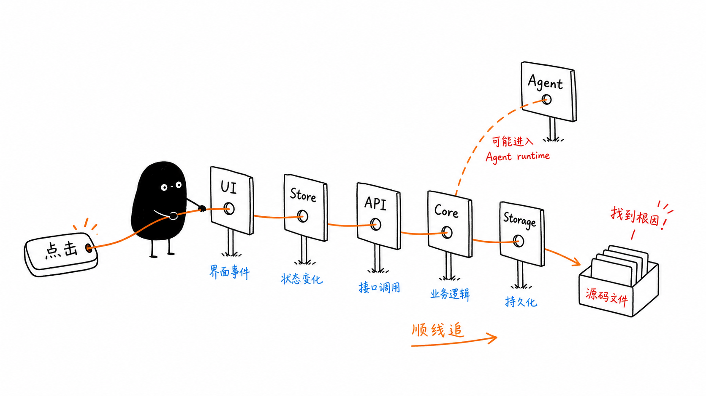
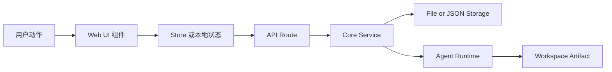
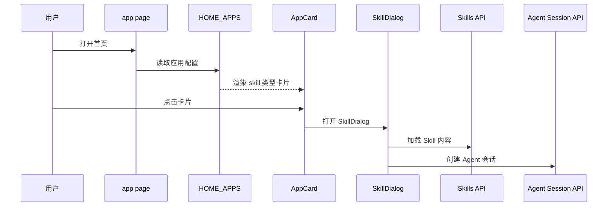
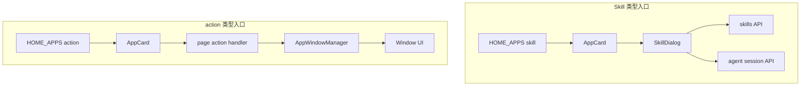
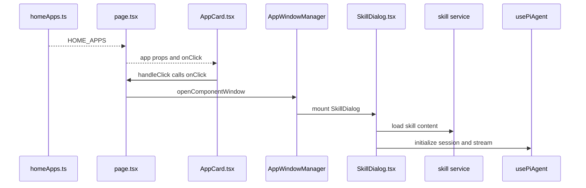

# A5. 从用户流程读源码

> 类型：源码课  
> 状态：正式课件  
> 本节目标：学会从一个真实用户动作出发，顺着 UI、状态、API、core、storage 或 Agent runtime 追源码。

## 问题

这一节解决：

> 新手看源码时，怎样避免随机打开文件、越看越乱？

答案是：不要从随机文件开始，要从用户流程开始。

例如用户在首页点击一个 Skill 卡片，这个动作不是停留在页面上。它会经过：

- 首页配置；
- AppCard 渲染；
- 点击事件；
- SkillDialog；
- skills API；
- agent session API；
- core Agent / Skill 加载逻辑；
- 输出目录或会话存储。



图里的小黑拿着一根线从“点击”穿过 UI、Store、API、Core、Storage。这个隐喻很重要：读源码不是看一个点，而是沿着线追。

## 图解

### 通用追踪链



### 首页 Skill 点击链



这条链路后面会在 C2、E4、F1-F3 继续精读。

## 源码入口

本节精读：

- [packages/web/src/app/page.tsx（第 1 行）](../../../../packages/web/src/app/page.tsx#L1)
- [packages/web/src/config/homeApps.ts（第 1 行）](../../../../packages/web/src/config/homeApps.ts#L1)
- [packages/web/src/components/framework/AppCard（第 1 行）](../../../../packages/web/src/components/framework/AppCard.tsx#L1)
- [packages/web/src/components/skills/SkillDialog.tsx（第 1 行）](../../../../packages/web/src/components/skills/SkillDialog.tsx#L1)
- [packages/web/src/app/api/skills/（第 1 行）](../../../../packages/web/src/app/api/skills/route.ts#L1)
- [packages/web/src/app/api/agent/sessions/（第 1 行）](../../../../packages/web/src/app/api/agent/sessions/route.ts#L1)

从 [homeApps.ts（第 1 行）](../../../../packages/web/src/config/homeApps.ts#L1) 可以看到：

- `AppCardType` 只有两类：`skill` 和 `action`；
- `HomeAppConfig` 包含 `id`、`name`、`description`、`icon`、`color`、`type`；
- `skill` 类型用 `skillName` 打开 SkillDialog；
- `action` 类型用 `action` 触发页面动作。

从 [page.tsx（第 1 行）](../../../../packages/web/src/app/page.tsx#L1) 可以看到：

- 顶部有 `'use client'`，说明它是客户端组件；
- 它导入 `HOME_APPS`；
- 它导入 `SkillDialog`、`AppCard`、`Dock`、`WorkspaceWindow`、`AppWindowManager`、多个 store 和 core 集成；
- 它是桌面首页的编排层，不是纯展示组件。

### 具体读法：从配置到点击

第一段读 [homeApps.ts（第 1 行）](../../../../packages/web/src/config/homeApps.ts#L1) ：

```ts
export type AppCardType = 'skill' | 'action';
```

这个类型把首页入口分成两条路。不要小看这行，它决定后面的事件分叉。

第二段读 `HOME_APPS.map` 渲染：

```tsx
{HOME_APPS.map((app) => (
  <AppCard
    key={app.id}
    id={app.id}
    name={app.name}
    description={app.description}
    icon={app.icon}
    color={app.color}
    dockType={app.type}
    skillName={app.skillName}
    onClick={() => {
      if (app.type === 'skill' && app.skillName) {
        handleSkillLaunch(app.skillName, app.name);
      } else if (app.action === 'open-workspace') {
        const firstProject = projects[0];
        if (firstProject) {
          handleOpenWorkspace(firstProject.id);
        }
      }
    }}
    action="launch"
  />
))}
```

这段说明 [page.tsx（第 1 行）](../../../../packages/web/src/app/page.tsx#L1) 做的是编排：它把配置转成 `AppCard` props，并把点击分派给对应 handler。

第三段读 [AppCard.tsx（第 1 行）](../../../../packages/web/src/components/framework/AppCard.tsx#L1) ：

```ts
const handleClick = () => {
  if (path) {
    window.location.href = path;
  } else if (onClick) {
    onClick();
  }
};
```

`AppCard` 自己不知道 Skill 怎么运行，它只负责展示和触发 `onClick`。这就是组件边界。

第四段读 `handleSkillLaunch`：

```ts
windowManager.openComponentWindow(
  `skill-${skillName}`,
  name,
  SkillDialog,
  { skillName, initialMessage },
  {
    position: { width: 1200, height: 800 },
    constraints: { minWidth: 600, minHeight: 400 },
    metadata: { entryType: 'skill', entryId: skillName }
  }
);
```

这段说明点击 Skill 不会立刻执行模型，而是先打开一个承载 `SkillDialog` 的窗口。真正加载 Skill 和创建会话，是下一层的事。

## 调用链

这节课先用“创建项目”和“打开 Skill”两个流程训练。



你现在只需要掌握追踪方法：

1. 找用户动作；
2. 找这个动作的 UI 入口；
3. 找配置或 props；
4. 找事件 handler；
5. 找状态变更；
6. 找 API route；
7. 找 core service；
8. 找测试。

### 文件级点击链



这条链路已经比“UI -> API -> Core”更具体了。你后面读 C2/E4/F3 时，就是继续把 `SkillDialog -> skill service -> usePiAgent` 展开。

## 关键类型

本节关键类型来自 [homeApps.ts（第 1 行）](../../../../packages/web/src/config/homeApps.ts#L1) 和 [page.tsx（第 1 行）](../../../../packages/web/src/app/page.tsx#L1) 。

```ts
export type AppCardType = 'skill' | 'action';

export interface HomeAppConfig {
  id: string;
  name: string;
  description: string;
  icon: string;
  color: string;
  type: AppCardType;
  skillName?: string;
  action?: string;
}
```

理解这个类型，你就能理解首页入口为什么分成两类：

- `skill`：进入 SkillDialog，再进入 Agent 会话；
- `action`：触发页面动作，例如打开工作区。

[page.tsx（第 1 行）](../../../../packages/web/src/app/page.tsx#L1) 里还有页面局部类型：

- `ProjectCardProps`
- `UserAgent`
- `DockActionDetail`

这些类型暂时不是全局领域模型，而是页面为了组织 UI 和事件定义的局部结构。

### 关键类型怎么判断边界

| 类型 | 文件 | 谁生产 | 谁消费 | 说明 |
| --- | --- | --- | --- | --- |
| `HomeAppConfig` | [homeApps.ts（第 1 行）](../../../../packages/web/src/config/homeApps.ts#L1) | 配置文件 | [page.tsx（第 1 行）](../../../../packages/web/src/app/page.tsx#L1) 、`AppCard` | 首页入口的最小描述 |
| `AppCardProps` | [AppCard.tsx（第 1 行）](../../../../packages/web/src/components/framework/AppCard.tsx#L1) | 页面传入 | `AppCard` | UI 卡片展示和点击能力 |
| `DockActionDetail` | [page.tsx（第 1 行）](../../../../packages/web/src/app/page.tsx#L1) | Dock 事件 | `handleDockAction` | Dock 到首页的事件协议 |
| `SkillDialogProps` | [SkillDialog.tsx（第 1 行）](../../../../packages/web/src/components/skills/SkillDialog.tsx#L1) | window manager / page | `SkillDialog` | Skill 会话窗口的输入 |

看类型时要问：这个类型是领域模型，还是页面/组件局部协议？A5 里大多数类型都是 UI 编排协议，不应过早搬到 core。

## 测试入口

本节相关测试入口：

- [packages/web/src/components/skills/__tests__/（第 1 行）](../../../../packages/web/src/components/skills/__tests__/skill-export-policy.test.ts#L1)
- [packages/web/src/components/os/__tests__/（第 1 行）](../../../../packages/web/src/components/os/__tests__/Background-subcomponents.test.tsx#L1)
- [packages/web/src/store/__tests__/（第 1 行）](../../../../packages/web/src/store/__tests__/dockStore.test.ts#L1)
- [packages/web/src/services/__tests__/（第 1 行）](../../../../packages/web/src/services/__tests__/normalize-markdown-tables.test.ts#L1)
- [packages/web/src/app/api/agent/**/__tests__（第 1 行）](../../../../packages/web/src/app/api/agent/sessions/route.ts#L1)
- [tests/e2e/（第 1 行）](../../../../tests/e2e/epic-2-workspace.spec.ts#L1)

如果只是读流程，不需要立刻跑测试。后面真正改动时，要按链路决定测试范围。

测试怎么用：

- [packages/web/src/store/__tests__/dockStore.test.ts（第 1 行）](../../../../packages/web/src/store/__tests__/dockStore.test.ts#L1) 适合验证“固定到 Dock / 状态变化”；
- [packages/web/src/components/skills/__tests__/skill-export-policy.test.ts（第 1 行）](../../../../packages/web/src/components/skills/__tests__/skill-export-policy.test.ts#L1) 适合学习 Skill UI 附近的策略判断；
- API route 测试适合验证 session 创建和消息发送；
- E2E 适合验证用户流程有没有断。

如果你改的是 `AppCard` 点击逻辑，优先找组件测试或补组件测试；如果你改的是 `handleSkillLaunch` 的 metadata，应该继续追到窗口和 session 相关测试。

## 练习

1. 打开 [homeApps.ts（第 1 行）](../../../../packages/web/src/config/homeApps.ts#L1) ，找出所有 `type: 'skill'` 的入口。
2. 找出 `app-workspace` 这一项为什么是 `action` 而不是 `skill`。
3. 在 [page.tsx（第 1 行）](../../../../packages/web/src/app/page.tsx#L1) 顶部导入区，把导入分成 5 类：UI、config、store、service、core。
4. 画出“点击工作区入口”从 `HOME_APPS` 到窗口打开的大致链路。

参考答案检查：

- `skill` 入口必须经过 `handleSkillLaunch`；
- `action: 'open-workspace'` 入口必须经过 `handleOpenWorkspace`；
- `AppCard` 不能被说成“负责执行 Skill”，它只负责触发；
- 如果你的链路没有 `AppWindowManager.openComponentWindow`，说明漏掉了窗口层。

## 验收

学完本节，你应该能做到：

- 不再随机打开文件，而是从用户流程追源码；
- 能解释 `skill` 类型和 `action` 类型入口的区别；
- 能从 `HOME_APPS` 追到 `AppCard`、`SkillDialog` 或页面 action；
- 能根据一次用户动作说出可能经过哪些层；
- 能为一个 UI 问题定位到合适的源码区域。
