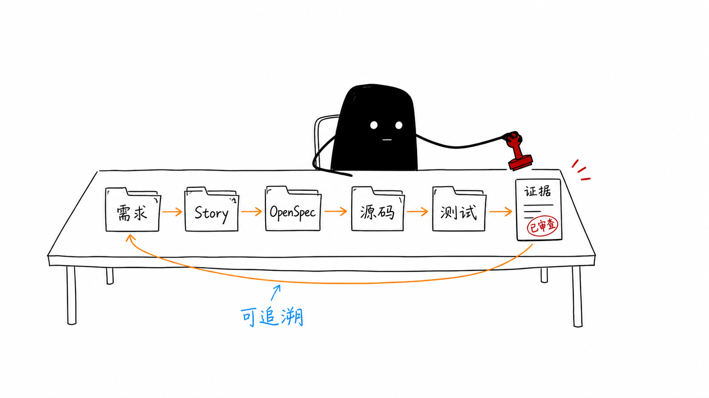
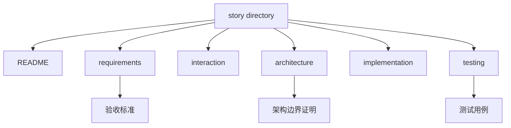
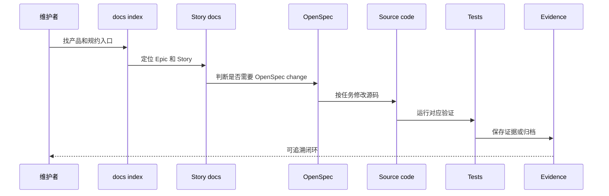
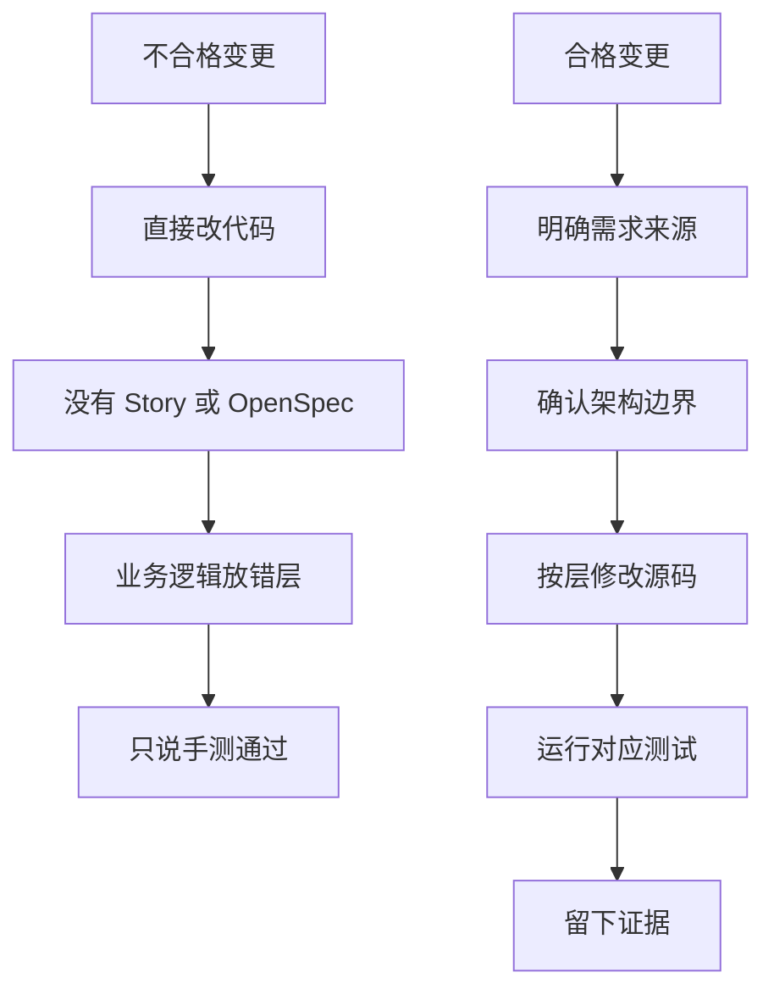

# A6. 从维护者视角读项目

> 类型：源码课  
> 状态：正式课件  
> 本节目标：从“能看代码”升级到“能判断改动是否合格”。维护者不只看功能能不能跑，还看需求来源、架构边界、测试证据和变更记录。

## 问题

这一节解决：

> 为什么项目里不仅有源码，还有 Story、OpenSpec、QA、变更记录、文档模板？读这些有什么用？

如果你只看源码，很容易不知道一个功能为什么这样设计，也不知道改动做到什么程度才算合格。OriginOS 的维护者视角是：

- 需求要能追到 Story 或产品文档；
- 架构要符合 [AGENTS.md（第 1 行）](../../../../AGENTS.md#L1) ；
- 变更要能被 OpenSpec 或 Story 解释；
- 实现要落在正确目录；
- 测试要覆盖成功路径、失败路径和边界；
- 重要变更要留下可审查证据。

图里的小黑不是在写代码，而是在审查桌前盖章。这个动作说明：维护者要判断一条变更链是否完整，而不是只看最后代码能不能运行。

## 图解

### 维护者闭环

### Story 文档结构

## 源码入口

本节精读：

- [docs/DOCUMENTATION-MANAGEMENT.md（第 1 行）](../../../../docs/DOCUMENTATION-MANAGEMENT.md#L1)
- [docs/index.md（第 1 行）](../../../../docs/index.md#L1)
- [docs/templates/story-spec-template/（第 1 行）](../../../../docs/templates/story-spec-template/README.md#L1)
- [docs/specs/（第 1 行）](../../../../docs/specs/epic-0/README.md#L1)
- [docs/test-cases/（第 1 行）](../../../../docs/test-cases/epic-1-project-quick-launch/test-cases-1.1-interview-start.md#L1)
- [docs/changes/（第 1 行）](../../../../docs/changes/changelog.md#L1)
- [openspec/config.yaml（第 1 行）](../../../../openspec/config.yaml#L1)
- [openspec/changes/（第 1 行）](../../../../openspec/changes/validate-pi-tasks-runtime-boundary/README.md#L1)
- [openspec/specs/（第 1 行）](../../../../openspec/specs/window-session-history-restore/spec.md#L1)

从 `DOCUMENTATION-MANAGEMENT.md` 可以看到，Story 目录应包含：

- [README.md（第 1 行）](../../../../README.md#L1) ：Story 概览；
- `requirements.md`：需求和验收；
- `interaction.md`：交互流程；
- `architecture.md`：技术设计和边界；
- `implementation.md`：实施步骤；
- `testing.md`：测试策略和用例。

从 [docs/index.md（第 1 行）](../../../../docs/index.md#L1) 可以看到，项目按产品规划、规约文档、API 文档、Agent 文档、使用指南、决策记录、QA、Epic 索引组织知识。

### 维护者实际审查顺序

维护者不会只问“代码能不能跑”。一个比较稳的顺序是：

1. 先看 [AGENTS.md（第 1 行）](../../../../AGENTS.md#L1) ：判断技术栈和目录边界；
2. 再看 [docs/index.md（第 1 行）](../../../../docs/index.md#L1) ：找到相关 Epic / Story / 设计文档；
3. 再看 Story 的 `requirements.md` 和 `testing.md`：确认需求和验收；
4. 如果是较大变更，看 [openspec/changes/（第 1 行）](../../../../openspec/changes/validate-pi-tasks-runtime-boundary/README.md#L1) ：确认 proposal、design、tasks 和 spec delta；
5. 再看源码 diff：判断是否落在正确层；
6. 最后看测试和证据：判断是否真的验证。

这个顺序看起来慢，但它能避免两种常见错误：

- 代码写完才发现违反架构；
- 功能能跑但没有需求和测试证据。

## 调用链

维护者读项目时，不是从代码直接跳到实现，而是走下面这条链。

读源码时你要经常反向追问：

- 这个功能对应哪个 Story？
- 这个实现是否符合 [AGENTS.md（第 1 行）](../../../../AGENTS.md#L1) ？
- 这个 API 的测试入口在哪里？
- 这个行为有没有 QA 或 test case？
- 如果我要改它，需要 OpenSpec 吗？

### 合格和不合格变更对照

这张图会在 P4 完整实战里再次出现。它是你从学习者变成维护者的分界线。

## 关键类型

A6 的关键类型是“文档对象”。

| 对象 | 作用 | 路径 |
| --- | --- | --- |
| Product docs | 解释产品目标和体验 | [docs/product/（第 1 行）](../../../../docs/product/PRD-Main.md#L1) |
| Design docs | 解释架构和设计思路 | [docs/design/（第 1 行）](../../../../docs/design/os-framework.md#L1) |
| Story specs | 解释需求、交互、架构、实现、测试 | [docs/specs/（第 1 行）](../../../../docs/specs/epic-0/README.md#L1) |
| Test cases | 解释验收和测试数据 | [docs/test-cases/（第 1 行）](../../../../docs/test-cases/epic-1-project-quick-launch/test-cases-1.1-interview-start.md#L1) |
| OpenSpec change | 解释一个变更的 proposal、design、tasks、spec delta | [openspec/changes/（第 1 行）](../../../../openspec/changes/validate-pi-tasks-runtime-boundary/README.md#L1) |
| OpenSpec specs | 主规格或已同步规格 | [openspec/specs/（第 1 行）](../../../../openspec/specs/window-session-history-restore/spec.md#L1) |
| Changes / QA | 记录变更、发布、质量验证 | [docs/changes/（第 1 行）](../../../../docs/changes/changelog.md#L1) 、`docs/QA/` |

这些不是“额外文档”，而是维护项目时判断代码是否正确的上下文。

### Story 6 个文件怎么用

| 文件 | 你要问的问题 | 如果缺失会怎样 |
| --- | --- | --- |
| [README.md（第 1 行）](../../../../README.md#L1) | 这个 Story 当前状态是什么？ | 不知道功能是否已完成 |
| `requirements.md` | 用户需求和验收是什么？ | 容易按想象实现 |
| `interaction.md` | 用户如何操作？状态和错误如何展示？ | UI 行为容易不一致 |
| `architecture.md` | 改哪些模块？是否符合 AGENTS？ | 容易破坏分层 |
| `implementation.md` | 实施步骤和文件范围是什么？ | diff 容易失控 |
| `testing.md` | 怎么验证成功和失败路径？ | 功能只能靠口头保证 |

## 测试入口

本节相关测试和验证入口：

- Story 测试文档：`docs/specs/**/testing.md`
- 测试用例： [docs/test-cases/（第 1 行）](../../../../docs/test-cases/epic-1-project-quick-launch/test-cases-1.1-interview-start.md#L1)
- 根级测试： [tests/（第 1 行）](../../../../tests/e2e/epic-2-workspace.spec.ts#L1)
- package 测试： [packages/**/__tests__（第 1 行）](../../../../packages/core/package.json#L1)
- OpenSpec 验证： [openspec/changes/*/tasks.md（第 1 行）](../../../../openspec/changes/validate-pi-tasks-runtime-boundary/README.md#L1) 、 [openspec/changes/*/specs/（第 1 行）](../../../../openspec/changes/validate-pi-tasks-runtime-boundary/README.md#L1)
- 架构检查：`pnpm agents:check`
- 常规检查：`pnpm lint`

如果一个 Story 缺少 testing 文档，按照 [AGENTS.md（第 1 行）](../../../../AGENTS.md#L1) 的规约，实施前应该先补测试 case 或验收用例。

## 练习

1. 打开 [docs/index.md（第 1 行）](../../../../docs/index.md#L1) ，找出 Epic OS、Epic R、Epic C 的入口。
2. 打开任意一个 [docs/specs/epic-OS/story-OS.*（第 1 行）](../../../../docs/specs/epic-OS/README.md#L1) ，确认是否包含 README、requirements、interaction、architecture、implementation、testing。
3. 从 `DOCUMENTATION-MANAGEMENT.md` 里摘出 `architecture.md` 必须包含的内容。
4. 假设要新增一个 Web/Core 跨层 API，写出你会检查的 5 类文件。

参考答案检查：

- 第 1 题至少应该找到 Epic OS、Epic R、Epic C 在 [docs/index.md（第 1 行）](../../../../docs/index.md#L1) 的索引行；
- 第 2 题如果某个 Story 缺文件，要记录为文档风险，而不是假装完整；
- 第 4 题至少应包含：需求/Story、AGENTS、API route、core feature、testing；
- 如果你的检查清单没有“测试入口”，说明还不是维护者视角。

## 验收

学完本节，你应该能做到：

- 能解释为什么维护者不能只看源码；
- 能从 [docs/index.md（第 1 行）](../../../../docs/index.md#L1) 找到产品、规约、Epic、QA 入口；
- 能说清 Story 6 个文档的分工；
- 能解释 OpenSpec change 和 Story 文档的关系；
- 能为一个真实改动列出需求来源、架构边界、源码位置、测试入口和证据路径。
