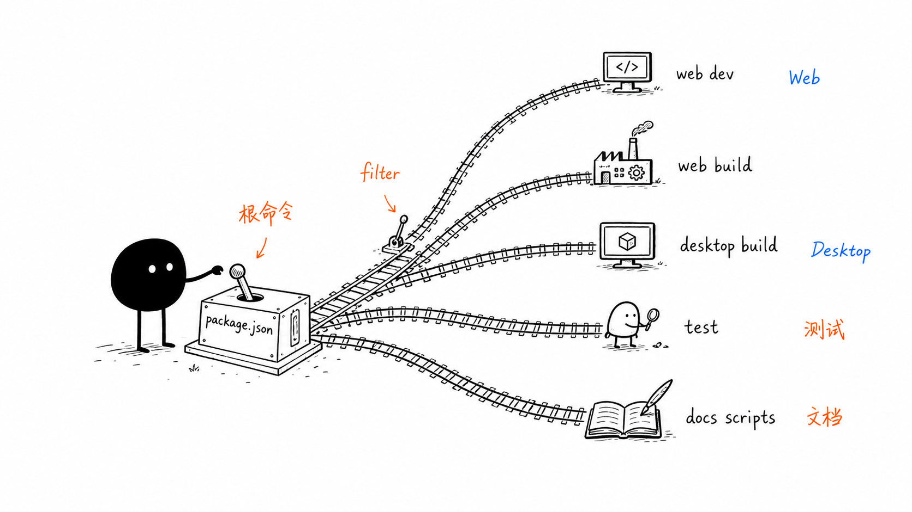
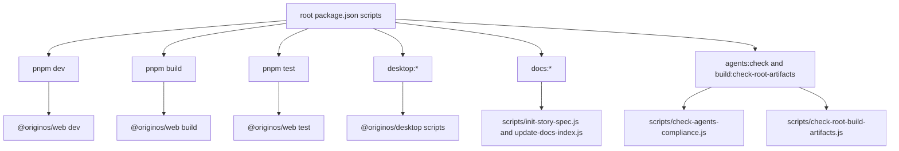
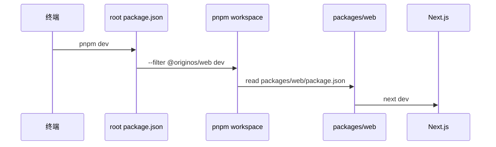
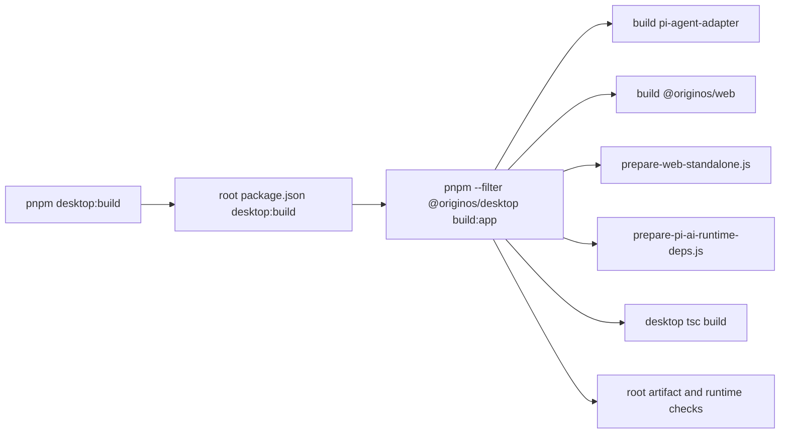
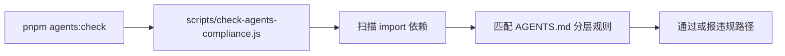

# B1. 根 package scripts

> 类型：源码课  
> 状态：正式课件  
> 本节目标：看懂根目录命令到底把工作交给谁。以后你看到 `pnpm dev`、`pnpm build`、`pnpm desktop:build`、`pnpm test`，不能只把它们当“神秘命令”，而要能判断它们影响哪个 package、会产出什么、适合验证什么。

## 问题

这一节解决：

> 根 [package.json（第 36 行）](../../../../package.json#L36) 里的 scripts 是项目的“命令总控台”，它们到底怎么把任务分发到 Web、Desktop、测试、文档和架构检查？

新手常见误区是：只背命令，不看命令背后的转发关系。这样一旦构建失败，就不知道失败来自 Next、Electron、TypeScript、脚本校验还是 package 边界。

这张小黑图的意思是：根 `package.json` 不直接实现业务，它像调度台，把命令通过 `pnpm --filter` 或 `node scripts/...` 分发到具体包和脚本。

## 图解

读这张图时注意两种分发方式：

| 分发方式 | 例子 | 含义 |
| --- | --- | --- |
| `pnpm --filter <package> <script>` | [package.json（第 37 行）](../../../../package.json#L37) | 到指定 workspace package 里继续执行脚本 |
| `node scripts/<file>.js` | [package.json（第 60 行）](../../../../package.json#L60) | 直接执行根目录脚本 |

## 源码入口

本节精读：

- [package.json（第 1 行）](../../../../package.json#L1)
- [packages/web/package.json（第 1 行）](../../../../packages/web/package.json#L1)
- [packages/desktop/package.json（第 1 行）](../../../../packages/desktop/package.json#L1)
- [scripts/check-agents-compliance.js（第 1 行）](../../../../scripts/check-agents-compliance.js#L1)
- [scripts/check-root-build-artifacts.js（第 1 行）](../../../../scripts/check-root-build-artifacts.js#L1)

### 根命令分组

根 [package.json（第 36 行）](../../../../package.json#L36) 的 scripts 可以分成 6 组：

| 组 | 命令 | 真实含义 |
| --- | --- | --- |
| Web 开发 | `dev`、`dev:clean`、`start` | 转发到 `@originos/web` |
| Web 构建 | `build`、`build:clean` | 转发到 Next build |
| 质量检查 | `lint`、`type-check`、`test`、`test:coverage` | 主要转发到 Web 包 |
| Desktop | `desktop:*` | 转发到 `@originos/desktop` 或执行 desktop 脚本 |
| 文档 | `docs:init-story`、`docs:index` | 执行 Story 文档脚本 |
| 架构/产物检查 | `agents:check`、`build:check-root-artifacts` | 检查 AGENTS 规约和根目录构建产物 |

你要特别注意：根 `test` 只写了 [package.json（第 46 行）](../../../../package.json#L46) 的 `pnpm --filter @originos/web test`，不是“全仓库所有测试”。所以改 core、desktop 时，只跑根 `pnpm test` 不一定够。

## 调用链

### `pnpm dev`

对应源码：

- 根入口： [package.json（第 37 行）](../../../../package.json#L37)
- Web 包脚本： [packages/web/package.json（第 6 行）](../../../../packages/web/package.json#L6)

### `pnpm desktop:build`

关键源码：

- 根转发： [package.json（第 50 行）](../../../../package.json#L50)
- Desktop build:app： [packages/desktop/package.json（第 10 行）](../../../../packages/desktop/package.json#L10)
- Web standalone 复制： [packages/desktop/scripts/prepare-web-standalone.js（第 4 行）](../../../../packages/desktop/scripts/prepare-web-standalone.js#L4)
- 根产物检查： [scripts/check-root-build-artifacts.js（第 8 行）](../../../../scripts/check-root-build-artifacts.js#L8)

### `pnpm agents:check`

这不是业务测试，而是架构规约检查：

入口在 [package.json（第 60 行）](../../../../package.json#L60) ，脚本在 [scripts/check-agents-compliance.js（第 1 行）](../../../../scripts/check-agents-compliance.js#L1)。

## 关键类型

这里的关键类型不是 TypeScript interface，而是脚本语义：

| 概念 | 人话解释 | 源码证据 |
| --- | --- | --- |
| `script` | 给人和 CI 使用的命令入口 | [package.json（第 36 行）](../../../../package.json#L36) |
| `--filter` | pnpm workspace 中选择某个包 | [package.json（第 37 行）](../../../../package.json#L37) |
| `@originos/web` | Next.js Web 应用包 | [packages/web/package.json（第 2 行）](../../../../packages/web/package.json#L2) |
| `@originos/desktop` | Electron 桌面包 | [packages/desktop/package.json（第 2 行）](../../../../packages/desktop/package.json#L2) |
| `node scripts/...` | 根目录脚本，通常做规约、文档或构建检查 | [package.json（第 60 行）](../../../../package.json#L60) |

## 测试入口

本节用于理解命令，不要求马上跑完整测试。真实入口是：

- Web 测试命令： [packages/web/package.json（第 11 行）](../../../../packages/web/package.json#L11)
- Desktop 测试命令： [packages/desktop/package.json（第 7 行）](../../../../packages/desktop/package.json#L7)
- 根 Vitest 配置： [vitest.config.ts（第 30 行）](../../../../vitest.config.ts#L30)
- Web Vitest 配置： [packages/web/vitest.config.ts（第 5 行）](../../../../packages/web/vitest.config.ts#L5)
- Desktop Vitest 配置： [packages/desktop/vitest.config.ts（第 4 行）](../../../../packages/desktop/vitest.config.ts#L4)

判断原则：

| 改动范围 | 优先命令 |
| --- | --- |
| `packages/web/src/**` | `pnpm --filter @originos/web test`、`pnpm --filter @originos/web type-check` |
| `packages/core/src/**` | `pnpm --filter @originos/core test` 或根 Vitest 指定文件 |
| `packages/desktop/src/**` / `scripts/**` | `pnpm --filter @originos/desktop test` 和对应 verify 脚本 |
| 架构边界 | `pnpm agents:check` |
| 构建产物边界 | `pnpm build:check-root-artifacts` |

## 逐行精读

这一节真正要精读的是 [package.json（第 36 行）](../../../../package.json#L36) 到 [package.json（第 67 行）](../../../../package.json#L67) 。不要一口气背完，按“命令类型”读。

### 第 37-42 行：Web 生命周期命令

- [package.json（第 37 行）](../../../../package.json#L37) 的 `dev` 转发到 `@originos/web dev`，再进入 [packages/web/package.json（第 6 行）](../../../../packages/web/package.json#L6) 的 `next dev`。
- [package.json（第 40 行）](../../../../package.json#L40) 的 `build` 转发到 `@originos/web build`，再进入 [packages/web/package.json（第 7 行）](../../../../packages/web/package.json#L7) 的 `next build`。
- [package.json（第 42 行）](../../../../package.json#L42) 的 `start` 转发到 `@originos/web start`，再进入 [packages/web/package.json（第 8 行）](../../../../packages/web/package.json#L8) 的 `next start`。

这里的判断方法是：根命令如果用了 `--filter @originos/web`，就说明根目录只是转发，真正行为要继续看 `packages/web/package.json`。

### 第 43-48 行：质量检查命令

- [package.json（第 43 行）](../../../../package.json#L43) 的 `lint` 转发到 Web lint。
- [package.json（第 45 行）](../../../../package.json#L45) 的 `type-check` 转发到 Web type-check。
- [package.json（第 46 行）](../../../../package.json#L46) 的 `test` 转发到 Web test。
- [package.json（第 48 行）](../../../../package.json#L48) 的 `test:coverage` 没有调用 Web package script，而是在 Web 包里直接执行 `vitest run --coverage`。

这说明根质量命令偏 Web，而不是天然覆盖 core 和 desktop。后面改 core 或 desktop 时，要主动补对应 package 的测试。

### 第 49-59 行：Desktop 分发命令

[package.json（第 49 行）](../../../../package.json#L49) 到 [package.json（第 59 行）](../../../../package.json#L59) 的 `desktop:*` 主要转发到 [packages/desktop/package.json（第 6 行）](../../../../packages/desktop/package.json#L6)。

其中最复杂的是：

- [package.json（第 50 行）](../../../../package.json#L50) `desktop:build`
- [packages/desktop/package.json（第 10 行）](../../../../packages/desktop/package.json#L10) `build:app`

`build:app` 是一条长流水线：先清理旧产物，再 build adapter，再 build Web，再复制 Next standalone，再准备 runtime deps，再编译 Desktop，再校验产物边界。

### 第 60-64 行：项目治理命令

- [package.json（第 60 行）](../../../../package.json#L60) `agents:check` 是架构规约检查。
- [package.json（第 61 行）](../../../../package.json#L61) `build:check-root-artifacts` 是根目录产物污染检查。
- [package.json（第 62 行）](../../../../package.json#L62) `docs:init-story` 用于生成 Story 文档骨架。
- [package.json（第 63 行）](../../../../package.json#L63) `docs:index` 用于更新文档索引。

这些不是业务功能命令，而是维护项目秩序的命令。

## 常见故障

| 现象 | 第一判断 | 应看入口 |
| --- | --- | --- |
| `pnpm dev` 失败 | Web dev 或 Next 配置问题 | [package.json（第 37 行）](../../../../package.json#L37) 、 [packages/web/package.json（第 6 行）](../../../../packages/web/package.json#L6) |
| `pnpm desktop:build` 失败 | Desktop build:app 流水线某一步失败 | [packages/desktop/package.json（第 10 行）](../../../../packages/desktop/package.json#L10) |
| `pnpm test` 通过但 core 改动仍有风险 | 根 test 不覆盖全仓库 | [package.json（第 46 行）](../../../../package.json#L46) |
| 根目录出现 `.js` 或 `.d.ts` | 构建产物落错位置 | [scripts/check-root-build-artifacts.js（第 8 行）](../../../../scripts/check-root-build-artifacts.js#L8) |
| Story 文档结构缺文件 | 没走 Story 模板脚本 | [package.json（第 62 行）](../../../../package.json#L62) |

排错时不要先猜“哪个库坏了”。先问：你运行的是根命令还是 package 命令？根命令有没有继续转发？

## 改动场景判断

| 你改了什么 | 应优先看什么 | 验证方式 |
| --- | --- | --- |
| Web 页面或组件 | `@originos/web` scripts | Web test、type-check、必要时 dev 手动验证 |
| 根 scripts | 根 [package.json（第 36 行）](../../../../package.json#L36) 和目标脚本 | 直接运行被改命令或对应脚本 |
| Desktop build 流水线 | [packages/desktop/package.json（第 10 行）](../../../../packages/desktop/package.json#L10) | `desktop:build` 或拆分运行失败子步骤 |
| Story 文档生成 | [scripts/init-story-spec.js（第 1 行）](../../../../scripts/init-story-spec.js#L1) | `pnpm docs:init-story ...` 并检查 6 个模板文件 |
| 架构依赖规则 | [scripts/check-agents-compliance.js（第 1 行）](../../../../scripts/check-agents-compliance.js#L1) | `pnpm agents:check` |

## 源码追问清单

读完本节后，你应该能继续追问：

1. 根 `pnpm test` 为什么只覆盖 Web？这是历史原因、项目策略，还是遗漏？
2. `desktop:build` 里哪一步最容易受 pnpm hoisted 影响？
3. `docs:init-story` 是否和 AGENTS.md 的 Story 模板约束完全一致？
4. `build:check-root-artifacts` 为什么只检查根目录，不检查 package 内部产物？
5. 如果要加一个新 package，根 scripts 是否需要增加转发命令？

## 练习

1. 打开 [package.json（第 36 行）](../../../../package.json#L36) ，把 scripts 分成 Web、Desktop、测试、文档、规约检查五类。
2. 解释 `pnpm dev` 和 `pnpm desktop:dev` 的差别。
3. 判断：如果只改了 [scripts/check-root-build-artifacts.js（第 8 行）](../../../../scripts/check-root-build-artifacts.js#L8) ，只跑 `pnpm test` 是否足够？为什么？
4. 找出 Desktop 发布相关的 5 个命令。

参考答案要点：

- `pnpm dev` 只启动 Web dev；`pnpm desktop:dev` 会走 Desktop 包，并同时涉及 Web dev、desktop tsc watch 和 Electron 启动。
- 改根脚本时只跑 `pnpm test` 不够，因为根 `test` 转发到 Web 包，不覆盖该脚本自身执行路径。
- Desktop 发布相关命令包括 `desktop:dist`、`desktop:dist:win:local`、`desktop:dist:mac`、`desktop:dist:mac:publish`、`desktop:publish:qiniu` 等。

## 验收

学完本节，你需要能做到：

- 看到根 scripts，能判断它是 `--filter` 转发还是 `node scripts` 直跑；
- 能说清 `pnpm dev`、`pnpm build`、`pnpm desktop:build`、`pnpm test` 的真实范围；
- 能解释为什么根 `pnpm test` 不等于全仓库测试；
- 能把一个构建失败初步定位到 Web、Desktop、脚本、依赖或架构检查层。
