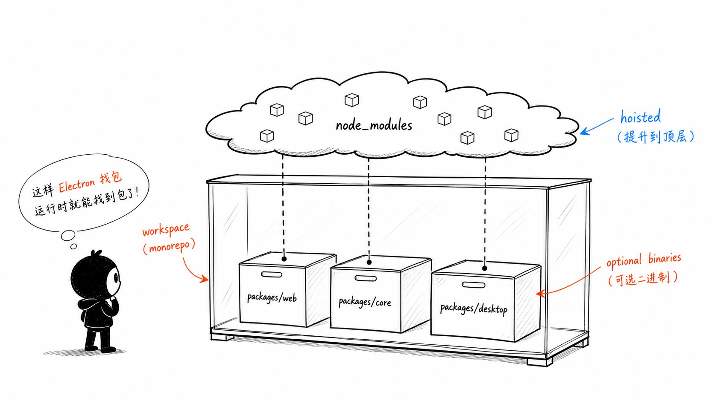
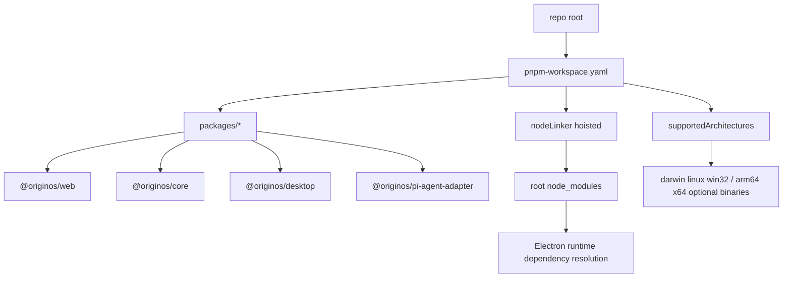
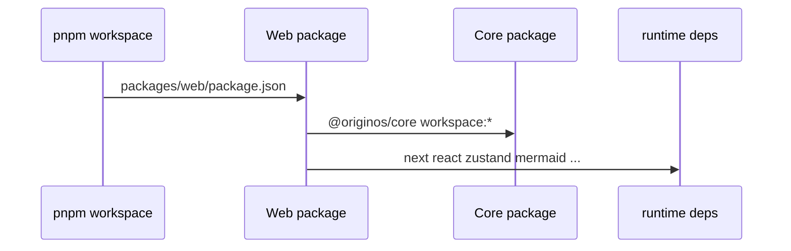
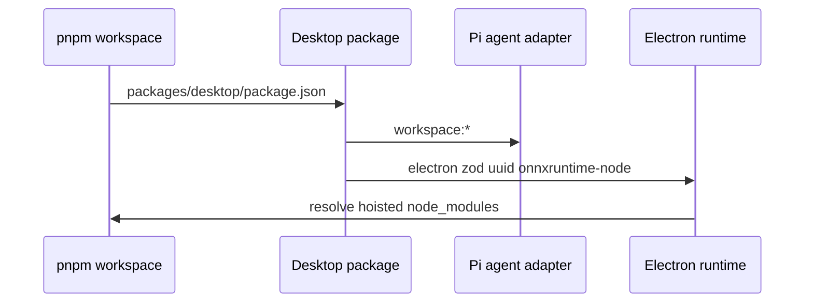
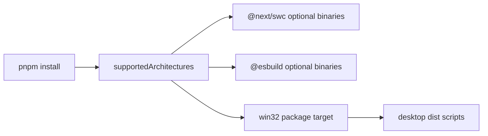

# B2. pnpm workspace 与 hoisted 依赖

> 类型：源码课  
> 状态：正式课件  
> 本节目标：理解 monorepo 如何组织多个 package，以及为什么这个项目明确选择 `nodeLinker: hoisted`。这不是依赖安装细节，而是 Electron 运行时能否找到依赖的关键。

## 问题

这一节解决：

> [pnpm-workspace.yaml（第 1 行）](../../../../pnpm-workspace.yaml#L1) 为什么只写 `packages/*`，又为什么要在 [pnpm-workspace.yaml（第 7 行）](../../../../pnpm-workspace.yaml#L7) 配 `nodeLinker: hoisted`？

如果你把 workspace 只理解成“多个包放在一起”，会漏掉更重要的一点：开发时能解析依赖，不代表 Electron 打包后也能解析依赖。



这张图里的 `node_modules` 云朵表示依赖被提升到顶层。它解决的是运行时找包路径问题，尤其是 Electron main 产物在 `dist-electron/` 下执行时，模块解析路径和源码目录不同。

## 图解



这张图要拆成三层理解：

1. `packages/*` 决定哪些目录进入 pnpm workspace；
2. `workspace:*` 决定本地包之间用源码包连接；
3. `hoisted` 和 `supportedArchitectures` 解决运行时/打包时的依赖布局。

## 源码入口

本节精读：

- [pnpm-workspace.yaml（第 1 行）](../../../../pnpm-workspace.yaml#L1)
- [package.json（第 26 行）](../../../../package.json#L26)
- [package.json（第 30 行）](../../../../package.json#L30)
- [packages/web/package.json（第 14 行）](../../../../packages/web/package.json#L14)
- [packages/core/package.json（第 12 行）](../../../../packages/core/package.json#L12)
- [packages/desktop/package.json（第 37 行）](../../../../packages/desktop/package.json#L37)

### `packages/*`

[pnpm-workspace.yaml（第 1 行）](../../../../pnpm-workspace.yaml#L1) 只声明：

```yaml
packages:
  - packages/*
```

这意味着 workspace package 必须在 `packages/` 下一层。根目录里的 `docs/`、`learning-note/`、`scripts/` 不是 package，它们是文档和工具区域。

### `nodeLinker: hoisted`

[pnpm-workspace.yaml（第 4 行）](../../../../pnpm-workspace.yaml#L4) 到 [pnpm-workspace.yaml（第 7 行）](../../../../pnpm-workspace.yaml#L7) 的注释已经说得很直接：

- Electron 主进程产物在 `dist-electron/` 下；
- 运行时会向上解析 `node_modules`；
- pnpm 默认 isolated 模式不 hoist；
- 所以 `zod` 等依赖可能解析失败；
- hoisted 模式通过平铺依赖解决这个运行期问题。

这不是“为了方便 import”，而是为了让打包后的运行布局仍能解析依赖。

## 调用链

### Web 依赖链



证据：

- Web 包名在 [packages/web/package.json（第 2 行）](../../../../packages/web/package.json#L2)
- Web 依赖 core 在 [packages/web/package.json（第 15 行）](../../../../packages/web/package.json#L15)

### Desktop 依赖链



证据：

- Desktop 包名在 [packages/desktop/package.json（第 2 行）](../../../../packages/desktop/package.json#L2)
- Desktop 依赖 adapter 在 [packages/desktop/package.json（第 39 行）](../../../../packages/desktop/package.json#L39)
- `zod` 等 runtime 依赖在 [packages/desktop/package.json（第 49 行）](../../../../packages/desktop/package.json#L49)

### 打包平台链

[pnpm-workspace.yaml（第 12 行）](../../../../pnpm-workspace.yaml#L12) 的 `supportedArchitectures` 明确安装 `darwin`、`linux`、`win32` 和 `arm64`、`x64`。这和 Desktop 分发有关：你在 macOS 上开发，也可能需要 Windows 目标相关的 optional binary。



## 关键类型

| 概念 | 人话解释 | 源码证据 |
| --- | --- | --- |
| `workspace package` | 被 pnpm 当成一个包管理的目录 | [pnpm-workspace.yaml（第 1 行）](../../../../pnpm-workspace.yaml#L1) |
| `workspace:*` | 依赖本仓库里的 sibling package | [packages/web/package.json（第 15 行）](../../../../packages/web/package.json#L15) |
| `nodeLinker: hoisted` | 依赖平铺，便于运行时向上找包 | [pnpm-workspace.yaml（第 7 行）](../../../../pnpm-workspace.yaml#L7) |
| `patchedDependencies` | 对第三方包打补丁，并锁定补丁文件 | [package.json（第 30 行）](../../../../package.json#L30) |
| `supportedArchitectures` | 安装跨平台 optional binary | [pnpm-workspace.yaml（第 12 行）](../../../../pnpm-workspace.yaml#L12) |

## 测试入口

依赖布局相关问题通常不是单元测试能完全覆盖的，要看三类入口：

- Desktop runtime 验证： [packages/desktop/package.json（第 20 行）](../../../../packages/desktop/package.json#L20)
- Pi task runtime package 测试： [packages/desktop/package.json（第 21 行）](../../../../packages/desktop/package.json#L21)
- Runtime package 校验脚本： [packages/desktop/scripts/verify-pi-task-runtime-package.js（第 13 行）](../../../../packages/desktop/scripts/verify-pi-task-runtime-package.js#L13)
- Web standalone 打包复制： [packages/desktop/scripts/prepare-web-standalone.js（第 147 行）](../../../../packages/desktop/scripts/prepare-web-standalone.js#L147)

## 逐行精读

本节要精读 [pnpm-workspace.yaml（第 1 行）](../../../../pnpm-workspace.yaml#L1) 到 [pnpm-workspace.yaml（第 35 行）](../../../../pnpm-workspace.yaml#L35)。

### 第 1-2 行：workspace 包边界

[pnpm-workspace.yaml（第 1 行）](../../../../pnpm-workspace.yaml#L1) 的 `packages` 声明只有 `packages/*`。这意味着：

- `packages/web`、`packages/core`、`packages/desktop` 是 workspace package；
- `docs`、`scripts`、`learning-note` 不是 workspace package；
- package 间依赖要在各自 `package.json` 中表达，而不是靠相对路径随便互相 import。

### 第 4-7 行：为什么 hoisted

[pnpm-workspace.yaml（第 4 行）](../../../../pnpm-workspace.yaml#L4) 到 [pnpm-workspace.yaml（第 7 行）](../../../../pnpm-workspace.yaml#L7) 是全文件最关键的注释。它不是普通备注，而是在解释一个真实工程选择：

- Electron 主进程产物在 `dist-electron/`；
- 运行时按 Node 规则向上找 `node_modules`；
- pnpm isolated 依赖布局可能让运行时代码找不到某些包；
- `hoisted` 把依赖平铺，牺牲一部分隔离性，换取 Electron runtime 可解析性。

这是一种明确 tradeoff：严格隔离更干净，但 Electron 打包运行更难；hoisted 更接近 npm/yarn classic 的布局，运行时找包更直接。

### 第 12-19 行：跨平台 optional binary

[pnpm-workspace.yaml（第 12 行）](../../../../pnpm-workspace.yaml#L12) 的 `supportedArchitectures` 不是给 TypeScript 用的，是给依赖安装和打包平台用的。它告诉 pnpm：除了当前平台，还要准备 `darwin`、`linux`、`win32`，以及 `arm64`、`x64`。

这和 [packages/desktop/package.json（第 29 行）](../../../../packages/desktop/package.json#L29) 的 Windows dist 有直接关系：打包 Windows 目标时，缺少 win32 optional binary 可能导致包内 runtime 不完整。

### 第 21-35 行：依赖安装例外

- [pnpm-workspace.yaml（第 21 行）](../../../../pnpm-workspace.yaml#L21) `overrides` 固定 `@electron/get` 版本；
- [pnpm-workspace.yaml（第 24 行）](../../../../pnpm-workspace.yaml#L24) `allowBuilds` 明确哪些依赖允许执行 build；
- [pnpm-workspace.yaml（第 34 行）](../../../../pnpm-workspace.yaml#L34) `ignoredBuiltDependencies` 忽略 `onnxruntime-node` 的 build。

这些配置说明：项目不是无条件相信所有依赖 postinstall，而是把 native/build 行为显式登记。

## 常见故障

| 现象 | 可能原因 | 应看入口 |
| --- | --- | --- |
| 开发时能跑，Electron 打包后 `Cannot find module` | runtime 路径和源码路径不同，hoisted/standalone 有问题 | [pnpm-workspace.yaml（第 7 行）](../../../../pnpm-workspace.yaml#L7) 、 [prepare-web-standalone.js（第 147 行）](../../../../packages/desktop/scripts/prepare-web-standalone.js#L147) |
| Windows 包缺 native runtime | optional binary 没安装完整 | [pnpm-workspace.yaml（第 12 行）](../../../../pnpm-workspace.yaml#L12) |
| 第三方包行为和 npm 原版不同 | patchedDependencies 生效 | [package.json（第 30 行）](../../../../package.json#L30) |
| 某依赖 postinstall 被拦截 | `allowBuilds` 或 `ignoredBuiltDependencies` 配置影响 | [pnpm-workspace.yaml（第 24 行）](../../../../pnpm-workspace.yaml#L24) |
| workspace 包没有被识别 | 目录不在 `packages/*` 下或 package.json 缺失 | [pnpm-workspace.yaml（第 1 行）](../../../../pnpm-workspace.yaml#L1) |

## 改动场景判断

| 你要做什么 | 应改哪里 | 风险 |
| --- | --- | --- |
| 新增 workspace package | `packages/<name>/package.json`，必要时保持 `packages/*` 可匹配 | 命名和依赖导出边界 |
| 新增 Web 依赖 | [packages/web/package.json（第 14 行）](../../../../packages/web/package.json#L14) | 是否会被 Desktop packaging 间接带入 |
| 新增 Desktop runtime 依赖 | [packages/desktop/package.json（第 37 行）](../../../../packages/desktop/package.json#L37) | 打包后能否解析、是否需要 verify |
| 修改第三方补丁 | [package.json（第 30 行）](../../../../package.json#L30) 和 `patches/` | 补丁 hash、runtime 兼容 |
| 调整 hoisted 策略 | [pnpm-workspace.yaml（第 7 行）](../../../../pnpm-workspace.yaml#L7) | 高风险，可能影响 Electron runtime |

## 源码追问清单

1. 哪些 package 使用 `workspace:*` 依赖本仓库其他包？
2. `@originos/core` 的 exports 是否让 Web 只能依赖公共入口？
3. `prepare-web-standalone.js` 为什么还要把 root node_modules 里的包复制到 Web standalone？
4. `onnxruntime-node` 为什么被忽略 build？它在 Web 和 Desktop 中分别承担什么风险？
5. 如果未来取消 hoisted，Desktop runtime 需要补哪些解析或复制逻辑？

## 练习

1. 打开 [pnpm-workspace.yaml（第 1 行）](../../../../pnpm-workspace.yaml#L1) ，解释为什么 `packages/web` 是 package，而 `docs` 不是。
2. 打开 [packages/web/package.json（第 15 行）](../../../../packages/web/package.json#L15) ，解释 `@originos/core: workspace:*` 的含义。
3. 用自己的话解释：为什么 Electron 比纯 Web 更容易遇到运行时找不到依赖？
4. 找出 [pnpm-workspace.yaml（第 24 行）](../../../../pnpm-workspace.yaml#L24) 到 [pnpm-workspace.yaml（第 35 行）](../../../../pnpm-workspace.yaml#L35) 里哪些包允许 build，哪些被忽略。

参考答案要点：

- `packages/*` 只匹配 `packages` 下一层目录；
- `workspace:*` 表示依赖本仓库里的 workspace 包，不是从 npm 下载一个同名包；
- Electron 打包后执行路径变成 `dist-electron` 或安装包内部路径，模块解析不等于源码目录；
- `onnxruntime-node` 被放入 `ignoredBuiltDependencies`，说明它是特殊 native 依赖。

## 验收

学完本节，你需要能做到：

- 能解释 `packages/*`、`workspace:*`、`nodeLinker: hoisted` 的区别；
- 能说明 hoisted 是为 Electron 运行时解析服务，不只是安装习惯；
- 能指出跨平台 optional binary 和 Desktop 打包的关系；
- 遇到“开发能跑、打包后找不到模块”时，知道先看 workspace、hoisted、standalone 复制和 runtime verify。
