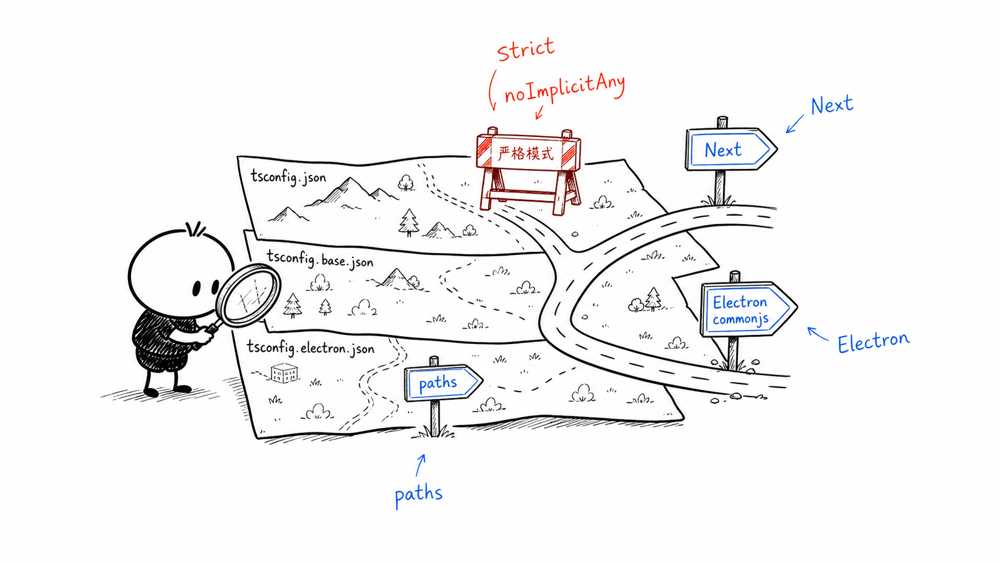
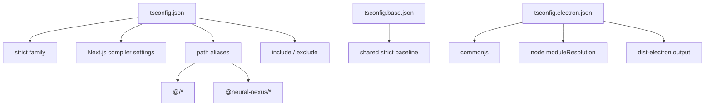
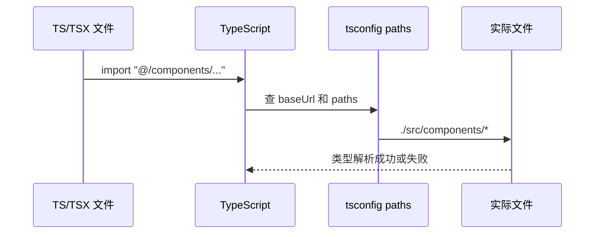
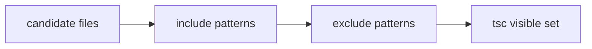

# B3. TypeScript 配置体系

> 类型：源码课  
> 状态：正式课件  
> 本节目标：看懂 TypeScript 配置怎样约束项目。重点不是背所有 compiler options，而是理解 strict、moduleResolution、paths、include/exclude 如何决定“代码能不能被类型系统看到”和“import 能不能被解析”。

## 问题

这一节解决：

> 为什么项目里同时有 [tsconfig.json（第 1 行）](../../../../tsconfig.json#L1) 、 [tsconfig.base.json（第 1 行）](../../../../tsconfig.base.json#L1) 、 [tsconfig.electron.json（第 1 行）](../../../../tsconfig.electron.json#L1) ？它们分别约束谁？

新手经常只在 TS 报错时才看 `tsconfig`。但在这个项目里，TypeScript 配置本身就是架构边界的一部分：它决定 strict 是否强制、Next 使用什么解析方式、Electron 使用什么输出方式、哪些目录被纳入检查。



这张图可以这样理解：`tsconfig` 是地图，不是代码。地图画错，代码可能“看起来没问题”，但类型检查、构建、运行时会走到不同的路上。

## 图解



这一节先把三份配置分清：

| 文件 | 作用 |
| --- | --- |
| [tsconfig.json（第 1 行）](../../../../tsconfig.json#L1) | 根级 Next/Web 风格配置，包含 strict、paths、include/exclude |
| [tsconfig.base.json（第 1 行）](../../../../tsconfig.base.json#L1) | 共享基础配置，沉淀 strict 基线 |
| [tsconfig.electron.json（第 1 行）](../../../../tsconfig.electron.json#L1) | Electron 风格配置，CommonJS、Node 解析、输出到 `dist-electron` |

## 源码入口

本节精读：

- [tsconfig.json（第 2 行）](../../../../tsconfig.json#L2)
- [tsconfig.base.json（第 2 行）](../../../../tsconfig.base.json#L2)
- [tsconfig.electron.json（第 2 行）](../../../../tsconfig.electron.json#L2)
- [packages/web/vitest.config.ts（第 10 行）](../../../../packages/web/vitest.config.ts#L10)
- [packages/core/vitest.config.ts（第 5 行）](../../../../packages/core/vitest.config.ts#L5)

### strict 不是装饰

[tsconfig.json（第 6 行）](../../../../tsconfig.json#L6) 到 [tsconfig.json（第 23 行）](../../../../tsconfig.json#L23) 是一组强约束：

| 选项 | 直觉解释 |
| --- | --- |
| `strict` | 打开一组严格检查 |
| `noImplicitAny` | 不允许隐式 `any` |
| `strictNullChecks` | `null` / `undefined` 必须被显式处理 |
| `noUncheckedIndexedAccess` | 下标访问可能拿不到值 |
| `noPropertyAccessFromIndexSignature` | 索引签名对象不能随便点属性 |

这和 AGENTS.md 的“禁止 any 类型”是同一条工程纪律：类型系统不是为了好看，而是为了让跨模块调用在编译阶段暴露问题。

### Next 和 Electron 的解析方式不同

[tsconfig.json（第 38 行）](../../../../tsconfig.json#L38) 到 [tsconfig.json（第 42 行）](../../../../tsconfig.json#L42) 使用：

- `module: esnext`
- `moduleResolution: bundler`
- `jsx: preserve`

这适合 Next/Web 侧，由 bundler 和 Next 接管最终处理。

而 [tsconfig.electron.json（第 3 行）](../../../../tsconfig.electron.json#L3) 到 [tsconfig.electron.json（第 8 行）](../../../../tsconfig.electron.json#L8) 使用：

- `module: commonjs`
- `moduleResolution: node`
- `outDir: ./dist-electron`
- `rootDir: ./electron`

这说明 Electron main 的编译思路和 Web 不同。Web 是面向浏览器和 Next 编译，Electron main 是面向 Node/Electron 运行时。

## 调用链

### import alias 解析链



证据在 [tsconfig.json（第 52 行）](../../../../tsconfig.json#L52) 到 [tsconfig.json（第 82 行）](../../../../tsconfig.json#L82)：

- `baseUrl: "."`
- `@/* -> ./src/*`
- `@/components/* -> ./src/components/*`
- `@/lib/* -> ./src/lib/*`
- `@neural-nexus/* -> ./src/modules/...`

这里有一个重要提醒：根 `tsconfig.json` 的 alias 更像早期根应用布局，真实 package 中的测试 alias 还要看各包自己的 Vitest 配置。例如 Web 测试在 [packages/web/vitest.config.ts（第 11 行）](../../../../packages/web/vitest.config.ts#L11) 把 `@` 指到 `packages/web/src`，Core 测试在 [packages/core/vitest.config.ts（第 6 行）](../../../../packages/core/vitest.config.ts#L6) 把 `@` 指到 `packages/core/src`。

### include / exclude 决定检查边界



[tsconfig.json（第 85 行）](../../../../tsconfig.json#L85) 到 [tsconfig.json（第 97 行）](../../../../tsconfig.json#L97) 是 include，[tsconfig.json（第 98 行）](../../../../tsconfig.json#L98) 到 [tsconfig.json（第 116 行）](../../../../tsconfig.json#L116) 是 exclude。注意根配置 exclude 了 `packages`，所以真正 package 级检查不能只靠根配置想象，要看各 package 命令。

## 关键类型

| 概念 | 人话解释 | 源码证据 |
| --- | --- | --- |
| `compilerOptions.strict` | 类型系统严格总开关 | [tsconfig.json（第 6 行）](../../../../tsconfig.json#L6) |
| `moduleResolution` | import 怎样解析到文件 | [tsconfig.json（第 39 行）](../../../../tsconfig.json#L39) |
| `paths` | alias 到真实路径的映射 | [tsconfig.json（第 53 行）](../../../../tsconfig.json#L53) |
| `include` | 哪些文件进入类型检查候选集合 | [tsconfig.json（第 85 行）](../../../../tsconfig.json#L85) |
| `exclude` | 哪些目录从检查集合排除 | [tsconfig.json（第 98 行）](../../../../tsconfig.json#L98) |
| `outDir` | 编译产物输出目录 | [tsconfig.electron.json（第 7 行）](../../../../tsconfig.electron.json#L7) |

## 测试入口

TypeScript 配置的验证不只看 `tsc`，还要看测试 runner 的 alias 是否一致：

- Web type-check 命令： [packages/web/package.json（第 10 行）](../../../../packages/web/package.json#L10)
- Web test alias： [packages/web/vitest.config.ts（第 10 行）](../../../../packages/web/vitest.config.ts#L10)
- Core test alias： [packages/core/vitest.config.ts（第 5 行）](../../../../packages/core/vitest.config.ts#L5)
- Desktop test 环境： [packages/desktop/vitest.config.ts（第 4 行）](../../../../packages/desktop/vitest.config.ts#L4)

## 逐行精读

本节重点精读三组配置：strict、解析方式、文件覆盖范围。

### strict 组：第 6-23 行

[tsconfig.json（第 6 行）](../../../../tsconfig.json#L6) 到 [tsconfig.json（第 23 行）](../../../../tsconfig.json#L23) 的核心不是“更严格”，而是“让跨模块契约不靠猜”。

| 配置 | 会阻止什么坏味道 | 例子 |
| --- | --- | --- |
| `noImplicitAny` | 函数参数悄悄变成 `any` | API route 参数未声明类型 |
| `strictNullChecks` | 把可能为空的值当必然存在 | `session?.id` 被当成 `session.id` |
| `noUncheckedIndexedAccess` | 数组/字典访问假定一定有值 | `items[0].name` 没判断 `items[0]` |
| `noImplicitReturns` | 分支漏 return | API handler 某个错误分支无响应 |
| `noPropertyAccessFromIndexSignature` | 动态对象字段被当成确定字段 | `record.foo` 实际来自 `Record<string, unknown>` |

这些选项和业务质量直接相关。OriginOS 里大量数据来自文件、Agent 消息、API body、技能 frontmatter，如果类型太松，很容易把错误推迟到运行时。

### Next 解析组：第 27-43 行

[tsconfig.json（第 27 行）](../../../../tsconfig.json#L27) 到 [tsconfig.json（第 43 行）](../../../../tsconfig.json#L43) 是 Web/Next 风格：

- `target: ES2020`：输出语义面向较现代 JS；
- `lib: dom / dom.iterable / esnext`：说明 Web 侧能使用 DOM 类型；
- `module: esnext` + `moduleResolution: bundler`：让 bundler 处理 ESM 解析；
- `jsx: preserve`：把 JSX 交给 Next/Babel/SWC 后续处理；
- `noEmit: true`：根类型检查不产出 JS。

这里要形成一个判断：Web 侧 TypeScript 不是“编译出 JS 文件”的主力，Next build 才是最终构建者。

### alias 组：第 52-82 行

[tsconfig.json（第 52 行）](../../../../tsconfig.json#L52) 到 [tsconfig.json（第 82 行）](../../../../tsconfig.json#L82) 是路径别名。最容易误读的是 `@/*`：

```json
"@/*": ["./src/*"]
```

但是当前项目源码主力在 `packages/web/src` 和 `packages/core/src`。所以读 alias 不能只看根 `tsconfig`，还必须结合 package 自己的测试配置：

- Web 测试 alias： [packages/web/vitest.config.ts（第 11 行）](../../../../packages/web/vitest.config.ts#L11)
- Core 测试 alias： [packages/core/vitest.config.ts（第 6 行）](../../../../packages/core/vitest.config.ts#L6)

### include/exclude 组：第 85-116 行

[tsconfig.json（第 85 行）](../../../../tsconfig.json#L85) 到 [tsconfig.json（第 116 行）](../../../../tsconfig.json#L116) 说明根配置并不覆盖所有 package 源码。尤其 [tsconfig.json（第 113 行）](../../../../tsconfig.json#L113) 排除了 `packages`。

这意味着：当你改 `packages/core/src` 时，不要以为根 `tsconfig` 一定检查到了它。要看 package 命令和 package 配置。

## 常见故障

| 现象 | 可能原因 | 应看入口 |
| --- | --- | --- |
| 测试里 `@/xxx` 找不到 | Vitest alias 没配或指错 package | [packages/web/vitest.config.ts（第 10 行）](../../../../packages/web/vitest.config.ts#L10) |
| Web 构建能过，某测试 import 失败 | Next alias 和 Vitest alias 不一致 | [packages/web/vitest.config.ts（第 11 行）](../../../../packages/web/vitest.config.ts#L11) |
| Electron main 用 ESM import 报错 | Electron TS 配置是 CommonJS/Node 解析 | [tsconfig.electron.json（第 4 行）](../../../../tsconfig.electron.json#L4) |
| 类型检查没有覆盖你改的 package | include/exclude 或 package 命令范围不对 | [tsconfig.json（第 98 行）](../../../../tsconfig.json#L98) |
| 新增动态对象字段后 TS 报错 | `noPropertyAccessFromIndexSignature` 正在保护索引签名 | [tsconfig.json（第 23 行）](../../../../tsconfig.json#L23) |

## 改动场景判断

| 你要改什么 | 应先看什么 | 不该做什么 |
| --- | --- | --- |
| 新增 `@/xxx` import | 当前 package 的 alias 配置 | 只改根 `tsconfig` 就以为测试也生效 |
| 新增 Core public API | [packages/core/package.json（第 12 行）](../../../../packages/core/package.json#L12) exports | 从 Web 直接深 import 内部文件 |
| 改 Electron main 编译 | [tsconfig.electron.json（第 3 行）](../../../../tsconfig.electron.json#L3) | 照搬 Next `moduleResolution: bundler` |
| 放宽 strict | [tsconfig.json（第 6 行）](../../../../tsconfig.json#L6) | 用 `any` 绕开真实数据建模 |
| 新增测试目录 | 对应 Vitest `include` | 以为文件名符合就一定会被收集 |

## 源码追问清单

1. 根 `tsconfig.json` 排除 `packages` 后，各 package 的 type-check 是如何被执行的？
2. Web 测试 alias 指向 `@originos/core` 的源码，会不会绕过 core 的 exports 边界？
3. `moduleResolution: bundler` 对 package exports 的解析和 Node runtime 有什么差别？
4. `allowJs: true` 在这个 TypeScript 项目里是兼容历史代码，还是仍有业务需要？
5. 如果新增 `packages/service` 类型检查，应该新增 package 自己的 tsconfig，还是改根 tsconfig？

## 练习

1. 打开 [tsconfig.json（第 53 行）](../../../../tsconfig.json#L53) ，解释 `@/components/*` 会被解析到哪里。
2. 打开 [packages/web/vitest.config.ts（第 11 行）](../../../../packages/web/vitest.config.ts#L11) ，解释测试里的 `@` 和根 `tsconfig` 里的 `@` 是否完全一样。
3. 判断：Electron main 代码能不能照搬 Next 的 `moduleResolution: bundler`？为什么？
4. 找出一个 strict 选项，并举例说明它能提前发现什么问题。

参考答案要点：

- alias 必须结合当前配置上下文看，根配置和 package 测试配置可能不同；
- Electron main 面向 Node/Electron，使用 CommonJS 和 Node resolution 更贴近运行时；
- `noImplicitAny` 能防止函数参数、对象字段等被隐式放弃类型检查；
- `include/exclude` 会影响类型检查实际覆盖范围，不能只看源码目录。

## 验收

学完本节，你需要能做到：

- 能解释三份 tsconfig 的职责差异；
- 能从 `paths` 追踪一个 alias 到真实文件区域；
- 能说明 strict 配置和 AGENTS.md 类型纪律的关系；
- 能判断某个类型错误应该看根配置、Web 配置、Core 配置还是 Electron 配置。
