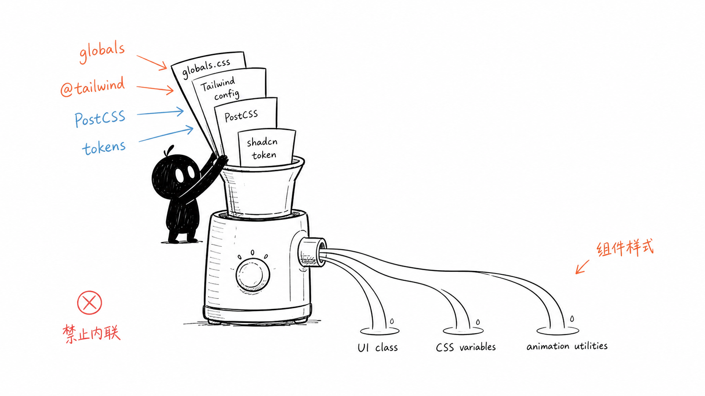
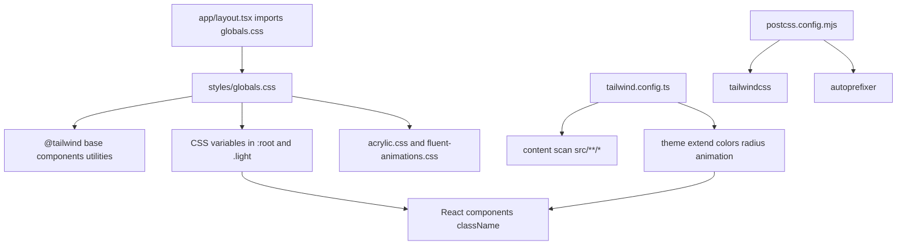
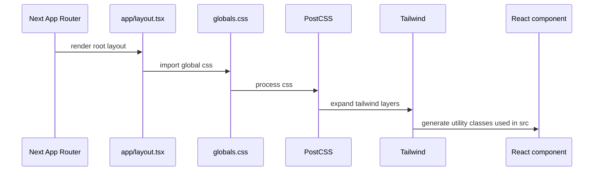

# B4. Tailwind 与 Web 样式入口

> 类型：源码课  
> 状态：正式课件  
> 本节目标：看懂 Web 样式从哪里进入应用，Tailwind、PostCSS、全局 CSS、shadcn token、组件 className 各自负责什么。以后改 UI 时，不要把样式散落到内联 style 或 CSS Modules。

## 问题

这一节解决：

> OriginOS 的样式系统是怎么接入 Next App Router 的？为什么 AGENTS.md 强制使用 Tailwind，禁止内联样式和 CSS Modules？

样式入口不是“随便找个 CSS 文件改”。在这个项目里，样式链路从 [packages/web/src/app/layout.tsx（第 2 行）](../../../../packages/web/src/app/layout.tsx#L2) 导入 [packages/web/src/styles/globals.css（第 1 行）](../../../../packages/web/src/styles/globals.css#L1) 开始，再由 Tailwind、PostCSS、CSS variables 和组件 className 共同工作。



这张图的意思是：样式不是散装颜料，而是一条管线。`globals.css` 放基础层和 CSS 变量，Tailwind config 提供 token 和扫描范围，组件通过 className 消费这些能力。

## 图解



这张图要读出 4 个边界：

1. `layout.tsx` 是全局样式进入 App Router 的入口；
2. `globals.css` 定义 Tailwind layers、CSS variables 和少量全局规则；
3. `tailwind.config.ts` 定义扫描范围和设计 token；
4. 组件样式应该通过 Tailwind className 和共享 UI 组件表达。

## 源码入口

本节精读：

- [packages/web/src/app/layout.tsx（第 1 行）](../../../../packages/web/src/app/layout.tsx#L1)
- [packages/web/src/styles/globals.css（第 1 行）](../../../../packages/web/src/styles/globals.css#L1)
- [packages/web/tailwind.config.ts（第 1 行）](../../../../packages/web/tailwind.config.ts#L1)
- [packages/web/postcss.config.mjs（第 1 行）](../../../../packages/web/postcss.config.mjs#L1)
- [tailwind.config.ts（第 1 行）](../../../../tailwind.config.ts#L1)

### 样式入口

[packages/web/src/app/layout.tsx（第 2 行）](../../../../packages/web/src/app/layout.tsx#L2) 导入：

```ts
import "@/styles/globals.css";
```

[packages/web/src/app/layout.tsx（第 3 行）](../../../../packages/web/src/app/layout.tsx#L3) 还导入了 `@xyflow/react/dist/style.css`，说明图谱/流程类组件有第三方基础样式。

### 全局 CSS 层

[packages/web/src/styles/globals.css（第 1 行）](../../../../packages/web/src/styles/globals.css#L1) 到 [packages/web/src/styles/globals.css（第 3 行）](../../../../packages/web/src/styles/globals.css#L3) 是 Tailwind 三层入口：

```css
@tailwind base;
@tailwind components;
@tailwind utilities;
```

[packages/web/src/styles/globals.css（第 5 行）](../../../../packages/web/src/styles/globals.css#L5) 到 [packages/web/src/styles/globals.css（第 9 行）](../../../../packages/web/src/styles/globals.css#L9) 导入 acrylic 和 animation 子文件。

[packages/web/src/styles/globals.css（第 12 行）](../../../../packages/web/src/styles/globals.css#L12) 到 [packages/web/src/styles/globals.css（第 50 行）](../../../../packages/web/src/styles/globals.css#L50) 定义 dark mode 默认 token；[packages/web/src/styles/globals.css（第 52 行）](../../../../packages/web/src/styles/globals.css#L52) 到 [packages/web/src/styles/globals.css（第 89 行）](../../../../packages/web/src/styles/globals.css#L89) 定义 `.light` token。

### Tailwind token 层

[packages/web/tailwind.config.ts（第 4 行）](../../../../packages/web/tailwind.config.ts#L4) 定义扫描范围：

```ts
content: ["./src/**/*.{js,ts,jsx,tsx,mdx}"]
```

[packages/web/tailwind.config.ts（第 9 行）](../../../../packages/web/tailwind.config.ts#L9) 到 [packages/web/tailwind.config.ts（第 49 行）](../../../../packages/web/tailwind.config.ts#L49) 把 `border`、`background`、`primary`、`panel` 等 Tailwind 颜色映射到 CSS variables。这样组件可以写 `bg-background`、`text-foreground`，而不是硬编码颜色。

## 调用链



这条链路说明：组件里的 `className` 不是孤立字符串，它要被 Tailwind content scan 找到，然后生成对应 CSS。

## 关键类型

| 概念 | 人话解释 | 源码证据 |
| --- | --- | --- |
| `@tailwind base/components/utilities` | Tailwind 的三层 CSS 注入点 | [globals.css（第 1 行）](../../../../packages/web/src/styles/globals.css#L1) |
| `content` | Tailwind 扫描哪些源码里的 className | [packages/web/tailwind.config.ts（第 4 行）](../../../../packages/web/tailwind.config.ts#L4) |
| CSS variables | 主题 token 的真实值 | [globals.css（第 12 行）](../../../../packages/web/src/styles/globals.css#L12) |
| `theme.extend.colors` | Tailwind token 到 CSS variables 的映射 | [packages/web/tailwind.config.ts（第 9 行）](../../../../packages/web/tailwind.config.ts#L9) |
| PostCSS plugins | Tailwind 和 autoprefixer 的处理入口 | [packages/web/postcss.config.mjs（第 3 行）](../../../../packages/web/postcss.config.mjs#L3) |

## 测试入口

样式系统没有单一“样式测试”。真实验证分三类：

- Web lint： [packages/web/package.json（第 9 行）](../../../../packages/web/package.json#L9)
- Web 组件测试环境： [packages/web/vitest.config.ts（第 5 行）](../../../../packages/web/vitest.config.ts#L5)
- CSS 支持开关： [packages/core/vitest.config.ts（第 19 行）](../../../../packages/core/vitest.config.ts#L19)
- E2E 视觉/交互入口： [tests/e2e/epic-2-workspace.spec.ts（第 1 行）](../../../../tests/e2e/epic-2-workspace.spec.ts#L1)

实际改 UI 时，你通常需要：

| 改动 | 验证 |
| --- | --- |
| 改组件 className | 组件测试 + 浏览器/截图人工检查 |
| 改 `globals.css` token | Web 页面回归 + 关键组件视觉检查 |
| 改 Tailwind config | dev/build 验证 class 是否生成 |
| 改 PostCSS | build 验证 |

## 逐行精读

本节要把样式链拆成入口、变量、映射、消费四段。

### 入口：layout.tsx 第 1-4 行

[packages/web/src/app/layout.tsx（第 2 行）](../../../../packages/web/src/app/layout.tsx#L2) 是全局样式入口。App Router 下，全局 CSS 通常只能从 layout 这类顶层入口导入，不能在任意组件里散装导入全局样式。

[packages/web/src/app/layout.tsx（第 3 行）](../../../../packages/web/src/app/layout.tsx#L3) 导入 `@xyflow/react/dist/style.css`，说明图谱/流程组件不是纯 Tailwind，它有第三方库自己的基础 CSS。

### Tailwind 指令：globals.css 第 1-3 行

[packages/web/src/styles/globals.css（第 1 行）](../../../../packages/web/src/styles/globals.css#L1) 到 [packages/web/src/styles/globals.css（第 3 行）](../../../../packages/web/src/styles/globals.css#L3) 是 Tailwind 注入点：

- `base`：浏览器基础和 reset；
- `components`：组件层；
- `utilities`：工具类。

如果 Tailwind class 没效果，第一步不是改组件，而是确认这个入口是否被 layout 导入，Tailwind config 是否扫描到了组件文件。

### CSS variables：globals.css 第 12-89 行

[packages/web/src/styles/globals.css（第 12 行）](../../../../packages/web/src/styles/globals.css#L12) 的 `:root` 是默认 dark mode token，[packages/web/src/styles/globals.css（第 52 行）](../../../../packages/web/src/styles/globals.css#L52) 的 `.light` 是 light mode token。

这解释了为什么组件里不应该写死 `#1A1F2E`。正确方式是让 `--panel-bg` 这种变量承载真实颜色，再由 Tailwind token 映射成 class。

### Tailwind 映射：tailwind.config.ts 第 9-49 行

[packages/web/tailwind.config.ts（第 9 行）](../../../../packages/web/tailwind.config.ts#L9) 到 [packages/web/tailwind.config.ts（第 49 行）](../../../../packages/web/tailwind.config.ts#L49) 把 CSS variables 包装成 Tailwind token：

```ts
background: "hsl(var(--background))"
```

这条映射的意思是：组件写 `bg-background`，最终颜色来自 `globals.css` 里的 `--background`。

### 动画和效果：tailwind.config.ts 第 55-104 行

[packages/web/tailwind.config.ts（第 55 行）](../../../../packages/web/tailwind.config.ts#L55) 到 [packages/web/tailwind.config.ts（第 104 行）](../../../../packages/web/tailwind.config.ts#L104) 扩展了 acrylic blur、keyframes、animation。这里是全局可复用动画 token，不应在每个组件里重新发明一套。

## 常见故障

| 现象 | 可能原因 | 应看入口 |
| --- | --- | --- |
| 新增 className 但样式没生成 | 文件不在 Tailwind content 扫描范围 | [packages/web/tailwind.config.ts（第 4 行）](../../../../packages/web/tailwind.config.ts#L4) |
| 颜色改了但组件没变化 | 组件没用 token，写了硬编码颜色 | [globals.css（第 12 行）](../../../../packages/web/src/styles/globals.css#L12) |
| light mode 颜色异常 | `.light` token 没同步 | [globals.css（第 52 行）](../../../../packages/web/src/styles/globals.css#L52) |
| 构建时报 PostCSS/Tailwind 错 | PostCSS 插件链问题 | [packages/web/postcss.config.mjs（第 3 行）](../../../../packages/web/postcss.config.mjs#L3) |
| 图谱组件样式丢失 | 忘了第三方 CSS 入口 | [layout.tsx（第 3 行）](../../../../packages/web/src/app/layout.tsx#L3) |

## 改动场景判断

| 你要改什么 | 首选位置 | 验证重点 |
| --- | --- | --- |
| 全局主题色 | [globals.css（第 12 行）](../../../../packages/web/src/styles/globals.css#L12) 和 `.light` | dark/light 都要看 |
| 新增设计 token | [packages/web/tailwind.config.ts（第 9 行）](../../../../packages/web/tailwind.config.ts#L9) | class 是否生成 |
| 组件局部布局 | 组件 `className` | 响应式和文本溢出 |
| 通用动画 | [packages/web/tailwind.config.ts（第 65 行）](../../../../packages/web/tailwind.config.ts#L65) | 命名是否可复用 |
| 第三方库基础样式 | 顶层 layout 或库推荐入口 | 是否污染全局 |

## 源码追问清单

1. 根 [tailwind.config.ts（第 4 行）](../../../../tailwind.config.ts#L4) 和 Web 包 [packages/web/tailwind.config.ts（第 4 行）](../../../../packages/web/tailwind.config.ts#L4) 是否重复？谁在实际构建中生效？
2. shadcn/ui 的 token 命名和 `globals.css` 变量是否完全对应？
3. acrylic 和 fluent animation 是全局能力，还是应该进一步组件化？
4. 哪些组件仍然存在硬编码颜色或任意值 class？
5. 如果要改整体视觉风格，应该先改 token，还是逐个组件改 className？

## 练习

1. 打开 [packages/web/src/app/layout.tsx（第 2 行）](../../../../packages/web/src/app/layout.tsx#L2) ，说明全局样式从哪里进入。
2. 打开 [packages/web/src/styles/globals.css（第 12 行）](../../../../packages/web/src/styles/globals.css#L12) ，找出 dark mode 下 `--primary` 的值。
3. 打开 [packages/web/tailwind.config.ts（第 15 行）](../../../../packages/web/tailwind.config.ts#L15) ，说明 `primary.DEFAULT` 如何拿到 CSS variable。
4. 判断：在组件里写 `style={{ marginTop: 13 }}` 是否符合 AGENTS.md？为什么？

参考答案要点：

- 全局样式入口是 `layout.tsx` 导入 `globals.css`；
- `--primary` 在 dark mode 下是 `217 91% 60%`；
- Tailwind token 通过 `hsl(var(--primary))` 绑定 CSS variable；
- 内联 style 违反项目规约，也绕开了设计 token 和 Tailwind 间距体系。

## 验收

学完本节，你需要能做到：

- 能从 `layout.tsx` 追到 `globals.css`、Tailwind config 和 PostCSS；
- 能解释 CSS variables 和 Tailwind token 的关系；
- 能说明为什么项目禁止 CSS Modules 和内联样式；
- 改 UI 时能优先找共享 token、Tailwind class 和已有组件，而不是临时硬编码。
