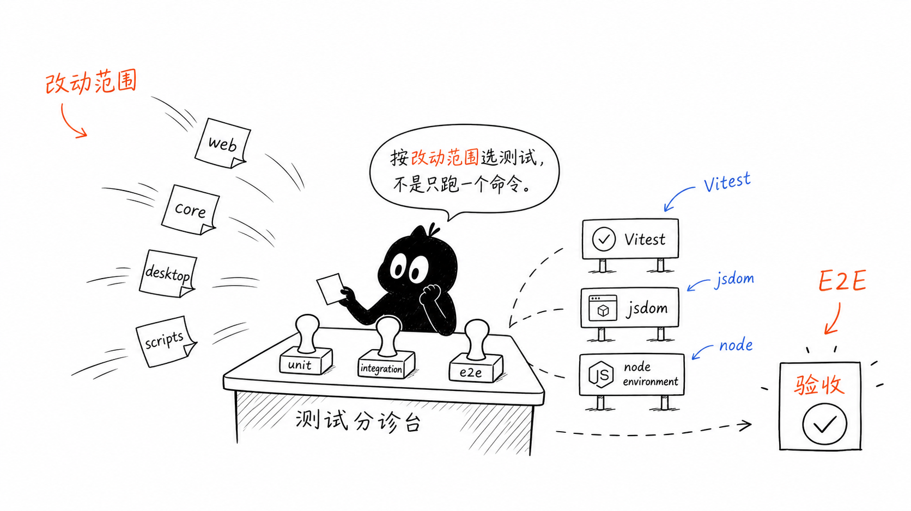
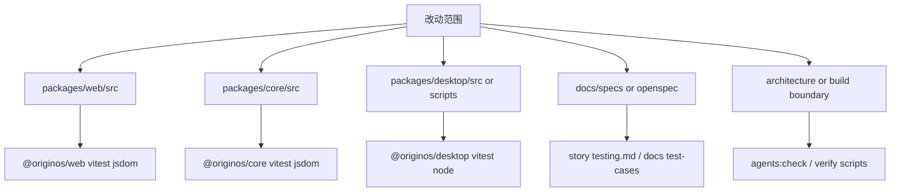
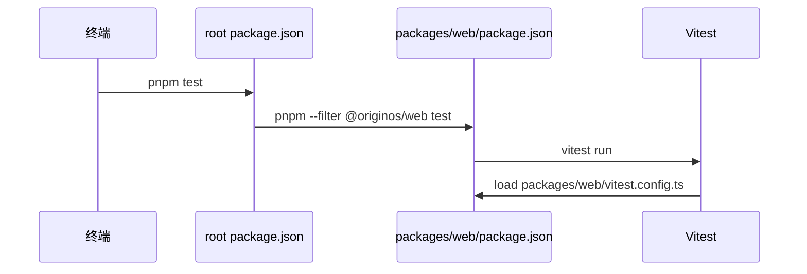
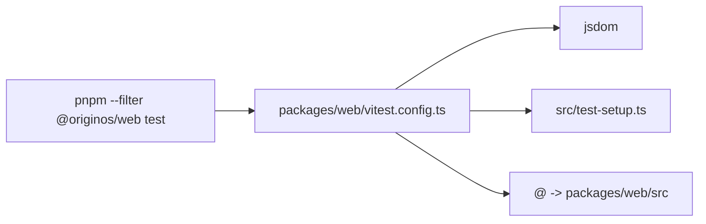
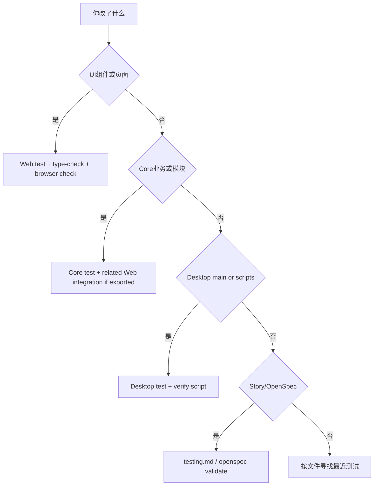

# B5. 测试运行方式

> 类型：源码课  
> 状态：正式课件  
> 本节目标：学会按改动范围选择测试入口。不是所有改动都只跑 `pnpm test`，也不是所有改动都要跑全量。你要能从 package scripts、Vitest 配置、测试文件位置和 Story 验收之间建立判断链。

## 问题

这一节解决：

> 改 Web、Core、Desktop、脚本、Story 文档时，应该跑什么测试？怎么知道一个测试命令覆盖了哪些文件？

如果你只记一个 `pnpm test`，会有两个风险：

1. 覆盖不够：根 `pnpm test` 只转发到 Web 包；
2. 成本过高：很小的脚本改动也盲目跑大范围测试，效率低，还不一定测到重点。



这张图的核心是“按改动范围选测试”。测试不是仪式，是证据链。

## 图解



测试选择有三个问题：

1. 哪个 package 的源码被改了？
2. 这个 package 的测试环境是什么？
3. 有没有跨边界影响，需要补集成/E2E/验证脚本？

## 源码入口

本节精读：

- [package.json（第 43 行）](../../../../package.json#L43)
- [package.json（第 46 行）](../../../../package.json#L46)
- [vitest.config.ts（第 30 行）](../../../../vitest.config.ts#L30)
- [packages/web/package.json（第 9 行）](../../../../packages/web/package.json#L9)
- [packages/web/vitest.config.ts（第 5 行）](../../../../packages/web/vitest.config.ts#L5)
- [packages/core/vitest.config.ts（第 13 行）](../../../../packages/core/vitest.config.ts#L13)
- [packages/desktop/vitest.config.ts（第 4 行）](../../../../packages/desktop/vitest.config.ts#L4)

### 根命令不是全量测试

[package.json（第 46 行）](../../../../package.json#L46)：

```json
"test": "pnpm --filter @originos/web test"
```

这说明根 `pnpm test` 跑的是 Web 包的 `test`。而 [packages/web/package.json（第 11 行）](../../../../packages/web/package.json#L11) 的 `test` 是：

```json
"test": "vitest run"
```

所以链路是：



## 调用链

### Web 测试链

[packages/web/vitest.config.ts（第 5 行）](../../../../packages/web/vitest.config.ts#L5) 到 [packages/web/vitest.config.ts（第 14 行）](../../../../packages/web/vitest.config.ts#L14) 说明：

- `environment: 'jsdom'`，适合 React/Web 组件；
- `setupFiles` 指向 `src/test-setup.ts`；
- alias `@` 指向 `packages/web/src`；
- alias `@originos/core` 指向 `packages/core/src`。



### Core 测试链

[packages/core/vitest.config.ts（第 13 行）](../../../../packages/core/vitest.config.ts#L13) 到 [packages/core/vitest.config.ts（第 23 行）](../../../../packages/core/vitest.config.ts#L23) 说明 Core 测试也是 `jsdom`，并加载 pi-agent 测试 setup。

Core 不是纯算法库，它包含 Agent、模块、UI 边界和一些浏览器相关抽象，所以使用 `jsdom` 不奇怪。

### Desktop 测试链

[packages/desktop/vitest.config.ts（第 4 行）](../../../../packages/desktop/vitest.config.ts#L4) 到 [packages/desktop/vitest.config.ts（第 9 行）](../../../../packages/desktop/vitest.config.ts#L9) 说明 Desktop 测试使用 `node` 环境，include 覆盖：

- `src/**/*.{test,spec}.ts`
- `scripts/**/*.{test,spec}.{js,mjs}`

这就解释了为什么脚本测试要看 Desktop 包，而不是 Web 包。

## 关键类型

| 概念 | 人话解释 | 源码证据 |
| --- | --- | --- |
| `test.environment` | 测试模拟浏览器还是 Node | [packages/web/vitest.config.ts（第 7 行）](../../../../packages/web/vitest.config.ts#L7) |
| `include` | Vitest 会收哪些测试文件 | [packages/desktop/vitest.config.ts（第 6 行）](../../../../packages/desktop/vitest.config.ts#L6) |
| `setupFiles` | 测试启动前注入的全局准备 | [packages/web/vitest.config.ts（第 8 行）](../../../../packages/web/vitest.config.ts#L8) |
| `alias` | 测试时 import 如何解析 | [packages/core/vitest.config.ts（第 6 行）](../../../../packages/core/vitest.config.ts#L6) |
| Story testing | 功能验收标准来源 | [docs/templates/story-spec-template/testing.md（第 1 行）](../../../../docs/templates/story-spec-template/testing.md#L1) |

## 测试入口

常用入口：

| 场景 | 命令或文件 |
| --- | --- |
| Web 单元/组件 | `pnpm --filter @originos/web test` |
| Web 类型检查 | `pnpm --filter @originos/web type-check` |
| Core 单元/模块 | `pnpm --filter @originos/core test` |
| Desktop main/scripts | `pnpm --filter @originos/desktop test` |
| 架构依赖规约 | `pnpm agents:check` |
| 根目录产物污染 | `pnpm build:check-root-artifacts` |
| Workspace E2E | [tests/e2e/epic-2-workspace.spec.ts（第 1 行）](../../../../tests/e2e/epic-2-workspace.spec.ts#L1) |
| Workspace API 集成 | [tests/integration/epic-2-workspace-api.test.ts（第 1 行）](../../../../tests/integration/epic-2-workspace-api.test.ts#L1) |

### 判断矩阵



## 逐行精读

本节要精读测试配置中的四个字段：`environment`、`setupFiles`、`include`、`alias`。

### 根 Vitest：第 30-78 行

[vitest.config.ts（第 30 行）](../../../../vitest.config.ts#L30) 到 [vitest.config.ts（第 78 行）](../../../../vitest.config.ts#L78) 是根级测试配置。它的特点是：

- `environment: "jsdom"`，偏浏览器环境；
- `testTimeout: 30000`，给 API 类测试更长时间；
- `include` 覆盖 `src` 和 `packages/**/src` 下的 test/spec；
- `exclude` 排除 `.next`、`dist`、`out` 等产物；
- mock 掉 `onnxruntime-node` 和 pi-agent adapter。

这份配置适合作为“广域测试入口”，但不等于每个 package 的真实日常入口。

### Web Vitest：第 5-15 行

[packages/web/vitest.config.ts（第 5 行）](../../../../packages/web/vitest.config.ts#L5) 到 [packages/web/vitest.config.ts（第 15 行）](../../../../packages/web/vitest.config.ts#L15) 更贴近 Web 包：

- `jsdom` 模拟浏览器；
- `setupFiles` 加载 Web 测试准备；
- `@` 指向 `packages/web/src`；
- `@originos/core` 指向 `packages/core/src`。

这意味着 Web 测试可以直接碰到 core 源码，但这也带来一个阅读提醒：测试 alias 可能绕过 package exports 的真实发布边界。

### Core Vitest：第 13-23 行

[packages/core/vitest.config.ts（第 13 行）](../../../../packages/core/vitest.config.ts#L13) 到 [packages/core/vitest.config.ts（第 23 行）](../../../../packages/core/vitest.config.ts#L23) 说明 Core 测试 include 只收 `src/**/*.{test,spec}.{ts,tsx}`。如果测试文件放错目录，即使文件名对，也可能不会被 core package test 收到。

### Desktop Vitest：第 4-12 行

[packages/desktop/vitest.config.ts（第 4 行）](../../../../packages/desktop/vitest.config.ts#L4) 到 [packages/desktop/vitest.config.ts（第 12 行）](../../../../packages/desktop/vitest.config.ts#L12) 使用 `node` 环境，并覆盖 `scripts/**/*.{test,spec}.{js,mjs}`。这就是 desktop 脚本测试存在的依据。

## 常见故障

| 现象 | 可能原因 | 应看入口 |
| --- | --- | --- |
| 测试文件写了但没运行 | 不匹配 `include` | [packages/core/vitest.config.ts（第 17 行）](../../../../packages/core/vitest.config.ts#L17) |
| DOM API 报不存在 | 测试环境不是 `jsdom` | [packages/desktop/vitest.config.ts（第 5 行）](../../../../packages/desktop/vitest.config.ts#L5) |
| Node API 在 Web 测试里异常 | Web 测试是 jsdom，不是真 Node main | [packages/web/vitest.config.ts（第 7 行）](../../../../packages/web/vitest.config.ts#L7) |
| 测试通过但构建失败 | 测试 alias/mock 掩盖了真实构建解析 | [vitest.config.ts（第 7 行）](../../../../vitest.config.ts#L7) |
| 只跑根 test 但 desktop 回归 | 根 test 转发到 Web，不覆盖 desktop | [package.json（第 46 行）](../../../../package.json#L46) |

## 改动场景判断

| 改动 | 最小验证 | 需要升级验证的情况 |
| --- | --- | --- |
| 纯函数/类型工具 | 最近单测或 package test | 被 Web/Desktop 同时消费 |
| React 组件 | Web test + type-check | 涉及真实交互、拖拽、窗口、文件上传时补 E2E |
| API route | 单元/集成测试 | 涉及文件系统、Agent session、鉴权或流式响应时补集成 |
| Desktop 脚本 | Desktop test 或脚本自运行 | 涉及打包产物时补 verify |
| Story 文档 | testing.md / test-cases 对齐 | 实施 Story 前缺测试 case 时先补文档 |

一个实用判断：测试命令要覆盖“你改的文件”和“消费它的边界”。只覆盖前者，可能漏集成；只覆盖后者，可能定位困难。

## 源码追问清单

1. 根 Vitest mock 了哪些真实依赖？这些 mock 会不会降低集成可信度？
2. Web 测试直接 alias 到 Core 源码，是否和 package exports 设计存在张力？
3. 哪些关键用户流程已经有 E2E，哪些只有单测？
4. Story testing 文档和实际自动化测试之间有没有映射表？
5. 改 Agent 流式响应时，应该如何组合单测、API 测试和人工验证？

## 练习

1. 解释根 [package.json（第 46 行）](../../../../package.json#L46) 为什么不能代表全仓库测试。
2. 打开 [packages/desktop/vitest.config.ts（第 5 行）](../../../../packages/desktop/vitest.config.ts#L5) ，说明 Desktop 测试为什么用 `node`。
3. 如果你改了 [packages/web/src/components/skills/SkillDialog.tsx（第 1 行）](../../../../packages/web/src/components/skills/SkillDialog.tsx#L1) ，至少应该考虑哪些验证？
4. 如果你改了 [packages/desktop/scripts/verify-pi-task-runtime-package.js（第 13 行）](../../../../packages/desktop/scripts/verify-pi-task-runtime-package.js#L13) ，应该优先找哪个测试？

参考答案要点：

- 根 `pnpm test` 只转发到 Web 包；
- Desktop main/scripts 运行在 Node/Electron 边界，不是浏览器 DOM；
- 改 `SkillDialog` 至少考虑 Web test、type-check、相关 API 流程和浏览器手动验证；
- Runtime verify 脚本对应 [packages/desktop/package.json（第 21 行）](../../../../packages/desktop/package.json#L21) 的 `test:pi-task-runtime-package`。

## 验收

学完本节，你需要能做到：

- 能根据改动路径选择测试命令；
- 能读懂 Vitest `environment`、`include`、`setupFiles`、`alias`；
- 能解释单元测试、集成测试、E2E、验证脚本各自证明什么；
- 能避免“跑了一个测试就宣称全项目验证完成”的错误。
