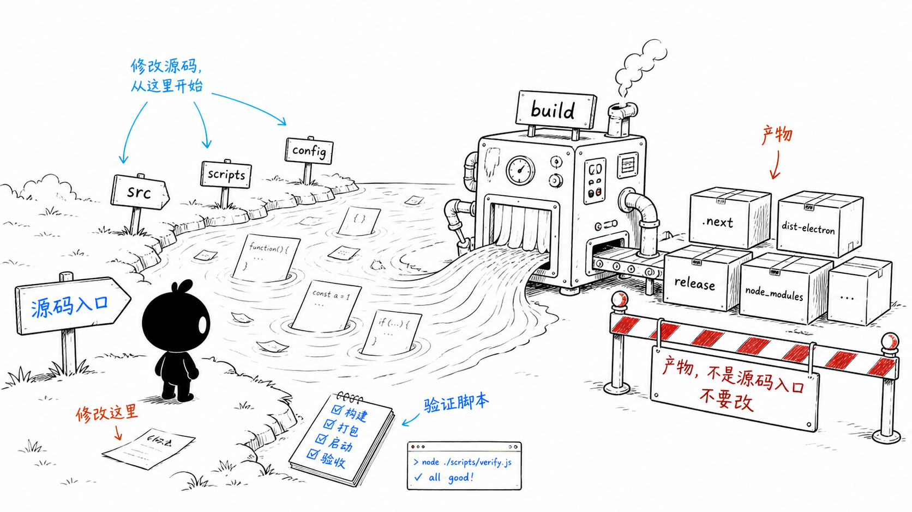
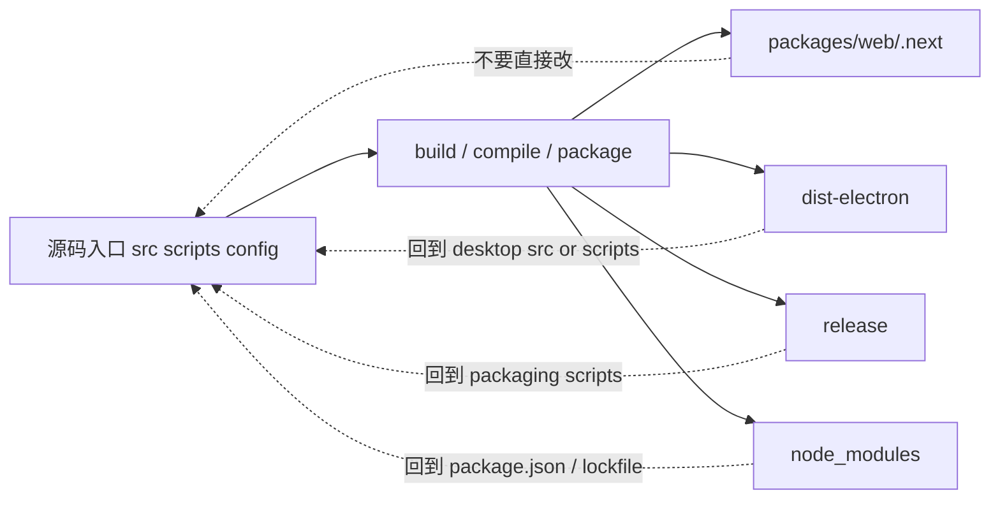
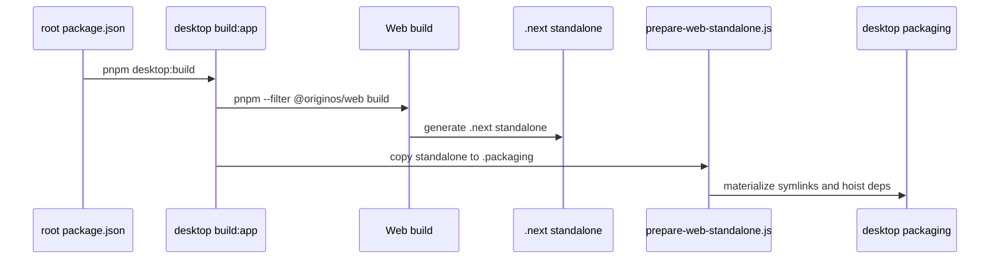
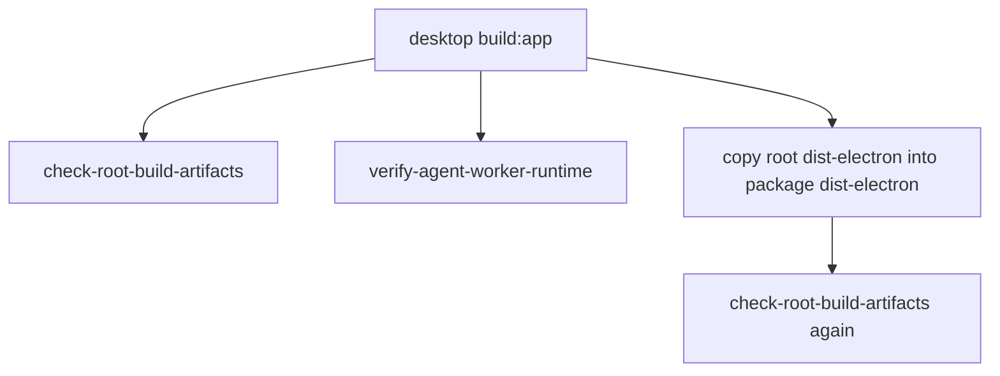

# B6. 构建产物和源码边界

> 类型：源码课  
> 状态：正式课件  
> 本节目标：分清源码入口、运行数据、构建产物、依赖目录。以后遇到 `.next`、`dist-electron`、`node_modules`、`release` 里的问题，第一反应不是直接改产物，而是回到对应源码、配置或构建脚本。

## 问题

这一节解决：

> 哪些目录不能当源码入口？为什么构建产物出了问题，应该改源码或脚本，而不是直接改产物文件？

AGENTS.md 已经明确：编译与运行时产物不是源码入口。这个原则很重要，因为产物会被下一次 build 覆盖。你改产物，等于改了一个会消失的结果，不是改生成结果的原因。

这张图表达的就是：源码从 `src`、`scripts`、`config` 流进 build 机器，产出 `.next`、`dist-electron`、`release`、`node_modules`。产物可以检查、可以删除重建，但不应该作为修复入口。

## 图解

读这张图时要记住一句话：

> 产物可以作为证据，不是修改入口。

## 源码入口

本节精读：

- [.gitignore（第 1 行）](../../../../.gitignore#L1)
- [package.json（第 61 行）](../../../../package.json#L61)
- [package.json（第 65 行）](../../../../package.json#L65)
- [scripts/check-root-build-artifacts.js（第 8 行）](../../../../scripts/check-root-build-artifacts.js#L8)
- [packages/desktop/package.json（第 10 行）](../../../../packages/desktop/package.json#L10)
- [packages/desktop/scripts/prepare-web-standalone.js（第 4 行）](../../../../packages/desktop/scripts/prepare-web-standalone.js#L4)

### `.gitignore` 是边界清单

[.gitignore（第 1 行）](../../../../.gitignore#L1) 到 [.gitignore（第 20 行）](../../../../.gitignore#L20) 把依赖和构建产物列出来：

- `node_modules`
- `dist`
- `dist-electron`
- `.next`
- `coverage`
- `release`
- `.tmp`
- `*.tsbuildinfo`

[.gitignore（第 21 行）](../../../../.gitignore#L21) 到 [.gitignore（第 23 行）](../../../../.gitignore#L23) 还排除了根 `data/`，说明运行时用户数据也不是普通源码。

### 根产物检查

[scripts/check-root-build-artifacts.js（第 8 行）](../../../../scripts/check-root-build-artifacts.js#L8) 定义了禁止出现在 repo root 的构建型文件后缀：

- `.js`
- `.cjs`
- `.mjs`
- `.d.ts`
- `.js.map`
- `.tsbuildinfo`

它只允许 [scripts/check-root-build-artifacts.js（第 18 行）](../../../../scripts/check-root-build-artifacts.js#L18) 的 `postcss.config.mjs` 作为根目录例外。这说明项目很在意“构建产物不要污染根目录”。

## 调用链

### Web build 到 Desktop package

对应源码：

- 根转发： [package.json（第 50 行）](../../../../package.json#L50)
- Desktop build:app： [packages/desktop/package.json（第 10 行）](../../../../packages/desktop/package.json#L10)
- `.next/standalone` source： [packages/desktop/scripts/prepare-web-standalone.js（第 5 行）](../../../../packages/desktop/scripts/prepare-web-standalone.js#L5)
- `.packaging/web-standalone` target： [packages/desktop/scripts/prepare-web-standalone.js（第 6 行）](../../../../packages/desktop/scripts/prepare-web-standalone.js#L6)

### 产物校验链

[packages/desktop/package.json（第 10 行）](../../../../packages/desktop/package.json#L10) 里两次运行 `check-root-build-artifacts`，说明这个项目不只关心“能不能 build”，还关心产物落点是否干净。

## 关键类型

| 概念 | 人话解释 | 源码证据 |
| --- | --- | --- |
| 源码入口 | 应该修改的原因层 | `packages/*/src`、`scripts`、config |
| 构建产物 | build 生成的结果，会被覆盖 | [.gitignore（第 5 行）](../../../../.gitignore#L5) |
| 运行数据 | 用户/开发态运行过程中产生的数据 | [.gitignore（第 21 行）](../../../../.gitignore#L21) |
| root artifact check | 防止编译产物污染根目录 | [scripts/check-root-build-artifacts.js（第 20 行）](../../../../scripts/check-root-build-artifacts.js#L20) |
| standalone copy | 把 Next standalone 复制进 Desktop packaging 区 | [prepare-web-standalone.js（第 16 行）](../../../../packages/desktop/scripts/prepare-web-standalone.js#L16) |

## 测试入口

构建边界的验证主要是脚本和打包链：

- 根产物检查命令： [package.json（第 61 行）](../../../../package.json#L61)
- 清理命令： [package.json（第 65 行）](../../../../package.json#L65)
- Desktop build:app： [packages/desktop/package.json（第 10 行）](../../../../packages/desktop/package.json#L10)
- Desktop package verify： [packages/desktop/package.json（第 19 行）](../../../../packages/desktop/package.json#L19)
- Runtime package verify： [packages/desktop/package.json（第 20 行）](../../../../packages/desktop/package.json#L20)
- Runtime verify 测试： [packages/desktop/scripts/__tests__/verify-pi-task-runtime-package.test.mjs（第 1 行）](../../../../packages/desktop/scripts/__tests__/verify-pi-task-runtime-package.test.mjs#L1)

## 逐行精读

本节重点精读 `.gitignore`、根产物检查、Desktop build:app、standalone 复制脚本。

### .gitignore 第 1-23 行

[.gitignore（第 1 行）](../../../../.gitignore#L1) 到 [.gitignore（第 23 行）](../../../../.gitignore#L23) 分成三类：

- 依赖：`node_modules`
- 构建输出：`dist`、`dist-electron`、`.next`、`coverage`、`release`、`.tmp`
- 运行数据：`/data`

这三类都不该当普通源码提交。区别是：依赖来自安装，构建输出来自 build，运行数据来自用户或开发态运行。

### check-root-build-artifacts 第 8-18 行

[scripts/check-root-build-artifacts.js（第 8 行）](../../../../scripts/check-root-build-artifacts.js#L8) 到 [scripts/check-root-build-artifacts.js（第 18 行）](../../../../scripts/check-root-build-artifacts.js#L18) 定义了“根目录不应该出现什么”。它不是全仓库清理器，只检查 repo root 的文件：

- 禁止根目录 `.js`、`.cjs`、`.mjs`；
- 禁止根目录 `.d.ts`、`.map`；
- 禁止根目录 `.tsbuildinfo`；
- 允许 `postcss.config.mjs` 作为例外。

所以它的职责很窄，但很关键：防止错误 tsconfig 或 build 脚本把产物吐到根目录。

### Desktop build:app 第 10 行

[packages/desktop/package.json（第 10 行）](../../../../packages/desktop/package.json#L10) 是一条压缩在一行里的构建流水线。拆开看大概是：

1. 删除旧 Web `.next` 和根 `dist-electron`；
2. build `@originos/pi-agent-adapter`；
3. build `@originos/web`；
4. 运行 `prepare-web-standalone.js`；
5. 运行 `prepare-pi-ai-runtime-deps.js`；
6. build Desktop TypeScript；
7. 运行根产物检查；
8. 运行 agent worker runtime 验证；
9. 复制根 `dist-electron` 到 desktop 包内；
10. 再运行一次根产物检查。

这条链路说明 Desktop build 不是“编译 Electron 一件事”，而是 Web、Agent adapter、runtime deps、Desktop main、产物边界的组合。

### prepare-web-standalone 第 4-22 行和第 147-172 行

[packages/desktop/scripts/prepare-web-standalone.js（第 4 行）](../../../../packages/desktop/scripts/prepare-web-standalone.js#L4) 到 [packages/desktop/scripts/prepare-web-standalone.js（第 6 行）](../../../../packages/desktop/scripts/prepare-web-standalone.js#L6) 定义：

- source：`packages/web/.next/standalone`
- target：`packages/desktop/.packaging/web-standalone`

[packages/desktop/scripts/prepare-web-standalone.js（第 147 行）](../../../../packages/desktop/scripts/prepare-web-standalone.js#L147) 到 [packages/desktop/scripts/prepare-web-standalone.js（第 172 行）](../../../../packages/desktop/scripts/prepare-web-standalone.js#L172) 处理 node_modules、pnpm store、symlink materialize 和必要文件断言。这和 B2 的 hoisted 依赖是连在一起的。

## 常见故障

| 现象 | 可能原因 | 应看入口 |
| --- | --- | --- |
| 根目录多出 `.js` 文件 | build 输出路径错了 | [scripts/check-root-build-artifacts.js（第 20 行）](../../../../scripts/check-root-build-artifacts.js#L20) |
| `.next/standalone` 不存在 | Web build 没生成 standalone 或 build 失败 | [prepare-web-standalone.js（第 5 行）](../../../../packages/desktop/scripts/prepare-web-standalone.js#L5) |
| Desktop 包运行时缺 `next` | standalone node_modules 没补齐 | [prepare-web-standalone.js（第 147 行）](../../../../packages/desktop/scripts/prepare-web-standalone.js#L147) |
| 修改 `.next` 后又丢失 | `.next` 是生成物，被 build 覆盖 | [.gitignore（第 10 行）](../../../../.gitignore#L10) |
| release 包异常 | packaging 脚本或 electron-builder 配置问题 | [packages/desktop/package.json（第 12 行）](../../../../packages/desktop/package.json#L12) |

## 改动场景判断

| 你看到的问题 | 应改哪里 | 不应改哪里 |
| --- | --- | --- |
| 页面构建后显示错误 | Web source 或 Next 配置 | `packages/web/.next` |
| Electron main 启动错误 | `packages/desktop/src/main` 或 build 脚本 | `dist-electron` 产物 |
| 打包缺依赖 | package.json、pnpm workspace、prepare 脚本 | 手动塞 `node_modules` 产物 |
| 根目录产物污染 | tsconfig outDir 或构建脚本 cwd | 直接删除后不查原因 |
| 用户数据格式问题 | storage feature 或 migration 逻辑 | `/data` 样例文件直接当源码修 |

## 源码追问清单

1. `check-root-build-artifacts` 是否应该扩展到 package 根目录？会不会误伤合法配置文件？
2. `prepare-web-standalone` 为什么需要 materialize symlink？这和 pnpm hoisted 有什么关系？
3. Desktop build 为什么要两次检查 root artifacts？
4. `.gitignore` 排除 `/data`，但 AGENTS.md 又规定数据结构，测试样例应该放在哪里更合适？
5. 如果某个 dist 文件不正确，如何从产物反追源码入口？

## 练习

1. 打开 [.gitignore（第 5 行）](../../../../.gitignore#L5) ，列出 5 个构建产物目录或文件模式。
2. 解释为什么不应该直接改 `packages/web/.next`。
3. 打开 [scripts/check-root-build-artifacts.js（第 8 行）](../../../../scripts/check-root-build-artifacts.js#L8) ，说明它禁止哪些根目录文件。
4. 如果 Desktop 包里缺少 Web standalone 文件，应该先看 [packages/desktop/scripts/prepare-web-standalone.js（第 5 行）](../../../../packages/desktop/scripts/prepare-web-standalone.js#L5) 还是直接改 `.packaging`？为什么？

参考答案要点：

- `.next`、`dist`、`dist-electron`、`coverage`、`release`、`.tmp` 都是产物或临时输出；
- `.next` 是 Next build 生成结果，改它会被下一次构建覆盖；
- 根产物检查禁止 `.js`、`.cjs`、`.mjs`、`.d.ts`、map、tsbuildinfo 等根级生成文件；
- standalone 缺失应回到构建脚本和 Web build 输出查原因。

## 验收

学完本节，你需要能做到：

- 能区分源码、运行数据、依赖目录、构建产物；
- 能解释为什么 `.next`、`dist-electron`、`node_modules` 不能作为修复入口；
- 能从 Desktop build 链追到 Web standalone 复制脚本；
- 能用 `check-root-build-artifacts` 理解项目对产物边界的要求。
