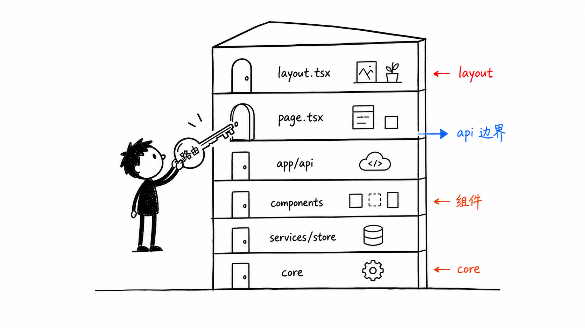
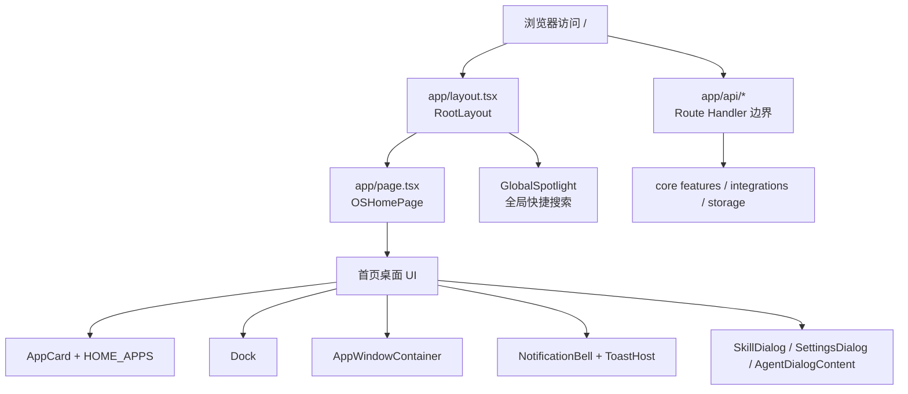
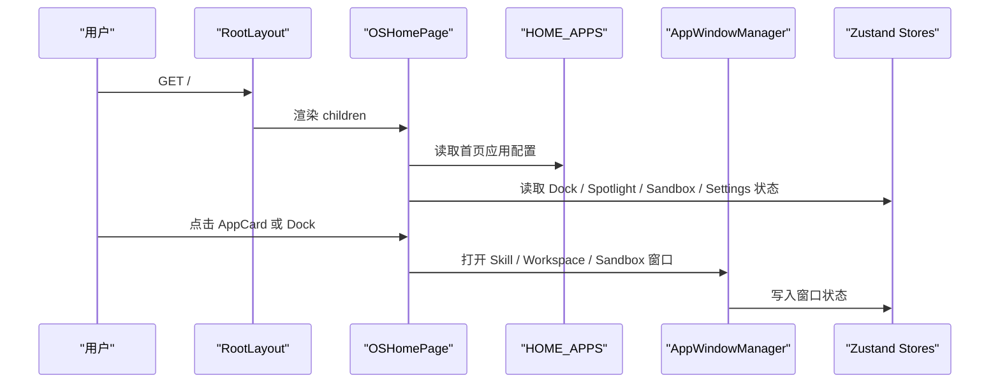

# C1. Next.js App Router 根入口

> 类型：正式源码课  
> 深度：C 部分入口总览  
> 学习目标：看懂 OriginOS Web 应用从 Next.js App Router 进入桌面系统的第一条主线。

## 问题

第一次打开这个项目时，最容易误判的是：以为 `packages/web/src/app/page.tsx` 只是一个普通首页。实际它是 Web 版 OriginOS 的“桌面总装配入口”：根布局提供全局壳，首页页面装配 Dock、窗口系统、通知、技能入口、Agent 对话、项目工作区、Sandbox 等用户第一屏能力。

本节要回答 4 个问题：

- `layout.tsx`、`page.tsx`、`app/api` 分别负责什么？
- 为什么 `page.tsx` 顶部有大量组件和 service import？
- 桌面入口和 Dock 独立路由是什么关系？
- 一个新功能应该放进 `app/`、`components/`、`services/` 还是 `core`？

## 图解

这张图的关键是：`app/` 是入口和边界，不是业务核心。页面入口可以组合组件，API route 可以解析请求并调用下层服务，但规则上不应该把核心业务逻辑写在这里。

## 源码入口

- [根布局导入全局样式和 Spotlight（第 1 行）](../../../../packages/web/src/app/layout.tsx#L1)
- [根布局挂载 `GlobalSpotlight`（第 20 行）](../../../../packages/web/src/app/layout.tsx#L20)
- [首页声明 client component（第 28 行）](../../../../packages/web/src/app/page.tsx#L28)
- [首页导入 Dock、通知、窗口、AppCard、SkillDialog（第 38 行）](../../../../packages/web/src/app/page.tsx#L38)
- [首页导入 `HOME_APPS` 配置（第 51 行）](../../../../packages/web/src/app/page.tsx#L51)
- [首页主组件 `OSHomePage`（第 474 行）](../../../../packages/web/src/app/page.tsx#L474)
- [桌面独立路由渲染 `Desktop`（第 9 行）](../../../../packages/web/src/app/desktop/page.tsx#L9)
- [Dock 独立路由声明 client component（第 1 行）](../../../../packages/web/src/app/dock/page.tsx#L1)

## 调用链

真实源码里的入口动作包括：

- 页面初始化在 [ `OSHomePage`（第 474 行）](../../../../packages/web/src/app/page.tsx#L474) 开始。
- Dock 事件统一进入 [ `handleDockAction`（第 618 行）](../../../../packages/web/src/app/page.tsx#L618)。
- Skill 启动集中在 [ `handleSkillLaunch`（第 845 行）](../../../../packages/web/src/app/page.tsx#L845)。
- 首页 AppCard 点击 Skill 时最终走到 [AppCard launch skill 分支（第 1438 行）](../../../../packages/web/src/app/page.tsx#L1438)。
- 页面末尾挂载 Dock 和窗口容器，分别在 [Dock 渲染（第 1566 行）](../../../../packages/web/src/app/page.tsx#L1566) 和 [AppWindowContainer 渲染（第 1569 行）](../../../../packages/web/src/app/page.tsx#L1569)。

## 关键类型

- `OSHomePage`：不是静态首页，而是系统级组合根组件。它把用户入口、窗口管理、Dock 通信、Electron fallback、通知激活都串起来。
- `DockActionDetail`：定义 Dock 传回主页面的动作形态，入口在 [第 98 行](../../../../packages/web/src/app/page.tsx#L98)。它让 Dock 不直接知道业务实现，只发 action。
- `ProjectCardProps`：项目卡片渲染数据，入口在 [第 75 行](../../../../packages/web/src/app/page.tsx#L75)。它属于页面展示适配，不是 core 项目实体。
- `HomeAppConfig`：首页应用配置类型，入口在 [第 10 行](../../../../packages/web/src/config/homeApps.ts#L10)。它是配置驱动首页的关键类型。

## 测试入口

- [Spotlight store 测试（第 6 行）](../../../../packages/web/src/store/__tests__/spotlightStore.test.ts#L6)
- [AgentHost 组件测试（第 10 行）](../../../../packages/web/src/components/os/agent-host/__tests__/AgentHost.test.tsx#L10)
- [core 包 Vitest 配置（第 1 行）](../../../../packages/core/vitest.config.ts#L1)

这里有一个测试缺口：`OSHomePage` 本身承担大量集成行为，但没有一个等价的页面级集成测试覆盖“AppCard -> WindowManager -> Dock/窗口状态”的完整路径。后面如果改首页入口，应该补这一类测试或至少做浏览器手工验收。

## 逐行精读

读 `page.tsx` 时不要从第 1 行一直硬啃。新手更应该按职责块读：

1. 先看 [第 28 行](../../../../packages/web/src/app/page.tsx#L28) 的 `'use client'`。它说明首页依赖 hooks、浏览器事件、local state，因此不是 server component。
2. 再看 [第 38 行](../../../../packages/web/src/app/page.tsx#L38) 附近的导入。Dock、Notification、Window、SkillDialog 同时出现，说明这是桌面壳装配层。
3. 看 [第 51 行](../../../../packages/web/src/app/page.tsx#L51) 的 `HOME_APPS`。首页应用不是散落写死在 JSX 中，而是配置驱动。
4. 跳到 [第 618 行](../../../../packages/web/src/app/page.tsx#L618) 的 `handleDockAction`。这是跨窗口/跨组件动作汇入口。
5. 跳到 [第 1566 行](../../../../packages/web/src/app/page.tsx#L1566) 附近看最终渲染。前面所有状态和 handler 最终服务于这些真实 UI 节点。

## 常见故障

- 首页打不开但 API 正常：优先看 `page.tsx` 的 client-side 错误，因为它是 client component。
- Dock 独立窗口点击无反应：看 [Dock 独立路由 bridge（第 79 行）](../../../../packages/web/src/app/dock/page.tsx#L79) 和首页 [Dock action listener（第 712 行）](../../../../packages/web/src/app/page.tsx#L712) 是否仍然匹配。
- 新功能被写进 `app/api` 很厚：这是架构味道。route handler 应该解析参数、调用下层、映射响应，业务逻辑要下沉。

## 改动场景判断

- 只新增首页图标：改 [ `HOME_APPS`（第 27 行）](../../../../packages/web/src/config/homeApps.ts#L27)。
- 点击图标打开一种已有窗口：优先改 [ `handleSkillLaunch`（第 845 行）](../../../../packages/web/src/app/page.tsx#L845) 或 Dock action 分支。
- 新增跨页面全局能力：看是否应该挂在 `layout.tsx`，例如 [ `GlobalSpotlight`（第 20 行）](../../../../packages/web/src/app/layout.tsx#L20)。
- 新增业务处理能力：不要塞到 `page.tsx`，优先找 `packages/core/src/lib/features` 或 `packages/core/src/modules`。

## 源码追问清单

- `page.tsx` 中哪些逻辑只是 UI 编排，哪些已经接近业务逻辑？
- `Dock` 为什么既可以在首页内渲染，也有独立 `/dock` 页面？
- 如果没有 Electron，Dock action 通过什么 fallback 通信？
- 新增一个首页 skill，最少需要改几个文件？

## 练习

1. 从 `HOME_APPS` 找到“工作空间”配置，再追到 `page.tsx` 中打开 `WorkspaceWindow` 的分支。
2. 从 `/dock` 页面找 `dock:action` 事件，再回到首页找它如何被消费。
3. 在纸上画出 `layout.tsx -> page.tsx -> AppWindowContainer -> AppWindow` 的路径。

## 验收

你能不看笔记回答下面问题，就算本节通过：

- `layout.tsx` 和 `page.tsx` 的职责边界是什么？
- 为什么 `page.tsx` 是 client component？
- 点击首页 skill 后，大致经过哪几个函数打开窗口？
- 为什么不能把核心业务逻辑写在 `packages/web/src/app/`？
