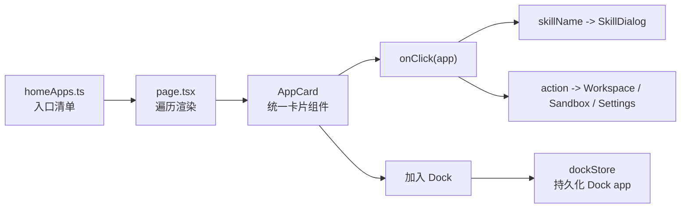
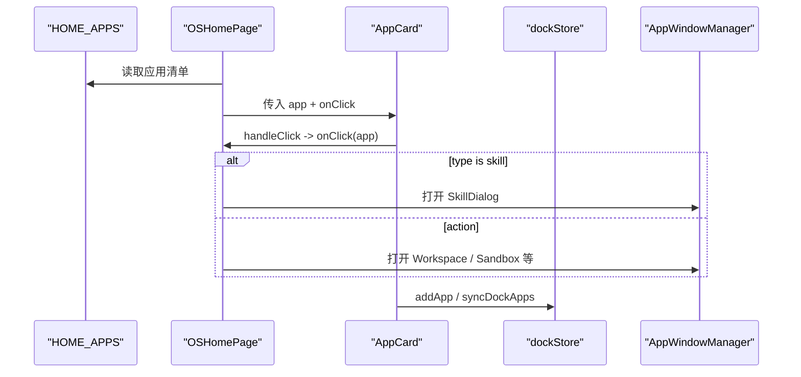

# C2. 首页 AppCard 与配置驱动

> 类型：正式源码课  
> 深度：配置入口、组件入口、动作分发  
> 学习目标：看懂 OriginOS 首页应用是怎样从配置变成可点击系统入口的。

## 问题

OriginOS 首页并不是每个图标写一个组件。它先用 `HOME_APPS` 描述“有哪些入口”，再由 `AppCard` 统一渲染，最后由首页页面判断打开 skill、workspace、sandbox 还是其他 action。

本节要学会：

- `skill` 类型和 `action` 类型入口差在哪里。
- `AppCard` 为什么不直接调用具体业务。
- 首页配置、Dock 配置、系统 app 配置之间是什么关系。
- 改一个入口时应该改配置、组件还是页面 handler。

## 图解

配置驱动的好处是：入口变化可以先从数据结构入手，而不是把多个按钮散落在首页 JSX 中。

## 源码入口

- [首页应用类型 `AppCardType`（第 8 行）](../../../../packages/web/src/config/homeApps.ts#L8)
- [首页应用配置接口 `HomeAppConfig`（第 10 行）](../../../../packages/web/src/config/homeApps.ts#L10)
- [Skill 入口字段 `skillName`（第 17 行）](../../../../packages/web/src/config/homeApps.ts#L17)
- [Action 入口字段 `action`（第 20 行）](../../../../packages/web/src/config/homeApps.ts#L20)
- [首页应用数组 `HOME_APPS`（第 27 行）](../../../../packages/web/src/config/homeApps.ts#L27)
- [AppCard props（第 28 行）](../../../../packages/web/src/components/framework/AppCard.tsx#L28)
- [AppCard 点击处理（第 73 行）](../../../../packages/web/src/components/framework/AppCard.tsx#L73)
- [AppCard 加入 Dock（第 81 行）](../../../../packages/web/src/components/framework/AppCard.tsx#L81)
- [系统应用配置 `SYSTEM_APPS`（第 15 行）](../../../../packages/web/src/config/system-apps.ts#L15)

## 调用链

真实路径要这样追：

- 配置从 [ `HOME_APPS`（第 27 行）](../../../../packages/web/src/config/homeApps.ts#L27) 出发。
- 首页点击 skill 的分支最终关联到 [AppCard launch skill（第 1438 行）](../../../../packages/web/src/app/page.tsx#L1438)。
- Skill 打开逻辑集中在 [ `handleSkillLaunch`（第 845 行）](../../../../packages/web/src/app/page.tsx#L845)。
- `AppCard` 自己只负责调用传入的 [ `onClick`（第 73 行）](../../../../packages/web/src/components/framework/AppCard.tsx#L73)，不应该知道 SkillDialog 的内部实现。
- 加入 Dock 时走 [ `handlePinToDock`（第 81 行）](../../../../packages/web/src/components/framework/AppCard.tsx#L81)。

## 关键类型

- `AppCardType = 'skill' | 'action'`：这是入口行为的最小分类。`skill` 通常进入 Pi Agent 技能会话，`action` 通常触发本地 UI 或系统动作。
- `HomeAppConfig`：描述首页入口，包括 `id`、`title`、`description`、`icon`、`type`、`skillName`、`action` 等字段。
- `AppCardProps`：组件层 props。注意它同时接收 UI 展示字段和行为回调，但不承载业务决策。
- `SystemAppConfig`：系统应用配置，给 Dock/系统入口使用，不等于首页 `HOME_APPS`。

## 测试入口

目前这个链路缺少专门的 `AppCard -> page handler -> WindowManager` 自动化测试。可以参考已有状态测试：

- [Spotlight store 测试（第 12 行）](../../../../packages/web/src/store/__tests__/spotlightStore.test.ts#L12)
- [AgentHost 组件测试 describe（第 42 行）](../../../../packages/web/src/components/os/agent-host/__tests__/AgentHost.test.tsx#L42)

如果要补测试，建议新增 `AppCard` 组件测试：传入一个假的 `onClick`，点击卡片后断言回调收到同一个 app 配置；Dock pin 则 mock `useDockStore`。

## 逐行精读

1. [第 8 行](../../../../packages/web/src/config/homeApps.ts#L8) 先定入口类型，说明首页行为只有两大类。
2. [第 17 行](../../../../packages/web/src/config/homeApps.ts#L17) 的 `skillName` 是 skill 文件加载和 SkillDialog 会话的桥。
3. [第 20 行](../../../../packages/web/src/config/homeApps.ts#L20) 的 `action` 是本地动作分发 key，不是函数本身。
4. [第 73 行](../../../../packages/web/src/components/framework/AppCard.tsx#L73) 只调用外部传入回调，保持组件通用。
5. [第 94 行](../../../../packages/web/src/components/framework/AppCard.tsx#L94) 附近同步 Dock apps，说明 AppCard 还有“固定到 Dock”的系统交互能力。

## 常见故障

- 新增入口显示了但点不开：检查 `type`、`skillName` 或 `action` 是否和 `page.tsx` 分支匹配。
- 加入 Dock 后图标重复：看 [Dock 去重身份函数（第 99 行）](../../../../packages/web/src/store/dockStore.ts#L99) 和 [去重函数（第 103 行）](../../../../packages/web/src/store/dockStore.ts#L103)。
- 入口配置越来越复杂：说明可能需要提取更清晰的 entry 类型，而不是在 `action` 字符串里继续堆特殊含义。

## 改动场景判断

- 只改首页文案、图标、顺序：改 [ `HOME_APPS`（第 27 行）](../../../../packages/web/src/config/homeApps.ts#L27)。
- 改卡片视觉样式：改 [ `AppCard` 组件（第 53 行）](../../../../packages/web/src/components/framework/AppCard.tsx#L53)。
- 新增一种本地动作：改首页 [点击分发逻辑（第 1438 行）](../../../../packages/web/src/app/page.tsx#L1438) 附近。
- 新增系统 app，不一定展示在首页：看 [ `SYSTEM_APPS`（第 15 行）](../../../../packages/web/src/config/system-apps.ts#L15)。

## 源码追问清单

- `skillName` 与 `.claude/skills` 或技能服务之间在哪里接上？
- 为什么 `AppCard` 不直接 import `SkillDialog`？
- `action` 字符串是否已经承担太多隐式约定？
- 固定到 Dock 的身份应该按 `id`、`path`、`skillName` 还是组合键？

## 练习

1. 找到 `HOME_APPS` 中 `workspace` 入口，追到首页打开工作区的分支。
2. 给某个 skill 入口画出“配置 -> AppCard -> handleSkillLaunch -> SkillDialog”的图。
3. 设计一个新的 `action: 'open-settings'`，写出你会改哪几个文件，不实际改代码。

## 验收

你通过本节的标准：

- 能解释 `skill` 和 `action` 的区别。
- 能说清 `AppCard` 为什么只做展示和事件上抛。
- 能定位首页入口、卡片组件、Dock 持久化三处源码。
- 能判断新增入口时不应该把业务逻辑写进 `AppCard`。
