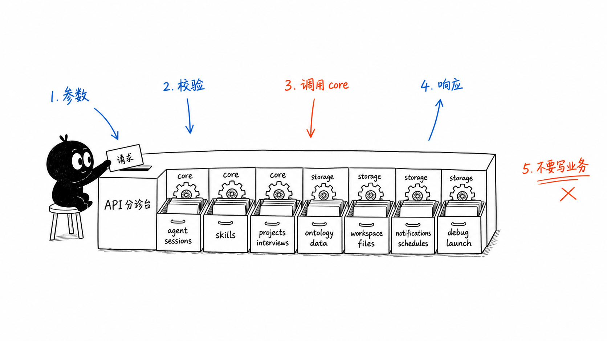
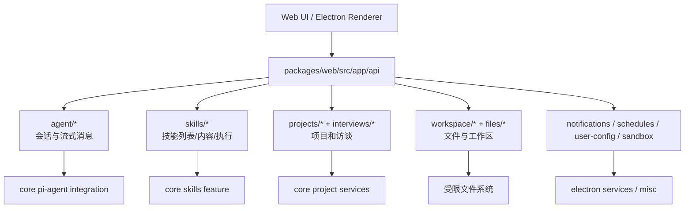
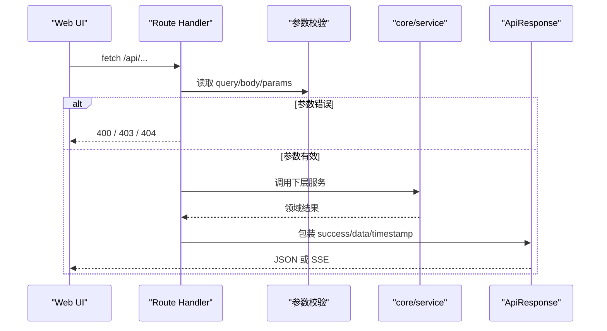

# C3. Web API Routes 总览

> 类型：正式源码课  
> 深度：App Router Route Handler 边界  
> 学习目标：建立 `packages/web/src/app/api` 的地图，知道每类 API 该追到哪里。

## 问题

`packages/web/src/app/api` 目录很容易让新手误以为“这里就是后端”。在 OriginOS 的架构规约里，它更准确地说是 Web 运行时的 API 边界：接收 HTTP 请求、解析参数、调用 core/service、把结果映射为 `ApiResponse`。

本节先建立地图，不钻进每个 route 的所有细节。

## 图解

关键心智模型：route handler 是“门卫 + 翻译员”，不是“业务大脑”。

## 源码入口

- [Agent session 列表/创建 route（第 14 行）](../../../../packages/web/src/app/api/agent/sessions/route.ts#L14)
- [Agent message 流式 route（第 51 行）](../../../../packages/web/src/app/api/agent/sessions/[sessionId]/messages/route.ts#L51)
- [Skills 列表 route（第 33 行）](../../../../packages/web/src/app/api/skills/route.ts#L33)
- [Skill 内容 route（第 39 行）](../../../../packages/web/src/app/api/skills/[name]/content/route.ts#L39)
- [Projects 列表 route（第 30 行）](../../../../packages/web/src/app/api/projects/route.ts#L30)
- [Projects 创建 route（第 94 行）](../../../../packages/web/src/app/api/projects/route.ts#L94)
- [Workspace resolve route（第 46 行）](../../../../packages/web/src/app/api/workspace/resolve/route.ts#L46)
- [Workspace upload route（第 137 行）](../../../../packages/web/src/app/api/workspace/upload/route.ts#L137)

## 调用链

你可以用这个模板去读大部分 route：

- import 区域看它依赖哪个下层模块。
- `GET/POST/PUT/PATCH/DELETE` 函数看请求入口。
- 前半段通常是参数解析和校验。
- 中段通常是下层服务调用。
- 后半段通常是 `NextResponse.json<ApiResponse<...>>`。

## 关键类型

- `NextRequest`：Next.js Route Handler 的请求对象，常用于读 `nextUrl.searchParams`、`headers`、`json()`、`formData()`。
- `NextResponse`：统一返回 JSON、状态码或普通响应。
- `ApiResponse<T>`：OriginOS API 响应外壳，常见字段是 `success`、`data`、`error`、`timestamp`。
- 动态路由参数：例如 `[sessionId]`、`[name]`、`[...filePath]`，它们不是普通目录名，而是 Next App Router 的参数约定。

## 测试入口

当前 API route 自动化测试覆盖并不完整。已有测试主要在 store、组件和 core 层：

- [Spotlight store 测试（第 6 行）](../../../../packages/web/src/store/__tests__/spotlightStore.test.ts#L6)
- [AgentHost 测试（第 42 行）](../../../../packages/web/src/components/os/agent-host/__tests__/AgentHost.test.tsx#L42)
- [core Vitest 配置（第 1 行）](../../../../packages/core/vitest.config.ts#L1)

如果给 API route 补测试，优先从“参数错误返回 400/403”和“成功时调用 service 并包装 `ApiResponse`”开始。

## 逐行精读

以 `skills/route.ts` 为例：

1. [第 7 行](../../../../packages/web/src/app/api/skills/route.ts#L7) 直接从 core feature 导入 `listSkills`，说明技能扫描逻辑不在 route 内。
2. [第 33 行](../../../../packages/web/src/app/api/skills/route.ts#L33) 定义 `GET`，这就是 HTTP 入口。
3. [第 35 行](../../../../packages/web/src/app/api/skills/route.ts#L35) 解析 query。
4. [第 37 行](../../../../packages/web/src/app/api/skills/route.ts#L37) 调用下层技能服务。
5. [第 43 行](../../../../packages/web/src/app/api/skills/route.ts#L43) 包装成 `ApiResponse` 返回。

这个模式会在项目、会话、通知、工作区等 route 里反复出现。

## 常见故障

- API 返回 500：先看 route catch 中打印的 error，再追 import 的 service。
- 动态路由文件在 shell 命令里打不开：路径包含 `[]` 时要加引号，例如 `'packages/web/src/app/api/skills/[name]/content/route.ts'`。
- route 里出现大量文件写入/业务计算：可能违反 `app/api` 只做边界的规约，需要考虑下沉。

## 改动场景判断

- 新增 UI fetch 的参数：route 可以改参数解析，但核心行为应改下层 service。
- 新增业务能力：优先在 `packages/core/src/lib/features` 或 `packages/core/src/modules` 建实现，再加 API route。
- 新增文件访问能力：必须先审查 `workspace-paths`、allowed base、path traversal 防护。
- 新增流式能力：参考 agent message route 的 SSE，而不是随便返回 chunk。

## 源码追问清单

- 这个 route 的 import 指向 core、web service 还是 Node fs？
- 参数校验是否足够早？
- 错误状态码能区分 400、403、404、500 吗？
- route 是否把业务逻辑写厚了？

## 练习

1. 找 3 个 route，分别标出“参数解析”“下层调用”“响应包装”。
2. 找一个动态 route，解释目录名里的 `[]` 对应哪个 URL 参数。
3. 选 `workspace/upload`，说出它为什么不能只是简单 `fs.writeFile`。

## 验收

你能做到：

- 看到一个 route 文件能快速判断它属于哪类 API。
- 能解释 route handler 与 core service 的边界。
- 能识别 `ApiResponse` 包装模式。
- 能指出动态路由和 catch-all 路由的路径写法。
