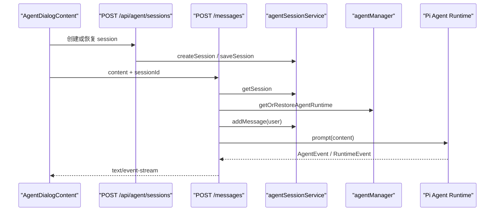
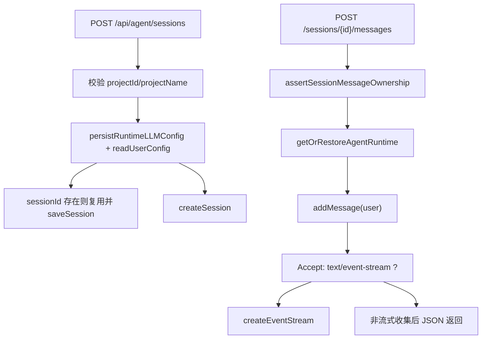

# C4. Agent Session API 与流式消息

> 类型：正式源码课  
> 深度：会话创建、恢复、SSE、消息持久化  
> 学习目标：看懂 Web UI 向 Pi Agent 发送消息时，API route 如何连接 session store 和 agent runtime。

## 问题

OriginOS 的 Agent 对话不是简单“前端发一句，后端回一句”。它至少包含 4 层：

- 会话元数据：`agentSessionService` 保存 session 和 messages。
- Agent runtime：`agentManager` 创建或恢复正在运行的 Pi Agent。
- 消息发送：当前 user message 要先进 session，再 prompt runtime。
- 流式返回：SSE 把 text delta、tool event、final message 推给 UI。

## 图解

## 源码入口

- [Session 列表 `GET`（第 14 行）](../../../../packages/web/src/app/api/agent/sessions/route.ts#L14)
- [Session 创建 `POST`（第 54 行）](../../../../packages/web/src/app/api/agent/sessions/route.ts#L54)
- [运行时 LLM 配置持久化（第 73 行）](../../../../packages/web/src/app/api/agent/sessions/route.ts#L73)
- [agentBaseDir 自动创建（第 102 行）](../../../../packages/web/src/app/api/agent/sessions/route.ts#L102)
- [调用 `createSession`（第 121 行）](../../../../packages/web/src/app/api/agent/sessions/route.ts#L121)
- [消息 route 的 `StreamMessage`（第 29 行）](../../../../packages/web/src/app/api/agent/sessions/[sessionId]/messages/route.ts#L29)
- [消息 `POST` 入口（第 51 行）](../../../../packages/web/src/app/api/agent/sessions/[sessionId]/messages/route.ts#L51)
- [恢复 Agent runtime（第 113 行）](../../../../packages/web/src/app/api/agent/sessions/[sessionId]/messages/route.ts#L113)
- [SSE 分支（第 145 行）](../../../../packages/web/src/app/api/agent/sessions/[sessionId]/messages/route.ts#L145)
- [创建 event stream（第 315 行）](../../../../packages/web/src/app/api/agent/sessions/[sessionId]/messages/route.ts#L315)

## 调用链

## 关键类型

- `StreamMessage`：SSE 推给客户端的事件外壳，类型包括 `user_message`、`assistant_message`、`text_delta`、`tool_start`、`tool_end`、`done`、`error`。
- `AgentMessage`：会话消息实体，来自 core types。
- `RestoreAgentEntryType`：用于校验 session 是否属于当前 entry，防止拿别的 agent/session 混用。
- `llmConfigWithMapping`：route 会把用户配置中的 mapping 合并进本次运行配置，入口在 [第 77 行](../../../../packages/web/src/app/api/agent/sessions/route.ts#L77)。

## 测试入口

这一链路缺口较大，建议测试分层：

- session service 的单元测试应放在 core feature 附近。
- route 测试应覆盖 `projectId/projectName` 缺失、`sessionId` 复用、SSE header。
- UI 测试可参考 [AgentHost 测试（第 42 行）](../../../../packages/web/src/components/os/agent-host/__tests__/AgentHost.test.tsx#L42)。

## 逐行精读

### 创建 session

1. [第 56 行](../../../../packages/web/src/app/api/agent/sessions/route.ts#L56) 读取 body。
2. [第 59 行](../../../../packages/web/src/app/api/agent/sessions/route.ts#L59) 校验 `projectId` 和 `projectName`。这说明会话至少绑定一个项目语境。
3. [第 73 行](../../../../packages/web/src/app/api/agent/sessions/route.ts#L73) 持久化运行时 LLM 配置。
4. [第 83 行](../../../../packages/web/src/app/api/agent/sessions/route.ts#L83) 如果传入 `sessionId`，优先复用已有 session。
5. [第 102 行](../../../../packages/web/src/app/api/agent/sessions/route.ts#L102) 创建 `agentBaseDir`，这是为了避免工具 cwd 回退。
6. [第 121 行](../../../../packages/web/src/app/api/agent/sessions/route.ts#L121) 真正进入 core session service。

### 发送消息

1. [第 61 行](../../../../packages/web/src/app/api/agent/sessions/[sessionId]/messages/route.ts#L61) 校验 content。
2. [第 76 行](../../../../packages/web/src/app/api/agent/sessions/[sessionId]/messages/route.ts#L76) 读取 session，不存在直接 404。
3. [第 91 行](../../../../packages/web/src/app/api/agent/sessions/[sessionId]/messages/route.ts#L91) 做 ownership 校验，这是恢复 session 时的安全边界。
4. [第 113 行](../../../../packages/web/src/app/api/agent/sessions/[sessionId]/messages/route.ts#L113) 先恢复 runtime，再追加当前消息，避免重复注入历史。
5. [第 145 行](../../../../packages/web/src/app/api/agent/sessions/[sessionId]/messages/route.ts#L145) 根据 `Accept` 头决定是否 SSE。
6. [第 315 行](../../../../packages/web/src/app/api/agent/sessions/[sessionId]/messages/route.ts#L315) 进入 runtime/in-process 两种 event stream。

## 常见故障

- 前端提示 session not found：看 `sessionId`、`projectId` 是否传一致。
- Agent 工具 cwd 不对：看创建 session 时 `agentBaseDir` 是否传入，以及 [第 102 行](../../../../packages/web/src/app/api/agent/sessions/route.ts#L102) 是否创建目录。
- 流式内容重复：重点看 [stream dedupe import（第 13 行）](../../../../packages/web/src/app/api/agent/sessions/[sessionId]/messages/route.ts#L13) 和 [delta 合并（第 404 行）](../../../../packages/web/src/app/api/agent/sessions/[sessionId]/messages/route.ts#L404)。
- tool event 前端没显示：检查 SSE 的 `tool_start`、`tool_end` 是否发出，以及 UI 是否订阅。

## 改动场景判断

- 改 LLM 配置来源：看 session route 的配置合并逻辑。
- 改消息显示格式：不要只改 UI，要看 message route 的 `sanitizeAgentDisplayContent`。
- 新增 agent entry 类型：要同时检查 launcher、session ownership、UI entryType map。
- 改流式协议：必须同步 UI 解析器、route `StreamMessage`、runtime event mapper。

## 源码追问清单

- 为什么必须先 `getOrRestoreAgentRuntime` 再 `addMessage`？
- `Accept: text/event-stream` 是谁设置的？
- non-streaming 分支为什么仍然要 subscribe agent events？
- session ownership 防的是哪类错误？

## 练习

1. 从 AgentDialogContent 的 `sendMessageStream` 追到 message route。
2. 写出 SSE 返回的 5 种事件类型，并说明哪些是工具相关。
3. 画出“创建 session”和“发送消息”两条链路的区别。

## 验收

你通过本节的标准：

- 能解释 session service 与 agent runtime 的区别。
- 能说清 user message 何时持久化。
- 能定位 SSE 创建入口。
- 能判断流式重复、cwd 错误、session mismatch 应该从哪些源码查。
