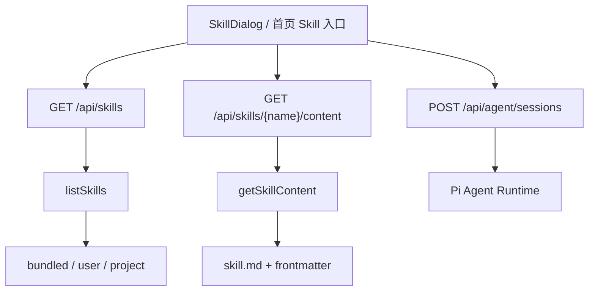
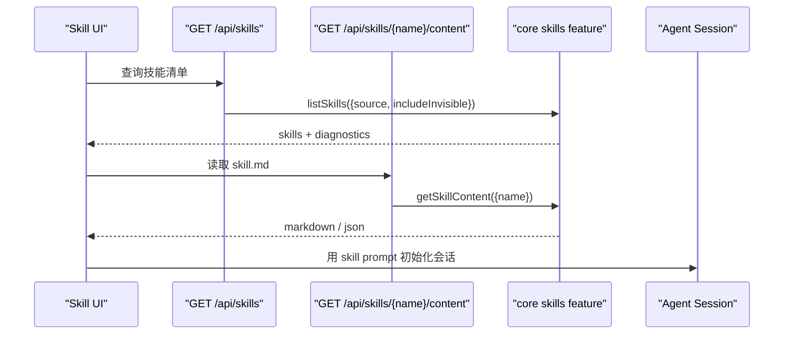

# C5. Skills API：技能列表、内容读取与执行边界

> 类型：正式源码课  
> 深度：技能服务 API 边界  
> 学习目标：看懂 Web 如何发现技能、读取技能内容，并把技能交给 Agent 会话执行。

## 问题

OriginOS 的 Skill 不是一个普通按钮脚本。它有“定义来源”和“运行产物”两个维度：

- 定义来源：bundled、user、project 等技能源。
- 内容读取：按技能名读取 markdown/frontmatter。
- 会话执行：SkillDialog 或 Agent 通过 prompt 和工具去执行。
- 产物目录：运行输出不能写回 `.claude/skills`，应进入 data/skills、data/agents 或项目工作目录。

## 图解

技能 API 的边界是“发现和读取”，真正执行通常会进入 Agent session。

## 源码入口

- [Skills 列表 route import `listSkills`（第 7 行）](../../../../packages/web/src/app/api/skills/route.ts#L7)
- [Skills 列表 `GET`（第 33 行）](../../../../packages/web/src/app/api/skills/route.ts#L33)
- [读取 query 并调用 `listSkills`（第 35 行）](../../../../packages/web/src/app/api/skills/route.ts#L35)
- [Skill 内容 route import `getSkillContent`（第 7 行）](../../../../packages/web/src/app/api/skills/[name]/content/route.ts#L7)
- [Skill 内容 `GET`（第 39 行）](../../../../packages/web/src/app/api/skills/[name]/content/route.ts#L39)
- [读取 raw/json 格式参数（第 47 行）](../../../../packages/web/src/app/api/skills/[name]/content/route.ts#L47)
- [返回 text/markdown raw 内容（第 52 行）](../../../../packages/web/src/app/api/skills/[name]/content/route.ts#L52)
- [Skills refresh route（第 27 行）](../../../../packages/web/src/app/api/skills/refresh/route.ts#L27)
- [Skill execution complete route（第 17 行）](../../../../packages/web/src/app/api/skills/executions/[executionId]/complete/route.ts#L17)

## 调用链

## 关键类型

- `SkillListResponse`：技能列表响应，包含 skills 和 diagnostics。
- `SkillSource`：技能来源过滤条件。
- `SkillContentResponse`：技能内容响应，包含 content 和可选 frontmatter。
- `SkillServiceError`：技能服务错误，route 会把它映射成对应 status，入口在 [第 71 行](../../../../packages/web/src/app/api/skills/[name]/content/route.ts#L71)。

## 测试入口

- [Skills `_test` route（第 16 行）](../../../../packages/web/src/app/api/skills/_test/route.ts#L16)
- [AgentHost 测试（第 42 行）](../../../../packages/web/src/components/os/agent-host/__tests__/AgentHost.test.tsx#L42)

还应该补：`listSkills` 多来源扫描测试、`getSkillContent` raw/json 两种格式测试、不存在 skill 的 404 测试。

## 逐行精读

1. [Skills route 第 19 行](../../../../packages/web/src/app/api/skills/route.ts#L19) 说明支持按 `source` 过滤。
2. [第 20 行](../../../../packages/web/src/app/api/skills/route.ts#L20) 的 `includeInvisible` 说明不是所有技能都默认暴露给模型调用。
3. [第 37 行](../../../../packages/web/src/app/api/skills/route.ts#L37) 调用 `listSkills`，route 自己不扫描目录。
4. [Skill 内容 route 第 23 行](../../../../packages/web/src/app/api/skills/[name]/content/route.ts#L23) 说明 frontmatter 可选。
5. [第 48 行](../../../../packages/web/src/app/api/skills/[name]/content/route.ts#L48) 支持 `raw` 和 `json` 两种返回。
6. [第 53 行](../../../../packages/web/src/app/api/skills/[name]/content/route.ts#L53) raw 模式直接返回 markdown，这适合 Agent 读取技能正文。

## 常见故障

- 技能列表没有某个 skill：看 `source`、`includeInvisible`、diagnostics。
- raw 内容缺 frontmatter：检查是否传 `includeFrontmatter=true`。
- 技能执行写错目录：这不是 list/content route 的问题，要追会话创建时 `agentBaseDir`、`outputDir` 和调用来源。
- 用户 skill 删除后首页还显示：检查用户技能列表、页面刷新和 `deleteUserSkill` 后的状态更新。

## 改动场景判断

- 新增技能来源：改 core skills feature，不只改 API route。
- 改技能读取格式：改 content route 和 core `getSkillContent`。
- 改技能执行完成回调：看 execution complete route。
- 改首页内置 skill：看 [ `HOME_APPS`（第 27 行）](../../../../packages/web/src/config/homeApps.ts#L27) 和 SkillDialog 打开链路。

## 源码追问清单

- 技能“可见”和“可被模型调用”是同一件事吗？
- raw markdown 返回为什么比 JSON 更适合某些 Agent 场景？
- `.claude/skills` 和 `data/skills` 的职责差别是什么？
- diagnostics 应该展示给用户还是只给开发者？

## 练习

1. 打开 `skills/route.ts`，找出 3 个 query 参数。
2. 打开 `skills/[name]/content/route.ts`，解释 raw/json 两种响应。
3. 画出“首页 skill 点击 -> 读取 skill 内容 -> 创建 Agent session”的链路。

## 验收

你能说明：

- Skill API 主要负责发现和读取，不负责全部执行。
- `listSkills` 和 `getSkillContent` 在 core 层。
- raw content 为什么返回 `text/markdown`。
- 技能定义目录和运行产物目录不能混淆。
