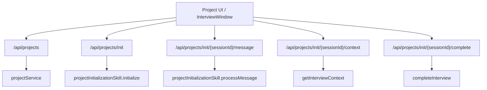
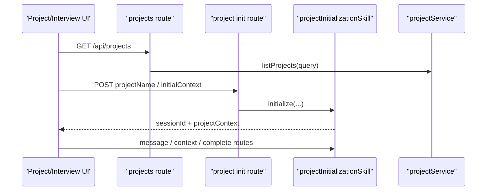

# C6. Projects 与 Project Interview API

> 类型：正式源码课  
> 深度：项目创建、初始化访谈、访谈上下文  
> 学习目标：看懂项目从创建、访谈初始化、消息推进到完成的 API 主线。

## 问题

OriginOS 的项目不只是一个列表项。项目创建和项目访谈是两条相关但不同的线：

- `/api/projects`：项目实体的列表与创建。
- `/api/projects/init`：启动项目初始化 skill session。
- `/api/projects/init/[sessionId]/message`：在访谈中继续对话。
- `/api/projects/init/[sessionId]/complete`：完成访谈并激活项目。
- `/api/interviews`：更传统的访谈 session CRUD 入口。

## 图解

## 源码入口

- [Projects route import `projectService`（第 8 行）](../../../../packages/web/src/app/api/projects/route.ts#L8)
- [Projects `GET`（第 30 行）](../../../../packages/web/src/app/api/projects/route.ts#L30)
- [Projects `POST`（第 94 行）](../../../../packages/web/src/app/api/projects/route.ts#L94)
- [创建项目调用 `projectService.createProject`（第 141 行）](../../../../packages/web/src/app/api/projects/route.ts#L141)
- [Project init route import 初始化 skill（第 9 行）](../../../../packages/web/src/app/api/projects/init/route.ts#L9)
- [Project init `POST`（第 12 行）](../../../../packages/web/src/app/api/projects/init/route.ts#L12)
- [调用 `initialize`（第 39 行）](../../../../packages/web/src/app/api/projects/init/route.ts#L39)
- [访谈消息 route 的 body 类型（第 12 行）](../../../../packages/web/src/app/api/projects/init/[sessionId]/message/route.ts#L12)
- [调用 `processMessage`（第 40 行）](../../../../packages/web/src/app/api/projects/init/[sessionId]/message/route.ts#L40)
- [完成访谈调用 `completeInterview`（第 20 行）](../../../../packages/web/src/app/api/projects/init/[sessionId]/complete/route.ts#L20)
- [读取访谈上下文（第 20 行）](../../../../packages/web/src/app/api/projects/init/[sessionId]/context/route.ts#L20)

## 调用链

## 关键类型

- `CreateProjectRequest`：创建项目的请求体类型，在 [Projects route import（第 9 行）](../../../../packages/web/src/app/api/projects/route.ts#L9) 引入。
- `ProjectListItem`：项目列表项，不等于完整项目所有内部数据。
- `SendMessageBody`：项目初始化消息体，只有 `message: string`，入口在 [第 12 行](../../../../packages/web/src/app/api/projects/init/[sessionId]/message/route.ts#L12)。
- `projectInitializationSkill`：复合技能服务，route 只调用它暴露的方法。

## 测试入口

这一部分应有 3 类测试：

- project service 创建/列表单元测试。
- project init route 参数校验和 service 调用测试。
- 访谈 UI 的集成测试。

当前可参考：

- [AgentHost 测试（第 42 行）](../../../../packages/web/src/components/os/agent-host/__tests__/AgentHost.test.tsx#L42)
- [core Vitest 配置（第 1 行）](../../../../packages/core/vitest.config.ts#L1)

## 逐行精读

1. [Projects route 第 34 行](../../../../packages/web/src/app/api/projects/route.ts#L34) 构造 query，说明列表 API 支持过滤。
2. [第 42 行](../../../../packages/web/src/app/api/projects/route.ts#L42) 调用 `listProjects`，数据访问不在 route 内。
3. [第 99 行](../../../../packages/web/src/app/api/projects/route.ts#L99) 校验 name 类型。
4. [第 127 行](../../../../packages/web/src/app/api/projects/route.ts#L127) 校验 domain，这是创建项目的必需业务字段。
5. [Project init 第 17 行](../../../../packages/web/src/app/api/projects/init/route.ts#L17) 只要求 `projectName`，因为这一步是启动访谈，不是最终完整项目。
6. [第 39 行](../../../../packages/web/src/app/api/projects/init/route.ts#L39) 进入初始化 skill。
7. [Message route 第 40 行](../../../../packages/web/src/app/api/projects/init/[sessionId]/message/route.ts#L40) 把消息推进交给 skill。

## 常见故障

- 创建项目 400：检查 `name` 和 `domain`。
- 初始化访谈成功但项目列表没出现：初始化 session 不等于已创建项目，必须看 complete 步骤。
- 访谈上下文丢失：检查 `sessionId` 是否一致，以及 `getInterviewContext` 返回是否 404。
- UI 卡在访谈中：检查 message route 是否返回 `success: true` 和 response。

## 改动场景判断

- 改项目实体字段：优先改 core types 和 projectService，再改 route 校验。
- 改访谈流程：改 `projectInitializationSkill`，route 不应该塞流程状态机。
- 改访谈 UI 展示：改 `InterviewWindow` 或相关组件。
- 改完成后的本体生成：追 `completeInterview` 下层，不只改 complete route。

## 源码追问清单

- 为什么 project init 只要求 `projectName`，projects POST 要求 `domain`？
- `projectId` 是谁生成或传入的？
- completeInterview 后返回的 `projectEntityId` 用在哪里？
- `/api/interviews` 与 `/api/projects/init` 是替代关系还是并行历史入口？

## 练习

1. 从 `POST /api/projects/init` 追到 `processMessage`。
2. 给项目创建 API 写 3 个失败用例：空 name、空 domain、非字符串 name。
3. 画出“初始化访谈”和“创建项目实体”的区别。

## 验收

你能回答：

- `/api/projects` 和 `/api/projects/init` 的职责差别。
- 访谈消息如何推进。
- complete route 做的事情是什么。
- 修改访谈流程时为什么不应该只改 route。
