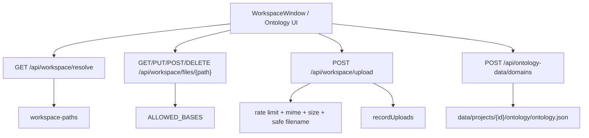
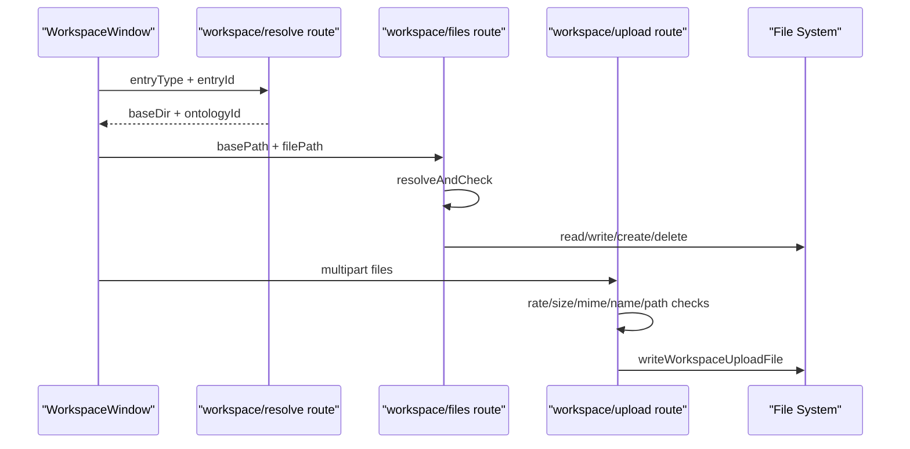

# C7. Ontology 与 Workspace API

> 类型：正式源码课  
> 深度：本体数据、工作区路径、文件读写、上传安全  
> 学习目标：看懂 OriginOS 如何通过 API 管理项目本体和工作区文件，并理解路径安全边界。

## 问题

这一节非常重要，因为它直接接触文件系统。Workspace API 不是普通 CRUD，它必须处理：

- 哪些目录允许访问。
- basePath 如何解析。
- 防止 `../` 路径逃逸。
- 文本文件和图片文件如何返回。
- 上传文件大小、类型、文件名是否合法。
- 上传记录如何写回 Agent 上下文。

## 图解

核心判断：只要一个 route 读写文件，就必须先看路径限制，不要只看业务字段。

## 源码入口

- [Ontology domain 创建 `POST`（第 14 行）](../../../../packages/web/src/app/api/ontology-data/domains/route.ts#L14)
- [Ontology 文件路径拼接（第 32 行）](../../../../packages/web/src/app/api/ontology-data/domains/route.ts#L32)
- [读取 ontology JSON（第 42 行）](../../../../packages/web/src/app/api/ontology-data/domains/route.ts#L42)
- [写回 ontology JSON（第 57 行）](../../../../packages/web/src/app/api/ontology-data/domains/route.ts#L57)
- [Workspace resolve `GET`（第 46 行）](../../../../packages/web/src/app/api/workspace/resolve/route.ts#L46)
- [Workspace files allowed bases（第 34 行）](../../../../packages/web/src/app/api/workspace/files/[...filePath]/route.ts#L34)
- [Workspace files 路径校验（第 40 行）](../../../../packages/web/src/app/api/workspace/files/[...filePath]/route.ts#L40)
- [读取图片转 base64（第 86 行）](../../../../packages/web/src/app/api/workspace/files/[...filePath]/route.ts#L86)
- [保存文件 `PUT`（第 127 行）](../../../../packages/web/src/app/api/workspace/files/[...filePath]/route.ts#L127)
- [上传 allowed bases（第 23 行）](../../../../packages/web/src/app/api/workspace/upload/route.ts#L23)
- [上传 rate limit（第 63 行）](../../../../packages/web/src/app/api/workspace/upload/route.ts#L63)
- [上传 `POST`（第 137 行）](../../../../packages/web/src/app/api/workspace/upload/route.ts#L137)
- [上传记录 `recordUploads`（第 219 行）](../../../../packages/web/src/app/api/workspace/upload/route.ts#L219)

## 调用链

## 关键类型

- `FileContentResponse`：文件内容响应，包含 file 元数据和 content。
- `ProjectFile`：文件树中的文件/目录节点。
- `ApiResponse<T>`：所有 JSON route 的统一响应壳。
- `ALLOWED_BASES`：文件 API 的第一道边界。它限制访问范围，不能绕过。
- `ontologyId`：这里通过 `ontology-` 前缀推回项目 id，入口在 [第 32 行](../../../../packages/web/src/app/api/ontology-data/domains/route.ts#L32)。

## 测试入口

应补但目前不足的测试：

- `resolveAndCheck` 防路径逃逸。
- 图片文件返回 base64 data URL。
- 上传超过 500MB 返回 413。
- unsupported MIME 返回 415。
- `ontologyId` 非法返回 400。

参考入口：

- [core Vitest 配置（第 1 行）](../../../../packages/core/vitest.config.ts#L1)
- [WorkspaceWindow 源码入口（第 38 行）](../../../../packages/web/src/components/os/workspace/WorkspaceWindow.tsx#L38)

## 逐行精读

### Ontology domain route

1. [第 19 行](../../../../packages/web/src/app/api/ontology-data/domains/route.ts#L19) 校验 `ontologyId`，避免任意路径。
2. [第 32 行](../../../../packages/web/src/app/api/ontology-data/domains/route.ts#L32) 从 `ontologyId` 推出 projectId。
3. [第 33 行](../../../../packages/web/src/app/api/ontology-data/domains/route.ts#L33) 拼到 `data/projects/{projectId}/ontology/ontology.json`。
4. [第 42 行](../../../../packages/web/src/app/api/ontology-data/domains/route.ts#L42) 读取 JSON。
5. [第 53 行](../../../../packages/web/src/app/api/ontology-data/domains/route.ts#L53) 确保 domains 数组存在。
6. [第 57 行](../../../../packages/web/src/app/api/ontology-data/domains/route.ts#L57) 写回文件。

### Workspace files route

1. [第 34 行](../../../../packages/web/src/app/api/workspace/files/[...filePath]/route.ts#L34) 定义 allowed bases。
2. [第 40 行](../../../../packages/web/src/app/api/workspace/files/[...filePath]/route.ts#L40) 做路径解析与校验。
3. [第 48 行](../../../../packages/web/src/app/api/workspace/files/[...filePath]/route.ts#L48) 防止 full path 逃出 base。
4. [第 86 行](../../../../packages/web/src/app/api/workspace/files/[...filePath]/route.ts#L86) 图片走二进制读取和 base64。
5. [第 117 行](../../../../packages/web/src/app/api/workspace/files/[...filePath]/route.ts#L117) 文本文件按 UTF-8 读取。
6. [第 136 行](../../../../packages/web/src/app/api/workspace/files/[...filePath]/route.ts#L136) 保存文本内容。

### Upload route

1. [第 23 行](../../../../packages/web/src/app/api/workspace/upload/route.ts#L23) allowed bases 更细，包含 data、skills、tmp。
2. [第 29 行](../../../../packages/web/src/app/api/workspace/upload/route.ts#L29) 限制最大 500MB。
3. [第 63 行](../../../../packages/web/src/app/api/workspace/upload/route.ts#L63) 简单内存限流。
4. [第 156 行](../../../../packages/web/src/app/api/workspace/upload/route.ts#L156) 解析并检查 basePath。
5. [第 187 行](../../../../packages/web/src/app/api/workspace/upload/route.ts#L187) 校验安全文件名。
6. [第 206 行](../../../../packages/web/src/app/api/workspace/upload/route.ts#L206) 调用安全写文件函数。
7. [第 220 行](../../../../packages/web/src/app/api/workspace/upload/route.ts#L220) 上传记录持久化到 agent 上下文。

## 常见故障

- Workspace 文件列表 403：basePath 不在 allowed bases。
- 图片打不开：看扩展名是否在 [IMAGE_EXTENSIONS（第 12 行）](../../../../packages/web/src/app/api/workspace/files/[...filePath]/route.ts#L12)。
- 上传文件被拒：检查文件名、MIME、大小和 rate limit。
- 本体新增 domain 不生效：看 ontology 文件是否存在，以及 `ontologyId` 是否能正确推 projectId。

## 改动场景判断

- 新增允许访问目录：必须审查安全风险，再改 `ALLOWED_BASES`。
- 新增文件类型预览：改 files route 的 MIME/读取逻辑和 Workspace viewer。
- 新增本体字段：改 ontology 数据结构和 UI，不只改 domain route。
- 改上传行为：同步更新 upload route、上传 UI、Agent 上传记录读取逻辑。

## 源码追问清单

- 为什么 `basePath` 不能直接信任前端传值？
- catch-all route `[...filePath]` 如何映射多级路径？
- 图片为什么不直接用 UTF-8 读？
- 上传记录为什么要进入 agent context？

## 练习

1. 解释 `resolveAndCheck(basePath, segments)` 如何防止目录逃逸。
2. 找一个图片文件请求路径，说明 API 返回内容结构。
3. 画出 WorkspaceWindow 从 resolve basePath 到 openFile 的链路。

## 验收

你能做到：

- 明确 Workspace API 的安全边界。
- 能定位文件读、写、创建、删除的源码入口。
- 能解释 upload 的 4 类校验。
- 能说明 ontology domain route 当前是直接读写 JSON 文件。
