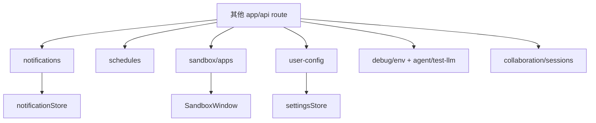
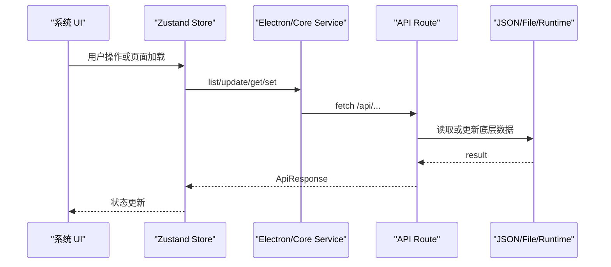

# C8. 其他 API 与调试地图

> 类型：正式源码课  
> 深度：通知、计划任务、沙箱、用户配置、debug route 的排查方式  
> 学习目标：建立非主线 API 的索引，遇到问题能快速定位而不是全局乱搜。

## 问题

除了 Agent、Skills、Projects、Workspace，`app/api` 里还有很多系统能力。它们不一定是课程主线，但真实开发时经常用来排障：

- 通知：通知列表、状态更新、激活目标。
- 计划任务：schedules 创建、运行、删除。
- 沙箱：列出可运行 app、返回静态资源。
- 用户配置：LLM 设置和偏好。
- debug：环境变量、LLM 测试。
- collaboration：协作运行时的人审/会话入口。

## 图解

这节课不是要求背所有 route，而是学会归类和排障。

## 源码入口

- [通知列表 `GET`（第 15 行）](../../../../packages/web/src/app/api/notifications/route.ts#L15)
- [通知创建 `POST`（第 60 行）](../../../../packages/web/src/app/api/notifications/route.ts#L60)
- [单条通知 `GET`（第 15 行）](../../../../packages/web/src/app/api/notifications/[id]/route.ts#L15)
- [单条通知 `PATCH`（第 67 行）](../../../../packages/web/src/app/api/notifications/[id]/route.ts#L67)
- [计划任务列表 `GET`（第 7 行）](../../../../packages/web/src/app/api/schedules/route.ts#L7)
- [计划任务创建 `POST`（第 30 行）](../../../../packages/web/src/app/api/schedules/route.ts#L30)
- [计划任务运行 `POST`（第 7 行）](../../../../packages/web/src/app/api/schedules/[id]/run/route.ts#L7)
- [用户配置 `GET`（第 4 行）](../../../../packages/web/src/app/api/user-config/route.ts#L4)
- [用户配置 `POST`（第 16 行）](../../../../packages/web/src/app/api/user-config/route.ts#L16)
- [debug env `GET`（第 10 行）](../../../../packages/web/src/app/api/debug/env/route.ts#L10)
- [LLM test route `GET`（第 232 行）](../../../../packages/web/src/app/api/agent/test-llm/route.ts#L232)
- [Sandbox apps `GET`（第 21 行）](../../../../packages/web/src/app/api/sandbox/apps/route.ts#L21)
- [Sandbox 静态资源 catch-all（第 37 行）](../../../../packages/web/src/app/api/sandbox/apps/[...appPath]/route.ts#L37)

## 调用链

## 关键类型

- `Notification`：Web store 里的通知展示模型，入口在 [notificationStore 第 8 行](../../../../packages/web/src/store/notificationStore.ts#L8)。
- `ScheduledTask` / `ScheduledTaskRun`：计划任务相关类型，route 从 core types 引入。
- `LLMSettings`：设置面板和 user-config API 之间的关键类型，入口在 [settingsStore 第 19 行](../../../../packages/web/src/store/settingsStore.ts#L19)。
- `SandboxAppInfo`：沙箱 app 列表返回的数据结构，入口可从 [sandbox apps route（第 21 行）](../../../../packages/web/src/app/api/sandbox/apps/route.ts#L21) 向下追。

## 测试入口

- [Spotlight store 测试（第 6 行）](../../../../packages/web/src/store/__tests__/spotlightStore.test.ts#L6)
- [Spotlight 组件测试（第 9 行）](../../../../packages/web/src/components/os/spotlight/__tests__/Spotlight.test.tsx#L9)

缺口：通知 store、settings store、schedules route、sandbox route 都值得补测试，尤其是状态更新和错误码。

## 逐行精读

### 通知

1. [notificationStore 第 33 行](../../../../packages/web/src/store/notificationStore.ts#L33) 创建 Zustand store。
2. [第 38 行](../../../../packages/web/src/store/notificationStore.ts#L38) 拉取通知。
3. [第 49 行](../../../../packages/web/src/store/notificationStore.ts#L49) 用 `pending` 计算未读数。
4. [第 63 行](../../../../packages/web/src/store/notificationStore.ts#L63) dismiss 时调用服务更新状态。

### 设置

1. [settingsStore 第 29 行](../../../../packages/web/src/store/settingsStore.ts#L29) 判断 provider 是否可用。
2. [第 79 行](../../../../packages/web/src/store/settingsStore.ts#L79) 统一 normalize 设置。
3. [第 188 行](../../../../packages/web/src/store/settingsStore.ts#L188) 持久化到服务端配置。
4. [第 255 行](../../../../packages/web/src/store/settingsStore.ts#L255) 计算当前有效配置，Agent 初始化会读取它。

### 沙箱

1. [Sandbox apps route 第 21 行](../../../../packages/web/src/app/api/sandbox/apps/route.ts#L21) 列出 sandbox app。
2. [catch-all route 第 37 行](../../../../packages/web/src/app/api/sandbox/apps/[...appPath]/route.ts#L37) 按路径返回资源。

## 常见故障

- 通知角标不更新：先查 `notificationStore.fetchNotifications` 和 unreadCount 计算。
- 设置保存了但 Agent 没用：查 `settingsStore.getEffectiveConfig` 和 Agent 初始化时的配置传入。
- Sandbox 打不开：查 `/api/sandbox/apps` 是否列出 app，再查 catch-all 静态资源 route。
- Debug route 泄漏风险：debug API 不应该暴露敏感 token；看返回字段是否经过筛选。

## 改动场景判断

- 改通知 UI：优先改 notification components 和 store，不直接改 route。
- 改通知持久化：追 core/electron misc service。
- 改 LLM 设置：settings store、user-config route、core user-config 要一起看。
- 改 sandbox 文件服务：必须审查路径和 MIME，不要直接放开任意文件读取。

## 源码追问清单

- 某个系统 API 是 UI 直接 fetch，还是通过 service/store 调用？
- 它的数据最后存在哪里？
- 错误码是否足够指导 UI 展示？
- route 是否可能暴露本地敏感路径或密钥？

## 练习

1. 从 `NotificationBell` 追到 `notificationStore.fetchNotifications`，再追到 notifications API。
2. 从 SettingsDialog 保存配置追到 `user-config` route。
3. 从打开 Sandbox app 追到静态资源 catch-all route。

## 验收

你能做到：

- 遇到非主线 API 问题，先归类再定位。
- 能说清通知、设置、沙箱各自的 route 和 store 入口。
- 能识别 debug/user-config 这类 API 的安全敏感点。
- 能为某个系统 API 写出最小排查路径。
