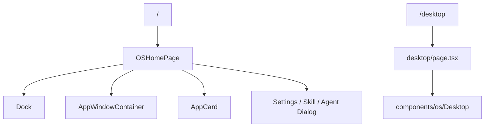
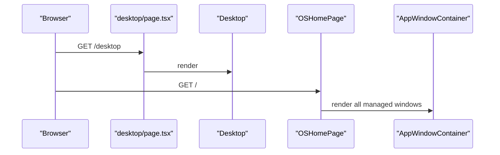
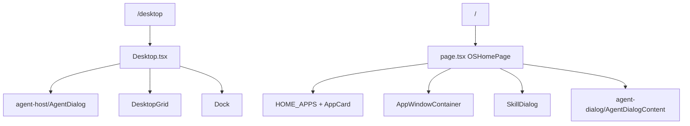

# D1. 桌面页面和 Shell

> 类型：正式源码课  
> 深度：桌面壳入口  
> 学习目标：看懂 Web 页面如何表现成一个“桌面操作系统”的第一层壳。

## 问题

OriginOS 的桌面不是只有 `/` 首页。它还有独立 `/desktop` 页面、Dock 页面、窗口容器和桌面组件。你要区分：

- `/`：主系统首页，装配完整桌面、Dock、窗口、对话框。
- `/desktop`：更纯粹的桌面页面入口。
- `components/os/Desktop.tsx`：桌面视觉和基础交互组件。
- `page.tsx`：系统级编排层。

## 图解

## 源码入口

- [桌面路由声明 client component（第 5 行）](../../../../packages/web/src/app/desktop/page.tsx#L5)
- [桌面路由导入 `Desktop`（第 7 行）](../../../../packages/web/src/app/desktop/page.tsx#L7)
- [桌面路由主组件（第 9 行）](../../../../packages/web/src/app/desktop/page.tsx#L9)
- [桌面路由渲染 `main`（第 11 行）](../../../../packages/web/src/app/desktop/page.tsx#L11)
- [首页主组件 `OSHomePage`（第 474 行）](../../../../packages/web/src/app/page.tsx#L474)
- [首页渲染 Dock（第 1566 行）](../../../../packages/web/src/app/page.tsx#L1566)
- [首页渲染窗口容器（第 1569 行）](../../../../packages/web/src/app/page.tsx#L1569)
- [Desktop 组件入口（第 55 行）](../../../../packages/web/src/components/os/Desktop.tsx#L55)

## 调用链

## 关键类型

- `DesktopPage`：独立桌面页面 wrapper，职责很薄。
- `Desktop`：OS 桌面组件，包含桌面层的视觉和交互。
- `OSHomePage`：完整系统首页，包含更多系统集成。
- `AppWindowContainer`：桌面窗口真实挂载点，后续 D3 深讲。

## 测试入口

- [AgentHost 组件测试（第 42 行）](../../../../packages/web/src/components/os/agent-host/__tests__/AgentHost.test.tsx#L42)
- [Spotlight 组件测试（第 9 行）](../../../../packages/web/src/components/os/spotlight/__tests__/Spotlight.test.tsx#L9)

桌面壳本身缺少页面级截图/交互测试。改 `Desktop` 或首页壳时，建议补 Playwright 级别的“首屏能渲染 Dock 和窗口容器”验收。

## 逐行精读

1. [desktop/page.tsx 第 5 行](../../../../packages/web/src/app/desktop/page.tsx#L5) 是 client component，因为桌面交互依赖浏览器状态。
2. [第 11 行](../../../../packages/web/src/app/desktop/page.tsx#L11) 用满屏 `main` 作为桌面画布。
3. [第 12 行](../../../../packages/web/src/app/desktop/page.tsx#L12) 渲染 `Desktop`，没有把 Dock/WindowManager 都塞进这个独立路由。
4. 对比首页 [第 1566 行](../../../../packages/web/src/app/page.tsx#L1566)，完整系统首页会同时渲染 Dock 和窗口容器。

## 深度拆解

`Desktop` 组件本身其实是一套较早的 OS Shell 组合，它和现在的 `OSHomePage` 有重叠但不完全等价。读它时要特别注意这些层：

- 桌面状态来自 [ `useDesktopStore`（第 7 行）](../../../../packages/web/src/components/os/Desktop.tsx#L7)，Dock 状态来自 [ `useDockStore`（第 8 行）](../../../../packages/web/src/components/os/Desktop.tsx#L8)。这说明桌面图标网格和 Dock 是两个 store。
- 它挂了 [ `Background`、`StatusBar`、`DesktopGrid`、`ContextMenu`（第 9 行）](../../../../packages/web/src/components/os/Desktop.tsx#L9)，这一组更像传统桌面。
- 它还挂了 [ `Dock`、`Spotlight`、`AgentInitializer`（第 13 行）](../../../../packages/web/src/components/os/Desktop.tsx#L13)，说明系统级入口已经进入 Shell。
- [静态 Spotlight items（第 25 行）](../../../../packages/web/src/components/os/Desktop.tsx#L25) 只是本组件内置的基础项；如果你要做完整系统搜索，不能只看这里，还要看 D6 的 Spotlight store 和首页注入。
- [第 70 行](../../../../packages/web/src/components/os/Desktop.tsx#L70) 开始读取 Agent launcher store，这说明旧 Agent 对话框是通过 launcher store 打开的。
- [第 75 行](../../../../packages/web/src/components/os/Desktop.tsx#L75) 的 `handleCloseAgent` 同步关闭 Agent、Dock running 状态和 Agent registry 状态，这是一个跨 store 更新点。
- [第 86 行](../../../../packages/web/src/components/os/Desktop.tsx#L86) 调用 `useSpotlight()`，意味着全局快捷键不是 Spotlight 组件自己 magically 生效，而是 hook 注册。
- [第 176 行](../../../../packages/web/src/components/os/Desktop.tsx#L176) 用 `DndContext` 包住桌面网格，说明桌面图标拖拽和 Dock 图标拖拽是两套 DnD。
- [第 202 行](../../../../packages/web/src/components/os/Desktop.tsx#L202) 渲染 Dock；[第 203 行](../../../../packages/web/src/components/os/Desktop.tsx#L203) 渲染 Spotlight；[第 206 行](../../../../packages/web/src/components/os/Desktop.tsx#L206) 根据 openAgentIds 渲染 AgentDialog。

### 两套入口的关系

结论：`/desktop` 更像 OS 桌面组件演进历史里的一个入口；`/` 才是当前课程 C/D 主线要重点掌握的完整系统入口。

### 新手容易混淆的点

- `Desktop.tsx` 里有 Dock，但它不等于 `OSHomePage`。
- `Desktop.tsx` 里用的是 `agent-host/AgentDialog`，而 D5 主线讲的是 `agent-dialog/AgentDialogContent`。
- `Desktop.tsx` 的 `STATIC_SPOTLIGHT_ITEMS` 不代表整个系统最终 Spotlight 数据来源。
- 桌面图标拖拽和 Dock 拖拽都用了 dnd-kit，但状态和目标不同。

## 常见故障

- `/desktop` 能打开但 `/` 首页报错：问题多半在首页系统集成，而不是 `Desktop` 基础组件。
- `/` 能打开但桌面视觉异常：检查 `components/os/Desktop.tsx` 和全局样式。
- 桌面窗口不显示：看 D3 的 `AppWindowContainer` 和 `appWindowStore`。
- 修改 Agent 对话框却发现 `/desktop` 没变：检查你改的是 `agent-dialog/AgentDialogContent` 还是旧的 `agent-host/AgentDialog`。
- Spotlight 快捷键不生效：看 `useSpotlight()` 是否挂载，而不是只看 Spotlight UI 是否渲染。

## 改动场景判断

- 改桌面背景/基础布局：看 `Desktop`。
- 改系统首页入口：看 `OSHomePage`。
- 改窗口显示：看 `AppWindowContainer` 和 `AppWindow`。
- 改 Dock：看 D2，不要在 `DesktopPage` 里硬加逻辑。

## 源码追问清单

- `/desktop` 和 `/` 是不是同一层职责？
- 为什么 `desktop/page.tsx` 很薄？
- 桌面壳和窗口系统的边界在哪里？
- 一个系统级 UI 应该挂在首页还是 layout？

## 练习

1. 对比 `/desktop` 和 `/` 的源码入口，写出职责差异。
2. 画出 `OSHomePage -> Dock + AppWindowContainer` 的渲染结构。
3. 找 `Desktop.tsx` 里负责背景或图标布局的代码块。

## 验收

你能说明：

- `/desktop` 页面为什么不是完整系统首页。
- 首页最终在哪里挂载 Dock 和窗口容器。
- `DesktopPage`、`Desktop`、`OSHomePage` 三者职责。
