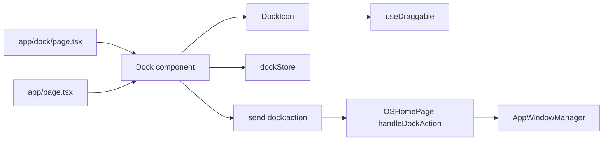
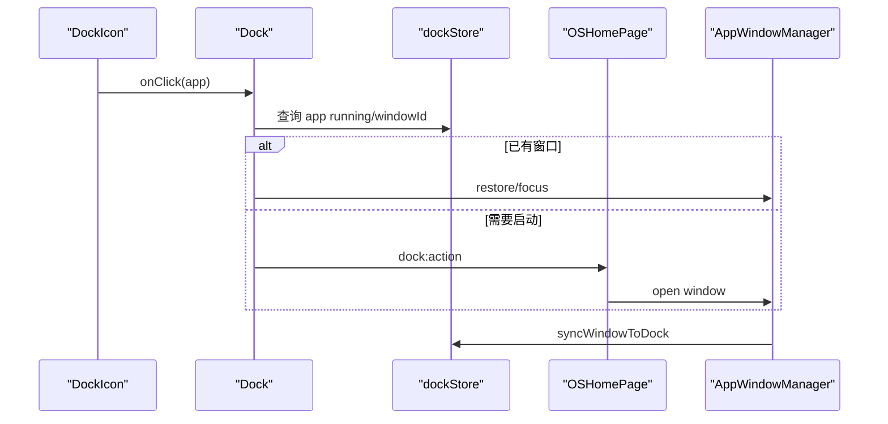
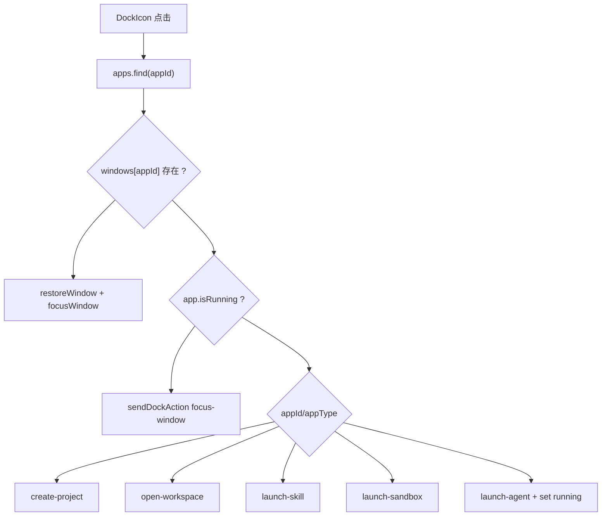

# D2. Dock 系统

> 类型：正式源码课  
> 深度：Dock 路由、Dock 组件、Dock store、跨窗口动作  
> 学习目标：看懂 Dock 如何显示应用、拖拽排序、同步运行状态并把动作发回主窗口。

## 问题

Dock 是 OriginOS 的系统入口栏。它不是单纯 UI 列表，而是连接了：

- `dockStore`：持久化 Dock app、位置、运行状态。
- `Dock` 组件：渲染图标、处理点击和拖拽。
- `/dock` 独立路由：Electron 下可作为单独 Dock 窗口。
- 首页 `handleDockAction`：真正执行打开窗口、恢复窗口、启动 sandbox 等动作。

## 图解

## 源码入口

- [Dock 独立页面入口（第 20 行）](../../../../packages/web/src/app/dock/page.tsx#L20)
- [Dock 独立页面同步 apps（第 37 行）](../../../../packages/web/src/app/dock/page.tsx#L37)
- [Dock 独立页面 action bridge（第 79 行）](../../../../packages/web/src/app/dock/page.tsx#L79)
- [Dock 组件入口（第 21 行）](../../../../packages/web/src/components/os/dock/index.tsx#L21)
- [Dock 同步窗口运行状态（第 44 行）](../../../../packages/web/src/components/os/dock/index.tsx#L44)
- [Dock 图标点击（第 100 行）](../../../../packages/web/src/components/os/dock/index.tsx#L100)
- [DockIcon 拖拽 hook（第 34 行）](../../../../packages/web/src/components/os/dock/DockIcon.tsx#L34)
- [DockIcon 点击处理（第 103 行）](../../../../packages/web/src/components/os/dock/DockIcon.tsx#L103)
- [Dock store 默认 apps（第 11 行）](../../../../packages/web/src/store/dockStore.ts#L11)
- [Dock store persist（第 121 行）](../../../../packages/web/src/store/dockStore.ts#L121)

## 调用链

## 关键类型

- `DockApp`：Dock 中的应用项，包含 id、title、icon、type、path、skillName 等。
- `dockSide`：Dock 方位，持久化在 store 中。
- `getDockAppIdentity`：去重身份函数，入口在 [第 99 行](../../../../packages/web/src/store/dockStore.ts#L99)。
- `dedupeDockApps`：防止重复图标，入口在 [第 103 行](../../../../packages/web/src/store/dockStore.ts#L103)。

## 测试入口

Dock 目前缺少专门组件测试。可以参考 Zustand 测试方式：

- [Spotlight store 测试（第 12 行）](../../../../packages/web/src/store/__tests__/spotlightStore.test.ts#L12)

建议补 `dockStore` 测试：add/remove/move、dedupe、setAppRunning、persist partialize。

## 逐行精读

1. [dockStore 第 11 行](../../../../packages/web/src/store/dockStore.ts#L11) 是默认 Dock 应用。
2. [第 121 行](../../../../packages/web/src/store/dockStore.ts#L121) 用 Zustand persist 创建 store。
3. [第 140 行](../../../../packages/web/src/store/dockStore.ts#L140) `setApps` 是全量同步入口。
4. [Dock 第 44 行](../../../../packages/web/src/components/os/dock/index.tsx#L44) 把窗口状态同步成 Dock running 状态。
5. [第 100 行](../../../../packages/web/src/components/os/dock/index.tsx#L100) 点击图标后判断恢复已有窗口还是发启动动作。
6. [DockIcon 第 140 行](../../../../packages/web/src/components/os/dock/DockIcon.tsx#L140) 支持键盘 Enter/Space，说明不是只有鼠标交互。

## 深度拆解

### Dock 的三种 app 来源

Dock 里出现一个图标，可能来自三种路径：

1. 默认固定入口：来自 [ `DEFAULT_DOCK_APPS`（第 11 行）](../../../../packages/web/src/store/dockStore.ts#L11)，例如创建项目、工作区、创建 Agent、代码沙箱。
2. 用户固定入口：通过 AppCard 或 Dock 菜单进入 `addApp` / `pinApp`，最终持久化。
3. 运行中窗口临时入口：Dock 组件监听窗口 store，在 [第 48 行](../../../../packages/web/src/components/os/dock/index.tsx#L48) 遍历 windows，如果 Dock 里没有就创建临时 app。

这解释了为什么 Dock store 的 persist 不能简单保存所有运行态字段。源码在 [partialize（第 227 行）](../../../../packages/web/src/store/dockStore.ts#L227) 明确只保存 pinned apps 和顺序相关字段，不保存 `isRunning` 这种运行态。

### 点击图标的完整分支

对应真实代码：

- [第 101 行](../../../../packages/web/src/components/os/dock/index.tsx#L101) 进入图标点击。
- [第 106 行](../../../../packages/web/src/components/os/dock/index.tsx#L106) 先判断主窗口 store 是否已有 window。
- [第 109 行](../../../../packages/web/src/components/os/dock/index.tsx#L109) 如果窗口最小化，先 restore。
- [第 118 行](../../../../packages/web/src/components/os/dock/index.tsx#L118) 如果 app 正在运行但本窗口 store 没有，说明可能是 native/跨窗口场景，走 IPC action。
- [第 124 行](../../../../packages/web/src/components/os/dock/index.tsx#L124) 处理创建项目快捷入口。
- [第 134 行](../../../../packages/web/src/components/os/dock/index.tsx#L134) 处理 skill 类型。
- [第 140 行](../../../../packages/web/src/components/os/dock/index.tsx#L140) 处理 sandbox 类型。
- [第 146 行](../../../../packages/web/src/components/os/dock/index.tsx#L146) 处理 Agent 类型并同步 Agent registry。

### 持久化合并为什么复杂

`dockStore` 的 [merge（第 235 行）](../../../../packages/web/src/store/dockStore.ts#L235) 不是简单覆盖本地状态。它会：

- 读取 persisted apps。
- 通过 [ `dedupeDockApps`（第 103 行）](../../../../packages/web/src/store/dockStore.ts#L103) 去重。
- 找出新增版本中缺失的默认 pinned app。
- 合并 persisted 和 missing defaults。

这解决了一个真实产品问题：用户升级后，代码里新增了默认 Dock app，如果直接使用旧 localStorage，用户永远看不到新增默认入口。

## 常见故障

- Dock 图标重复：看 `getDockAppIdentity` 和 `dedupeDockApps`。
- 独立 Dock 点击无反应：看 `/dock` route 的 IPC/BroadcastChannel fallback。
- 运行状态不同步：看 Dock 组件的窗口状态同步 effect。
- 拖拽后顺序丢失：看 `moveApp` 和 persist partialize。
- 升级后默认图标没出现：看 [merge（第 235 行）](../../../../packages/web/src/store/dockStore.ts#L235) 是否保留 missing defaults。
- 关闭窗口后临时 Dock 图标不消失：看 [清理非固定 app（第 73 行）](../../../../packages/web/src/components/os/dock/index.tsx#L73)。

## 改动场景判断

- 改 Dock 视觉：改 Dock/DockIcon/Container。
- 改 Dock 持久化字段：改 dockStore 和迁移逻辑。
- 新增 Dock app 类型：改 Dock 点击分支和首页 action handler。
- 改 Electron 独立 Dock 通信：改 `/dock/page.tsx` 和首页 listener。

## 源码追问清单

- Dock 是谁决定“打开新窗口”还是“恢复旧窗口”？
- 独立 Dock 不能直接调用首页函数，它通过什么通信？
- running 状态是 Dock 自己维护还是窗口系统同步？
- Dock app 的唯一身份怎么定义？

## 练习

1. 从 DockIcon 点击追到 OSHomePage 的 `handleDockAction`。
2. 找 `dockStore` 中 add/remove/move/setAppRunning 的实现。
3. 画出独立 `/dock` 页面和首页之间的动作传递。

## 验收

你能回答：

- Dock store 管什么状态。
- Dock 点击后的两条分支是什么。
- `/dock` 独立页面为什么需要 bridge。
- Dock 和窗口系统如何同步运行状态。
