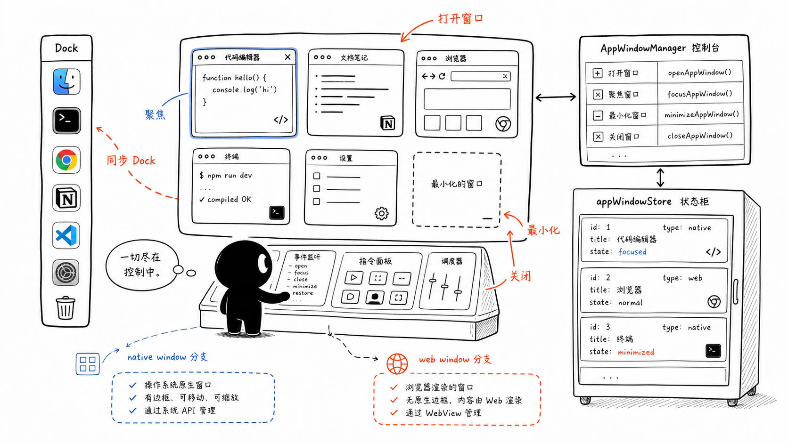
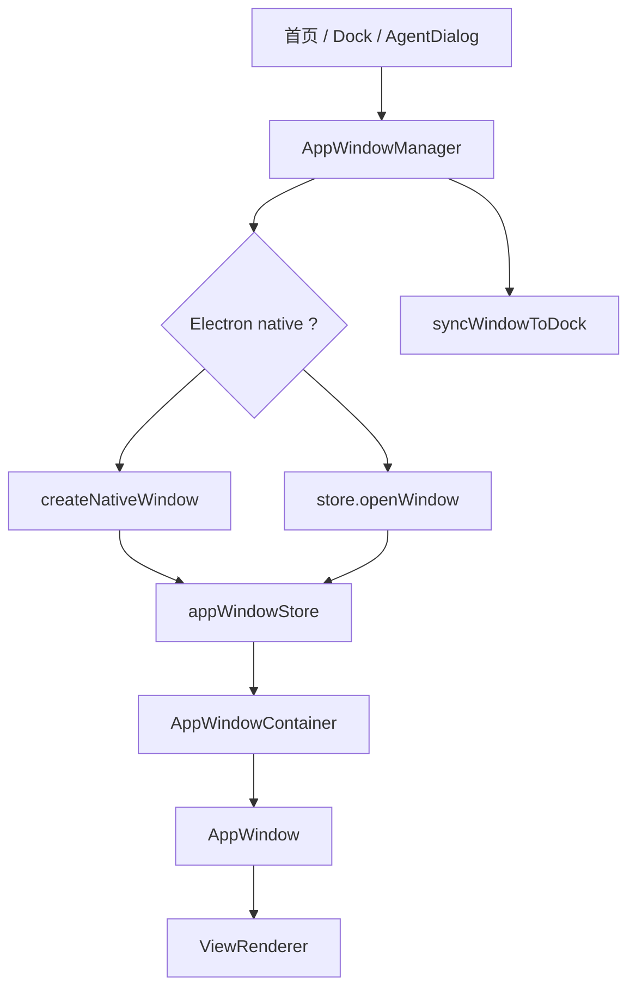
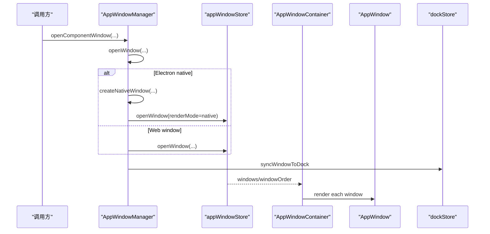
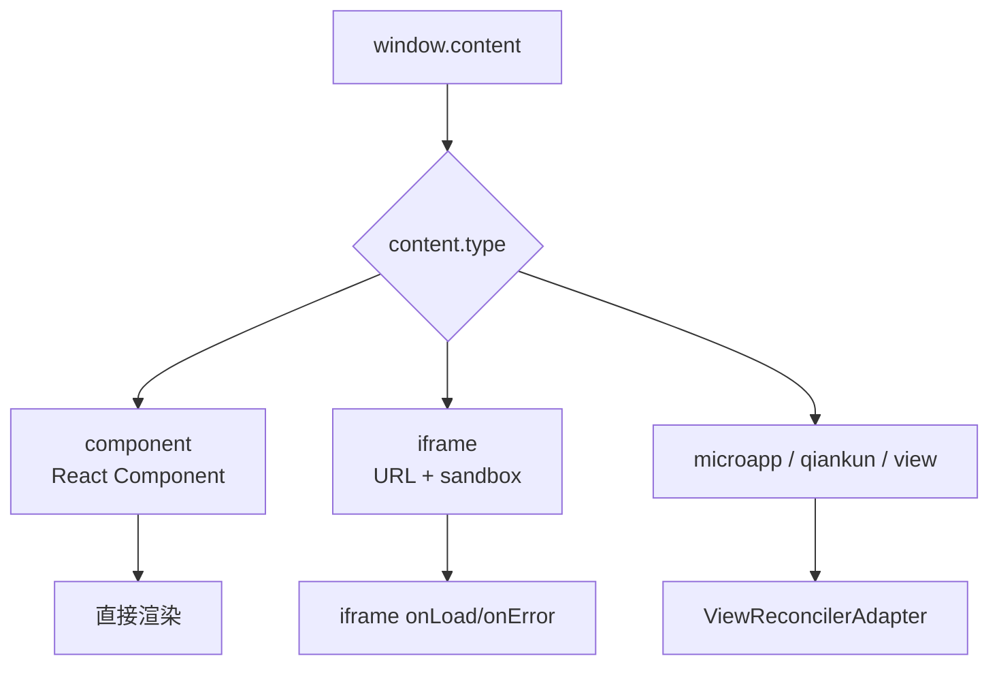

# D3. Window 系统：AppWindowManager、容器与窗口组件

> 类型：正式源码课  
> 深度：窗口打开、native/web 分支、渲染容器  
> 学习目标：看懂 OriginOS 多窗口系统从 service 到 UI 渲染的完整链路。

## 问题

窗口系统是 D 部分最核心的模块之一。它至少分成三层：

- `AppWindowManager`：命令式服务，负责打开/关闭/聚焦/同步 Dock。
- `appWindowStore`：状态容器，保存 windows、activeWindowId、windowOrder。
- `AppWindowContainer` / `AppWindow`：把 store 中的窗口渲染成真实 UI。

## 图解

## 源码入口

- [AppWindowManager 类入口（第 16 行）](../../../../packages/web/src/services/AppWindowManager.ts#L16)
- [单例获取（第 21 行）](../../../../packages/web/src/services/AppWindowManager.ts#L21)
- [打开窗口 `openWindow`（第 31 行）](../../../../packages/web/src/services/AppWindowManager.ts#L31)
- [Electron native 分支（第 56 行）](../../../../packages/web/src/services/AppWindowManager.ts#L56)
- [同步窗口到 Dock（第 144 行）](../../../../packages/web/src/services/AppWindowManager.ts#L144)
- [打开组件窗口（第 245 行）](../../../../packages/web/src/services/AppWindowManager.ts#L245)
- [导出 singleton（第 299 行）](../../../../packages/web/src/services/AppWindowManager.ts#L299)
- [AppWindowContainer 入口（第 15 行）](../../../../packages/web/src/components/os/window/AppWindowContainer.tsx#L15)
- [过滤 native renderMode 窗口（第 23 行）](../../../../packages/web/src/components/os/window/AppWindowContainer.tsx#L23)
- [AppWindow 入口（第 23 行）](../../../../packages/web/src/components/os/window/AppWindow.tsx#L23)
- [窗口定位样式（第 123 行）](../../../../packages/web/src/components/os/window/AppWindow.tsx#L123)
- [ViewRenderer 渲染内容（第 160 行）](../../../../packages/web/src/components/os/window/AppWindow.tsx#L160)

## 调用链

## 关键类型

- `WindowState`：窗口状态模型，包含 id、title、component/view、position、size、zIndex、minimized、maximized 等。
- `renderMode`：区分 web 渲染窗口和 Electron native 窗口。
- `AppWindowManager`：命令式 facade。调用方不应该直接手写 store 状态来打开复杂窗口。
- `ViewRenderer`：根据窗口内容类型渲染 component/iframe/micro app 等视图。

## 测试入口

目前窗口系统缺少系统性测试。建议补：

- `appWindowStore` action 单测。
- `AppWindowManager.openComponentWindow` 与 `syncWindowToDock` mock 测试。
- `AppWindowContainer` 对 native renderMode 的过滤测试。

可参考：

- [Spotlight store 测试（第 12 行）](../../../../packages/web/src/store/__tests__/spotlightStore.test.ts#L12)

## 逐行精读

1. [Manager 第 16 行](../../../../packages/web/src/services/AppWindowManager.ts#L16) 是 class，而不是 hook，因为它作为全局命令服务被多处调用。
2. [第 31 行](../../../../packages/web/src/services/AppWindowManager.ts#L31) 的 `openWindow` 是底层统一入口。
3. [第 56 行](../../../../packages/web/src/services/AppWindowManager.ts#L56) 判断 Electron native 分支，说明同一窗口系统兼容 Web 内嵌和桌面原生窗口。
4. [第 114 行](../../../../packages/web/src/services/AppWindowManager.ts#L114) native 窗口也会写入 store，用于 Dock 状态和系统管理。
5. [Container 第 23 行](../../../../packages/web/src/components/os/window/AppWindowContainer.tsx#L23) Electron 下过滤 native 窗口，避免 Web 中重复渲染。
6. [AppWindow 第 123 行](../../../../packages/web/src/components/os/window/AppWindow.tsx#L123) 通过 fixed + left/top/width/height/zIndex 定位窗口。
7. [第 177 行](../../../../packages/web/src/components/os/window/AppWindow.tsx#L177) createPortal 把窗口挂到 body，避免受父容器布局影响。

## 深度拆解

### `openWindow` 不是简单 setState

`AppWindowManager.openWindow` 做了比 store 更多的事情：

- [第 35 行](../../../../packages/web/src/services/AppWindowManager.ts#L35) 提取 metadata。
- [第 40 行](../../../../packages/web/src/services/AppWindowManager.ts#L40) 对 memory entry 类型做特殊处理。
- [第 43 行](../../../../packages/web/src/services/AppWindowManager.ts#L43) 包装 onClose，关闭窗口时额外清理 Agent session 或 consolidate memory。
- [第 56 行](../../../../packages/web/src/services/AppWindowManager.ts#L56) 判断 native window 分支。
- [第 81 行](../../../../packages/web/src/services/AppWindowManager.ts#L81) 序列化 props 给 native 窗口，因为跨进程不能传 React component。
- [第 111 行](../../../../packages/web/src/services/AppWindowManager.ts#L111) native 窗口创建后同步 Dock。
- [第 121 行](../../../../packages/web/src/services/AppWindowManager.ts#L121) 非 native 才直接进入 store.openWindow。

这就是为什么 D3 一直强调：调用方应优先用 Manager，不要绕过它直接 set store。

### ViewRenderer 决定窗口内容类型

窗口打开后，不是所有内容都按 React component 渲染。`ViewRenderer` 支持多种内容：

- [component 分支（第 177 行）](../../../../packages/web/src/components/os/window/ViewRenderer.tsx#L177)：直接渲染 React component 和 props。
- [iframe 分支（第 190 行）](../../../../packages/web/src/components/os/window/ViewRenderer.tsx#L190)：渲染外部/沙箱 URL。
- [microapp 分支（第 210 行）](../../../../packages/web/src/components/os/window/ViewRenderer.tsx#L210)：通过 view reconciler 管理微应用容器。
- [初始化 view/microapp/qiankun（第 98 行）](../../../../packages/web/src/components/os/window/ViewRenderer.tsx#L98)：这些需要生命周期。
- [destroyView（第 127 行）](../../../../packages/web/src/components/os/window/ViewRenderer.tsx#L127)：卸载时销毁 view，避免残留。

### 拖拽、缩放、控制按钮不是装饰

窗口作为 OS 级 UI，需要真实状态回写：

- [WindowControls 第 20 行](../../../../packages/web/src/components/os/window/WindowControls.tsx#L20) 最小化按钮调用 `onMinimize`。
- [WindowControls 第 33 行](../../../../packages/web/src/components/os/window/WindowControls.tsx#L33) 最大化/还原按钮调用 `onMaximize`。
- [WindowControls 第 48 行](../../../../packages/web/src/components/os/window/WindowControls.tsx#L48) 关闭按钮调用 `onClose`。
- [WindowResizer 第 27 行](../../../../packages/web/src/components/os/window/WindowResizer.tsx#L27) 鼠标按下进入 resize 状态。
- [WindowResizer 第 46 行](../../../../packages/web/src/components/os/window/WindowResizer.tsx#L46) mousemove 计算 delta。
- [WindowResizer 第 53 行](../../../../packages/web/src/components/os/window/WindowResizer.tsx#L53) 按方向计算新 position/size。
- [WindowResizer 第 121 行](../../../../packages/web/src/components/os/window/WindowResizer.tsx#L121) 在 window 上监听 move/up，保证拖出窗口边界也能继续 resize。

## 常见故障

- 调用了打开窗口但没显示：看是否 native renderMode 被过滤，或者 store 中 `minimized` 为 true。
- 窗口在 Dock 里 running 但页面无窗口：可能是 native 窗口分支。
- 窗口层级不对：看 focusWindow 和 zIndex 更新。
- 关闭窗口后 Agent session 未清理：看 Manager 中注入 onClose 的特殊逻辑。
- iframe 窗口空白：看 [iframe onLoad/onError（第 197 行）](../../../../packages/web/src/components/os/window/ViewRenderer.tsx#L197) 和 URL/sandbox。
- 微应用窗口内存泄漏：看 [destroyView（第 127 行）](../../../../packages/web/src/components/os/window/ViewRenderer.tsx#L127) 是否执行。
- 缩放方向反了：看 WindowResizer 中 `w/n/nw` 这类需要同时改 x/y 和 width/height 的分支。

## 改动场景判断

- 新增一种窗口内容类型：看 `ViewRenderer` 和 `open*Window` helper。
- 改窗口生命周期：先改 Manager，再看 store action。
- 改窗口视觉和拖拽：改 `AppWindow`、`WindowControls`、`WindowResizer`。
- 改 Dock 运行态同步：改 `syncWindowToDock`。

## 源码追问清单

- 为什么不让每个组件直接调用 `useAppWindowStore.openWindow`？
- native 窗口为什么仍要记录在 store 里？
- 关闭窗口时哪些资源需要额外清理？
- `createPortal` 解决了什么布局问题？

## 练习

1. 从 `handleOpenDirectory` 追到 `openComponentWindow` 再追到 `openWindow`。
2. 找 native renderMode 在 Container 中为什么不渲染。
3. 画出 closeWindow、minimizeWindow、focusWindow 与 store 的关系。

## 验收

你能说明：

- Manager、store、Window UI 三层职责。
- native 和 web window 分支。
- Dock 状态为什么和窗口系统有关。
- 一个窗口打开后如何最终被渲染到页面。
