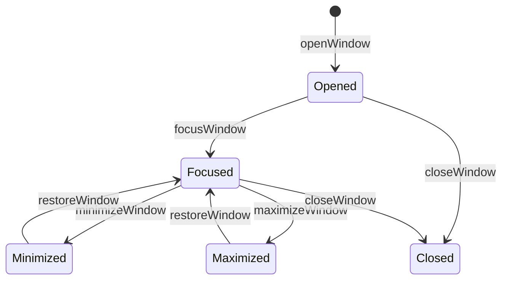
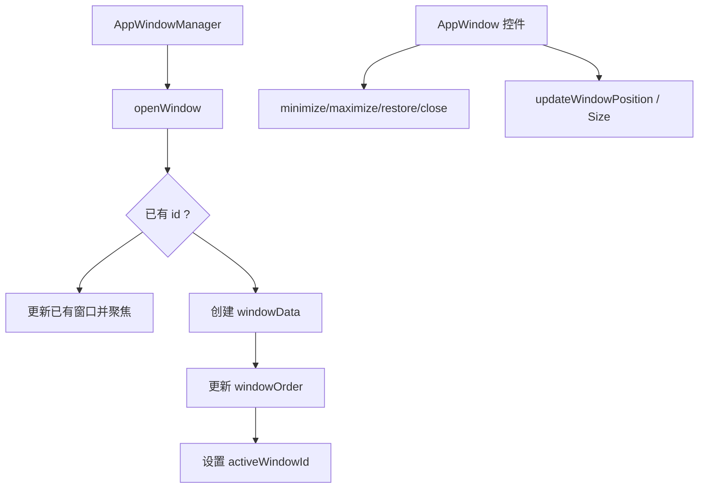
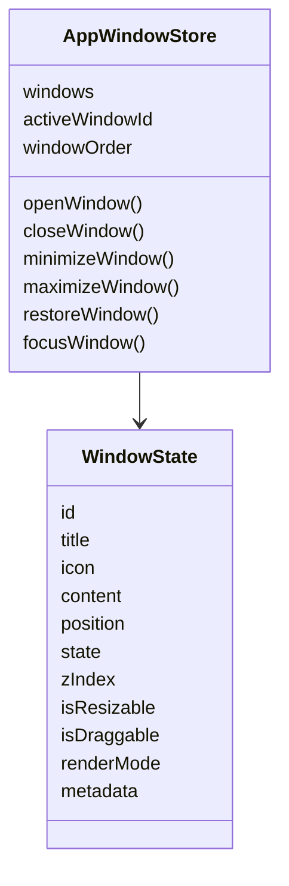

# D4. appWindowStore：窗口状态机

> 类型：正式源码课  
> 深度：Zustand 窗口状态与 action  
> 学习目标：看懂窗口状态如何被创建、排序、聚焦、最小化、最大化、恢复和移动。

## 问题

如果 D3 是“谁来下命令打开窗口”，D4 就是“窗口状态到底怎么变”。`appWindowStore` 是窗口系统的事实状态源。它保存：

- `windows`：窗口 id 到窗口状态的映射。
- `windowOrder`：窗口顺序。
- `activeWindowId`：当前聚焦窗口。
- 一组 action：open、close、minimize、maximize、restore、focus、update position/size。

## 图解

## 源码入口

- [store 创建入口（第 31 行）](../../../../packages/web/src/store/appWindowStore.ts#L31)
- [openWindow action（第 38 行）](../../../../packages/web/src/store/appWindowStore.ts#L38)
- [复用已有窗口分支（第 41 行）](../../../../packages/web/src/store/appWindowStore.ts#L41)
- [生成窗口 id（第 70 行）](../../../../packages/web/src/store/appWindowStore.ts#L70)
- [组装 windowData（第 75 行）](../../../../packages/web/src/store/appWindowStore.ts#L75)
- [closeWindow action（第 125 行）](../../../../packages/web/src/store/appWindowStore.ts#L125)
- [minimizeWindow action（第 156 行）](../../../../packages/web/src/store/appWindowStore.ts#L156)
- [maximizeWindow action（第 171 行）](../../../../packages/web/src/store/appWindowStore.ts#L171)
- [restoreWindow action（第 214 行）](../../../../packages/web/src/store/appWindowStore.ts#L214)
- [focusWindow action（第 228 行）](../../../../packages/web/src/store/appWindowStore.ts#L228)
- [updateWindowPosition（第 256 行）](../../../../packages/web/src/store/appWindowStore.ts#L256)

## 调用链

## 关键类型

- `WindowState`：每个窗口的完整状态。
- `WindowPosition` / `WindowSize`：窗口几何信息。
- `windowOrder`：独立于 `windows` map 的排序数组，帮助按 zIndex 或打开顺序渲染。
- `activeWindowId`：当前激活窗口，不等于最后一个窗口一定存在。

## 测试入口

建议新增 `packages/web/src/store/__tests__/appWindowStore.test.ts`，覆盖：

- open 新窗口。
- open 同 id 窗口复用而不是重复。
- minimize 后 activeWindowId 是否合理变化。
- restore 后 zIndex 是否提升。
- close 后 windowOrder 是否删除。

可参考 [Spotlight store 测试结构（第 12 行）](../../../../packages/web/src/store/__tests__/spotlightStore.test.ts#L12)。

## 逐行精读

1. [第 31 行](../../../../packages/web/src/store/appWindowStore.ts#L31) 创建 Zustand store。
2. [第 38 行](../../../../packages/web/src/store/appWindowStore.ts#L38) `openWindow` 接收窗口数据。
3. [第 41 行](../../../../packages/web/src/store/appWindowStore.ts#L41) 如果已有窗口，优先复用。这避免同一个 app 重复打开多个同 id 窗口。
4. [第 75 行](../../../../packages/web/src/store/appWindowStore.ts#L75) 组装默认窗口状态，是理解窗口默认尺寸、位置、zIndex 的入口。
5. [第 125 行](../../../../packages/web/src/store/appWindowStore.ts#L125) close 不只是删除 `windows`，还要处理 active 和 order。
6. [第 156 行](../../../../packages/web/src/store/appWindowStore.ts#L156) minimize 会改变 `minimized`。
7. [第 228 行](../../../../packages/web/src/store/appWindowStore.ts#L228) focus 会把窗口带到前面。

## 深度拆解

### 为什么 `openWindow` 要先查已有窗口

窗口 id 是系统语义的一部分，不只是随机 key。比如工作区窗口、某个 skill 窗口、某个 agent 工作区窗口，都应该能被 Dock 恢复和聚焦。如果同一个 id 每次点击都创建新窗口，会出现：

- Dock running 状态不知道对应哪一个窗口。
- close/minimize/focus 操作找不到稳定目标。
- 同一个 Agent/Skill 的工作区被打开多个副本。

所以 [第 41 行](../../../../packages/web/src/store/appWindowStore.ts#L41) 的 existing window 分支非常关键。它代表“同 id 窗口是可复用实体”。

### 窗口状态字段的意义

- `windows` 是数据主体，适合通过 id 读取。
- `windowOrder` 是渲染顺序和层级推导辅助，适合排序。
- `activeWindowId` 是交互焦点，适合控制高亮、zIndex 和输入。
- `state` 表示窗口生命周期状态，例如 normal/minimized/maximized。
- `position` 表示几何状态，拖拽和 resize 都要回写它。

### 每个 action 的副作用

- `openWindow`：可能复用已有窗口，也可能创建新窗口；会影响 `windows`、`windowOrder`、`activeWindowId`。
- `closeWindow`：删除窗口，还要从 `windowOrder` 删除；如果关闭的是 active window，还要重新选择 active。
- `minimizeWindow`：不删除窗口，只改变显示状态；Dock 仍可能显示 running。
- `maximizeWindow`：保存/设置最大化状态，UI 层据此改尺寸。
- `restoreWindow`：从 minimized/maximized 回到 normal，并通常需要聚焦。
- `focusWindow`：把窗口推到最前，不改变内容。
- `updateWindowPosition`：拖拽/缩放时高频调用，必须保持轻量。

### Store 和 Manager 的边界

`appWindowStore` 不应该知道：

- 一个 skill 窗口关闭时是否要 consolidate memory。
- 一个 native 窗口要不要通过 Electron 创建。
- 一个 window 是否要同步 Dock。
- 一个 component props 如何序列化。

这些都属于 `AppWindowManager` 的职责。Store 只负责状态变化的纯逻辑。

## 常见故障

- 同一个窗口重复出现：检查 openWindow 是否用了稳定 id。
- 关闭后 Dock 仍显示运行：store 关闭和 Dock 同步没有串起来。
- 最小化后无法恢复：看 restoreWindow 是否被调用，以及 Dock 点击是否能找到 windowId。
- 拖拽窗口跳动：看 position 更新和 AppWindow 的拖拽计算。
- activeWindowId 指向不存在窗口：检查 closeWindow 后是否正确重算 active。
- 窗口顺序错乱：检查 `windowOrder` 是否随 open/close/focus 同步更新。

## 改动场景判断

- 改窗口默认尺寸位置：改 openWindow 的 windowData 默认值。
- 改 zIndex 策略：改 focus/open/restore 的顺序逻辑。
- 改最小化行为：改 store action 和 Dock 恢复逻辑。
- 改窗口持久化：需要新增 persist，但要谨慎处理 component 引用不可序列化问题。

## 源码追问清单

- 为什么要同时有 `windows` map 和 `windowOrder`？
- open 同 id 窗口时应该复用还是创建新实例？
- activeWindowId 在关闭当前窗口后应该变成谁？
- component 类型窗口为什么不适合直接持久化？

## 练习

1. 手画 `openWindow -> focusWindow -> minimizeWindow -> restoreWindow` 的状态变化。
2. 找出 closeWindow 对 `windows`、`windowOrder`、`activeWindowId` 的影响。
3. 给 appWindowStore 设计 3 个单元测试用例。

## 验收

你能回答：

- appWindowStore 管哪些核心状态。
- openWindow 如何避免重复窗口。
- zIndex/active/windowOrder 的关系。
- 最小化、恢复、关闭分别改变哪些字段。
