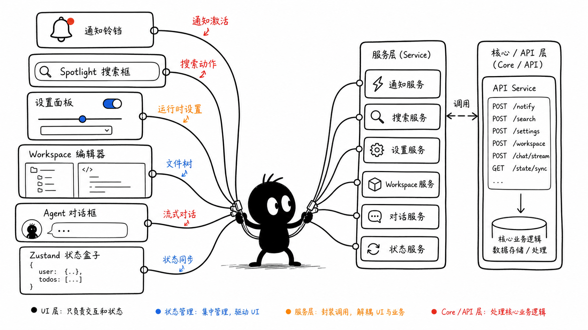
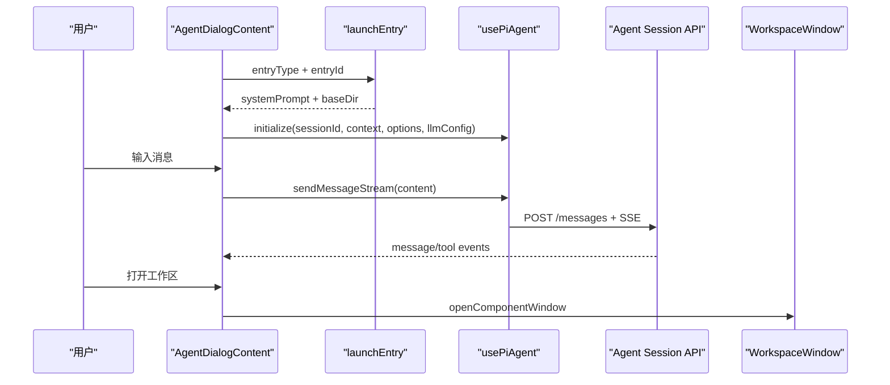
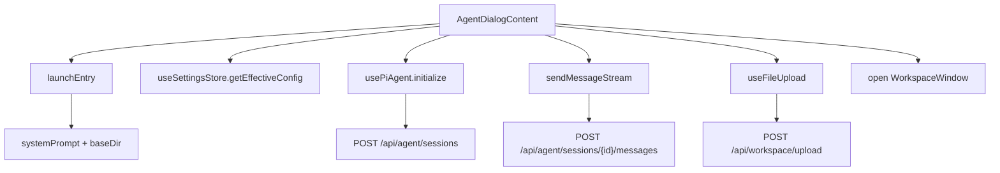
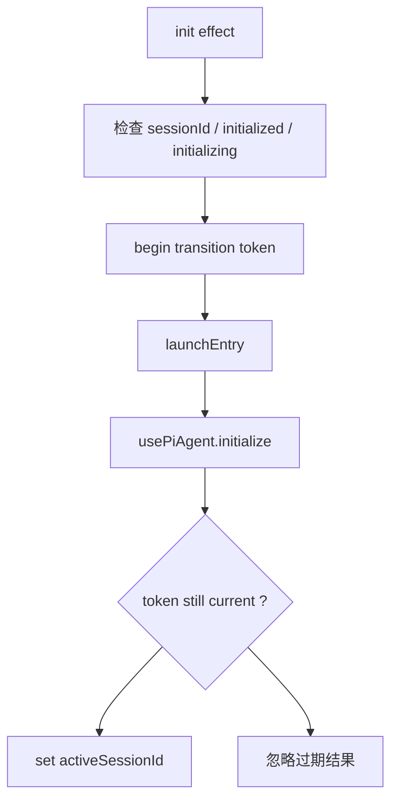

# D5. CUI Agent Dialog：对话 UI 到流式 Agent

> 类型：正式源码课  
> 深度：Agent 对话组件、会话初始化、流式消息、上传文件、工作区入口  
> 学习目标：看懂用户在对话框输入一句话后，前端组件如何创建会话、发送流式消息并展示结果。

## 问题

`AgentDialogContent` 是一个典型的“复杂 UI 编排组件”。它不是 LLM runtime 本身，但它要协调：

- agent entry 启动。
- session 初始化。
- 历史会话切换。
- 流式发送消息。
- 工具执行展示。
- 文件上传和文件提示注入。
- 打开 Agent 工作区。

## 图解

## 源码入口

- [AgentDialogContent 入口（第 51 行）](../../../../packages/web/src/components/os/agent-dialog/AgentDialogContent.tsx#L51)
- [usePiAgent 解构 `sendMessageStream`（第 86 行）](../../../../packages/web/src/components/os/agent-dialog/AgentDialogContent.tsx#L86)
- [读取有效 LLM 配置（第 98 行）](../../../../packages/web/src/components/os/agent-dialog/AgentDialogContent.tsx#L98)
- [初始化 effect 开始（第 250 行）](../../../../packages/web/src/components/os/agent-dialog/AgentDialogContent.tsx#L250)
- [调用 launcher（第 274 行）](../../../../packages/web/src/components/os/agent-dialog/AgentDialogContent.tsx#L274)
- [调用 `initialize`（第 287 行）](../../../../packages/web/src/components/os/agent-dialog/AgentDialogContent.tsx#L287)
- [自动发送 initialMessage（第 348 行）](../../../../packages/web/src/components/os/agent-dialog/AgentDialogContent.tsx#L348)
- [发送消息 handler（第 404 行）](../../../../packages/web/src/components/os/agent-dialog/AgentDialogContent.tsx#L404)
- [上传文件提示包装（第 450 行）](../../../../packages/web/src/components/os/agent-dialog/AgentDialogContent.tsx#L450)
- [打开 Agent 工作区（第 474 行）](../../../../packages/web/src/components/os/agent-dialog/AgentDialogContent.tsx#L474)
- [MessageList 渲染（第 629 行）](../../../../packages/web/src/components/os/agent-dialog/AgentDialogContent.tsx#L629)
- [ChatInputBar 渲染（第 632 行）](../../../../packages/web/src/components/os/agent-dialog/AgentDialogContent.tsx#L632)

## 调用链

## 关键类型

- `AgentDialogContentProps`：定义 agentId、agentName、agentType、initialMessage 等入口参数，入口在 [第 44 行](../../../../packages/web/src/components/os/agent-dialog/AgentDialogContent.tsx#L44)。
- `EntryType`：launcher 使用的 entry 类型，组件内有 entryTypeMap。
- `UploadedFileDisplay`：上传后展示在输入框附件 chip 中。
- `Message`：MessageList 接收的展示消息类型，入口在 [MessageList 第 17 行](../../../../packages/web/src/components/os/agent-dialog/MessageList.tsx#L17)。

## 测试入口

- [AgentHost 测试（第 42 行）](../../../../packages/web/src/components/os/agent-host/__tests__/AgentHost.test.tsx#L42)

缺口：`AgentDialogContent` 复杂度很高，应补组件测试：

- 初始化时调用 launcher 和 initialize。
- disabled 状态下不能发送。
- 上传文件后发送时注入文件路径提示。
- 点击工作区按钮调用 AppWindowManager。

## 逐行精读

1. [第 263 行](../../../../packages/web/src/components/os/agent-dialog/AgentDialogContent.tsx#L263) 把 UI 的 agent 类型映射成 launcher entryType。
2. [第 274 行](../../../../packages/web/src/components/os/agent-dialog/AgentDialogContent.tsx#L274) 调用 launcher，不在 UI 内拼完整 system prompt。
3. [第 285 行](../../../../packages/web/src/components/os/agent-dialog/AgentDialogContent.tsx#L285) 从设置 store 读取 LLM 配置并 normalize。
4. [第 287 行](../../../../packages/web/src/components/os/agent-dialog/AgentDialogContent.tsx#L287) 初始化 Pi Agent session。
5. [第 404 行](../../../../packages/web/src/components/os/agent-dialog/AgentDialogContent.tsx#L404) 是手动发送消息入口。
6. [第 450 行](../../../../packages/web/src/components/os/agent-dialog/AgentDialogContent.tsx#L450) 上传文件后会把文件路径注入提示词，不是直接把文件二进制塞进消息。
7. [第 474 行](../../../../packages/web/src/components/os/agent-dialog/AgentDialogContent.tsx#L474) 打开 Agent 专属 workspace。

## 深度拆解

### 初始化为什么需要 transition guard

Agent 对话框很容易出现竞态：用户快速切换历史会话、创建新会话、关闭再打开，旧请求可能晚于新请求返回。如果没有保护，旧初始化结果会覆盖新 session。

源码中有几层保护：

- [第 250 行](../../../../packages/web/src/components/os/agent-dialog/AgentDialogContent.tsx#L250) 初始化 effect 先判断是否已经初始化过同一个 session。
- [第 256 行](../../../../packages/web/src/components/os/agent-dialog/AgentDialogContent.tsx#L256) 用 `isInitializingSessionRef` 标记当前正在初始化的 session。
- [第 257 行](../../../../packages/web/src/components/os/agent-dialog/AgentDialogContent.tsx#L257) 开启 transition token。
- [第 300 行](../../../../packages/web/src/components/os/agent-dialog/AgentDialogContent.tsx#L300) 初始化完成后确认 token 仍然是当前 token。
- [第 310 行](../../../../packages/web/src/components/os/agent-dialog/AgentDialogContent.tsx#L310) catch 中也确认 token，避免旧错误覆盖新状态。

### 上传链路不是一句话带过

AgentDialogContent 的上传链路有 3 段：

1. UI 选择文件：`ChatInputBar` 触发 `onUpload`。
2. hook 上传文件：`useFileUpload` 创建隐藏 input、校验文件、转 base64、调用 workspace upload service。
3. 消息发送时注入路径：不是把二进制塞给 LLM，而是告诉 Agent “文件名 + 路径”，让工具读取。

真实入口：

- [AgentDialogContent 导入 `useFileUpload`（第 26 行）](../../../../packages/web/src/components/os/agent-dialog/AgentDialogContent.tsx#L26)
- [配置上传 basePath（第 467 行）](../../../../packages/web/src/components/os/agent-dialog/AgentDialogContent.tsx#L467)
- [上传 hook 入口（第 75 行）](../../../../packages/web/src/lib/hooks/use-file-upload.ts#L75)
- [创建隐藏 file input（第 90 行）](../../../../packages/web/src/lib/hooks/use-file-upload.ts#L90)
- [校验文件大小和类型（第 44 行）](../../../../packages/web/src/lib/hooks/use-file-upload.ts#L44)
- [转换 base64（第 63 行）](../../../../packages/web/src/lib/hooks/use-file-upload.ts#L63)
- [调用 `uploadWorkspaceFiles`（第 152 行）](../../../../packages/web/src/lib/hooks/use-file-upload.ts#L152)
- [发送消息时注入文件提示（第 459 行）](../../../../packages/web/src/components/os/agent-dialog/AgentDialogContent.tsx#L459)

### 对话渲染也分层

- `AgentDialogContent` 管状态和编排。
- [MessageList（第 25 行）](../../../../packages/web/src/components/os/agent-dialog/MessageList.tsx#L25) 把消息交给共享 ChatMessageList。
- [ToolExecutionFrame（第 45 行）](../../../../packages/web/src/components/os/agent-dialog/ToolExecutionFrame.tsx#L45) 显示工具执行。
- [ChatInputBar 渲染（第 632 行）](../../../../packages/web/src/components/os/agent-dialog/AgentDialogContent.tsx#L632) 是输入区，负责提交、上传、停止生成、附件 chip。

这意味着如果“消息内容显示不对”，不一定是 AgentDialogContent 的问题；如果“发送按钮状态不对”，大概率才在它这里。

## 常见故障

- 打开对话框后一直初始化：看 launcher 是否返回 success、baseDir、systemPrompt。
- 发送按钮禁用：检查 `isInitialized`、`isRunning`、`isRestoring`、`switchingSessionId`。
- 上传了文件但 Agent 找不到：看上传 basePath 是否是 `data/agents/{agentId}`，发送提示是否带路径。
- 历史会话切换串消息：看 transitionGuard 和 initializedSessionRef。
- 上传按钮没反应：看隐藏 input 是否创建、`input.click()` 是否执行，入口在 [useFileUpload 第 173 行](../../../../packages/web/src/lib/hooks/use-file-upload.ts#L173)。
- 大文件上传前端就失败：看 hook 的 [默认 500MB 限制（第 27 行）](../../../../packages/web/src/lib/hooks/use-file-upload.ts#L27) 和 API route 的服务端限制是否一致。

## 改动场景判断

- 改对话 UI 外观：改 AgentDialogContent 子组件或 ChatInputBar。
- 改 Agent 初始化参数：改 launcher 返回和 initialize 调用。
- 改文件上传策略：改 useFileUpload、workspace upload route、wrappedSendMessage。
- 改流式消息展示：同步看 usePiAgent、message route、MessageList。

## 源码追问清单

- `launchEntry` 为什么先于 `initialize`？
- `baseDir` 对 Agent 工具 cwd 有什么影响？
- 为什么上传文件后发送的是“路径提示”？
- `transitionGuardRef` 解决哪类竞态？

## 练习

1. 从 `handleSendMessage` 追到 message API route。
2. 解释 AgentDialogContent 初始化时需要哪些参数。
3. 画出上传文件后发送消息的链路。

## 验收

你能回答：

- AgentDialogContent 不是 Agent runtime，它负责哪些 UI 编排。
- session 初始化和消息发送分别走哪里。
- 文件上传如何进入 Agent 语境。
- 打开 Agent 工作区如何经过 AppWindowManager。
