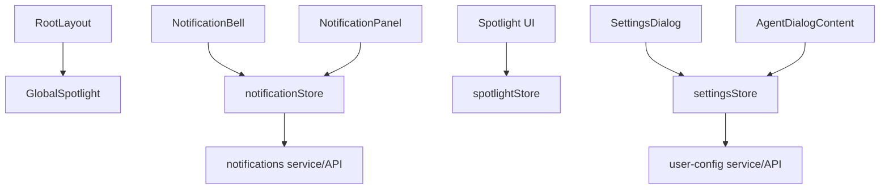
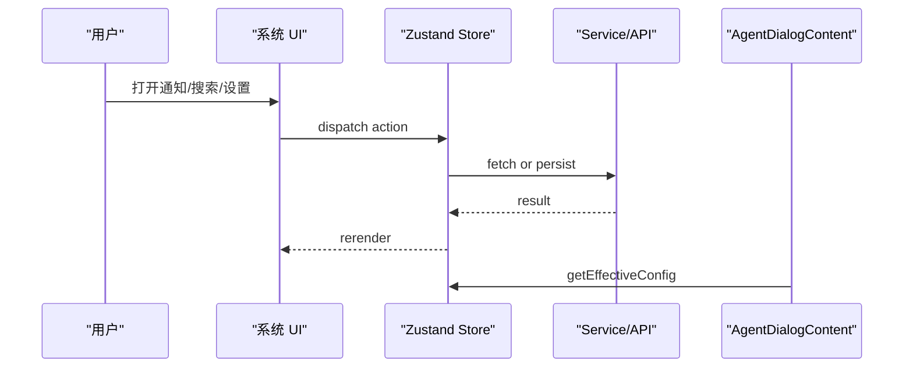
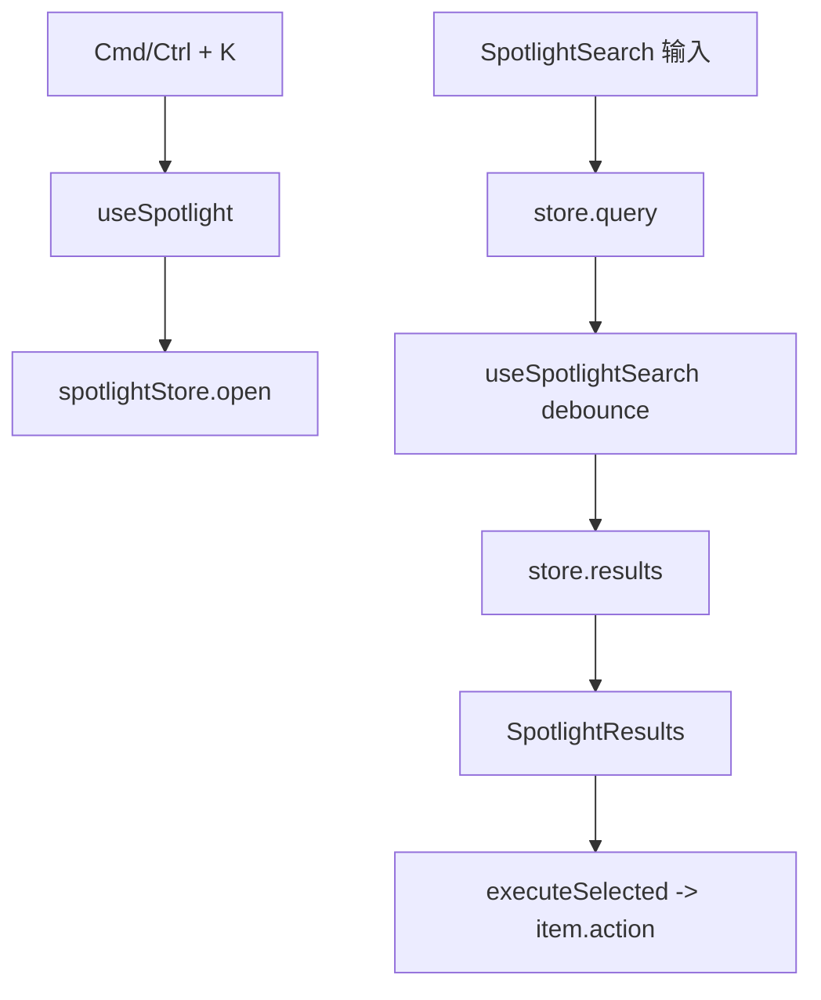

# D6. 通知、Spotlight 与设置

> 类型：正式源码课  
> 深度：系统级状态与轻量服务  
> 学习目标：看懂三个横切 UI 能力如何通过 Zustand store 驱动：通知、全局搜索、运行时设置。

## 问题

通知、Spotlight、设置都不是某个业务页面的私有能力，而是系统级 UI：

- 通知：从服务拉取，计算未读，支持 read/dismiss。
- Spotlight：全局打开、搜索、选中、执行 action。
- 设置：本地存储 + 服务端配置 + Agent 初始化读取有效 LLM 配置。

## 图解

## 源码入口

- [GlobalSpotlight 入口（第 6 行）](../../../../packages/web/src/components/os/GlobalSpotlight.tsx#L6)
- [Spotlight store 创建（第 8 行）](../../../../packages/web/src/store/spotlightStore.ts#L8)
- [Spotlight executeSelected（第 36 行）](../../../../packages/web/src/store/spotlightStore.ts#L36)
- [Spotlight 组件入口（第 23 行）](../../../../packages/web/src/components/os/spotlight/index.tsx#L23)
- [Notification store 类型（第 8 行）](../../../../packages/web/src/store/notificationStore.ts#L8)
- [Notification store 创建（第 33 行）](../../../../packages/web/src/store/notificationStore.ts#L33)
- [NotificationBell 入口（第 12 行）](../../../../packages/web/src/components/os/notification/NotificationBell.tsx#L12)
- [NotificationPanel 入口（第 59 行）](../../../../packages/web/src/components/os/notification/NotificationPanel.tsx#L59)
- [Settings 类型 `LLMSettings`（第 19 行）](../../../../packages/web/src/store/settingsStore.ts#L19)
- [Settings store 创建（第 209 行）](../../../../packages/web/src/store/settingsStore.ts#L209)
- [SettingsDialog 入口（第 23 行）](../../../../packages/web/src/components/os/settings/SettingsDialog.tsx#L23)
- [AgentDialog 读取有效配置（第 98 行）](../../../../packages/web/src/components/os/agent-dialog/AgentDialogContent.tsx#L98)

## 调用链

## 关键类型

- `Notification`：通知展示实体，包含 id、type、status、title、message、payload。
- `SpotlightState` / `SpotlightItem`：来自 core types，store 只维护打开状态、查询、结果和执行。
- `ProviderConfig`：LLM provider 配置，包含 baseUrl、authToken、apiKey、model、maxTokens、mapping。
- `LLMSettings`：当前 provider 和各 provider 配置集合。

## 测试入口

- [Spotlight store 测试（第 6 行）](../../../../packages/web/src/store/__tests__/spotlightStore.test.ts#L6)
- [Spotlight 组件测试（第 9 行）](../../../../packages/web/src/components/os/spotlight/__tests__/Spotlight.test.tsx#L9)

缺口：notificationStore 和 settingsStore 没有同等覆盖。尤其 settingsStore 涉及凭证 normalize，值得补单测。

## 逐行精读

### Spotlight

1. [spotlightStore 第 8 行](../../../../packages/web/src/store/spotlightStore.ts#L8) 创建状态。
2. [第 15 行](../../../../packages/web/src/store/spotlightStore.ts#L15) open 时清空 query 和 selectedIndex。
3. [第 36 行](../../../../packages/web/src/store/spotlightStore.ts#L36) executeSelected 执行当前结果的 action 并关闭。

### Notification

1. [notificationStore 第 38 行](../../../../packages/web/src/store/notificationStore.ts#L38) 拉取通知。
2. [第 49 行](../../../../packages/web/src/store/notificationStore.ts#L49) pending 数量就是 unreadCount。
3. [第 79 行](../../../../packages/web/src/store/notificationStore.ts#L79) mark read 前会确认当前通知仍是 pending。

### Settings

1. [settingsStore 第 29 行](../../../../packages/web/src/store/settingsStore.ts#L29) 判断 provider 是否可用。
2. [第 79 行](../../../../packages/web/src/store/settingsStore.ts#L79) normalize 本地设置。
3. [第 107 行](../../../../packages/web/src/store/settingsStore.ts#L107) normalize 凭证字符串，处理 JSON 或 Bearer 前缀。
4. [第 188 行](../../../../packages/web/src/store/settingsStore.ts#L188) 持久化到服务端。
5. [第 255 行](../../../../packages/web/src/store/settingsStore.ts#L255) 返回有效 provider 配置，Agent 初始化使用。

## 深度拆解

### Spotlight 的完整链路

Spotlight 分成 hook、store、UI 三块：

- [useSpotlight 第 13 行](../../../../packages/web/src/hooks/useSpotlight.ts#L13) 读取 store action。
- [第 22 行](../../../../packages/web/src/hooks/useSpotlight.ts#L22) 注册 Cmd/Ctrl+K 快捷键。
- [第 25 行](../../../../packages/web/src/hooks/useSpotlight.ts#L25) 只在打开时监听 Escape、ArrowDown、ArrowUp、Enter。
- [useSpotlightSearch 第 9 行](../../../../packages/web/src/hooks/useSpotlightSearch.ts#L9) 接收 items。
- [第 14 行](../../../../packages/web/src/hooks/useSpotlightSearch.ts#L14) 对 query 做 150ms debounce。
- [第 26 行](../../../../packages/web/src/hooks/useSpotlightSearch.ts#L26) 按 title、subtitle、keywords 过滤。
- [Spotlight 组件第 34 行](../../../../packages/web/src/components/os/spotlight/index.tsx#L34) 调用搜索 hook。
- [SpotlightSearch 第 18 行](../../../../packages/web/src/components/os/spotlight/SpotlightSearch.tsx#L18) 打开后自动 focus 和 select。
- [SpotlightResults 第 30 行](../../../../packages/web/src/components/os/spotlight/SpotlightResults.tsx#L30) 点击结果会 setSelectedIndex 再 execute。

### 通知激活不是简单标已读

通知面板里点击一条通知，可能会触发打开 Agent/Skill 等系统动作：

- [NotificationBell 第 19 行](../../../../packages/web/src/components/os/notification/NotificationBell.tsx#L19) 首次拉取通知，并每 30 秒 silent 刷新。
- [第 62 行](../../../../packages/web/src/components/os/notification/NotificationBell.tsx#L62) unread badge 超过 9 显示 `9+`。
- [NotificationPanel 第 65 行](../../../../packages/web/src/components/os/notification/NotificationPanel.tsx#L65) 过滤掉 dismissed。
- [第 118 行](../../../../packages/web/src/components/os/notification/NotificationPanel.tsx#L118) 通知激活时，如果 pending 先 mark read。
- [第 122 行](../../../../packages/web/src/components/os/notification/NotificationPanel.tsx#L122) 派发 `originos:notification-activate` 自定义事件。
- [第 200 行](../../../../packages/web/src/components/os/notification/NotificationPanel.tsx#L200) 从 payload/action 推导 activationTarget。

所以通知链路要同时看 store、panel、首页事件监听。只看 API 或只看 badge 都不完整。

### 设置保存链路

设置不是“点击保存写 localStorage”这么简单：

- [SettingsDialog 第 44 行](../../../../packages/web/src/components/os/settings/SettingsDialog.tsx#L44) 打开时从服务端加载配置。
- [第 50 行](../../../../packages/web/src/components/os/settings/SettingsDialog.tsx#L50) 把 store 值复制到 draft。
- [第 95 行](../../../../packages/web/src/components/os/settings/SettingsDialog.tsx#L95) 保存时先解析 mapping JSON。
- [第 103 行](../../../../packages/web/src/components/os/settings/SettingsDialog.tsx#L103) 保存 LLM 设置。
- [第 109 行](../../../../packages/web/src/components/os/settings/SettingsDialog.tsx#L109) 保存语言偏好。
- [第 110 行](../../../../packages/web/src/components/os/settings/SettingsDialog.tsx#L110) 保存 Dock 位置。
- [settingsStore 第 188 行](../../../../packages/web/src/store/settingsStore.ts#L188) 持久化到服务端配置。

这个链路说明设置面板跨了三个状态域：LLM、用户偏好、Dock。

## 常见故障

- Spotlight 打开但没有结果：看 items 是否 set、query 是否被搜索 hook 消费。
- 通知 read 后角标没变：看状态是否 pending，以及 unreadCount 更新。
- 设置保存后刷新丢失：看 localStorage 和 `setUserConfig` 是否都成功。
- Agent 用错模型：看 `getEffectiveProvider` 和 `getEffectiveConfig`。
- Spotlight 组件卸载后快捷键失效：看 [关闭时仍返回 hidden placeholder（第 36 行）](../../../../packages/web/src/components/os/spotlight/index.tsx#L36) 的设计。
- 通知点击没打开目标：看 `activationTarget` 是否能从 payload 推出来，以及首页是否监听 `originos:notification-activate`。
- mapping JSON 保存失败：看 [SettingsDialog 第 95 行](../../../../packages/web/src/components/os/settings/SettingsDialog.tsx#L95) 的 parseMappingText。

## 改动场景判断

- 新增 Spotlight 命令：新增 item/action，不要改 store 核心。
- 改通知状态枚举：同步更新 store、API、后端/服务。
- 改 LLM provider：settingsStore、SettingsDialog、runtime config normalize、agent session route 都要看。
- 改全局快捷键：看 GlobalSpotlight 和 useSpotlight hook。

## 源码追问清单

- Spotlight item 的 action 是在哪里注册的？
- 通知 payload 如何映射成激活动作？
- 设置为什么既保存 localStorage 又保存服务端配置？
- authToken 和 apiKey 的 provider 差异在哪里处理？

## 练习

1. 从 SettingsDialog 保存按钮追到 settingsStore。
2. 从 NotificationBell 追到 notificationStore 的 unreadCount。
3. 给 Spotlight store 写一个“选中下一项循环”的测试思路。

## 验收

你能说明：

- 通知、Spotlight、设置为什么适合放 store。
- Agent 初始化如何读取 LLM 设置。
- 通知 unreadCount 如何计算。
- Spotlight executeSelected 为什么执行后关闭。
