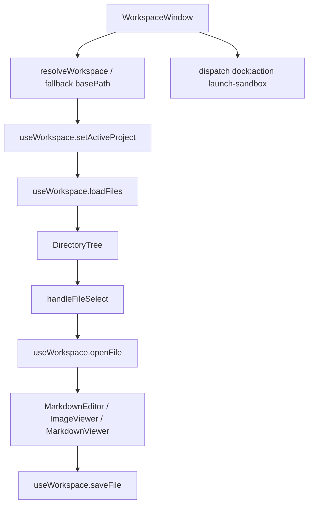
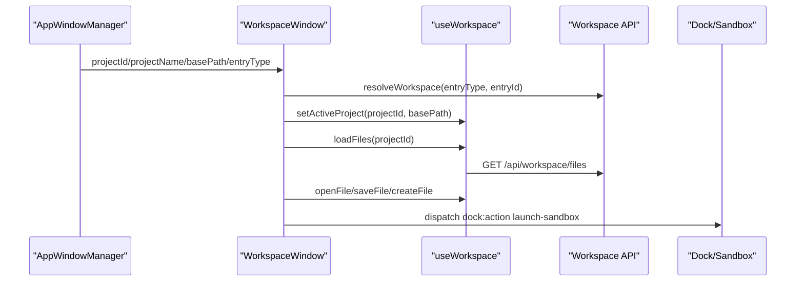
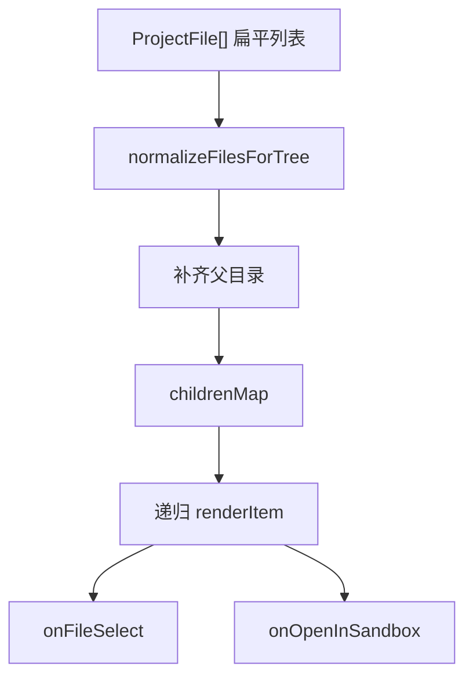

# D7. Workspace UI：文件树、编辑器、预览与 Sandbox

> 类型：正式源码课  
> 深度：工作区窗口 UI 与文件 API 调用  
> 学习目标：看懂 WorkspaceWindow 如何解析工作目录、加载文件、打开编辑器、保存文件并启动 Sandbox。

## 问题

Workspace 是项目、Agent、Skill 产物的共同查看和编辑入口。它需要处理：

- entryType/entryId/basePath 到真实目录的解析。
- 文件树加载和选择。
- Markdown 编辑、图片预览、数据 tab。
- Electron 下监听本地文件变化。
- 检测可运行 HTML 并打开 Sandbox。

## 图解

## 源码入口

- [WorkspaceWindow 入口（第 38 行）](../../../../packages/web/src/components/os/workspace/WorkspaceWindow.tsx#L38)
- [使用 `useWorkspace`（第 39 行）](../../../../packages/web/src/components/os/workspace/WorkspaceWindow.tsx#L39)
- [basePath 解析 effect（第 51 行）](../../../../packages/web/src/components/os/workspace/WorkspaceWindow.tsx#L51)
- [调用 `resolveWorkspace`（第 75 行）](../../../../packages/web/src/components/os/workspace/WorkspaceWindow.tsx#L75)
- [设置 active project 并加载文件（第 89 行）](../../../../packages/web/src/components/os/workspace/WorkspaceWindow.tsx#L89)
- [Electron 文件监听（第 96 行）](../../../../packages/web/src/components/os/workspace/WorkspaceWindow.tsx#L96)
- [Sandbox app 检测（第 131 行）](../../../../packages/web/src/components/os/workspace/WorkspaceWindow.tsx#L131)
- [打开 Sandbox（第 156 行）](../../../../packages/web/src/components/os/workspace/WorkspaceWindow.tsx#L156)
- [选择文件（第 179 行）](../../../../packages/web/src/components/os/workspace/WorkspaceWindow.tsx#L179)
- [新建文件（第 190 行）](../../../../packages/web/src/components/os/workspace/WorkspaceWindow.tsx#L190)
- [保存文件（第 200 行）](../../../../packages/web/src/components/os/workspace/WorkspaceWindow.tsx#L200)
- [DirectoryTree 渲染（第 211 行）](../../../../packages/web/src/components/os/workspace/WorkspaceWindow.tsx#L211)
- [Tab 渲染（第 227 行）](../../../../packages/web/src/components/os/workspace/WorkspaceWindow.tsx#L227)
- [Web 侧 hook 转导出（第 1 行）](../../../../packages/web/src/hooks/use-workspace.ts#L1)

## 调用链

## 关键类型

- `WorkspaceWindowProps`：projectId、projectName、entryType、entryId、ontologyId、basePath，入口在 [第 25 行](../../../../packages/web/src/components/os/workspace/WorkspaceWindow.tsx#L25)。
- `WorkspaceTab = '项目' | '数据'`：工作区两大视图，入口在 [第 19 行](../../../../packages/web/src/components/os/workspace/WorkspaceWindow.tsx#L19)。
- `ProjectFile`：文件树节点类型，从 core types 引入。
- `openedFile`：当前打开文件，来自 `useWorkspace`。

## 测试入口

当前 Workspace UI 缺少足够组件测试。建议补：

- 传入 basePath 时不调用 resolve API。
- 未传 basePath 时根据 entryType/entryId resolve。
- 点击文件调用 openFile 并切到 editor。
- index.html 存在时显示 Sandbox 打开入口。

可参考 [AgentHost 组件测试（第 42 行）](../../../../packages/web/src/components/os/agent-host/__tests__/AgentHost.test.tsx#L42) 的组件测试组织方式。

## 逐行精读

1. [第 51 行](../../../../packages/web/src/components/os/workspace/WorkspaceWindow.tsx#L51) 是路径解析主 effect。
2. [第 53 行](../../../../packages/web/src/components/os/workspace/WorkspaceWindow.tsx#L53) 如果调用方直接传 basePath，就直接使用。
3. [第 62 行](../../../../packages/web/src/components/os/workspace/WorkspaceWindow.tsx#L62) 如果 entryType/entryId 缺失，会按 projectId 做 fallback。
4. [第 75 行](../../../../packages/web/src/components/os/workspace/WorkspaceWindow.tsx#L75) 正常走 `resolveWorkspace` 服务。
5. [第 89 行](../../../../packages/web/src/components/os/workspace/WorkspaceWindow.tsx#L89) basePath 解析完成后才设置 active project 和加载文件。
6. [第 96 行](../../../../packages/web/src/components/os/workspace/WorkspaceWindow.tsx#L96) Electron 下监听目录变化。
7. [第 141 行](../../../../packages/web/src/components/os/workspace/WorkspaceWindow.tsx#L141) 优先检测根目录 `index.html`，这是 Sandbox 可运行入口。
8. [第 179 行](../../../../packages/web/src/components/os/workspace/WorkspaceWindow.tsx#L179) 选择文件后打开内容并切到 editor。

## 深度拆解

### 文件树不是后端直接给的树

Workspace API 返回的可能是扁平文件列表，`DirectoryTree` 会在前端补齐目录结构：

- [DirectoryTree props（第 7 行）](../../../../packages/web/src/components/os/workspace/DirectoryTree.tsx#L7) 接收 `ProjectFile[]`，不是树节点。
- [第 20 行](../../../../packages/web/src/components/os/workspace/DirectoryTree.tsx#L20) 调用 `normalizeFilesForTree`。
- [第 23 行](../../../../packages/web/src/components/os/workspace/DirectoryTree.tsx#L23) 自动展开根目录。
- [第 40 行](../../../../packages/web/src/components/os/workspace/DirectoryTree.tsx#L40) buildTree 构造 rootItems 和 childrenMap。
- [第 56 行](../../../../packages/web/src/components/os/workspace/DirectoryTree.tsx#L56) 排序规则是 folder first，再按 name。
- [第 72 行](../../../../packages/web/src/components/os/workspace/DirectoryTree.tsx#L72) 检测 HTML/Sandbox 可运行入口。
- [第 169 行](../../../../packages/web/src/components/os/workspace/DirectoryTree.tsx#L169) `normalizeFilesForTree` 入口。
- [第 197 行](../../../../packages/web/src/components/os/workspace/DirectoryTree.tsx#L197) 遍历路径段，为缺失的父目录补 folder。

### 编辑器和预览选择逻辑

WorkspaceWindow 的右侧内容不是固定 MarkdownEditor：

- [第 285 行](../../../../packages/web/src/components/os/workspace/WorkspaceWindow.tsx#L285) 图片扩展名走 `ImageViewer`。
- [第 289 行](../../../../packages/web/src/components/os/workspace/WorkspaceWindow.tsx#L289) `.md` 文件走 `MarkdownEditor`。
- [第 296 行](../../../../packages/web/src/components/os/workspace/WorkspaceWindow.tsx#L296) 其他文件走 `MarkdownViewer`。
- [ImageViewer 第 32 行](../../../../packages/web/src/components/os/workspace/ImageViewer.tsx#L32) 直接使用 API 返回的 base64 data URL。
- [ImageViewer 第 34 行](../../../../packages/web/src/components/os/workspace/ImageViewer.tsx#L34) 缩放限制在 0.25 到 3。
- [MarkdownEditor 第 24 行](../../../../packages/web/src/components/os/workspace/MarkdownEditor.tsx#L24) 打开文件时同步 content。
- [MarkdownEditor 第 50 行](../../../../packages/web/src/components/os/workspace/MarkdownEditor.tsx#L50) 支持 Cmd/Ctrl+S 保存。
- [MarkdownEditor 第 197 行](../../../../packages/web/src/components/os/workspace/MarkdownEditor.tsx#L197) 用 `ReactMarkdown` + `remarkGfm` 渲染预览。

### 数据 tab 是本体数据编辑入口

`WorkspaceWindow` 的“数据” tab 不只是展示 JSON，它进入本体数据编辑：

- [WorkspaceWindow 第 303 行](../../../../packages/web/src/components/os/workspace/WorkspaceWindow.tsx#L303) 有 resolvedOntologyId 才渲染 `DataTabView`。
- [DataTabView 第 25 行](../../../../packages/web/src/components/os/workspace/DataTabView.tsx#L25) 以 ontologyId 为入口。
- [第 49 行](../../../../packages/web/src/components/os/workspace/DataTabView.tsx#L49) mount 时先同步 business-model。
- [第 64 行](../../../../packages/web/src/components/os/workspace/DataTabView.tsx#L64) 拉取 concepts。
- [第 71 行](../../../../packages/web/src/components/os/workspace/DataTabView.tsx#L71) 拉取 instance relations。
- [第 82 行](../../../../packages/web/src/components/os/workspace/DataTabView.tsx#L82) concepts 变化后拉取 instances。
- [第 229 行](../../../../packages/web/src/components/os/workspace/DataTabView.tsx#L229) 创建实例。
- [第 271 行](../../../../packages/web/src/components/os/workspace/DataTabView.tsx#L271) 保存实例。
- [第 341 行](../../../../packages/web/src/components/os/workspace/DataTabView.tsx#L341) 创建实例关系。

## 常见故障

- 文件树为空：看 basePath 是否解析成功，再查 `/api/workspace/files`。
- 保存失败：看 `saveFile` 对应 API 是否 403 或缺 content。
- Electron 文件变化不刷新：看 `isElectron()`、watchPath、onChanged。
- Sandbox 按钮不出现：检查根目录 `index.html` 或单独 html 文件检测。
- 子目录文件不显示为树：看 `normalizeFilesForTree` 是否补齐父目录。
- 图片预览空白：看 files API 是否按 base64 data URL 返回，ImageViewer 不会自己读本地文件。
- 数据 tab 显示“未关联本体”：看 `resolvedOntologyId` 的推导逻辑。

## 改动场景判断

- 改工作区布局：改 WorkspaceWindow 和子组件。
- 改文件读写行为：改 core `use-workspace` 或 workspace API。
- 改路径解析：改 `resolveWorkspace` 和 `/api/workspace/resolve`。
- 改 Sandbox 检测规则：改 `sandboxAppId` useMemo。

## 源码追问清单

- 为什么 WorkspaceWindow 既支持 basePath，也支持 entryType/entryId？
- Agent 工作区和项目工作区的 fallback 路径有什么区别？
- 文件监听为什么只在 Electron 下启用？
- Sandbox appId 为什么从 `data/` 后面的相对路径推导？

## 练习

1. 从 AgentDialog 打开工作区追到 WorkspaceWindow 的 basePath。
2. 从选择文件追到 `openFile` 和文件 API。
3. 给 Sandbox 检测逻辑设计 3 个目录例子。

## 验收

你能回答：

- WorkspaceWindow 如何解析真实工作目录。
- 文件树加载和打开文件的调用链。
- 保存文件走哪个 hook 和 API。
- Sandbox 按钮出现的条件。
