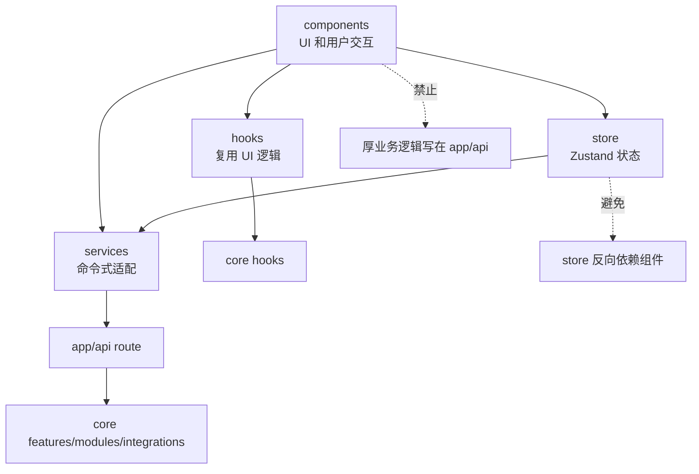
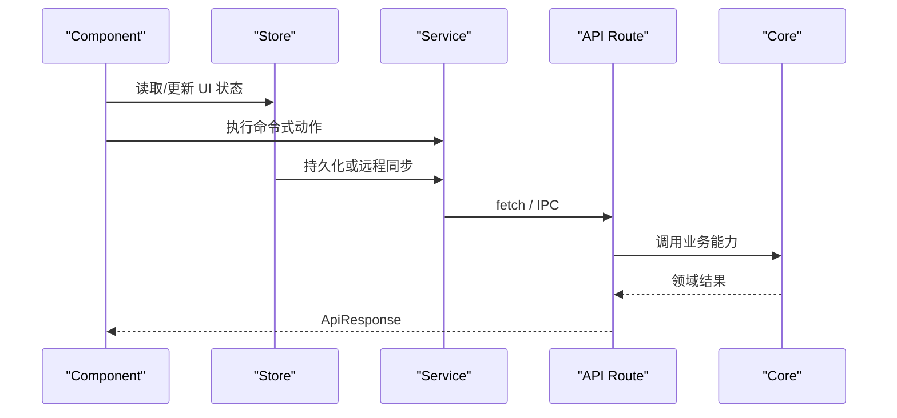
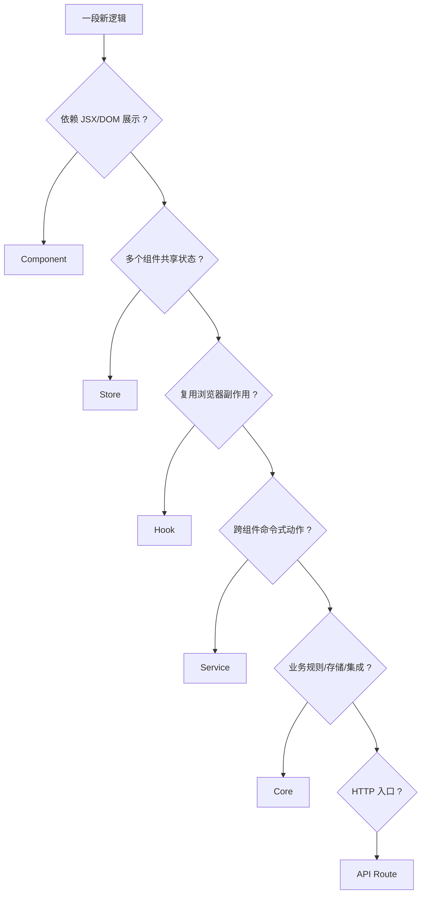

# D8. Web Hooks、Services、Stores 总复盘

> 类型：正式源码课  
> 深度：Web 层边界审视  
> 学习目标：把 D 部分串成一个可维护的判断框架：什么放 hook，什么放 service，什么放 store，什么必须下沉 core。

## 问题

学完 C/D 后，你会看到 Web 层有很多文件夹：

- `components/`：真实 UI 和交互。
- `store/`：Zustand 状态源。
- `services/`：Web 侧命令式服务或 API/Electron 适配。
- `hooks/`：组件复用逻辑，常常桥接 core hook 或浏览器能力。
- `app/api/`：HTTP route 边界。
- `core`：共享业务、集成、存储和类型。

本节不是再讲一个功能，而是建立“放在哪里”的判断能力。

## 图解

## 源码入口

- [useWorkspace Web 转导出（第 1 行）](../../../../packages/web/src/hooks/use-workspace.ts#L1)
- [useAgentLifecycle 调用设置 store（第 19 行）](../../../../packages/web/src/hooks/useAgentLifecycle.ts#L19)
- [useSpotlight hook 读取 store（第 14 行）](../../../../packages/web/src/hooks/useSpotlight.ts#L14)
- [useSpotlightSearch hook 读取 query（第 10 行）](../../../../packages/web/src/hooks/useSpotlightSearch.ts#L10)
- [AppWindowManager service（第 16 行）](../../../../packages/web/src/services/AppWindowManager.ts#L16)
- [appWindowStore（第 31 行）](../../../../packages/web/src/store/appWindowStore.ts#L31)
- [dockStore persist（第 121 行）](../../../../packages/web/src/store/dockStore.ts#L121)
- [notificationStore（第 33 行）](../../../../packages/web/src/store/notificationStore.ts#L33)
- [settingsStore（第 209 行）](../../../../packages/web/src/store/settingsStore.ts#L209)
- [spotlightStore（第 8 行）](../../../../packages/web/src/store/spotlightStore.ts#L8)
- [Agent session route 边界（第 54 行）](../../../../packages/web/src/app/api/agent/sessions/route.ts#L54)

## 调用链

## 关键类型

- Store state interface：例如 `SettingsState`、`NotificationStore`，定义状态和 action。
- Service class：例如 `AppWindowManager`，提供跨组件命令入口。
- Hook return object：例如 `useWorkspace` 返回 files、openedFile、loadFiles、openFile、saveFile。
- `ApiResponse<T>`：Web API 与 UI/service 的统一响应外壳。

## 测试入口

- [Spotlight store 测试（第 6 行）](../../../../packages/web/src/store/__tests__/spotlightStore.test.ts#L6)
- [Spotlight 组件测试（第 9 行）](../../../../packages/web/src/components/os/spotlight/__tests__/Spotlight.test.tsx#L9)
- [AgentHost 组件测试（第 10 行）](../../../../packages/web/src/components/os/agent-host/__tests__/AgentHost.test.tsx#L10)

测试策略：

- store：纯 action 和状态变化单测。
- service：mock store/API/IPC，测命令是否派发正确。
- component：测用户行为和可见结果。
- route：测参数校验、错误码、下层调用。
- core：测业务规则和存储规则。

## 逐行精读

1. [use-workspace 第 1 行](../../../../packages/web/src/hooks/use-workspace.ts#L1) 只是从 core 转导出，说明 Workspace 的主要逻辑在 core hook。
2. [AppWindowManager 第 16 行](../../../../packages/web/src/services/AppWindowManager.ts#L16) 是 service，因为它被多处命令式调用。
3. [appWindowStore 第 31 行](../../../../packages/web/src/store/appWindowStore.ts#L31) 是状态源，不负责 UI 渲染。
4. [settingsStore 第 188 行](../../../../packages/web/src/store/settingsStore.ts#L188) store 可以调用 service 做持久化，但仍保持 UI 无关。
5. [agent sessions route 第 54 行](../../../../packages/web/src/app/api/agent/sessions/route.ts#L54) 是 API 边界，负责解析 HTTP 和调用 core service。

## 深度拆解

### 本项目 Web 层的 5 种代码形态

| 形态 | 典型文件 | 应该承担 | 不应该承担 |
| --- | --- | --- | --- |
| Component | [AgentDialogContent（第 51 行）](../../../../packages/web/src/components/os/agent-dialog/AgentDialogContent.tsx#L51) | 渲染、事件、组合 hook/store/service | 文件存储规则、Agent runtime 内核 |
| Store | [settingsStore（第 209 行）](../../../../packages/web/src/store/settingsStore.ts#L209) | 跨组件状态、轻量 action | React component、复杂业务算法 |
| Service | [AppWindowManager（第 16 行）](../../../../packages/web/src/services/AppWindowManager.ts#L16) | 命令式协调、跨组件 facade | UI 渲染、长期业务规则堆积 |
| Hook | [useSpotlight（第 13 行）](../../../../packages/web/src/hooks/useSpotlight.ts#L13) | 复用副作用、键盘事件、桥接 store | 全局业务状态本体 |
| API Route | [workspace upload（第 137 行）](../../../../packages/web/src/app/api/workspace/upload/route.ts#L137) | HTTP 参数、权限、响应映射 | 可复用业务主实现 |

### 怎么判断一段代码放哪里

### 对 C/D 主线做一次端到端复盘

以“用户点击首页 Skill 并开始对话”为例：

1. 首页配置来自 [ `HOME_APPS`（第 27 行）](../../../../packages/web/src/config/homeApps.ts#L27)。
2. 卡片 UI 来自 [ `AppCard`（第 53 行）](../../../../packages/web/src/components/framework/AppCard.tsx#L53)。
3. 首页分发到 [ `handleSkillLaunch`（第 845 行）](../../../../packages/web/src/app/page.tsx#L845)。
4. 窗口打开经由 [ `AppWindowManager.openComponentWindow`（第 245 行）](../../../../packages/web/src/services/AppWindowManager.ts#L245)。
5. 窗口状态进入 [ `appWindowStore.openWindow`（第 38 行）](../../../../packages/web/src/store/appWindowStore.ts#L38)。
6. 真实渲染在 [ `AppWindowContainer`（第 15 行）](../../../../packages/web/src/components/os/window/AppWindowContainer.tsx#L15)。
7. 对话组件用 [ `AgentDialogContent`（第 51 行）](../../../../packages/web/src/components/os/agent-dialog/AgentDialogContent.tsx#L51)。
8. Agent session API 从 [ `POST /api/agent/sessions`（第 54 行）](../../../../packages/web/src/app/api/agent/sessions/route.ts#L54) 开始。
9. 流式消息从 [message route（第 51 行）](../../../../packages/web/src/app/api/agent/sessions/[sessionId]/messages/route.ts#L51) 进入。

这条链路横跨 config、component、service、store、api、core integration。能顺着这条链路读，才算真正进入项目。

### 质量红线

- Component 里出现大量文件路径安全判断：应该下沉 route/core。
- Store 里 import React component：依赖方向错。
- API route 里写复杂状态机：应该下沉 feature/service。
- Service 里越来越多 if special case：需要抽象 entry/window 类型，不能一直堆。
- Hook 里保存长期业务数据：应该进 store 或 core。

## 常见故障

- 组件越来越大：判断是否可以把状态抽到 store，命令抽到 service，复用逻辑抽到 hook。
- store import 组件：方向错了。store 不应该依赖 UI。
- API route 变厚：应下沉 core。
- service 变成全局垃圾桶：如果里面出现业务规则，要拆到 core feature 或 module。
- 找不到调用链：先从用户事件所在组件开始，不要直接全局搜 service。
- 改了 core 没效果：看 Web 是否通过 API/service/hook 真的调用到了新实现。
- 改了 store 没渲染：看组件 selector 是否订阅了对应字段。

## 改动场景判断

- 多组件共享状态：放 store。
- 只有一个组件内部状态：放组件 useState。
- 多组件调用同一个命令：放 service。
- 复用浏览器事件/订阅逻辑：放 hook。
- 业务规则、存储、集成：放 core。
- HTTP 参数解析和响应：放 app/api route。

## 源码追问清单

- 这段逻辑是否需要跨组件共享？
- 它是否依赖 React 渲染？
- 它是否是业务规则？
- 它是否需要被 Electron/Web 两端复用？
- 它是否能写单元测试而不用渲染组件？

## 练习

1. 选择一个功能，判断每段逻辑应该放 components、store、service、hook、api 还是 core。
2. 给 `AppWindowManager` 和 `appWindowStore` 分别写一句职责定义。
3. 找一个你觉得“太厚”的组件，写出可拆分方向。

## 验收

你通过 D 部分总验收的标准：

- 能解释 Web 层每个目录的职责。
- 能从 UI 事件追到 store/service/API/core。
- 能判断新增功能放在哪里。
- 能识别违反单向依赖和边界过厚的代码味道。
