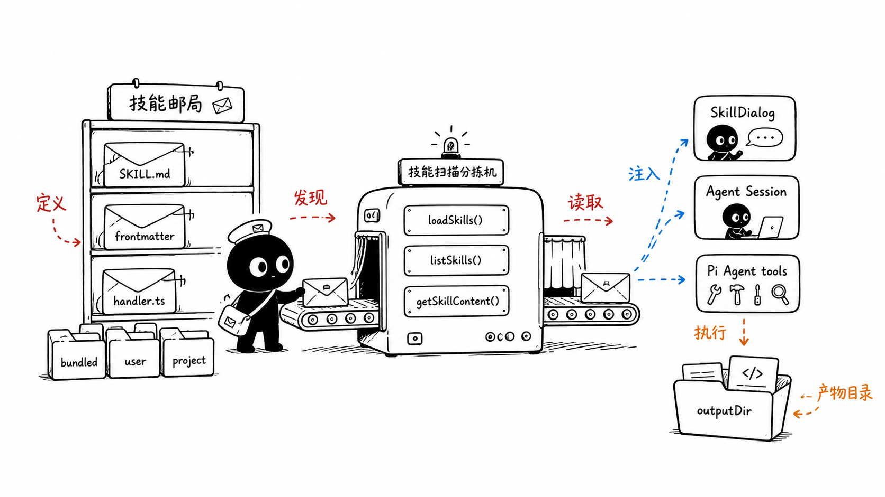
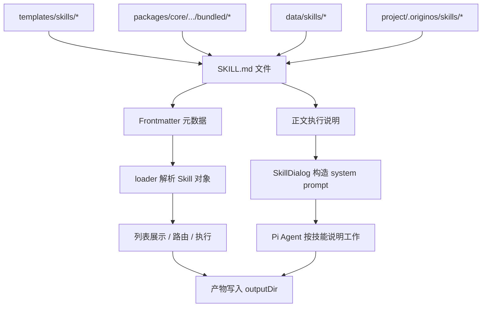
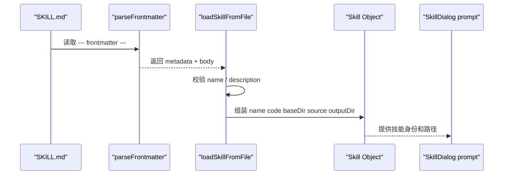
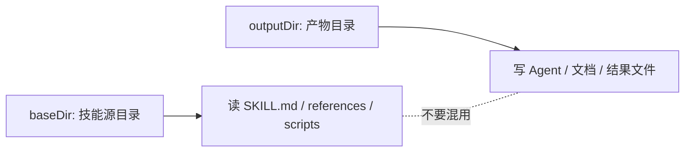

# E1：Skill 文件格式与目录身份

## 问题

这一节回答一个基础但很关键的问题：OriginOS 里的“技能”到底是什么？

新手最容易把 Skill 理解成“一个按钮”“一个 prompt”“一个 Agent 插件”或者“一段后端代码”。在这个项目里，Skill 更准确地说是：

> 一个以 `SKILL.md` 为入口、可被 loader 发现、可被 UI 展示、可被 Agent 注入为 system prompt、也可能绑定 TypeScript handler 的任务能力单元。

所以我们要同时看四层：

1. 文件格式：`SKILL.md` 如何描述技能。
2. 存放位置：系统内置、用户安装、项目级技能分别放在哪里。
3. 元数据：`name`、`code`、`description`、`originos-system`、`outputDir` 如何影响运行。
4. 运行边界：技能源目录和技能产物目录不是一回事。

这一节不追 UI，不追流式对话，只把“一个 Skill 如何被定义”讲清楚。

## 图解





读图时抓住一句话：`SKILL.md` 是定义入口，`outputDir` 是产物边界，loader 把 Markdown 文件变成运行时 `Skill` 对象。

## 源码入口

先看 Skill 类型和 frontmatter 解析：

- [Skill frontmatter 类型（第 30 行）](../../../../packages/core/src/lib/integrations/pi-agent/core/skills.ts#L30)
- [Skill 运行时类型（第 42 行）](../../../../packages/core/src/lib/integrations/pi-agent/core/skills.ts#L42)
- [parseFrontmatter 入口（第 208 行）](../../../../packages/core/src/lib/integrations/pi-agent/core/skills.ts#L208)
- [loadSkillFromFile 入口（第 250 行）](../../../../packages/core/src/lib/integrations/pi-agent/core/skills.ts#L250)

再看真实 Skill 文件：

- [agent-creator 的 frontmatter（第 1 行）](../../../../templates/skills/agent-creator/SKILL.md#L1)
- [role-agent-creator 的 frontmatter（第 1 行）](../../../../templates/skills/role-agent-creator/SKILL.md#L1)
- [skill-creator-app 的 frontmatter（第 1 行）](../../../../templates/skills/skill-creator-app/SKILL.md#L1)
- [task-manager 的 frontmatter（第 1 行）](../../../../packages/core/src/lib/features/skills/bundled/task-manager/SKILL.md#L1)

注意：当前仓库里可读到的系统技能主要在 `templates/skills/` 和 `packages/core/src/lib/features/skills/bundled/`。AGENTS.md 里提到 `.claude/skills/` 是架构规约里的定义目录，但这份工作区当前并没有把它作为主要源码入口来落文件。

## 调用链



这条链里最重要的不是“Markdown 内容有多长”，而是 Markdown 文件头部有没有足够稳定的机器可读信息。

## 关键类型

`SkillFrontmatter` 是写在 `SKILL.md` 顶部的声明：

- `name`：技能名。可以是中文，也可以是英文；但运行时代码通常更喜欢稳定英文名。
- `code`：技能代码名。很多入口会用 `code ?? name` 来决定目录名或查找名。
- `description`：技能描述。loader 会校验长度，缺失时这个文件不会形成有效 Skill。
- `disable-model-invocation`：控制是否注入到模型可见技能列表。
- `originos-system`：标记系统内置技能，后续会影响 source 和产物目录。
- `outputDir`：技能产物应该写到哪里，尤其对系统内置技能很关键。

`Skill` 是解析后的运行时对象：

- `filePath`：`SKILL.md` 的真实路径。
- `baseDir`：技能定义所在目录，用于读取 references、scripts、assets。
- `source`：`bundled | user | project`。
- `systemManaged`：是否系统管理。
- `outputDir`：产物输出目录，不一定等于 `baseDir`。

最容易踩坑的是 `baseDir` 和 `outputDir`：



系统内置技能的定义可以来自 `templates/skills/skill-creator-app/SKILL.md`，但它生成的内容不应该写回模板目录，而应该写到运行数据目录。

## 测试入口

这一节对应的测试不是 UI 测试，而是 loader 和目录路由测试：

- [Skill framework 测试入口（第 27 行）](../../../../packages/core/src/lib/integrations/pi-agent/__tests__/skills.test.ts#L27)
- [formatSkillsForPrompt 测试（第 41 行）](../../../../packages/core/src/lib/integrations/pi-agent/__tests__/skills.test.ts#L41)
- [禁用模型调用的技能不进入 prompt（第 60 行）](../../../../packages/core/src/lib/integrations/pi-agent/__tests__/skills.test.ts#L60)
- [系统技能产物目录测试说明（第 1 行）](../../../../packages/core/src/lib/integrations/pi-agent/__tests__/skill-output-dir.test.ts#L1)
- [bundled skill 写入 data/skills 的断言（第 30 行）](../../../../packages/core/src/lib/integrations/pi-agent/__tests__/skill-output-dir.test.ts#L30)

可运行：

```bash
pnpm --filter @originos/core test -- --run packages/core/src/lib/integrations/pi-agent/__tests__/skills.test.ts
pnpm --filter @originos/core test -- --run packages/core/src/lib/integrations/pi-agent/__tests__/skill-output-dir.test.ts
```

## 逐行精读

从 [Skill frontmatter 类型（第 30 行）](../../../../packages/core/src/lib/integrations/pi-agent/core/skills.ts#L30) 开始读。

第 30-36 行定义的是“Markdown 文件头里允许被识别的字段”。这里没有复杂 schema，也没有 YAML 解析库，而是项目自己实现了一个轻量 frontmatter parser。优点是依赖少，缺点是表达能力有限。

第 42-52 行定义 `Skill`。这里已经不是 Markdown 原文，而是系统内部真正使用的对象。`baseDir`、`source`、`disableModelInvocation`、`systemManaged`、`outputDir` 都是在这里进入运行时语义的。

第 208 行进入 `parseFrontmatter`。它用正则识别 `--- ... ---` 结构。你读这里时要注意：它不是完整 YAML 解析器，基本适合 `key: value` 这种简单声明，不适合复杂嵌套。

第 250 行进入 `loadSkillFromFile`。这才是“一个 Markdown 文件能不能成为 Skill”的关口。它会读取文件、解析 frontmatter、校验 description、决定 name、判断系统技能，并组装返回对象。

第 279 行附近，如果缺少 description，会返回 `skill: null` 和 diagnostic。这意味着不是所有 `SKILL.md` 都会被无条件加载，元数据缺失会让技能被排除。

## 深度拆解

Skill 文件有两种身份：

第一种是“给人看的说明书”。正文告诉 Agent：什么时候触发、怎么执行、读取什么、写入什么、有哪些约束。

第二种是“给系统看的元数据”。frontmatter 告诉系统：这是什么技能、是否系统内置、在哪里展示、是否能被模型调用、产物应该去哪里。

如果只写正文，没有 frontmatter，Agent 也许能读懂，但系统很难稳定管理它。如果只写 frontmatter，没有正文，系统能发现它，但 Agent 没有足够执行策略。

这就是 Skill 的核心设计：用 Markdown 降低创作门槛，用少量机器字段保证运行时可控。

## 常见故障

`description` 缺失：技能文件存在，但列表里看不到。原因是 loader 会把它视为无效技能。

`name` 和 `code` 混乱：UI 用 `skillName` 打开，目录用 `code ?? name`，如果两者不一致但没有理解调用链，就会出现“列表能看到，打开失败”。

把产物写进技能源目录：这是系统技能里最危险的错误。模板或内置技能目录应该可复用，运行产物应该进入 `data/skills/{skillName}` 或项目工作目录。

frontmatter 写复杂 YAML：当前 parser 更像简单键值解析器，不适合把复杂数组和嵌套对象托付给它。

## 改动场景判断

如果你只是新增一个首页能打开的系统技能，优先改 `templates/skills/{skill-code}/SKILL.md`，再把它接入首页配置。

如果你要新增一个带 TypeScript handler 的内置业务技能，需要看 `packages/core/src/lib/features/skills/bundled/` 和 feature service 的 handler 注册。

如果你要让某个项目拥有自己的技能，不应该塞到系统模板目录，而应该进入项目级技能目录。

如果你只是改技能说明文字，不应该碰 agent manager、session service 或 API route。

## 源码追问清单

- 这个技能是系统技能、用户技能，还是项目技能？
- UI 入口使用的是 `name` 还是 `code`？
- `description` 是否存在且足够准确？
- 技能运行时读资源用 `baseDir`，写产物用哪个目录？
- 这个技能只是 prompt 技能，还是绑定了 TypeScript handler？
- 这个技能是否应该被模型看到？是否需要 `disable-model-invocation`？

## 练习

1. 打开 [skill-creator-app（第 1 行）](../../../../templates/skills/skill-creator-app/SKILL.md#L1)，标出它的 `name`、`code`、`description`、`outputDir`。
2. 对照 [Skill 类型（第 42 行）](../../../../packages/core/src/lib/integrations/pi-agent/core/skills.ts#L42)，说明这些字段会进入哪个运行时字段。
3. 打开 [task-manager（第 1 行）](../../../../packages/core/src/lib/features/skills/bundled/task-manager/SKILL.md#L1)，判断它是“纯 prompt 技能”还是可能被 feature service handler 执行的技能。

## 验收

你完成本节后，应该能说清楚：

- `SKILL.md` 为什么既是文档又是运行时入口。
- `frontmatter` 和正文分别解决什么问题。
- `baseDir` 和 `outputDir` 的区别。
- 系统技能为什么不能把产物写回模板目录。
- 新增或排查一个 Skill 时，第一眼应该看哪些字段。
