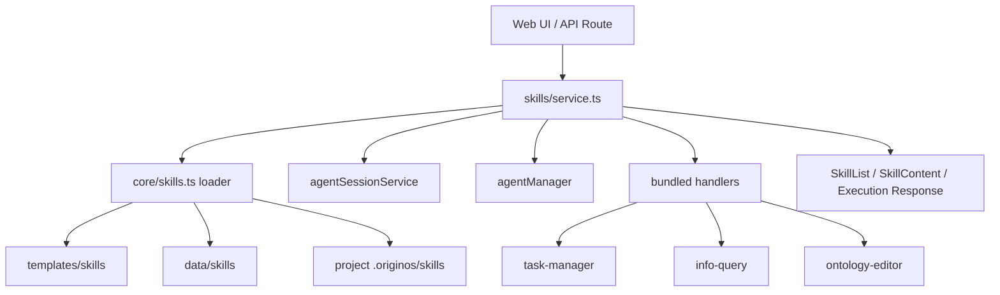
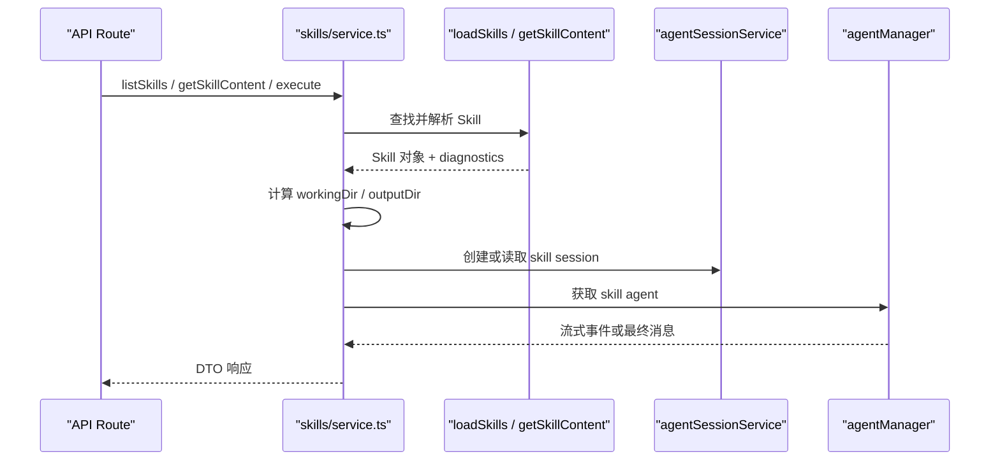

# E2：Core Skill Feature Service

## 问题

E1 讲的是“技能如何被定义”。这一节看“技能如何被服务层管理”。

在 OriginOS 里，`packages/core/src/lib/integrations/pi-agent/core/skills.ts` 更像底层 loader，而 `packages/core/src/lib/features/skills/service.ts` 是面向 Web API 和 UI 的 feature service。它负责把 loader 的能力变成这些业务动作：

- 列出技能。
- 读取技能内容。
- 解析技能工作目录和产物目录。
- 查询技能历史会话。
- 启动技能执行。
- 给技能执行发送消息。
- 将执行过程转换成 timeline 或流式事件。

所以这一节的问题是：为什么项目不让 UI 直接读 `SKILL.md`，而是要通过 core feature service？

答案是：因为 UI 需要的是稳定业务接口，不应该知道技能到底来自模板目录、用户 data 目录、Electron resources，还是项目 `.originos/skills`。

## 图解



`service.ts` 是一个适配层：上面接 API/UI，下面接 loader、session、agent、handler。

## 源码入口

- [Skill feature service 类型区（第 25 行）](../../../../packages/core/src/lib/features/skills/service.ts#L25)
- [SkillContentResponse 类型（第 54 行）](../../../../packages/core/src/lib/features/skills/service.ts#L54)
- [resolveSkillWorkingDirectory（第 171 行）](../../../../packages/core/src/lib/features/skills/service.ts#L171)
- [resolveSkillOutputDir（第 204 行）](../../../../packages/core/src/lib/features/skills/service.ts#L204)
- [findSkillForContent（第 264 行）](../../../../packages/core/src/lib/features/skills/service.ts#L264)
- [listSkills（第 455 行）](../../../../packages/core/src/lib/features/skills/service.ts#L455)
- [getSkillContent（第 488 行）](../../../../packages/core/src/lib/features/skills/service.ts#L488)
- [startSkillExecution（第 561 行）](../../../../packages/core/src/lib/features/skills/service.ts#L561)
- [streamSkillExecutionMessage（第 911 行）](../../../../packages/core/src/lib/features/skills/service.ts#L911)

## 调用链



这条链说明：service 不是简单转发，它承担了“运行上下文拼装”的职责。

## 关键类型

`SkillListRequest`：给列表接口用，主要控制来源过滤。

`SkillListItem`：给 UI 卡片展示用。它不暴露所有 loader 内部字段，而是给出 UI 关心的信息。

`SkillContentResponse`：这节最重要的 DTO：

- `content`：技能 Markdown 正文。
- `baseDir`：技能定义目录。
- `workingDir`：技能运行时工作目录。
- `outputDir`：技能产物输出目录。
- `systemManaged`：是否系统管理。
- `frontmatter`：可选返回的元数据。

`SkillExecutionStartRequest`：启动技能执行，需要 `skillName`，可选 `input`、`sessionId`、`config`。

`SkillExecutionMessageRequest`：向已有执行会话发送消息，需要 `sessionId` 和 `content`。

## 测试入口

- [Skill feature service 测试入口（第 8 行）](../../../../packages/core/src/lib/features/skills/__tests__/service.test.ts#L8)
- [已物化 data skill 内容读取测试（第 9 行）](../../../../packages/core/src/lib/features/skills/__tests__/service.test.ts#L9)
- [Electron resources 技能物化测试（第 48 行）](../../../../packages/core/src/lib/features/skills/__tests__/service.test.ts#L48)

可运行：

```bash
pnpm --filter @originos/core test -- --run packages/core/src/lib/features/skills/__tests__/service.test.ts
```

## 逐行精读

从 [SkillContentResponse 类型（第 54 行）](../../../../packages/core/src/lib/features/skills/service.ts#L54) 开始看。这个类型已经把“技能内容”和“运行目录”放在同一个响应里，说明 UI 打开技能时不只是要 Markdown，还要知道后续会话在哪个目录执行。

[resolveSkillWorkingDirectory（第 171 行）](../../../../packages/core/src/lib/features/skills/service.ts#L171) 是核心边界：如果是 bundled 技能，工作目录会走 `data/skills/{skillCode}`；否则使用技能自己的 `baseDir`。这体现了 AGENTS.md 的强约束：系统内置技能定义只读，运行产物进入 data。

[findSkillForContent（第 264 行）](../../../../packages/core/src/lib/features/skills/service.ts#L264) 体现兼容策略。它先找已经存在的 data skill，再尝试 materialize 系统技能，最后 fallback 到 bundled skill。这是为了兼容开发态、用户态、Electron 打包态。

[listSkills（第 455 行）](../../../../packages/core/src/lib/features/skills/service.ts#L455) 负责把 loader 结果变成 UI 列表。这里会过滤 invisible 项，并按 source 做筛选。

[getSkillContent（第 488 行）](../../../../packages/core/src/lib/features/skills/service.ts#L488) 是 SkillDialog 打开技能时最常走的服务入口。它读取内容，同时返回 `workingDir` 和 `outputDir`。

[startSkillExecution（第 561 行）](../../../../packages/core/src/lib/features/skills/service.ts#L561) 处理非纯聊天式的 handler 技能。如果没有已有 session，它会创建一个 `projectId: skill-${skillName}` 的 session，并把 `currentPath`、`outputDir` 放入 `projectContext`。

[streamSkillExecutionMessage（第 911 行）](../../../../packages/core/src/lib/features/skills/service.ts#L911) 是流式路径。它把用户消息写进 session，拿到 agent，然后订阅 `message_delta`、`message_end`、`agent_error`，最后 emit 给上层。

## 深度拆解

这一层有三个设计目的。

第一，隐藏多源加载复杂度。UI 不需要关心技能来自 `templates/skills`、`data/skills`、Electron resources，还是项目目录。

第二，保证目录安全。系统技能的 `baseDir` 是定义目录，不能被当成写入目录。service 在打开技能时统一计算 `workingDir` 和 `outputDir`，减少 UI 自己猜路径的风险。

第三，连接“文档技能”和“代码技能”。有些技能只是 `SKILL.md` prompt，由 SkillDialog 注入给 Agent；有些技能有 `handler`，能被 `startSkillExecution` 直接执行。service 同时支撑这两种模式。

## 常见故障

打开技能失败：先看 `findSkillForContent` 能不能找到对应 `name/code`，再看 `SKILL.md` 是否有 description。

技能执行有 session 但没响应：看 `agentManager.getOrCreateAgent` 是否拿到了正确的 `agentBaseDir` 和 `outputDir`。

打包后技能找不到：看 Electron resources 路径是否存在，service 测试里专门覆盖了 resources 下的 `templates/skills`。

系统技能写错目录：看 `resolveSkillWorkingDirectory` 和 `resolveSkillOutputDir`，不要在 UI 里手写路径。

## 改动场景判断

如果要新增 API 能力，先看是否能加在 `service.ts`，API route 只做薄封装。

如果要改技能目录解析，优先改底层 loader；如果只是返回给 UI 的 DTO 变化，改 feature service。

如果要增加 handler 技能，需要在 service 的 handler 加载处注册，而不是只放一个 `SKILL.md`。

如果要改 UI 展示字段，要确认 `SkillListItem` 是否已经承载，不要直接让 UI 依赖 loader 内部对象。

## 源码追问清单

- 这个需求是 loader 层问题，还是 feature service 层问题？
- UI 是否真的需要新字段，还是 service 可以内部消化？
- `workingDir` 和 `outputDir` 是否都正确返回？
- 新增技能是否需要 handler？
- 错误码应该是 `INVALID_REQUEST`、`NOT_FOUND` 还是 `INTERNAL_ERROR`？
- 流式消息是否会持久化到 session？

## 练习

1. 从 [getSkillContent（第 488 行）](../../../../packages/core/src/lib/features/skills/service.ts#L488) 出发，画出它调用哪些 helper。
2. 解释为什么 [service 测试第 88 行](../../../../packages/core/src/lib/features/skills/__tests__/service.test.ts#L88) 期望 `skill-creator-app` 从 resources 物化后返回内容。
3. 对照 [startSkillExecution（第 561 行）](../../../../packages/core/src/lib/features/skills/service.ts#L561)，说明一个 handler 技能从启动到写入 assistant message 的过程。

## 验收

你完成本节后，应该能判断：

- `core/skills.ts` 和 `features/skills/service.ts` 的职责差异。
- Skill 内容接口为什么必须返回 `baseDir`、`workingDir`、`outputDir`。
- bundled 技能为什么需要物化。
- handler 技能和 prompt 技能在 service 层如何分流。
